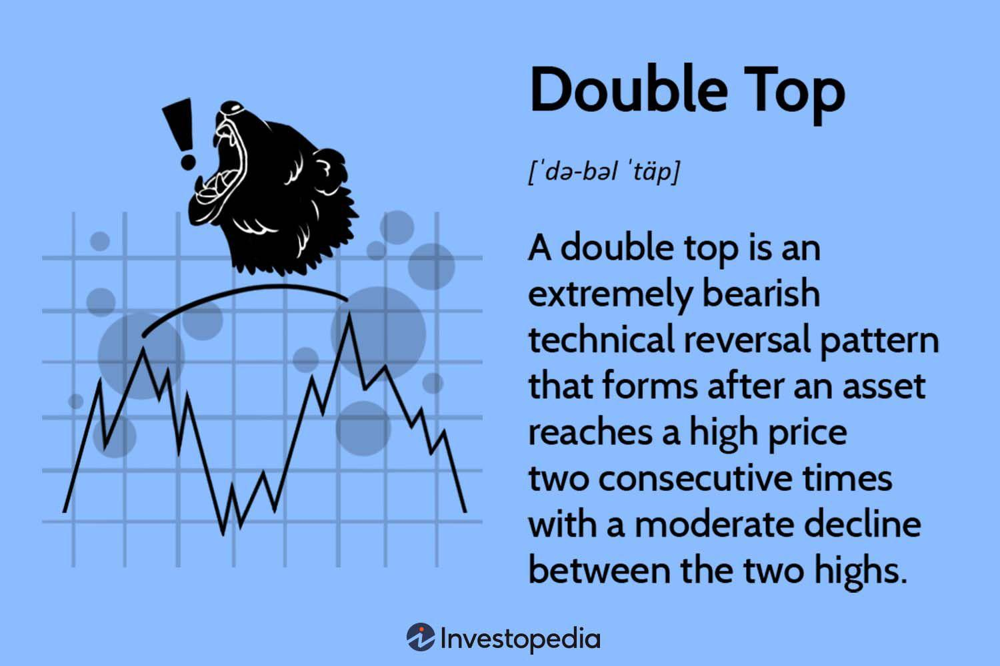

The double top pattern is a well-established formation in technical analysis, frequently utilized by traders as an indicator of a potential trend reversal from an uptrend to a downtrend. This chart pattern is characterized by two distinct peaks at approximately the same price level, signifying a potential weakening of buyer momentum and a possible beginning of a downward price movement. In the rapidly evolving sphere of algorithmic trading, the double top pattern holds significant value. Modern trading algorithms can be programmed to identify these patterns automatically, allowing traders to act on potential market shifts with precision and speed. By integrating this pattern into algorithmic strategies, traders aim to capitalize on the predictive nature of the pattern, enhancing their ability to anticipate and profit from market reversals. This article examines the characteristics of the double top stock pattern, its detection within algorithmic systems, and its application in contemporary trading strategies, offering insights into its ongoing relevance and utility in financial markets.

## Table of Contents



## What is a Double Top Stock Pattern?

A double top is a bearish reversal chart pattern recognized in technical analysis, signaling a possible shift from an uptrend to a downtrend in an asset's market price. This pattern manifests when the price reaches a high point twice consecutively, with a moderate decline occurring between the peaks. These two peaks are typically at similar price levels, separated by a trough.

The double top pattern begins to take shape as the price of the asset climbs to a peak (P1), retraces to form a trough (T), and then ascends again to a second peak (P2), which is at roughly the same level as P1. Ideally, both peaks should be formed at approximately the same price level. The trough, which sits between these peaks, establishes the support level or the "neckline."

Here's a simple illustration of the pattern:

```
   Peak (P1)
      /\       
     /  \       
    /    \      
   /      \      
  /        \    Trough (T)
 /          \   
/            \ 
               \
               /\
              /  \       
             /    \     
            /      \  
           /        \
    Peak (P2)
```

The pattern is confirmed as a bearish signal when the asset's price breaks below the neckline (T), indicating that the previous support level has failed. Traders often interpret this breakdown as a sign of weakening market sentiment, which is likely to lead to a downward price movement. 

Mathematically, this can be represented when the price $P_t$ satisfies:
$$
P_{t-\Delta t} > P_{t} > T
$$

Where $\Delta t$ is the time interval across which the pattern has been observed and $P_t$ denotes the price at time $t$. The confirmation of the pattern occurs when the price moves lower than $T$, indicating a breach of the support and validating the reversal signal.

It's important to note that a double top pattern's reliability increases when accompanied by a decrease in [volume](/wiki/volume-trading-strategy) during the second peak. This suggests a waning buying pressure, corroborating the bearish outlook of the pattern.

## Identifying Double Top Patterns in Algo Trading

Algorithmic trading systems utilize advanced computational techniques to detect double top patterns by scanning price charts for characteristic peaks and troughs. This automated approach involves several key steps to reliably identify these patterns within various financial markets.

The process begins with the algorithm monitoring real-time price movements, searching for two consecutive peaks at nearly the same height. To qualify as a double top, these peaks must be formed after an established uptrend, indicating a potential reversal. Between these peaks lies a trough representing a temporary decline before the second peak forms. The critical component of the pattern recognition is the breakdown below this intervening trough, known as the "neckline." This breakdown acts as a confirmation signal, suggesting a possible shift from an uptrend to a downtrend.

To enhance the reliability of these pattern detections, algorithms often incorporate additional technical indicators, such as volume analysis. An increase in trading volume during the formation of the peaks or during the breakdown below the neckline can provide further validation of the pattern's significance. For example, algorithms may be programmed to consider a double top more credible if the breakdown is accompanied by a surge in volume, indicating strong selling pressure.

In practice, this detection process can be implemented programmatically. Here's a simplified Python example to illustrate how an algorithm might scan for double top patterns:

```python
def detect_double_top(price_data):
    peaks = []
    # Iterate through price data to find peaks
    for i in range(1, len(price_data) - 1):
        if price_data[i - 1] < price_data[i] > price_data[i + 1]:
            peaks.append(i)

    # Check for a double top pattern
    if len(peaks) >= 2:
        first_peak = peaks[0]
        second_peak = peaks[1]
        neckline = min(price_data[first_peak:second_peak])
        if price_data[second_peak] > neckline:
            print("Double top pattern detected")
        else:
            print("Pattern not confirmed")
    else:
        print("Insufficient data for detection")

# Example price data
price_data = [100, 105, 102, 108, 107, 95, 90]
detect_double_top(price_data)
```

This example demonstrates a basic way to iterate over a list of price data, identify potential peaks, and check for confirmation of the double top pattern by verifying that the price breaks below the neckline. While simple, more sophisticated algorithms would involve real-time data analytics, multiple indicators for validation, and handling larger datasets.

By integrating such algorithms with high-frequency trading platforms, traders can swiftly respond to market conditions, executing trades aligned with identified double top patterns, all while mitigating the manual inspection of chart data.

## Trading Strategies Using Double Top Patterns

Once a double top pattern is identified, traders often seize the opportunity to capitalize on anticipated price reversals by employing short-selling strategies. The fundamental premise behind short selling in this context is the expected decline in price following the completion of the pattern, which typically signifies a shift from bullish to bearish sentiment.

A common strategy is to enter a short position immediately after the price decisively breaches the neckline, which is the support level formed by the trough between the two peaks. The rationale is that breaking below this critical threshold increases the probability of continued downward movement. To effectively implement this strategy, traders might utilize stop-loss orders to manage risk, setting them slightly above the neckline to protect against false breakdowns.

Another method to enhance entry precision involves waiting for a retest of the neckline. This approach assumes that, upon breaching the neckline, the price may briefly rally to test this former support level, now acting as resistance. If the price fails to break back above the neckline during this retest, it provides a more favorable short entry point, allowing traders to confirm the validity of the new resistance and potentially optimize their risk-reward ratio.

Implementing these strategies can be automated within [algorithmic trading](/wiki/algorithmic-trading) systems by encoding specific rules. In Python, for example, the identification of breakouts and retests can be executed using libraries like `pandas` for data manipulation and `TA-Lib` for technical analysis:

```python
import talib
import pandas as pd

# Assuming 'df' is a DataFrame with 'close' prices
# Calculate peaks and troughs
peaks = df['close'][talib.peak_detection(df['close'])]
troughs = df['close'][talib.trough_detection(df['close'])]

# Define the neckline as the average between two troughs for simplicity
neckline = (troughs.iloc[0] + troughs.iloc[1]) / 2

# Strategy: Enter short on break below neckline
df['short_signal'] = df['close'] < neckline

# Strategy: Retest confirmation
df['retest_signal'] = (df['close'].shift(1) <= neckline) & (df['close'] > neckline)
```

These trading strategies highlight the versatility of the double top pattern in predicting potential market reversals. However, successful trades require vigilance against false breakouts and integrating broader market analyses to bolster decision-making.

## Benefits and Limitations of Trading Double Tops

The double top pattern is a valuable tool in the technical analyst's arsenal, offering distinct benefits that make it appealing to traders. One significant advantage is its ability to provide clear entry and [exit](/wiki/exit-strategy) signals. These signals arise when the pattern completes, allowing traders to anticipate potential reversals and make informed decisions. The double top formation is versatile, as it can be applied across different market conditions and asset classes, including stocks, [forex](/wiki/forex-system), and commodities. This versatility enhances its usefulness as a part of trading strategies.

However, caution is advised due to potential limitations when relying solely on double top patterns. False breakouts represent a primary concern, where the price may temporarily fall below the pattern's support level (or neckline) only to reverse and resume its prior trend. To mitigate this risk, traders often seek confirmation from other technical indicators, such as Relative Strength Index (RSI), Moving Average Convergence Divergence (MACD), or volume analysis. These indicators can provide additional validation of the pattern and enhance trade reliability.

Additionally, market [volatility](/wiki/volatility-trading-strategies) can impact the effectiveness of the double top pattern. High volatility environments may lead to rapid and unpredictable price movements, which can disrupt pattern formations and lead to false signals. Thus, relying exclusively on double top patterns without supplementary analysis or confirmation from other indicators might result in suboptimal trading outcomes. To address these limitations, traders can integrate double top patterns with broader technical analysis and risk management strategies, thereby increasing the likelihood of achieving successful trades.

## Integrating Double Tops with Other Indicators

To improve the accuracy of predicting potential market reversals indicated by double top patterns, traders frequently integrate additional technical indicators such as Moving Averages, the Relative Strength Index (RSI), and the Moving Average Convergence Divergence (MACD) into their analysis.

**Moving Averages** are instrumental in smoothing out price data, thereby providing clearer signals. By comparing shorter-term and longer-term moving averages, traders can identify changes in momentum that may confirm a double top formation. For example, a trader might use a 50-day moving average (MA) crossing below a 200-day MA as an additional confirmation of a bearish reversal.

**Relative Strength Index (RSI)** measures the magnitude of recent price changes to evaluate overbought or oversold conditions. A double top pattern accompanied by an RSI value greater than 70 could indicate that the asset is overbought, bolstering the case for a potential reversal. Conversely, if the RSI starts declining when the second peak forms, it may signal waning momentum behind the uptrend.

**Moving Average Convergence Divergence (MACD)** is another tool that highlights changes in the strength, direction, and momentum of a trend. A typical MACD setup involves the MACD line, the signal line, and a histogram. If, at the formation of the second peak, the MACD line crosses below the signal line while the histogram shows decreasing bullish momentum, it might confirm the double top pattern's bearish implications.

In algorithmic trading, such integration can be automated using software that processes historical and real-time data streams. For instance, traders could employ a Python script to continuously monitor these indicators:

```python
import pandas as pd
import talib as ta

# Example dataframe 'data' with columns 'close', for stock prices

# Calculate necessary indicators
data['50_MA'] = ta.SMA(data['close'], timeperiod=50)
data['200_MA'] = ta.SMA(data['close'], timeperiod=200)
data['RSI'] = ta.RSI(data['close'], timeperiod=14)
data['MACD'], data['MACD_signal'], data['MACD_hist'] = ta.MACD(data['close'])

# Check conditions for a double top
for i in range(1, len(data)):
    if data['close'][i-1] > data['close'][i] and data['close'][i-2] < data['close'][i-1]:  # simple peak verification
        # Confirm with moving averages and MACD
        if (data['50_MA'][i] < data['200_MA'][i]) and (data['MACD'][i] < data['MACD_signal'][i] and data['RSI'][i] > 70):
            print(f"Double Top Potential Breakout at Index: {i}")
```

This script automates the detection of double top patterns confirmed by additional indicators, allowing for efficient processing of large datasets. This approach enhances the reliability of trading strategies by filtering out false signals and confirming true pattern formations.

## Case Studies and Backtest Results

Backtesting provides traders with valuable insights into the historical performance of double top trading strategies. By simulating trades on historical data, traders can assess the effectiveness of the double top pattern in predicting market movements, enabling them to refine their strategies accordingly.

Studies by technical analysis experts like Thomas Bulkowski highlight that while double top patterns can be effective indicators, not all formations reach their predicted targets. Bulkowski's analysis suggests that the success rate of double top patterns hitting their price targets varies, emphasizing the importance of using these patterns alongside other technical signals and indicators. For instance, Bulkowski's research[1] indicates that certain patterns hit their targets approximately 69% of the time. Such findings underscore the necessity for traders to remain cautious and not rely solely on these patterns for trading decisions.

To put these insights into practice, algorithmic traders can leverage Python to conduct their own backtests. The following is a simplistic Python example using the `pandas` and `numpy` libraries to identify double top patterns and evaluate their profitability:

```python
import pandas as pd
import numpy as np

def identify_double_tops(df):
    # Assuming df contains 'High' and 'Low' columns
    peaks = (df['High'].shift(1) < df['High']) & (df['High'].shift(-1) < df['High'])
    troughs = (df['Low'].shift(1) > df['Low']) & (df['Low'].shift(-1) > df['Low'])

    double_tops = []
    for i in range(1, len(df) - 1):
        if peaks[i] and pd.Series(peaks[:i]).any() and df['High'][i] > df['High'][i-1]:
            prev_peak_idx = pd.Series(peaks[:i]).idxmax()
            if df['High'][i] >= (0.95 * df['High'][prev_peak_idx]) and df['High'][i] <= (1.05 * df['High'][prev_peak_idx]):
                trough_idx = np.argmin(df['Low'][prev_peak_idx:i])
                if df['Low'][trough_idx] < df['Low'][i] and troughs[trough_idx]:
                    double_tops.append((prev_peak_idx, i, trough_idx))

    return double_tops

df = pd.read_csv('historical_data.csv')
double_tops = identify_double_tops(df)

# Analysis of outcomes after a double top confirmation
profits = []
for peak1, peak2, trough in double_tops:
    entry_price = df['Low'][trough]
    exit_price = df['Low'][peak2+1:peak2+10].min() # Exit within the next 10 periods
    profits.append(entry_price - exit_price)

win_rate = len([p for p in profits if p > 0]) / len(profits)
print(f"Win rate of double top strategy: {win_rate:.2%}")
```

By analyzing historical data, traders can adjust their expectations and fine-tune their strategies. Backtesting results may reveal trends, profitability factors, and potential risks associated with double top patterns, allowing traders to enhance their decision-making processes.

[1] Bulkowski, T. (2008). *Encyclopedia of Chart Patterns, Second Edition*. John Wiley & Sons.

## Conclusion

The double top pattern remains a critical component of technical analysis, providing traders with valuable insights into potential market reversals. In the context of algorithmic trading, understanding the structure and significance of this pattern allows traders to effectively incorporate it into automated systems designed to anticipate shifts from uptrends to downtrends.

Modern algorithms facilitate the precise detection and analysis of double top patterns by analyzing vast datasets in real-time. By calculating price highs twice, separated by a moderate decline, algorithms can trigger alerts when a breakdown occurs below the support level, known as the neckline. This automation enables traders to capitalize promptly on emerging trading opportunities, reducing the delay inherent in manual analysis.

Despite its utility, the double top pattern is not infallible. False breakouts can lead to erroneous trading decisions, emphasizing the necessity of comprehensive risk management strategies. Incorporating additional technical indicators, such as Moving Averages, Relative Strength Index (RSI), and the Moving Average Convergence Divergence (MACD), can help confirm pattern validity and filter out misleading signals. These supplementary tools enhance decision-making and provide a broader context for market movements.

In algorithmic trading, integrating these indicators alongside double top patterns ensures that systems are not solely reliant on one pattern. The ability to process simultaneous inputs creates a robust trading framework, essential for navigating volatile market conditions. As such, while the double top pattern remains a fundamental tool, its effectiveness is significantly enhanced when used as part of a diversified analysis strategy. Through this balanced approach, traders can achieve more consistent and reliable trading outcomes.

## References & Further Reading

[1]: Bulkowski, T. (2008). ["Encyclopedia of Chart Patterns, Second Edition."](https://books.google.com/books/about/Encyclopedia_of_Chart_Patterns.html?id=zZAsEAAAQBAJ) John Wiley & Sons.

[2]: Aronson, D. R. (2006). ["Evidence-Based Technical Analysis: Applying the Scientific Method and Statistical Inference to Trading Signals."](https://www.amazon.com/Evidence-Based-Technical-Analysis-Scientific-Statistical/dp/0470008741) John Wiley & Sons.

[3]: Jansen, S. (2022). ["Machine Learning for Algorithmic Trading."](https://github.com/stefan-jansen/machine-learning-for-trading) Packt Publishing.

[4]: Lopez de Prado, M. (2018). ["Advances in Financial Machine Learning."](https://www.amazon.com/Advances-Financial-Machine-Learning-Marcos/dp/1119482089) Wiley.

[5]: Chan, E. P. (2008). ["Quantitative Trading: How to Build Your Own Algorithmic Trading Business."](https://github.com/ftvision/quant_trading_echan_book) Wiley.