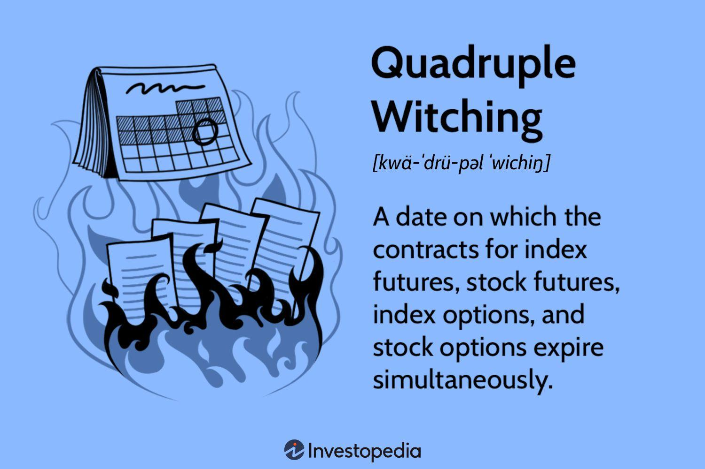

## Table of Contents

## What is double witching?

Double witching is a term used in the stock market. It happens when two types of financial products expire on the same day. These products are stock options and stock index futures. This can cause more trading and price changes in the market because people need to buy or sell these products before they expire.

When double witching happens, it can make the stock market a bit more unpredictable. Traders and investors need to be careful and watch the market closely. It's important because the expiring products can affect the prices of stocks and indexes. This event happens four times a year, and it's something that people in the stock market pay attention to.

## How often does double witching occur?

Double witching happens four times every year. It's when stock options and stock index futures both expire on the same day. This event can make the stock market a bit more exciting and unpredictable.

When these two types of financial products expire at the same time, it can lead to more trading. People might need to buy or sell these products before they expire, which can cause the prices of stocks and indexes to change more than usual. That's why traders and investors need to be careful and keep an eye on the market during these times.

## What types of financial instruments are involved in double witching?

Double witching involves two types of financial instruments: stock options and stock index futures. Stock options give the buyer the right, but not the obligation, to buy or sell a stock at a certain price before a specific date. Stock index futures are agreements to buy or sell a stock index at a set price on a future date.

When these two types of financial instruments expire on the same day, it's called double witching. This happens four times a year and can lead to increased trading activity. People need to buy or sell these instruments before they expire, which can cause more changes in stock and index prices.

## What is the difference between double witching and triple witching?

Double witching and triple witching are events in the stock market that happen when certain financial products expire on the same day. Double witching happens when stock options and stock index futures expire together. This happens four times a year and can make the market more active because people need to buy or sell these products before they expire.

Triple witching is similar, but it includes one more type of financial product. Along with stock options and stock index futures, single stock futures also expire on the same day. This makes triple witching even busier than double witching. Triple witching happens on the third Friday of March, June, September, and December. Both events can make the stock market more unpredictable, so traders and investors need to be careful during these times.

## How does double witching affect stock market volatility?

Double witching can make the stock market more volatile because it's when stock options and stock index futures expire on the same day. When these financial products expire, people need to buy or sell them before the deadline. This can lead to a lot of trading in a short time, which can cause bigger price changes in stocks and indexes. Traders and investors need to be ready for more ups and downs in the market during these times.

The increased trading activity during double witching can make the market feel more unpredictable. People might rush to close their positions or start new ones, which can add to the excitement and uncertainty. While it's not guaranteed that double witching will always cause big swings, it's something that everyone in the stock market watches closely. It happens four times a year, so it's a regular event that traders and investors plan for.

## What strategies can traders use during double witching?

During double witching, traders can use a few strategies to handle the increased market activity. One strategy is to be ready for more price changes. Since a lot of trading happens when stock options and stock index futures expire, traders should watch the market closely and be ready to act quickly. They can set up stop-loss orders to limit their losses if the market moves against them. Another strategy is to look for opportunities to buy or sell stocks at good prices. When everyone is trading, it can create chances to make money if you know what to look for.

Another approach is to stay calm and not make quick decisions based on fear or excitement. Double witching can make the market feel unpredictable, but it's important not to panic. Traders can stick to their plans and avoid making big trades just because the market is busy. If they feel overwhelmed, they might choose to trade less or even take a break until the market calms down. By being prepared and staying level-headed, traders can handle the ups and downs of double witching more effectively.

## What historical events are notable for their impact during double witching?

One notable event during double witching was the stock market crash of October 19, 1987, also known as Black Monday. On that day, the market was already tense, and the expiration of stock options and stock index futures added to the chaos. The market dropped a lot, with the Dow Jones Industrial Average falling more than 22% in one day. This crash showed how double witching can make things worse when the market is already under pressure.

Another event worth mentioning happened on June 16, 1995. This was a double witching day, and the market saw a big drop in the morning. The S&P 500 fell by about 2% before recovering a bit later in the day. Traders were worried about rising interest rates, and the expiration of options and futures added to the market's swings. These events show that double witching can lead to big changes in the stock market, especially when other things are already making people nervous.

## How do market makers adjust their positions during double witching?

Market makers are important people in the stock market. They help make sure there are always buyers and sellers for stocks and other financial products. During double witching, when stock options and stock index futures expire, market makers need to adjust their positions carefully. They do this to manage the risk that comes with all the extra trading. Market makers might buy or sell more of these products to keep the market balanced and make sure they don't lose too much money if prices change a lot.

To handle double witching, market makers watch the market very closely. They use special computer programs to help them make quick decisions. These programs can tell them when to buy or sell based on what's happening in the market. By doing this, market makers can keep the market running smoothly even when a lot of trading is happening. They try to make sure there's always someone ready to trade, no matter how busy the market gets.

## What are the regulatory considerations during double witching?

During double witching, regulators need to make sure the stock market stays fair and orderly. They watch the market closely to stop any bad behavior, like people trying to cheat or manipulate prices. Regulators also make sure that everyone follows the rules, especially when a lot of trading is happening. They might check the systems that handle trading to make sure they can handle the extra work without breaking down.

Regulators also think about how double witching might affect the market's stability. They look at how much the market is moving and if there are any big problems. If they see something that worries them, they might step in to calm things down. This could mean slowing down trading or even stopping it for a short time if things get too wild. By doing this, regulators help keep the market safe for everyone who trades.

## How can algorithmic trading be optimized for double witching?

During double witching, [algorithmic trading](/wiki/algorithmic-trading) can be optimized by making the trading programs smarter and faster. These programs need to look at a lot of information quickly to make good choices. They should be set up to watch the market closely and be ready to buy or sell when the right time comes. This means using special math formulas to predict what might happen next in the market. By doing this, the algorithms can help traders make money even when the market is moving a lot because of double witching.

Another way to optimize algorithmic trading for double witching is to make sure the programs can handle a lot of trades without slowing down. When a lot of people are trading at the same time, the systems need to work well to keep up. Traders can use strong computers and fast internet to help their algorithms work better. They should also test their programs a lot to make sure they are ready for the busy times. By getting everything ready ahead of time, traders can use their algorithms to do well during double witching.

## What are the global implications of double witching on financial markets?

Double witching can affect not just the U.S. stock market but also financial markets around the world. When stock options and stock index futures expire on the same day in the U.S., it can cause a lot of trading. This activity can make the prices of stocks and indexes move a lot, which can then affect other markets. If people in other countries see the U.S. market moving, they might start trading more too. This can lead to more ups and downs in stock markets everywhere, not just in the U.S.

Even though double witching happens in the U.S., it can have a big impact on global markets because many financial products are connected. For example, if the U.S. market goes down, it might make people in Europe or Asia worried about their own markets. They might sell their stocks too, which can make prices go down in those places. So, traders and investors all over the world need to watch what happens during double witching in the U.S. and be ready for changes in their own markets.

## How do different market participants, such as institutional investors and retail traders, approach double witching?

Institutional investors, like big banks and investment firms, approach double witching with a lot of planning. They have to manage big amounts of money and lots of different investments. So, they use special computer programs to watch the market and make smart trades. They might buy or sell a lot of stocks and options before they expire to make sure they don't lose money. They also talk to other big investors to see what everyone else is doing. This helps them make better decisions and keep their investments safe during the busy times of double witching.

Retail traders, or regular people who trade on their own, might not have the same tools and information as big investors. But they can still do well during double witching. They need to watch the market closely and be ready for big price changes. Some retail traders might choose to trade less during these times to avoid losing money. Others might look for good chances to buy or sell stocks at the right prices. They can use simple trading plans and set up stop-loss orders to protect their money if the market moves against them.

## References & Further Reading

[1]: Bergstra, J., Bardenet, R., Bengio, Y., & Kégl, B. (2011). ["Algorithms for Hyper-Parameter Optimization."](https://papers.nips.cc/paper/4443-algorithms-for-hyper-parameter-optimization) Advances in Neural Information Processing Systems 24.

[2]: ["Advances in Financial Machine Learning"](https://www.amazon.com/Advances-Financial-Machine-Learning-Marcos/dp/1119482089) by Marcos Lopez de Prado

[3]: ["Evidence-Based Technical Analysis: Applying the Scientific Method and Statistical Inference to Trading Signals"](https://onlinelibrary.wiley.com/doi/book/10.1002/9781118268315) by David Aronson

[4]: ["Machine Learning for Algorithmic Trading"](https://github.com/stefan-jansen/machine-learning-for-trading) by Stefan Jansen

[5]: ["Quantitative Trading: How to Build Your Own Algorithmic Trading Business"](https://www.amazon.com/Quantitative-Trading-Build-Algorithmic-Business/dp/1119800064) by Ernest P. Chan