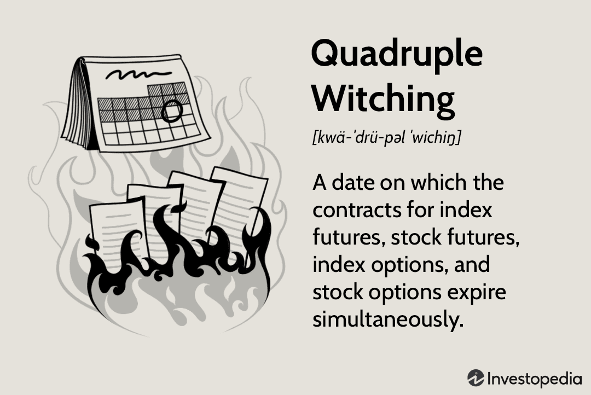

Double witching in the stock market refers to the simultaneous expiration of two types of derivative contracts—stock options and stock index futures—occurring typically on the third Friday of a month. This phenomenon can create significant volatility in the stock market due to the large volume of trades executed as investors and traders attempt to unwind or roll over their positions. Historically, double witching has been known to lead to increased trading activity as market participants adjust their portfolios to account for the expiry of these contracts.

Algorithmic trading, commonly known as algo trading, involves the use of complex algorithms to automate trading decisions and execute trades at speeds and frequencies beyond the capability of human traders. By employing mathematical models to analyze market data and execute trading strategies, algorithmic trading has fundamentally transformed market dynamics. The high efficiency and ability to respond to market conditions in real-time have made algorithmic trading a preferred choice among institutional and retail traders alike. 



The intersection of double witching and algorithmic trading is particularly significant. During double witching days, heightened market activity can lead to increased price volatility, presenting both opportunities and challenges for traders. Algorithmic trading systems are often designed to capitalize on this volatility, executing trades based on predefined criteria to optimize performance and manage risk. Understanding how these two elements interact can provide traders with valuable insights into market behavior and opportunities for profit.

The aim of this article is to equip investors and traders with a comprehensive understanding of double witching and its implications when combined with algorithmic trading. By exploring strategies for navigating these complex market dynamics and examining case studies of successful implementations, this article seeks to offer actionable insights for optimizing trading approaches in the context of double witching. The discussion will also touch upon risk management strategies and the future of algorithmic trading in an evolving market landscape, emphasizing the importance of leveraging both technology and strategic planning to maximize benefits and mitigate risks.

## Table of Contents

## Understanding Double Witching

Double witching is a trading phenomenon that occurs when two different types of financial derivative contracts expire on the same trading day. Typically, double witching involves the expiration of stock index futures and options contracts. These simultaneous expirations can lead to increased trading volumes and volatility, as investors and traders adjust their portfolios to settle or roll over their positions. Double witching commonly takes place on the third Friday of March, June, September, and December, aligning with the quarterly options expiration cycle.

In contrast, triple witching refers to the concurrent expiration of three types of derivative contracts: stock index futures, stock index options, and stock options. This typically occurs on the same quarterly schedule as double witching. The primary distinction lies in the number of derivative contracts expiring simultaneously, with triple witching encompassing an additional layer of complexity due to the inclusion of stock options. As a result, triple witching can prompt even greater market activity and volatility compared to double witching.

For investors, understanding the mechanics of double witching is crucial due to the notable impact on market dynamics. The heightened activity can offer opportunities for significant profits but also poses increased risks. Key patterns associated with double witching days include sharp price movements and unpredictable swings as market participants close out or adjust their derivative positions. Recognizing these patterns enables investors to time their trades more effectively and prepare for potential market [volatility](/wiki/volatility-trading-strategies).

Investors should also be aware of the specific timing of double witching days to align their strategies accordingly. This quarterly event can serve as both a challenge and an opportunity, depending on one's market position and preparedness. By understanding the distinctions between double and triple witching and recognizing the potential implications of these expiration cycles, investors can better navigate the complexities of derivative markets.

## Algorithmic Trading in Today's Market

Algorithmic trading, often referred to as "algo trading", involves the use of computer programs to automate and execute trading strategies based on pre-defined criteria. This form of trading has gained significant traction in today's markets due to its ability to process large volumes of data and execute trades at vastly increased speeds compared to manual processes. The primary benefit of [algorithmic trading](/wiki/algorithmic-trading) lies in its precision and efficiency. By minimizing human intervention, it reduces the likelihood of errors and capitalizes on market opportunities in fractions of a second. Furthermore, algorithms can operate across multiple markets and instruments, providing diversification and optimized execution without the need for constant human oversight.

The role of algorithms in modern trading is multifaceted. One key aspect is [market making](/wiki/market-making), where algorithms are used to provide [liquidity](/wiki/liquidity-risk-premium) by continuously quoting buy and sell prices in the market. This helps in narrowing bid-ask spreads and enhancing market efficiency. Additionally, algorithms facilitate the execution of large transactions, often through techniques such as slicing orders into smaller parts to minimize market impact and reduce transaction costs. Risk management is another critical area where algorithms aid traders by monitoring market positions and automatically adjusting exposure based on pre-set risk parameters.

Several common strategies are employed by algorithmic trading systems. One widely used approach is mean reversion, which assumes that the price of an asset will revert to its mean over time. Traders using this strategy will buy assets when they are perceived to be undervalued and sell them when they are overvalued. Another popular strategy is [trend following](/wiki/trend-following), which involves algorithms identifying and riding the [momentum](/wiki/momentum) of market trends. Additionally, [arbitrage](/wiki/arbitrage) strategies are implemented to exploit price discrepancies between related instruments, achieving profits through high-frequency trading when minute differences are detected.

The implementation of these strategies often involves complex mathematical models and sophisticated coding. For example, a simple mean reversion strategy in Python might involve computing the moving average of an asset's price and executing trades based on deviations from this average:

```python
import numpy as np
import pandas as pd

# Sample price data
price_data = pd.Series([100, 102, 101, 105, 107, 110, 108, 109, 111, 113])

# Compute moving average
window_size = 3
moving_average = price_data.rolling(window=window_size).mean()

# Generate signals
threshold = 1.0
signals = (price_data - moving_average).fillna(0) > threshold

# Execute trades based on signals
# 'True' denotes a buy signal, 'False' a sell signal
trade_decisions = ["Buy" if signal else "Sell" for signal in signals]
```

This basic example highlights how algorithms can help identify trading signals based on market data analysis, making timely decisions that align with strategic objectives. As algorithmic trading continues to evolve with technological advancements, its influence on market dynamics and investor strategies remains formidable.

## The Intersection of Double Witching and Algo Trading

Double witching, a term describing the simultaneous expiration of stock options and stock index futures contracts, has a notable impact on trading volumes and market volatility. This phenomenon traditionally occurs on the third Friday of March, June, September, and December. During these days, traders often experience heightened volatility due to the convergence of these expirations, which compels market participants to adjust or close out their positions.

Algorithmic trading, the use of computer algorithms to automate trading decisions and orders, plays a significant role during double witching periods. These algorithms can process and react to market data at speeds beyond human capability, thereby capitalizing on the increased market activity. The surge in trading [volume](/wiki/volume-trading-strategy) creates opportunities for algorithms to execute rapid, high-frequency trades, thereby contributing further to the liquidity and volatility in the market.

Strategies employed by algorithmic trading systems during double witching are primarily focused on exploiting the temporary price inefficiencies that arise due to the mass adjustments of positions by market participants. These strategies often include momentum trading, arbitrage, and mean reversion:

1. **Momentum Trading**: Algorithms can identify trends and execute trades in the direction of the prevailing market movement. During double witching, the influx of transactions can create discernible patterns that algorithms are designed to detect and follow.

2. **Arbitrage**: Algorithms aim to profit from price differentials between related securities. With the expiration of futures and options, prices may temporarily diverge from their fair values, providing opportunities for arbitrage. For example, if stock XYZ's future price differs from the anticipated future spot price, an arbitrage algorithm can simultaneously execute trades to exploit this discrepancy.

3. **Mean Reversion**: This strategy is grounded on the assumption that prices will revert to their historical averages. Algorithms track over-extended price movements caused by the high volume of trades and execute opposite trades anticipating a return to average levels.

Python code can be utilized to model and implement these algorithmic trading strategies. Below is an elementary example of a mean reversion strategy:

```python
import numpy as np
import pandas as pd

# Load historical price data
prices = pd.Series([...])  # Insert stock prices data here

# Calculate moving average
window = 20
rolling_mean = prices.rolling(window=window).mean()
rolling_std = prices.rolling(window=window).std()

# Set threshold for overbought or oversold conditions
threshold = 2

# Generate signals
signals = np.where(prices > rolling_mean + threshold * rolling_std, -1, 0)
signals = np.where(prices < rolling_mean - threshold * rolling_std, 1, signals)

# Output signals
signals_series = pd.Series(signals, index=prices.index)
```

In this code snippet, we calculate a rolling mean and standard deviation to detect overbought or oversold conditions based on standard deviation from the mean, generating buy or sell signals accordingly.

During double witching, algorithmic trading's ability to quickly and efficiently interpret market signals is crucial for successfully navigating the volatile environment. As these trading days are characterized by complex market movements, leveraging algorithms provides a strategic advantage for managing trades and optimizing performance.

## Strategies for Navigating Double Witching with Algorithms

Double witching refers to the simultaneous expiration of stock options and stock index futures. During these days, trading activity often sees increased volatility and volume, providing unique opportunities and challenges for both human and algorithmic traders. Integrating algorithmic strategies during such periods can help traders effectively navigate the heightened market dynamics.

### Key Strategies for Integrating Algorithmic Trading During Double Witching

To harness the opportunities presented by double witching, traders can deploy several key strategies in their algorithmic systems:

1. **Liquidity Provision Algorithms**: Given the heightened trading volumes, liquidity provision algorithms can be employed to capture spreads from increased market orders. Such algorithms often work on the principles of delta-neutral strategies ensuring the portfolio maintains a balanced position despite market fluctuations.

2. **Market Timing Algorithms**: These algorithms aim to predict and react to short-term price movements effectively. By leveraging statistical models or machine learning techniques, such systems forecast trends to aid in the timely execution of trades. For instance, traders may employ algorithms trained on historical data specific to double witching days to predict possible price swings with reasonable accuracy.

3. **Arbitrage Opportunities**: Increased volatility often leads to temporary price discrepancies between correlated assets or markets, presenting arbitrage opportunities. Algorithmic trading systems can be designed to rapidly identify and exploit these inefficiencies before they are corrected by the market.

### Optimizing Trading Algorithms for Heightened Activity Periods

Algorithm optimization is crucial for success on double witching days. Here are some methods to enhance algorithm performance during these periods:

- **Adaptive Algorithms**: Algorithms that can dynamically adjust their parameters in real-time to respond to changing market conditions are particularly useful. Techniques such as reinforcement learning can be applied to train algorithms to adapt their trading strategies based on live market feedback.

- **Backtesting with Relevant Data**: Algorithms should be backtested using data from past double witching days to ensure they can perform effectively under similar conditions. This helps in identifying potential weaknesses and strengths in the trading strategy.

- **Latency Reduction**: Minimizing latency is critical for algorithms operating in fast-moving markets such as those experienced during double witching. Optimizing code for execution speed and choosing colocated servers can significantly improve the effectiveness of algorithmic trades.

### Risk Management Tactics When Using Algorithms in Volatile Markets

The volatility during double witching days necessitates robust risk management frameworks. Here are some tactics:

- **Stop-Loss Mechanisms**: Implementing stop-loss strategies to limit potential losses is essential. Automated stop-loss orders can be triggered when trades deviate unfavorably from expected outcomes, providing a safety net.

- **Diversity in Algorithmic Strategies**: Employing a suite of diverse algorithmic strategies can reduce risk exposure. A diversified approach ensures that if one strategy underperforms, others can potentially cover the losses.

- **Position Sizing Adjustments**: Algorithms should be calibrated to adjust position sizes dynamically based on volatility levels, ensuring that excessive risk is not taken during periods of rapid price movements.

By effectively integrating and optimizing algorithmic trading strategies during double witching days, traders can enhance their ability to capitalize on market conditions while minimizing associated risks. Such strategic deployment of algorithms is essential for maintaining a competitive edge in today's fast-paced trading environment.

## Risks Involved in Double Witching and Algorithmic Trading

Trading during double witching days, characterized by the simultaneous expiration of stock options and index options, presents unique challenges that traders must navigate carefully. These days often lead to increased trading volumes and heightened market volatility, creating both opportunities and risks.

One of the potential pitfalls during double witching days is the significant increase in market volatility. This volatility can be attributed to the large number of contracts set to expire, prompting investors to adjust or unwind their positions rapidly. Such activity can cause abrupt price movements, which, while offering profit potential, also pose risks of substantial losses. For investors relying on algorithmic trading, this can be particularly challenging, as algorithms may not always adapt proficiently to the dynamic shifts in price.

Algorithmic trading systems, although designed to execute trades efficiently, are susceptible to common errors that can be exacerbated during volatile periods. A notable issue is the occurrence of "overfitting" in algorithmic strategies. Overfitting happens when a trading model is excessively tailored to historical data, making it less effective in adapting to unforeseen market conditions. To mitigate this, traders should ensure that their models undergo rigorous [backtesting](/wiki/backtesting) with diverse datasets to enhance their robustness in unanticipated environments.

Another common error is the lag in execution time caused by latency. During double witching days, when volumes spike and price changes are rapid, even minor delays in execution can significantly impact profitability. Utilizing low-latency trading infrastructure and colocating trading servers closer to market exchanges are strategies that can reduce execution delays.

Moreover, algorithmic trading systems might trigger a cascade of unintended trades during market anomalies, such as "flash crashes". This can occur if an algorithm misinterprets a sudden price movement as a trend, leading to a chain reaction of sell or buy orders. Implementing stringent risk management tactics, like dynamic stop-loss mechanisms and volatility filters, can prevent excessive trading activity in such situations.

Additionally, [machine learning](/wiki/machine-learning) algorithms frequently employed in trading can misjudge the transient nature of price changes on double witching days. Instead of relying solely on historical patterns, integrating real-time news analytics and sentiment analysis into trading systems could provide better context and adaptability to current conditions.

Increased market volatility on double witching days magnifies the inherent risks of algorithm-driven trades. Traders must remain vigilant, constantly refining their models and implementing robust risk management strategies. Effective measures include continuous monitoring of algorithm performance, maintaining a diverse set of trading strategies, and fostering human oversight to manage unexpected market shifts. By doing so, traders can navigate the complexities of double witching days while minimizing potential downside risks.

## Successful Case Studies and Examples

Successful trading strategies during double witching periods often hinge on astute utilization of algorithmic trading systems to navigate heightened market volatility and increased trading volumes. Double witching, which occurs when stock options and index options expire simultaneously, prompts significant activity that market participants can exploit through precision-driven algorithmic techniques.

One notable strategy involves the use of [statistical arbitrage](/wiki/statistical-arbitrage) algorithms, which detect and capitalize on temporary mispricings while maintaining market neutrality. For instance, during double witching periods, when trading activity spikes, these algorithms become especially effective in identifying arbitrage opportunities due to the increased liquidity and price discrepancies. By leveraging historical data and real-time price feeds, traders can construct algorithms to automatically execute trades when arbitrage conditions are met. This approach not only mitigates timing risks inherent to manual trading but also enhances profitability potential through rapid execution.

Risk management is a critical component of successful algorithmic trading during these periods. Many algorithmic systems incorporate adaptive risk models, which dynamically adjust to changing market conditions. For example, volatility forecasting models can be embedded within trading algorithms to monitor volatility spikes, allowing for the adjustment of trading position sizes and risk limits in real-time. This adaptation helps in maintaining a balance between capitalizing on opportunities and preserving capital.

A remarkable example of algorithmic trading managing risks and boosting profits can be drawn from a case study of a trading firm that implemented machine learning algorithms during a recent double witching event. The firm utilized a [reinforcement learning](/wiki/reinforcement-learning) model that continuously learned from market data to optimize trade execution and timing. By processing vast amounts of data and simulating various market scenarios, the model could predict price movements and adapt trading strategies accordingly. As a result, the firm reported a substantial increase in trade accuracy and a notable reduction in drawdown, leading to improved net profits during the typically erratic double witching period.

Expert insights from professional traders further bolster understanding of these strategies. A prominent trader with extensive experience in high-frequency trading noted that success during double witching days often involves not only sophisticated algorithms but also the fine-tuning of these systems based on real-world trading experiences. This involves adjusting parameters such as trade thresholds and holding periods in response to observed market behaviors.

Ultimately, the successful integration of algorithmic trading during double witching days lies in a blend of strategic foresight, advanced technology, and responsive risk management protocols. As traders continue to innovate and refine their approaches, the lessons learned from past successes provide a valuable roadmap for future endeavors.

## Preparing for the Future: Enhancing Algorithmic Strategies

Anticipating future trends in double witching and algorithmic trading necessitates a forward-looking approach that considers both technological advancements and market changes. Double witching, a phenomenon that occurs when the expiration of stock index futures and options coincides, traditionally results in heightened market volatility and trading volume. As algorithmic trading systems continue to evolve, they stand to significantly impact how double witching days are navigated.

Technology advancements, particularly in [artificial intelligence](/wiki/ai-artificial-intelligence) (AI) and machine learning (ML), are transforming trading strategies by enabling algorithms to process vast amounts of data in real-time. This enhanced data processing capability allows for more accurate predictions and more adaptive trading strategies. For instance, machine learning models can be trained to recognize patterns and anomalies in historical market data, thereby improving the algorithms' ability to anticipate and react to market moves on double witching days.

Additionally, the growth of quantum computing presents new possibilities for algorithmic trading. Quantum algorithms, which have the potential to solve complex optimization problems exponentially faster than classical algorithms, may redefine the speed and efficiency of executing trades. Traders employing quantum-driven strategies could gain a significant edge during the volatile periods of double witching.

To stay ahead in this evolving landscape, traders should consider several recommendations. First, continuous education and adaptation are crucial. This means staying informed about the latest technological developments and integrating applicable advancements into existing trading systems. Furthermore, the development of robust risk management frameworks is essential. Given the potential for increased volatility, algorithms should be programmed with strict risk controls to prevent significant losses.

Traders should also invest in scalable infrastructure that can handle surges in trading volume and data processing requirements. Cloud computing offers a scalable and cost-effective solution for managing the increased data flow and computational demands during double witching days. Additionally, employing advanced data analytics tools can enhance the capability to dissect market trends and refine trading algorithms accordingly.

Finally, collaboration with tech specialists can facilitate the implementation of cutting-edge technologies and strategies. By partnering with experts in AI, ML, and quantum computing, trading teams can harness the full potential of these technologies, optimizing their algorithms to capitalize on the opportunities presented during double witching events and beyond.

In conclusion, the synergy between evolving technology and strategic trading will define the future of double witching in algorithmic trading. By embracing technological advances and implementing comprehensive strategies, traders can position themselves to effectively navigate the complexities of the market and achieve sustainable success.

## Conclusion

The relationship between double witching and algorithmic trading is a complex, yet significant dynamic in the stock market. Double witching, which occurs when options and futures contracts expire simultaneously, leads to increased trading volumes and volatility. This phenomenon presents both challenges and opportunities for traders and investors as the market behaves unpredictably. Algorithmic trading, with its precision and speed, has become an indispensable tool in navigating these turbulent periods.

To maximize the benefits and minimize the risks associated with double witching, traders must leverage technology and strategy effectively. Algorithms can be adjusted to account for heightened activity by incorporating volatility indicators and real-time data analysis, thus allowing for quick decision-making and execution. Strategies such as mean reversion or trend following can be programmed into trading systems to capitalize on short-term price movements that are characteristic of double witching days.

Furthermore, risk management is crucial when using algorithms in such a volatile environment. Implementing stop-loss orders and position size limits are effective methods to prevent significant losses. Continuous monitoring of algorithmic performance and market conditions can help ensure that strategies remain effective and adaptable to unforeseen changes.

Traders are encouraged to continuously refine their algorithmic strategies with advancements in technology, including machine learning and artificial intelligence, which offer more sophisticated predictive capabilities. By staying ahead of technological trends and market developments, traders can enhance their ability to navigate double witching periods profitably and with reduced risk. Ultimately, the synergy between algorithmic trading and a strategic approach to double witching positions traders to maximize returns and maintain a competitive edge in the ever-evolving market landscape.

## References & Further Reading

[1]: Bergstra, J., Bardenet, R., Bengio, Y., & Kégl, B. (2011). ["Algorithms for Hyper-Parameter Optimization."](https://papers.nips.cc/paper/4443-algorithms-for-hyper-parameter-optimization) Advances in Neural Information Processing Systems 24.

[2]: ["Advances in Financial Machine Learning"](https://www.amazon.com/Advances-Financial-Machine-Learning-Marcos/dp/1119482089) by Marcos Lopez de Prado

[3]: ["Evidence-Based Technical Analysis: Applying the Scientific Method and Statistical Inference to Trading Signals"](https://onlinelibrary.wiley.com/doi/book/10.1002/9781118268315) by David Aronson

[4]: ["Machine Learning for Algorithmic Trading"](https://github.com/stefan-jansen/machine-learning-for-trading) by Stefan Jansen

[5]: ["Quantitative Trading: How to Build Your Own Algorithmic Trading Business"](https://www.amazon.com/Quantitative-Trading-Build-Algorithmic-Business/dp/1119800064) by Ernest P. Chan