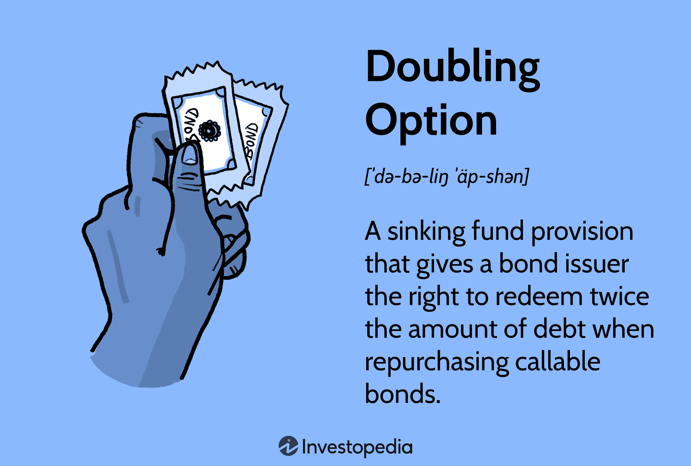

Strategies designed to optimize and potentially double investment options are of significant interest to investors seeking to maximize returns. This article focuses on the concept of doubling option investments and examines their relevance within the context of contemporary algorithmic trading. Doubling options involve strategic maneuvers and techniques in options trading, aimed at potentially achieving double the return on investments under favorable market conditions.

Algorithmic trading is pivotal in implementing these strategies systematically and efficiently. By utilizing sophisticated computer algorithms, trading decisions can be automated, allowing for rapid and precise trade execution. This technological advancement minimizes human error and enables traders to seize opportunities that may only be available for brief moments. 



The objective of this article is to equip investors with insights into effectively incorporating the doubling option strategy into their broader investment plans. By understanding and integrating these strategies, investors can strive for robust financial growth and a more diversified investment portfolio.

## Table of Contents

## Understanding Doubling Option

A doubling option is a provision in a bond agreement where the issuer can redeem twice the amount of debt during the repurchase of callable bonds. This financial instrument is crucial for managing corporate debt levels and offers enhanced flexibility, particularly under favorable market conditions such as low-interest rates. By utilizing doubling options, issuers can strategically manage their debt load, potentially reducing the overall cost of borrowing and optimizing capital structure.

The operation of doubling options hinges on specific triggers and conditions set out in the bond's indenture. These triggers often include changes in interest rates or credit ratings that make the exercise of the doubling option financially beneficial for the issuer. For instance, in a declining interest rate environment, an issuer might choose to use the doubling option to refinance existing debt at a lower cost, thereby enhancing overall financial health.

Investors must understand the nuances of doubling options to effectively assess their impact on bond investments and broader market dynamics. When a doubling option is exercised, the sudden redemption of a significant portion of debt can affect the market value of the bonds and influence yield curves. It can also signal the issuer's financial maneuvering aspirations, impacting investor sentiment and market perceptions.

Incorporating knowledge of doubling options into investment strategies requires analyzing the likelihood of the issuer executing the provision and understanding the conditions that may trigger such actions. By doing so, investors can better anticipate potential changes in bond valuations and align their portfolios to capitalize on these strategic financial decisions.

## Algorithmic Trading: A New Age in Finance

Algorithmic trading has significantly transformed the landscape of modern finance by enabling rapid and precise trade executions. These automated systems leverage complex algorithms to process vast amounts of market data and execute trades based on pre-defined criteria, reducing the latency associated with human intervention. By analyzing market conditions in real-time, [algorithmic trading](/wiki/algorithmic-trading) systems can make swift decisions to seize transient opportunities that might be missed by human traders.

The integration of algorithmic trading enhances the implementation of the doubling option strategy by providing an advanced infrastructure for executing trades under optimal market conditions. The algorithms can monitor market signals continuously and react almost instantaneously, ensuring that trades are executed when market conditions are most favorable. This real-time execution is crucial for strategies such as doubling options, where timing and precision are vital components for achieving desired investment outcomes.

Investors benefit from algorithmic trading through reduced transaction costs. Automated systems can execute large volumes of trades across different markets simultaneously, achieving economies of scale that lower the cost per transaction. Moreover, the increased efficiency contributes to improved market [liquidity](/wiki/liquidity-risk-premium) and reduced bid-ask spreads, further enhancing market efficiency.

In summary, algorithmic trading aligns trades to optimize investment outcomes by minimizing human error, maximizing speed, and capitalizing on fleeting opportunities, providing investors with an effective tool to navigate the complexities of financial markets and enhance their portfolio performance.

## Benefits of Incorporating Doubling Option Strategy

Incorporating a doubling option strategy into investment portfolios offers the potential to significantly enhance returns by capitalizing on favorable market conditions. One of the primary benefits is the amplification of returns through the strategic doubling of positions. By increasing exposure during positive market movements, investors can capitalize on trends and price advancements, which can lead to increased profits.

This approach is particularly beneficial in bullish markets or during times of market recovery when asset prices are expected to rise. In such environments, the doubling option strategy leverages the growth potential, thus providing investors with the opportunity to achieve substantial returns. By reacting swiftly to changing market dynamics, investors can optimize the timing of their trades, increasing the likelihood of favorable outcomes.

Moreover, the doubling option strategy provides flexibility in managing investment risks. Investors can employ this approach to hedge against potential losses by offsetting positions or lock in gains in volatile markets. This adaptability is critical for navigating uncertain market conditions and preserving capital while maximizing upside potential.

In addition to risk management, the doubling option strategy supports portfolio diversification. By expanding investment positions in various asset classes or securities, investors can reduce the impact of losses in any single holding. This diversity helps balance the overall risk-return profile of the portfolio, leading to more stable and consistent performance.

Lastly, strategically timed trades can enhance income generation. By optimizing entry and [exit](/wiki/exit-strategy) points based on market analysis, investors can increase the frequency and magnitude of profitable trades. This approach not only boosts total returns but also contributes to a more dynamic and proactive investment strategy.

Through the effective incorporation of a doubling option strategy, investors can navigate market complexities, hedge risks, and harness growth opportunities, all of which contribute to robust financial performance and enhanced portfolio value.

## Step-by-Step Implementation Guide

Implementing the doubling option strategy requires a systematic and disciplined approach, ensuring precise execution to optimize potential returns. The following guidelines provide a comprehensive framework for investors to effectively integrate this strategy into their portfolios while managing associated risks.

### Step 1: Evaluate Potential Stocks

The initial task is to identify stocks with favorable characteristics for options trading. Key factors to examine include:

- **Historical Volatility**: Analyze the stock’s past price movements to assess its volatility. Higher volatility can indicate a greater potential for significant gains.
- **Market Trends**: Evaluate current market conditions and trends to determine the sector and individual stock performance.
- **Liquidity**: Ensure the stock has high trading volume to facilitate easy entry and exit, minimizing the spread between bid and ask prices.

### Step 2: Assess Options Contracts

Once potential stocks are identified, the next step involves selecting appropriate options contracts. Considerations include:

- **Strike Price**: Choose a strike price that reflects a balance between risk and potential return. At-the-money or slightly out-of-the-money contracts are often preferred for doubling strategies.
- **Expiration Date**: Select an expiration date that aligns with your investment timeline and market predictions.
- **Premium Cost**: Evaluate the premium cost relative to the budget and risk tolerance, ensuring it remains within manageable limits.

### Step 3: Calculate Feasibility of Doubling Positions

Assess the practicality of doubling positions through rigorous market analysis:

- **Profit and Loss Projections**: Calculate the potential profit and loss scenarios using options pricing models or Python libraries like `numpy` and `scipy`. This step can involve:

  ```python
  import numpy as np
  from scipy.stats import norm

  def black_scholes(S, K, T, r, sigma, option_type='call'):
      # Calculate the Black-Scholes option price
      d1 = (np.log(S/K) + (r + 0.5 * sigma**2) * T) / (sigma * np.sqrt(T))
      d2 = d1 - sigma * np.sqrt(T)
      if option_type == 'call':
          return S * norm.cdf(d1) - K * np.exp(-r * T) * norm.cdf(d2)
      elif option_type == 'put':
          return K * np.exp(-r * T) * norm.cdf(-d2) - S * norm.cdf(-d1)

  # Example: Calculate a call option price
  current_stock_price = 100
  strike_price = 105
  time_to_expiration = 1  # in years
  risk_free_rate = 0.05  # 5% annual interest rate
  volatility = 0.2  # 20% annual volatility

  call_price = black_scholes(current_stock_price, strike_price, time_to_expiration,
                             risk_free_rate, volatility, option_type='call')
  print(f'Call Option Price: {call_price}')
  ```

- **Break-even Analysis**: Determine the break-even point, ensuring the strategy's feasibility under various market conditions.

### Step 4: Consider Risk Tolerance and Investment Goals

Before executing the doubling strategy, investors must:

- **Define Risk Tolerance**: Assess your ability to withstand potential losses, setting stop-loss orders to mitigate risks.
- **Align with Investment Goals**: Ensure the doubling strategy aligns with broader investment objectives, whether for income generation, growth, or hedging.

### Step 5: Systematic Execution and Risk Management

The final step is to execute the strategy while continuously monitoring and managing risks:

- **Diversification**: Spread investments across various assets to cushion against potential losses.
- **Risk Management Tools**: Utilize stop-loss orders and other risk management techniques to protect investments against unfavorable market movements.
- **Continuous Monitoring**: Regularly review and adjust positions to reflect changing market conditions and objectives.

By adhering to these structured guidelines, investors can incorporate the doubling option strategy effectively, optimizing their investment outcomes while managing risks comprehensively.

## Assessing Risks and Rewards

Analyzing the risk-reward profile of doubling options is crucial for informed trading decisions. This investment strategy involves several factors that can significantly impact its success, including time decay, market [volatility](/wiki/volatility-trading-strategies), and liquidity.

Time decay, or theta, refers to the reduction in the value of options contracts as they approach their expiration date. This decay can eat into potential profits, particularly for options that aren't moving favorably relative to the underlying asset. Investors must account for this erosion when planning to double positions, ensuring that any anticipated gains surpass the inherent loss of value over time.

Market volatility is another critical consideration. Volatility can amplify both potential gains and losses, posing a double-edged sword for investments. High volatility might present opportunities for doubling returns if market movements align with the chosen strategy. Conversely, it can lead to substantial losses if the market shifts unexpectedly. Understanding the current volatility environment and its potential future trajectory is vital to making sound decisions in this context.

Liquidity, the ease with which an asset can be bought or sold in the market without affecting its price, also plays a vital role. Illiquid markets can lead to slippage, where the execution price of a trade differs from its expected price, reducing the strategy's effectiveness. Thus, investors should ensure that the options they are dealing in are traded in markets with sufficient liquidity to allow for smooth entry and exit.

To evaluate the probability of achieving doubled returns versus the risk of losses, investors should engage in thorough analysis and [backtesting](/wiki/backtesting). Backtesting involves simulating the strategy on historical data to gauge its past performance and refine the approach. This practice can help identify optimal conditions under which the strategy thrives and scenarios that might pose risks.

Risk management strategies are integral to shielding investments from adverse market movements. Implementing stop-loss orders, which automatically sell securities when they reach a predetermined price, helps limit potential losses. Additionally, hedging, or taking offsetting positions in different assets, can mitigate risks. For example, investors might hedge a doubling option position by simultaneously holding a protective put option, which caps downside risk while allowing for upside potential.

In summary, effective risk assessment and management are paramount to leveraging the doubling option strategy successfully. By incorporating considerations of time decay, volatility, liquidity, and employing robust risk management tactics, investors can navigate the complexities of financial markets and optimize their chances of achieving favorable outcomes.

## Common Mistakes to Avoid

Investors often encounter several common mistakes when implementing the doubling option strategy, which can undermine potential success. One notable error is underestimating risks associated with this aggressive strategy. Doubling options [carry](/wiki/carry-trading) significant risk, especially in volatile markets where rapid price changes can lead to substantial losses. Comprehensive risk assessment is crucial, as it enables investors to anticipate potential pitfalls and adjust their strategies accordingly.

Neglecting thorough research is another frequent mistake. An in-depth analysis of market trends, historical data, and specific securities is essential for informed decision-making. Employing advanced tools and methodologies for market analysis can provide investors with valuable insights and enhance the precision of their trading strategies.

Failing to diversify investments is a risky approach that can expose investors to unnecessary financial vulnerabilities. A well-diversified portfolio mitigates risks by spreading investments across various asset classes and sectors, reducing the impact of any single asset's poor performance on the overall portfolio.

Misjudging market timing is a common error that can adversely affect the doubling option strategy. Accurate timing is crucial for maximizing returns, yet it is also one of the most challenging aspects of trading. Investors should leverage algorithmic tools and real-time data to refine their timing strategies. Techniques such as moving averages, [momentum](/wiki/momentum) indicators, and other analytical tools can assist in identifying optimal entry and exit points.

Ignoring risk management practices can lead to inadequate protection against market downturns. Implementing measures such as stop-loss orders and employing hedging strategies can provide necessary safeguards for investments. Additionally, maintaining an adequate level of patience is key; impulsive decisions can lead to unfavorable outcomes, particularly in volatile markets.

Investors who remain diligent in conducting comprehensive market analysis and adjusting their strategies in response to evolving conditions can mitigate these common mistakes. By being aware of these pitfalls and implementing robust strategies, investors are better positioned to optimize their investment outcomes and achieve their financial goals.

## Conclusion

The doubling option strategy, when synergized with algorithmic trading, offers considerable potential to enhance investment performance. This strategic combination enables investors to efficiently capitalize on favorable market conditions by executing trades with precision and speed. The successful application of this strategy demands strategic planning, comprehensive analysis, and meticulous risk management to adeptly navigate the complexities of financial markets. 

Investors are advised to harmonize traditional and modern trading techniques. By doing so, they can cultivate sustainable wealth growth, adapting to both established market dynamics and innovative trading practices. The thoughtful integration of these strategies allows investors to optimize their portfolios, paving the way for substantial financial growth within today's dynamic markets. 

In conclusion, the convergence of doubling option strategies with algorithmic trading provides a robust framework for investors seeking to maximize returns. As markets continue to evolve, those who can strategically implement these methods are well-positioned to secure lasting financial success.

## References & Further Reading

[1]: Chan, E. P. (2009). ["Quantitative Trading: How to Build Your Own Algorithmic Trading Business."](https://github.com/ftvision/quant_trading_echan_book) Wiley.

[2]: Jansen, S. (2020). ["Machine Learning for Algorithmic Trading."](https://github.com/stefan-jansen/machine-learning-for-trading) Packt Publishing.

[3]: Lopez de Prado, M. (2018). ["Advances in Financial Machine Learning."](https://www.amazon.com/Advances-Financial-Machine-Learning-Marcos/dp/1119482089) Wiley.

[4]: Aronson, D. R. (2007). ["Evidence-Based Technical Analysis: Applying the Scientific Method and Statistical Inference to Trading Signals."](https://onlinelibrary.wiley.com/doi/book/10.1002/9781118268315) Wiley.

[5]: Passarella, A. (2016). ["Algorithmic Finance."](https://journals.sagepub.com/toc/alg/5/3-4) Springer International Publishing.