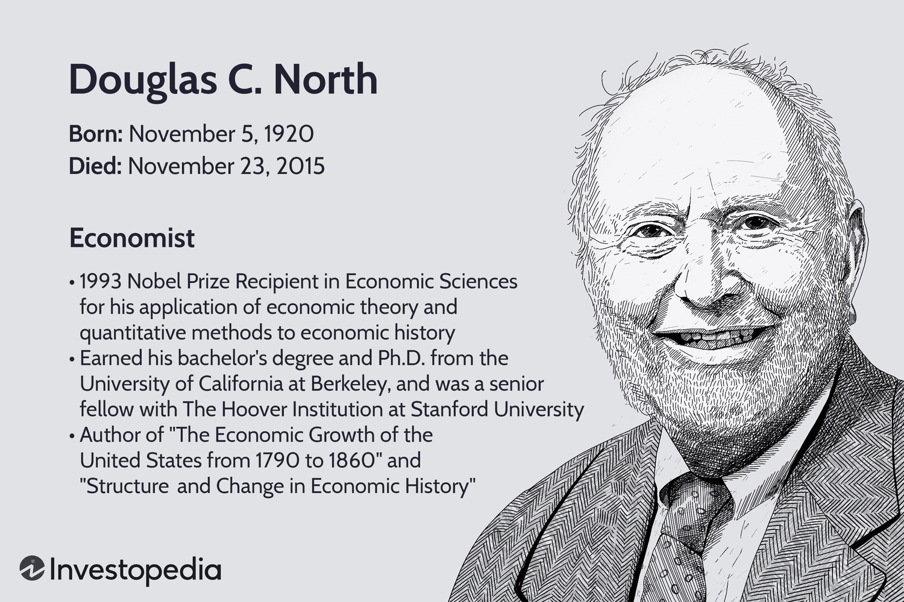

Douglass C. North was a renowned economist whose innovative work reshaped the understanding of economic history through cliometrics and new institutional economics. As a pioneering force, North emphasized the significance of employing quantitative methods and statistical tools alongside economic theory to re-evaluate historical economic phenomena. This article examines North's profound contributions, showcasing not only his transformative impact on institutional analysis but also his influential role in advancing quantitative approaches within economic history.

North's methodologies have paved the way for subsequent research and have broad implications in various fields, including modern technological advancements such as algorithmic trading. His theories provide a framework to understand how historical economic patterns and institutional structures can inform and improve contemporary financial practices. The synthesis of North's ideas with algorithmic trading signifies an innovative merger of historical analysis with state-of-the-art technology, ultimately enhancing strategies and market predictions in today's fast-paced financial environments.



Among his numerous achievements, North received the Nobel Prize in Economic Sciences in 1993, acknowledging his groundbreaking contributions to economic thought. His legacy persists in the continued exploration of economic systems through the lens of historical context and institutional influence. By integrating historical economic analysis with modern technologies, North's work remains highly relevant in addressing contemporary economic challenges and opportunities.

## Table of Contents

## Douglass C. North and Cliometrics

Cliometrics is a subfield of economic history that applies economic theory and quantitative methods to the study of historical events. Douglass C. North, along with Robert W. Fogel, is acknowledged as a pioneer in this discipline. Their work has significantly impacted how historians and economists analyze historical economic phenomena.

North's contributions to cliometrics involved utilizing statistical tools and models to reassess and reinterpret historical economic events. This methodological shift provided more rigorous and analytical insights into economic history, offering a deeper understanding of the factors influencing economic and institutional change over time. By employing quantitative approaches, North highlighted the importance of measurable data in assessing the roles of institutions and their evolution, thereby facilitating a nuanced understanding of economic development.

The significance of cliometrics lies in its ability to interrogate historical data through a quantitative lens, fostering a more robust analysis compared to traditional narrative methods. This approach has enabled researchers to apply economic theories to historical contexts, thereby allowing for the testing of hypotheses and the exploration of counterfactual scenarios. As a result, the cliometric method has broadened the scope of historical economic research, providing frameworks that challenge and refine existing narratives about economic growth, decline, and institutional transformation.

The foundational work by North and Fogel has not only expanded the analytical toolkit available to historians but has also influenced broader economic thinking, providing a quantitative backbone to modern institutional analysis and policy-making. Through their pioneering efforts, cliometrics continues to thrive as a vital approach in understanding the complexities of historical economic systems and their contemporary implications.

## Economic History and Institutional Analysis

Douglass C. North's work highlighted the critical role of institutions in shaping the economic performance of societies. He argued that institutions, defined as the formal and informal rules governing human interaction, fundamentally influence the incentives within an economy. This, in turn, determines the economic trajectory of societies, whether they experience growth, stagnation, or decline. North's analysis was groundbreaking in underscoring the limitations of neo-classical economic theories, which often assumed that markets operated efficiently without considering the intricate web of institutional factors.

North's challenge to conventional economic thought led to the emergence of new institutional economics. Unlike traditional economic analysis, which primarily focuses on market mechanisms and price signals, new institutional economics places significant emphasis on the role of institutions in reducing uncertainty, managing transaction costs, and fostering economic coordination. North posited that institutions are the catalyst for lowering transaction costs, as they provide a stable structure for interactions, reducing the uncertainty associated with exchanges and enabling more efficient economic processes.

The impact of institutions on economic efficiency is multifaceted. For instance, well-defined property rights and robust legal systems can enhance economic performance by ensuring that transactions are secure and predictable. Conversely, weak or misaligned institutions can lead to economic inefficiencies, where high transaction costs and ambiguous property rights deter investment and innovation. North's work illustrated that an understanding of economic history requires examining how institutions have evolved over time and how they have influenced economic outcomes.

North's analytical framework remains highly influential, both in academic circles and in policy-making. Policymakers and economists rely on his insights to design institutional reforms that can facilitate economic development. By evaluating the historical progression of institutions and their impact on economies, decision-makers can craft policies that strive for economic efficiency and sustainability. North's theories have provided a robust toolkit for analyzing economic systems, offering valuable lessons on the importance of institutional quality and adaptability. His legacy continues to inform both theoretical research and practical strategies aimed at fostering economic growth and stability.

## Algorithmic Trading and Economic History

Algorithmic trading, often referred to as algo trading, involves the use of sophisticated algorithms to execute trades at high speeds and volumes. These algorithms are designed to implement predefined trading strategies by analyzing market data, making trading decisions, and executing orders faster than human capabilities. The integration of historical economic analysis with [algorithmic trading](/wiki/algorithmic-trading) can significantly enhance trading strategies and improve market predictions by providing a deeper understanding of underlying market dynamics.

Douglass C. North's emphasis on the role of institutions offers a valuable framework for understanding market behaviors in automated trading environments. Institutions, as defined by North, encompass the rules, norms, and enforcement mechanisms that shape economic interactions. By applying institutional analysis to algorithmic trading, traders can account for how changes in regulations, market practices, and cultural norms impact trading environments. This approach aids in anticipating market shifts and [volatility](/wiki/volatility-trading-strategies), leading to more informed decision-making processes.

Historical data, when interpreted through the lens of cliometrics — the application of quantitative analysis to historical study — can significantly inform algorithmic models. By leveraging historical transaction records, price movements, and economic conditions, traders can develop algorithms that not only consider current market conditions but are also resilient to historical market patterns and anomalies. For instance, past economic events such as financial crises or regulatory changes can be modeled into trading algorithms to predict how similar events might influence future markets.

The fusion of cliometrics and algorithmic trading is exemplified by the use of historical insights to inform and refine modern financial technologies. By incorporating historical data analysis as a foundation, algo trading strategies can be tailored to recognize patterns that are not immediately evident through real-time market analysis alone. This historical perspective enhances the adaptability and accuracy of trading models, ensuring they are robust against a variety of market conditions and capable of exploiting short-term opportunities while mitigating risk.

In practice, Python is often employed to develop and test these complex trading algorithms. The language's extensive libraries and frameworks enable the efficient processing and analysis of vast datasets. For example, the pandas library facilitates data manipulation and analysis, making it easier to incorporate historical datasets into trading strategies:

```python
import pandas as pd

# Load historical market data
data = pd.read_csv('historical_market_data.csv')

# Calculate historical moving averages
data['Moving_Average'] = data['Price'].rolling(window=20).mean()

# Strategy: Buy when price is above moving average, sell when below
def trading_strategy(data):
    buy_signals = []
    sell_signals = []

    for i in range(len(data)):
        if data['Price'][i] > data['Moving_Average'][i]:
            buy_signals.append(data['Price'][i])
            sell_signals.append(None)
        else:
            buy_signals.append(None)
            sell_signals.append(data['Price'][i])

    return buy_signals, sell_signals

# Apply the trading strategy
data['Buy_Signal'], data['Sell_Signal'] = trading_strategy(data)
```

In this example, a simple moving average strategy is formulated using historical price data, illustrating how historical analysis can be embedded within algo trading frameworks. The legacy of Douglass C. North persists, as his methodologies continue to inspire the enhancement of algorithmic trading strategies through the utilization of economic history insights.

## The Legacy of Douglass C. North

Douglass C. North's contributions to economic history have significantly influenced both academic scholarship and practical approaches in economics. Through his groundbreaking work in cliometrics, North introduced innovative methods for analyzing historical economic data using quantitative techniques. This development not only reshaped the study of economic history but also paved the way for new institutional economics, a field that emphasizes the critical role of institutions—such as laws, property rights, and social norms—in shaping economic outcomes. These ideas challenged traditional neo-classical theories by proposing that institutions are fundamental determinants of economic performance, impacting the incentives and transaction costs within an economy.

North's analytical frameworks have had enduring influence on both economic theory and policy-making. By highlighting the importance of institutions, North's work has provided tools for addressing international economic issues. His insights have been employed in evaluating economic development strategies, institutional reforms, and policy decisions aimed at achieving sustainable growth.

The contemporary landscape of financial technology, particularly algorithmic trading, also reflects Douglass C. North's enduring legacy. The integration of historical economic analysis with sophisticated trading algorithms underscores the relevance of his methodologies. Algorithmic trading systems can be enhanced by incorporating historical data and insights into their predictive models, thus improving their accuracy and adaptability. North's focus on institutions offers a valuable lens through which market dynamics and automated trading processes can be understood and optimized.

Douglass C. North's legacy continues through the application of his methodologies across various domains of economics and finance. His work has been instrumental in shaping modern economic analysis and remains a foundation for ongoing research and technological advancements, underscoring the timelessness and versatility of his contributions.

## References & Further Reading

[1]: North, Douglass C. (1990). ["Institutions, Institutional Change and Economic Performance."](https://www.cambridge.org/core/books/institutions-institutional-change-and-economic-performance/AAE1E27DF8996E24C5DD07EB79BBA7EE) Cambridge: Cambridge University Press.

[2]: Fogel, Robert W., & Engerman, Stanley L. (1974). ["Time on the Cross: The Economics of American Negro Slavery."](https://en.wikipedia.org/wiki/Time_on_the_Cross:_The_Economics_of_American_Negro_Slavery) Boston: Little, Brown and Company.

[3]: Popper, Ludwig. (1994). ["Cliometrics: Past, Present, and Future."](https://hal.science/hal-03345558/document) The Journal of Economic History, 54(2), 289-301.

[4]: Lopez de Prado, Marcos. (2018). ["Advances in Financial Machine Learning."](https://www.amazon.com/Advances-Financial-Machine-Learning-Marcos/dp/1119482089) Hoboken: John Wiley & Sons.

[5]: McCloskey, Deirdre N. (1975). ["The Economics of Enclosure: A Market Analysis."](https://www.deirdremccloskey.com/articles/) European Review of Economic History, 24(3), 346–369.