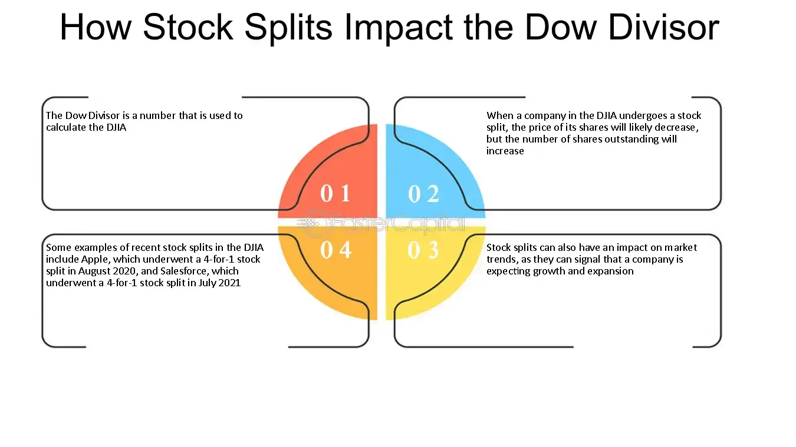

## Table of Contents

## What is the Dow Divisor?

The Dow Divisor is a number used to calculate the Dow Jones Industrial Average (DJIA), which is a stock market index. It helps to make the average value of the stocks in the DJIA easier to understand. The DJIA is made up of 30 big companies, and their stock prices are added together and then divided by the Dow Divisor to get the index value.

The Dow Divisor started as the number of companies in the index, which was originally 12. Over time, it has changed because of things like stock splits and changes in the companies included in the index. Today, the Dow Divisor is much smaller than the number of companies, and it is adjusted to keep the index stable when changes happen. This way, the DJIA can still show how the stock market is doing overall.

## Why is the Dow Divisor important for the Dow Jones Industrial Average (DJIA)?

The Dow Divisor is really important for the Dow Jones Industrial Average (DJIA) because it helps make the index easier to understand. The DJIA is made up of 30 big companies, and their stock prices are added together. Then, this total is divided by the Dow Divisor to get the final number for the DJIA. This way, even though the stock prices can be very different, the Dow Divisor helps make the index a simple number that people can use to see how the stock market is doing.

The Dow Divisor also keeps the DJIA stable when things change, like when a company's stock splits or when a new company is added to the index. If the Dow Divisor didn't change, these events could make the DJIA go up or down a lot, even if the overall market didn't really change. By adjusting the Dow Divisor, it makes sure the DJIA stays a good measure of the market, so people can trust it to show what's really happening with the stocks of those 30 companies.

## How is the Dow Divisor calculated?

The Dow Divisor is a special number used to figure out the Dow Jones Industrial Average (DJIA). It started as the number of companies in the index, which was 12 when the DJIA began. But over time, it changed because of things like stock splits and new companies joining the index. Today, the Dow Divisor is a lot smaller than the number of companies. It's adjusted to keep the DJIA stable when changes happen, so the index can still show how the stock market is doing overall.

When something changes with the companies in the DJIA, like a stock split or a company being added or removed, the Dow Divisor is recalculated. The goal is to make sure that these changes don't make the DJIA go up or down in a way that doesn't match what's really happening in the market. So, if a company's stock splits, making its price lower, the Dow Divisor is adjusted to a smaller number to keep the DJIA the same. This way, the DJIA stays a reliable way to see how the stock market is doing.

## What happens to the Dow Divisor when a company in the DJIA undergoes a stock split?

When a company in the Dow Jones Industrial Average (DJIA) has a stock split, the price of its stock goes down. But we want the DJIA to stay the same, so it still shows what's happening in the market correctly. To do this, the Dow Divisor is changed to a smaller number. This makes sure that even though the stock price is lower, the DJIA doesn't change in a way that's not right.

The Dow Divisor is like a special tool that helps keep the DJIA steady. When a stock splits, the total value of all the stocks in the DJIA would normally go down because of the lower price of the split stock. By making the Dow Divisor smaller, we can keep the DJIA the same. This way, the DJIA keeps showing the real picture of how the market is doing, even when one company's stock changes.

## Can you provide a simple example of how the Dow Divisor affects the DJIA?

Let's say the DJIA has three companies: Company A, Company B, and Company C. Their stock prices are $100, $150, and $200 respectively. If we add these up, we get $450. The Dow Divisor right now is 3, so we divide $450 by 3, and the DJIA is 150.

Now, imagine Company A does a 2-for-1 stock split. Its stock price drops from $100 to $50. If we didn't change the Dow Divisor, the new total would be $400 ($50 + $150 + $200), and the DJIA would drop to about 133.33 ($400 divided by 3). But we want the DJIA to stay the same because the market hasn't really changed, just one stock's price. So, we adjust the Dow Divisor to a smaller number, like 2.5. Now, when we divide $400 by 2.5, the DJIA stays at 160, showing the market is still the same.

## How often is the Dow Divisor adjusted?

The Dow Divisor is adjusted whenever there's a big change with one of the companies in the Dow Jones Industrial Average (DJIA). This could be things like a stock split, a company being added or taken away, or a big change in how a company's stock is counted. These changes are needed to keep the DJIA showing the real picture of the market, without going up or down just because of one company's change.

These adjustments don't happen on a set schedule. They only happen when something important changes with one of the companies. The people who take care of the DJIA watch for these changes and make sure the Dow Divisor is updated right away to keep the index accurate and fair.

## What are the historical changes to the Dow Divisor?

The Dow Divisor started out as the number of companies in the Dow Jones Industrial Average (DJIA), which was 12 when it began in 1896. Back then, you just added up the stock prices of all the companies and divided by 12 to get the DJIA. But over time, things like stock splits and changes in the companies in the index made the Dow Divisor change. By the time the DJIA had 30 companies, the Dow Divisor was no longer 30. It had to be adjusted to keep the DJIA showing the right picture of the market.

Today, the Dow Divisor is a much smaller number than the number of companies in the DJIA. It's been adjusted many times over the years to make sure that when a company's stock splits or a new company joins the index, the DJIA doesn't jump around in a way that doesn't match what's really happening in the market. These adjustments help keep the DJIA a reliable way to see how the stock market is doing. The exact number of the Dow Divisor changes whenever there's a big change with one of the companies, and it's always being watched to make sure it's right.

## How does the Dow Divisor differ from other market indices' divisors?

The Dow Divisor is special because it's used just for the Dow Jones Industrial Average (DJIA). It started as the number of companies in the DJIA, but it's changed a lot over time. When a company's stock splits or a new company joins the DJIA, the Dow Divisor gets smaller to keep the DJIA showing the right picture of the market. This way, even if one stock's price changes, the whole DJIA doesn't jump around in a way that's not fair.

Other market indices, like the S&P 500 or the Nasdaq Composite, use different ways to figure out their values. Instead of a divisor like the DJIA, they often use a "float-adjusted market capitalization" method. This means they look at the total value of all the stocks in the index, but only count the shares that are available to be traded. This is different from the Dow Divisor because it's not just about adding up stock prices and dividing by a number. Each index has its own way to make sure it shows what's happening in the market correctly.

## What impact do mergers and acquisitions have on the Dow Divisor?

When companies in the Dow Jones Industrial Average (DJIA) go through mergers or acquisitions, it can change the price of their stocks. If a company's stock price goes up or down a lot because of a merger or acquisition, the people who take care of the DJIA need to make sure the index still shows the right picture of the market. To do this, they might need to adjust the Dow Divisor. The Dow Divisor is a special number used to calculate the DJIA, and it helps keep the index steady even when big changes happen with the companies.

So, if a company in the DJIA merges with another company and its stock price changes, the Dow Divisor might be changed to a different number. This change makes sure that the DJIA doesn't go up or down just because of the merger or acquisition. The goal is to keep the DJIA showing what's really happening in the market, without being affected too much by one company's big change. That's why the Dow Divisor is so important—it helps the DJIA stay a reliable way to see how the stock market is doing.

## How does the Dow Divisor influence investment decisions?

The Dow Divisor helps investors by making the Dow Jones Industrial Average (DJIA) easier to understand. The DJIA is a number that shows how a group of big companies are doing in the stock market. The Dow Divisor is a special number that keeps the DJIA steady, even when things change with the companies. This way, investors can trust the DJIA to show what's really happening in the market. If the DJIA goes up or down, investors can use that information to decide if they want to buy or sell stocks.

But the Dow Divisor itself doesn't tell investors what to do. It's just a tool to help the DJIA work right. Investors look at the DJIA, along with other information, to make their decisions. For example, if the DJIA is going up, it might mean the market is doing well, and investors might want to buy more stocks. If it's going down, they might want to sell or wait. The Dow Divisor helps make sure the DJIA is a reliable tool for investors to use.

## What are the criticisms of using the Dow Divisor in the DJIA?

Some people say the Dow Divisor has problems because it can make the Dow Jones Industrial Average (DJIA) seem a bit off. The DJIA only looks at the stock prices of 30 big companies, and it doesn't count how many shares of each company there are. This means a company with a high stock price can affect the DJIA more than a company with a lower stock price, even if the lower-priced company is actually worth more. This can make the DJIA not show the full picture of the market.

Also, because the Dow Divisor changes whenever something big happens with one of the companies, it can be hard for people to understand why the DJIA goes up or down. If a stock splits or a new company joins the DJIA, the Dow Divisor gets smaller, but this might confuse some investors. They might think the market is changing when really it's just the Dow Divisor that's been adjusted. This can make it harder for people to trust the DJIA as a good measure of how the market is doing.

## How can understanding the Dow Divisor help in predicting market trends?

Understanding the Dow Divisor can help in predicting market trends because it shows how the Dow Jones Industrial Average (DJIA) works. The DJIA is a number that tells us how a group of big companies are doing in the stock market. The Dow Divisor is a special number that keeps the DJIA steady, even when things change with the companies. If you know how the Dow Divisor works, you can see why the DJIA might go up or down, and this can help you guess what might happen next in the market.

For example, if a company in the DJIA does a stock split, its stock price goes down, but the Dow Divisor gets smaller to keep the DJIA the same. By understanding this, you can tell that a change in the DJIA might not mean the whole market is changing, just that one company's stock did something different. This can help you make better guesses about where the market might be headed, by looking at the bigger picture and not just the DJIA number.

## What is the Dow Divisor?

The Dow Divisor is a fundamental component used in calculating the Dow Jones Industrial Average (DJIA), one of the most renowned stock market indices globally. Unlike many other stock indices that are market-capitalization-weighted, the DJIA is calculated using a price-weighted methodology. This means that the price of each stock in the index directly influences the overall value of the index. As a result, more expensive stocks have a greater impact on the DJIA movement compared to cheaper ones.

The primary function of the Dow Divisor is to ensure continuity and consistency of the DJIA by adjusting for corporate actions such as stock splits, dividends, and changes in the constituent companies of the index. For example, if a company within the DJIA undergoes a 2-for-1 stock split, the price of that company's stock will be halved. Without an adjustment, this would cause a misleading drop in the DJIA. The Dow Divisor is recalibrated to offset the impact of such a stock split so the index accurately reflects the overall market's performance.

Mathematically, the DJIA is calculated using the following formula:

$$
\text{DJIA} = \frac{\sum \text{Price of component stocks}}{\text{Dow Divisor}}
$$

As of November 2024, the Dow Divisor is approximately 0.16268413125742. This small divisor allows the DJIA to operate on a scale that is more fitting for interpretation as an index. Understanding the role of the Dow Divisor is pivotal for accurately interpreting movements in the DJIA because it ensures that the index remains stable over time when structural changes occur in the component stocks.

The consistent adjustment of the Divisor maintains the historical continuity of the DJIA, allowing investors and analysts to make meaningful comparisons of the index's level over time. By understanding how this figure is employed, investors can better interpret daily index fluctuations and the influence of individual stock performances on the index's overall movement.

## What are Calculations and Adjustments?

The Dow Divisor plays an essential role in maintaining the Dow Jones Industrial Average (DJIA) as a consistent market indicator amidst the changing landscape of corporate actions such as stock splits and component alterations. When a stock in the DJIA undergoes a split, the stock price decreases while the number of shares increases, but the overall market capitalization remains unchanged. Without an adjustment, such events would erroneously reflect a sharp decline in the DJIA. Herein lies the crucial function of the Dow Divisor: it adjusts the index to neutralize the effects of these corporate actions, ensuring that the DJIA remains reflective of genuine market movements rather than administrative stock changes.

The process of using the Dow Divisor is relatively straightforward, albeit significant for the accurate representation of the DJIA. Initially, the sum of the prices of all 30 stocks in the DJIA is calculated. This value is then divided by the Dow Divisor to result in the DJIA. Symbolically, this can be expressed as:

$$
\text{DJIA} = \frac{\sum \text{Price of stocks}}{\text{Dow Divisor}}
$$

When a corporate action such as a stock split occurs, the divisor is recalculated to prevent artificial fluctuations in the index. For example, consider a 2-for-1 stock split on a company whose stock was priced at $200. Post-split, the stock price would adjust to $100, theoretically halving the DJIA value if no correction were made via the divisor.

An accurate divisor is paramount for reliable market assessments, as tiny inaccuracies can propagate significant discrepancies in the DJIA's calculated value, affecting investor perception and decision-making. To illustrate, consider a hypothetical adjustment where the sum of the stock prices is 30,000 and the current divisor is 0.16268413125742:

Without any adjustments, the DJIA would be calculated as:

$$
\text{DJIA} = \frac{30,000}{0.16268413125742} \approx 184,453
$$

If a stock split alters the sum to 29,500 but the divisor is not adjusted, the DJIA would inaccurately reflect a decrease:

$$
\text{Incorrect DJIA} = \frac{29,500}{0.16268413125742} \approx 181,262
$$

This variation can mislead market participants into perceiving it as a significant drop in market value, underscoring the necessity of maintaining an accurate Dow Divisor. By recalculating and adjusting the divisor in response to changes like stock splits and dividends, the DJIA can retain its historical integrity and continue to be a reliable benchmark for market assessments.

## References & Further Reading

[1]: ["DJIA Divisor History, Average & Top 30 Companies"](https://www.wsj.com/market-data/quotes/index/DJIA) - Investopedia

[2]: ["The Dow Jones Averages 1885-1995"](https://archive.org/details/dowjonesaverages0000unse_t3g8) by Aswath Damodaran

[3]: ["Trading and Exchanges: Market Microstructure for Practitioners"](https://academic.oup.com/book/52292) by Larry Harris

[4]: ["Algorithmic and High-Frequency Trading"](https://assets.cambridge.org/97811070/91146/frontmatter/9781107091146_frontmatter.pdf) by Alireza Javaheri

[5]: ["An Introduction to High-Frequency Finance"](https://archive.org/details/an-introduction-to-high-frequency-finance) by Ramazan Gençay, Michel Dacorogna, Ulrich Müller, Richard Olsen, and Olivier Pictet