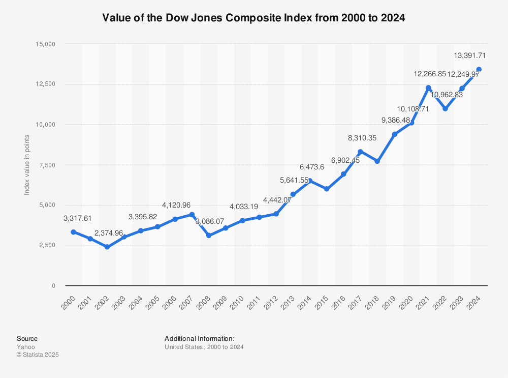

## Table of Contents

## What is the Dow Jones 65 Composite Average?

The Dow Jones 65 Composite Average is not a real financial index. It seems like it might be a mix-up with the actual Dow Jones Industrial Average, which is a well-known stock market index. The Dow Jones Industrial Average, often just called the Dow, tracks 30 large companies in the United States. It's used to give a quick look at how the stock market and the economy are doing.

The Dow Jones Industrial Average was started by Charles Dow in 1896. It's made up of big companies from different industries, like tech, health care, and finance. The value of the Dow goes up or down based on how the stocks of these companies are doing. People watch the Dow to see if the market is going up or down, and it's often mentioned in the news.

## How does the Dow Jones 65 Composite Average differ from other Dow Jones indices?

The Dow Jones 65 Composite Average is not a real index. It might sound like it's part of the Dow Jones family, but it's actually made up. The real Dow Jones indices, like the Dow Jones Industrial Average, track actual stock prices and give us information about the market. The Dow Jones Industrial Average, for example, follows 30 big companies in the U.S. and shows how the stock market is doing overall.

Other real Dow Jones indices include the Dow Jones Transportation Average and the Dow Jones Utility Average. The Transportation Average looks at companies that move goods and people, like airlines and railroads. The Utility Average focuses on companies that provide services like electricity and water. These indices help investors see how different parts of the economy are doing. But remember, the Dow Jones 65 Composite Average isn't one of them; it's just a made-up name.

## What types of companies are included in the Dow Jones 65 Composite Average?

The Dow Jones 65 Composite Average is not a real index, so it doesn't include any companies. It's a made-up name that sounds like it could be part of the Dow Jones family, but it's not. The real Dow Jones indices, like the Dow Jones Industrial Average, track actual stock prices of big companies in the U.S.

The Dow Jones Industrial Average, for example, includes 30 large companies from different industries, like technology, health care, and finance. These companies are chosen to give a good picture of how the overall stock market is doing. If someone talks about the Dow Jones 65 Composite Average, they're probably mixing it up with a real index or just making a mistake.

## How is the Dow Jones 65 Composite Average calculated?

The Dow Jones 65 Composite Average is not a real index, so there's no way to calculate it. It sounds like it might be part of the Dow Jones family, but it's actually made up. If someone mentions it, they might be confusing it with a real index like the Dow Jones Industrial Average.

The Dow Jones Industrial Average is a real index that tracks 30 big companies in the U.S. To calculate it, you add up the stock prices of these 30 companies and then divide by a special number called the "Dow Divisor." This divisor changes over time to keep the index accurate, even when companies split their stocks or other changes happen. So, while the Dow Jones 65 Composite Average isn't real, the Dow Jones Industrial Average is, and it's calculated in a specific way to show how the market is doing.

## What is the historical performance of the Dow Jones 65 Composite Average?

The Dow Jones 65 Composite Average is not a real index, so it doesn't have any historical performance to talk about. It might sound like it's part of the Dow Jones family, but it's actually made up. If someone mentions it, they're probably confusing it with a real index like the Dow Jones Industrial Average.

The Dow Jones Industrial Average, on the other hand, is a real index that tracks 30 big companies in the U.S. Its historical performance goes back to 1896 when it was first created by Charles Dow. Over the years, the Dow has gone up and down, showing how the economy and stock market are doing. For example, it has hit all-time highs during good economic times and dropped during recessions, like in 2008 during the financial crisis.

## How can investors use the Dow Jones 65 Composite Average to make investment decisions?

The Dow Jones 65 Composite Average isn't real, so investors can't use it to make any investment decisions. It's a made-up name that might sound like it's part of the Dow Jones family, but it doesn't exist. If someone talks about it, they're probably mixing it up with a real index like the Dow Jones Industrial Average.

The Dow Jones Industrial Average, which is real, tracks 30 big companies in the U.S. and can help investors understand how the stock market is doing. Investors might look at the Dow to see if the market is going up or down. If the Dow is doing well, it might mean the economy is strong, and that could be a good time to invest. If the Dow is going down, it might be a sign that the economy is struggling, and investors might want to be more careful with their money.

## What are the criteria for a company to be included in the Dow Jones 65 Composite Average?

The Dow Jones 65 Composite Average isn't a real index, so there are no criteria for a company to be included in it. It might sound like it's part of the Dow Jones family, but it's actually made up. If someone mentions it, they're probably confusing it with a real index like the Dow Jones Industrial Average.

The Dow Jones Industrial Average, which is real, has specific criteria for the companies it includes. It tracks 30 big companies in the U.S. that represent different parts of the economy, like technology, health care, and finance. The companies are chosen based on their reputation, their impact on the market, and how well they show what's happening in the economy. The goal is to give a good picture of how the overall stock market is doing.

## How often is the Dow Jones 65 Composite Average updated or rebalanced?

The Dow Jones 65 Composite Average isn't real, so it doesn't get updated or rebalanced. It's a made-up name that sounds like it could be part of the Dow Jones family, but it doesn't exist. If someone talks about it, they might be mixing it up with a real index like the Dow Jones Industrial Average.

The Dow Jones Industrial Average, which is real, gets updated every day when the stock market is open. The prices of the 30 companies it tracks change all the time, so the index changes too. It's not rebalanced often, but sometimes a company might be added or removed if it's not a good fit anymore or if a new company better represents the economy.

## What impact do economic events have on the Dow Jones 65 Composite Average?

The Dow Jones 65 Composite Average isn't real, so economic events can't affect it. It's a made-up name that might sound like it's part of the Dow Jones family, but it doesn't exist. If someone mentions it, they might be confusing it with a real index like the Dow Jones Industrial Average.

The Dow Jones Industrial Average, which is real, can go up or down because of economic events. For example, if there's good news about the economy, like more people getting jobs, the Dow might go up because people feel good about investing. But if there's bad news, like a big company going bankrupt, the Dow might go down because people might worry and sell their stocks. So, economic events can really change how the Dow Jones Industrial Average performs, but they don't affect the made-up Dow Jones 65 Composite Average at all.

## How does the Dow Jones 65 Composite Average compare to other major market indices like the S&P 500?

The Dow Jones 65 Composite Average isn't a real index, so you can't compare it to other major market indices like the S&P 500. It's a made-up name that might sound like it's part of the Dow Jones family, but it doesn't exist. If someone talks about it, they might be mixing it up with a real index like the Dow Jones Industrial Average. The S&P 500, on the other hand, is a real index that tracks 500 large companies in the U.S. It's used to show how the overall stock market is doing.

The S&P 500 is different from the Dow Jones Industrial Average because it includes more companies and is based on the market value of those companies, not just their stock prices. The Dow Jones Industrial Average tracks 30 big companies and is calculated by adding up their stock prices and dividing by a special number called the "Dow Divisor." Both indices help investors see how the market is doing, but the S&P 500 gives a broader picture because it includes more companies from different parts of the economy.

## What are the advantages and disadvantages of using the Dow Jones 65 Composite Average as a market benchmark?

The Dow Jones 65 Composite Average isn't a real index, so there are no advantages or disadvantages to using it as a market benchmark. It's a made-up name that might sound like it's part of the Dow Jones family, but it doesn't exist. If someone talks about it, they might be confusing it with a real index like the Dow Jones Industrial Average. Since it's not real, it can't help investors understand how the market is doing or make any investment decisions.

Instead, investors use real indices like the Dow Jones Industrial Average or the S&P 500 as market benchmarks. The Dow Jones Industrial Average tracks 30 big companies in the U.S. and gives a quick look at how the stock market is doing. The S&P 500, on the other hand, tracks 500 large companies and provides a broader view of the market. Both of these indices have their own advantages and disadvantages, but the made-up Dow Jones 65 Composite Average has none because it's not real.

## What future trends might affect the composition and performance of the Dow Jones 65 Composite Average?

The Dow Jones 65 Composite Average isn't a real index, so there are no future trends that can affect its composition or performance. It's a made-up name that might sound like it's part of the Dow Jones family, but it doesn't exist. If someone talks about it, they're probably mixing it up with a real index like the Dow Jones Industrial Average. Since it's not real, it can't change or be influenced by anything happening in the economy or the stock market.

Instead, investors look at real indices like the Dow Jones Industrial Average or the S&P 500 to understand future trends. These indices can be affected by things like new technology, changes in the economy, or big events around the world. For example, if a new type of technology becomes popular, companies that make that technology might be added to the index, changing its composition. Or if there's a big economic change, like a recession, the performance of the index might go down as companies struggle.

## References & Further Reading

[1]: Jones, C. M. (2013). ["What Do We Know About High-Frequency Trading?"](https://papers.ssrn.com/sol3/papers.cfm?abstract_id=2236201) Journal of Financial Markets, 16(1), 3-24.

[2]: Hasbrouck, J., & Saar, G. (2013). ["Low-Latency Trading"](https://www.sciencedirect.com/science/article/abs/pii/S1386418113000165) Review of Financial Studies, 26(9), 2095-2136.

[3]: Aldridge, I. (2013). ["High Frequency Trading: A Practical Guide to Algorithmic Strategies and Trading Systems"](https://www.amazon.com/High-Frequency-Trading-Practical-Algorithmic-Strategies/dp/1118343506) (2nd ed.). Wiley.

[4]: Hendershott, T., Jones, C. M., & Menkveld, A. J. (2011). ["Does Algorithmic Trading Improve Liquidity?"](https://onlinelibrary.wiley.com/doi/full/10.1111/j.1540-6261.2010.01624.x) Journal of Financial Economics, 21(3), 825-859.

[5]: Harris, L. (2003). ["Trading and Exchanges: Market Microstructure for Practitioners"](https://www.amazon.com/Trading-Exchanges-Market-Microstructure-Practitioners/dp/0195144708) Oxford University Press.