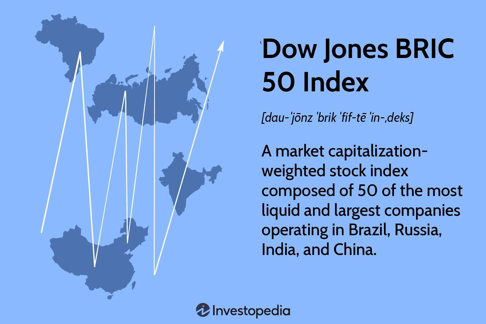

## Table of Contents

## What is the Dow Jones BRIC 50 Index?

The Dow Jones BRIC 50 Index is a stock market index that focuses on the biggest companies in four countries: Brazil, Russia, India, and China. These countries are often called the BRIC nations. The index includes 50 of the largest and most influential companies from these countries. It helps investors see how well these big companies are doing and gives them a way to invest in the growth of these emerging markets.

The index is made up of companies from different industries, like energy, finance, and technology. This mix helps spread out the risk for investors. The Dow Jones BRIC 50 Index is important because it shows how the economies of Brazil, Russia, India, and China are doing overall. By tracking this index, people can get a good idea of the economic health and growth potential of these key emerging markets.

## Which countries are included in the BRIC acronym?

The BRIC acronym stands for Brazil, Russia, India, and China. These four countries are grouped together because they are seen as big emerging markets with a lot of potential for growth.

Each of these countries has a large population and a growing economy. They are important players on the world stage and are expected to have a big impact on the global economy in the future.

## How is the Dow Jones BRIC 50 Index calculated?

The Dow Jones BRIC 50 Index is calculated by adding up the stock prices of the 50 biggest companies from Brazil, Russia, India, and China. Each company's stock price is then multiplied by a special number called a "weight." This weight shows how important that company is in the index. The weights make sure that bigger companies have a bigger impact on the index's value.

After multiplying each stock price by its weight, all the results are added together. This total number is then divided by a special number called the "divisor." The divisor helps keep the index steady even when companies are added or removed, or when there are stock splits. The final number you get after dividing is the value of the Dow Jones BRIC 50 Index.

## What types of companies are included in the Dow Jones BRIC 50 Index?

The Dow Jones BRIC 50 Index includes different kinds of companies from Brazil, Russia, India, and China. These companies come from many industries like energy, finance, technology, and more. This mix of industries helps spread out the risk for people who invest in the index. It means that if one type of company does badly, others might still do well.

The index focuses on the biggest and most important companies in these countries. This makes it a good way to see how the overall economy in these places is doing. By looking at the index, investors can get a sense of how well these big companies are performing and what might happen with the economy in Brazil, Russia, India, and China in the future.

## How does the Dow Jones BRIC 50 Index differ from other BRIC indices?

The Dow Jones BRIC 50 Index is different from other BRIC indices because it focuses on the 50 biggest companies from Brazil, Russia, India, and China. Other indices might include more companies or focus on different sizes of companies. The Dow Jones BRIC 50 Index is made up of big companies from different industries like energy, finance, and technology. This mix helps spread out the risk for investors. Other indices might focus on just one type of industry or might not have such a big mix of industries.

Another way the Dow Jones BRIC 50 Index is different is how it's calculated. It uses a special way to add up the stock prices of the 50 companies, where each company's price is multiplied by a weight. This weight shows how important the company is in the index. Other BRIC indices might use different ways to calculate their values, like using equal weights for all companies or focusing on different factors. This can make the Dow Jones BRIC 50 Index give a different picture of the BRIC economies compared to other indices.

## What are the historical performance trends of the Dow Jones BRIC 50 Index?

The Dow Jones BRIC 50 Index has shown a lot of ups and downs over the years. This is because the economies of Brazil, Russia, India, and China can be very different from each other and can change a lot. Sometimes, the index goes up a lot when these countries are growing fast and their big companies are doing well. Other times, it goes down when there are problems in these countries, like economic slowdowns or political issues. For example, the index had a big jump in the early 2000s when China and India were growing very fast, but it fell during times like the 2008 global financial crisis and other economic downturns.

Over the long term, the Dow Jones BRIC 50 Index has shown that it can grow a lot, but it can also be very risky. Investors who put their money in this index have seen big gains when the BRIC countries are doing well, but they have also seen big losses when things go wrong. This makes the index a good choice for people who want to invest in the growth of these big emerging markets, but they need to be ready for a bumpy ride. Keeping an eye on the news and understanding what's happening in Brazil, Russia, India, and China can help investors make better decisions about when to buy or sell.

## How can investors use the Dow Jones BRIC 50 Index to diversify their portfolios?

Investors can use the Dow Jones BRIC 50 Index to diversify their portfolios by adding a mix of big companies from Brazil, Russia, India, and China. This index includes companies from different industries like energy, finance, and technology. By investing in the Dow Jones BRIC 50 Index, investors can spread out their risk. Instead of putting all their money in just one country or industry, they can have a piece of many big companies across four important emerging markets. This can help protect their money if one country or industry does badly, because other parts of their investment might still do well.

The Dow Jones BRIC 50 Index also lets investors tap into the growth of these emerging markets. Brazil, Russia, India, and China are big countries with lots of people and growing economies. By investing in this index, investors can benefit from the growth of these countries. However, it's important to remember that investing in the Dow Jones BRIC 50 Index can be risky because these markets can go up and down a lot. So, investors should keep an eye on what's happening in these countries and be ready for some ups and downs.

## What are the risks associated with investing in the Dow Jones BRIC 50 Index?

Investing in the Dow Jones BRIC 50 Index can be risky because the economies of Brazil, Russia, India, and China can change a lot. These countries can have big ups and downs. For example, if there's a political problem in one of these countries, it can make the stock prices of the companies in the index go down. Also, these countries might have times when their economies slow down, which can hurt the index's value. Because the index includes companies from different industries, if one industry does badly, it can pull down the whole index.

Another risk is that the Dow Jones BRIC 50 Index might not be as stable as other investments. The index can go up a lot when these countries are growing fast, but it can also drop a lot if something goes wrong. This means investors might see big gains, but they could also see big losses. It's important for investors to understand that they need to be ready for a bumpy ride if they choose to invest in this index. Keeping up with news about Brazil, Russia, India, and China can help investors make better decisions and manage these risks.

## How frequently is the Dow Jones BRIC 50 Index rebalanced and reconstituted?

The Dow Jones BRIC 50 Index is rebalanced and reconstituted once a year. This happens every March. Rebalancing means adjusting the weights of the companies in the index to make sure they still show how important each company is. Reconstitution means checking which companies should be in the index and maybe adding new ones or taking out old ones.

Doing this once a year helps keep the index up to date with the latest changes in the economies of Brazil, Russia, India, and China. It makes sure the index still represents the biggest and most important companies in these countries. By rebalancing and reconstituting the index, it stays a good tool for investors to use when they want to invest in these emerging markets.

## What impact do economic policies in BRIC countries have on the Dow Jones BRIC 50 Index?

Economic policies in Brazil, Russia, India, and China can have a big impact on the Dow Jones BRIC 50 Index. When these countries make new rules or change old ones, it can affect how well their big companies do. For example, if a country decides to lower taxes, it might help companies make more money. This could make their stock prices go up, which would make the Dow Jones BRIC 50 Index go up too. On the other hand, if a country raises taxes or puts new rules on businesses, it might make it harder for companies to do well. This could make their stock prices go down and pull down the index.

The economies of the BRIC countries can also be affected by things like interest rates and trade policies. If a country raises interest rates, it might slow down its economy because borrowing money becomes more expensive. This could hurt the companies in the Dow Jones BRIC 50 Index. Also, if a country starts a trade war or puts up new barriers to trade, it can affect how much money companies make from selling things to other countries. All these changes can make the Dow Jones BRIC 50 Index go up or down, depending on what the economic policies are and how they affect the big companies in Brazil, Russia, India, and China.

## Can you compare the Dow Jones BRIC 50 Index with major global indices like the S&P 500?

The Dow Jones BRIC 50 Index and the S&P 500 are both stock market indices, but they focus on different parts of the world. The Dow Jones BRIC 50 Index looks at the biggest companies in Brazil, Russia, India, and China. These countries are known as the BRIC nations and are seen as emerging markets with a lot of growth potential. On the other hand, the S&P 500 focuses on the 500 largest companies in the United States. These companies are often well-established and come from a wide range of industries. The Dow Jones BRIC 50 Index can be more risky because the economies of the BRIC countries can change a lot, while the S&P 500 might be more stable because the U.S. economy is usually more predictable.

Another big difference is how these indices perform over time. The Dow Jones BRIC 50 Index can have big ups and downs because the BRIC countries are growing fast but can also have big problems. For example, if there's a political issue in one of these countries, it can make the index go down a lot. The S&P 500, on the other hand, tends to be more steady because the U.S. economy is usually more stable. But it can still go down during big events like the 2008 financial crisis. Investors might choose the Dow Jones BRIC 50 Index if they want to invest in the growth of emerging markets, while they might pick the S&P 500 if they want a more reliable investment.

## What are the future growth prospects for the Dow Jones BRIC 50 Index based on current economic analyses?

The future growth prospects for the Dow Jones BRIC 50 Index look promising, but they also come with a lot of uncertainty. The BRIC countries - Brazil, Russia, India, and China - are big and have a lot of people. This means they have a lot of room to grow their economies. China and India, in particular, are expected to keep growing fast because they are making more things and selling more services. Brazil and Russia also have a lot of natural resources like oil and minerals, which can help their economies grow if the world needs more of these things. But, these countries can also have big problems. Things like political issues, economic slowdowns, or trade wars can make it hard for their companies to do well. So, while the Dow Jones BRIC 50 Index might grow a lot, it can also go down a lot if something goes wrong.

Current economic analyses show that the BRIC countries are trying to make their economies stronger. They are doing things like building better roads and schools, and trying to make it easier for businesses to start and grow. These changes could help the companies in the Dow Jones BRIC 50 Index do better in the future. However, the world economy can change a lot, and what happens in one country can affect the others. For example, if the U.S. or Europe has a big economic problem, it can make it harder for the BRIC countries to sell their things to these places. So, while there are good reasons to think the Dow Jones BRIC 50 Index will grow, investors need to be ready for some ups and downs along the way.

## References & Further Reading

[1]: ["The BRICs and Beyond"](https://www.goldmansachs.com/insights/goldman-sachs-research/BRICs-and-Beyond) by Mark Kobayashi-Hillary

[2]: O'Neill, J. (2001). ["Building Better Global Economic BRICs."](https://www.goldmansachs.com/pdfs/insights/archive/archive-pdfs/build-better-brics.pdf) Goldman Sachs Global Economics Paper No. 66.

[3]: ["BRIC: The New Investment Paradigm"](https://www.bny.com/investments/uk/en/intermediary/news-and-insights/articles/four-themes-in-a-new-investment-paradigm.html) by Alexey V. Bogoviz and Mikhail V. Ragulina

[4]: Pizzi, M.A., Economou, F., & Philippas, N. (2010). ["The Creation and Performance of Equity Securities in Emerging Markets."](https://scholar.google.gr/citations?user=ArbP-xYAAAAJ&hl=en) Applied Economics.

[5]: ["Algorithmic Trading: Winning Strategies and Their Rationale"](https://www.amazon.com/Algorithmic-Trading-Winning-Strategies-Rationale-ebook/dp/B00CY5HC0U) by Ernie Chan

[6]: Chue, T. K. & Cook, D. (2008). ["Emerging Market Exchange Rate Exposure."](https://www.sciencedirect.com/science/article/pii/S0378426607003512) Journal of International Money and Finance.