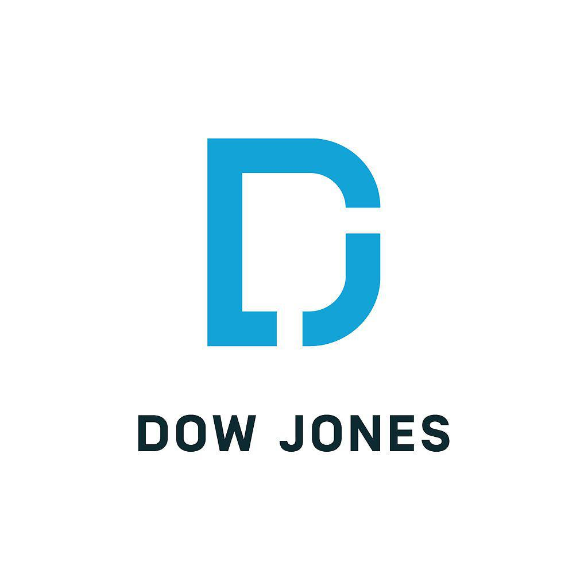

## Table of Contents

## What is Dow Jones & Co. and what is its primary business?

Dow Jones & Co. is a company that started in 1882. It is famous for giving people important news and information about business and money. The company was created by Charles Dow, Edward Jones, and Charles Bergstresser. They wanted to help people understand what was happening in the world of business.

The main business of Dow Jones & Co. is running The Wall Street Journal. This is a very popular newspaper that talks about business and finance. They also have other things like Barron's magazine and the Dow Jones Newswires. These help people all over the world stay updated on business news.

## When was Dow Jones & Co. founded and by whom?

Dow Jones & Co. was founded in 1882. It was started by three people: Charles Dow, Edward Jones, and Charles Bergstresser. They wanted to help people understand what was happening in the world of business.

These three men worked together to create a company that would provide important news and information about business and money. Their goal was to make it easier for people to stay informed about what was happening in the financial world.

## What are some of the key publications owned by Dow Jones & Co.?

Dow Jones & Co. owns several important publications. One of the main ones is The Wall Street Journal. This newspaper is very popular and talks about business and finance. It helps people understand what is happening in the world of money and business.

Another key publication is Barron's magazine. This magazine gives people more detailed information about the stock market and investments. It is useful for people who want to learn more about where to put their money.

Dow Jones also has the Dow Jones Newswires. These provide up-to-date news about business and finance to people all around the world. They help keep everyone informed about what is happening in the economy.

## How does Dow Jones & Co. generate its revenue?

Dow Jones & Co. makes money in different ways. One of the main ways is through selling subscriptions to its publications. People pay to read The Wall Street Journal and Barron's magazine. These subscriptions help Dow Jones earn a lot of money because many people want to stay updated on business and finance news.

Another way Dow Jones makes money is through advertising. Companies pay to put their ads in The Wall Street Journal and other Dow Jones publications. This is a big source of revenue because a lot of businesses want to reach the people who read these publications. By selling ad space, Dow Jones can make a good amount of money.

Dow Jones also earns money from its data and analytics services. They sell information and analysis about the stock market and other financial data to businesses and investors. This helps companies make better decisions and is another important way Dow Jones generates revenue.

## What is the significance of the Dow Jones Industrial Average in relation to Dow Jones & Co.?

The Dow Jones Industrial Average (DJIA) is a very important stock market index that shows how well the biggest companies in the United States are doing. It was created by Charles Dow, one of the founders of Dow Jones & Co. The DJIA is made up of 30 large companies from different industries, like technology, healthcare, and finance. When people talk about "the Dow," they are usually talking about this index. It helps people understand how the stock market is doing and can influence how they feel about the economy.

Even though Dow Jones & Co. created the Dow Jones Industrial Average, the company itself does not own or control it. The DJIA is managed by S&P Dow Jones Indices, which is a different company that Dow Jones & Co. helped start. But Dow Jones & Co. still has a close connection to the DJIA because it publishes the index's values in The Wall Street Journal and other places. This helps people stay informed about the stock market and makes Dow Jones & Co. an important part of the financial world.

## Who are the major competitors of Dow Jones & Co. in the financial information market?

Dow Jones & Co. has many big competitors in the financial information market. One of the main ones is Bloomberg L.P. They are known for their Bloomberg Terminal, which gives people a lot of data and news about finance. Bloomberg also has a news service and a TV channel that talk about business and the economy. Another big competitor is Reuters, which is part of Thomson Reuters. They give people news and data about financial markets all over the world. Reuters also has a big news service that covers many different topics, not just finance.

Another important competitor is The Financial Times. This newspaper, like The Wall Street Journal, talks about business and finance. It is very popular in Europe and other places around the world. The Financial Times also has a website and other services that help people stay updated on financial news. There are also other companies like Morningstar and FactSet that give people financial data and analysis. These companies help investors and businesses make decisions by providing them with important information.

## What role does Dow Jones & Co. play in the global financial markets?

Dow Jones & Co. plays a big role in the global financial markets by giving people important news and information about business and money. They own The Wall Street Journal, which is a very popular newspaper that talks about what is happening in the world of finance. This helps people all over the world understand the economy better. Dow Jones also has other services like Barron's magazine and the Dow Jones Newswires, which provide up-to-date news to businesses and investors everywhere. By sharing this information, Dow Jones helps people make smart decisions about their money.

Another important way Dow Jones & Co. affects the global financial markets is through the Dow Jones Industrial Average (DJIA). Even though Dow Jones doesn't own the DJIA anymore, they helped create it and still publish its values in their newspapers and online. The DJIA is a key stock market index that shows how well big companies in the U.S. are doing. When the DJIA goes up or down, it can influence how people feel about the economy and the stock market. This makes Dow Jones & Co. an important part of the financial world because they help spread this important information to everyone.

## How has Dow Jones & Co. adapted to the digital transformation in media and finance?

Dow Jones & Co. has changed a lot to keep up with the digital world. They used to mostly sell newspapers and magazines, but now they have a big online presence. The Wall Street Journal, their main newspaper, has a website and an app where people can read the news on their phones or computers. They also have digital subscriptions, so people can pay to read the news online instead of buying a paper copy. This helps them reach more people around the world who want to stay updated on business and finance news.

Another way Dow Jones has adapted is by using technology to give people better and faster information. They use data and analytics to help people understand what is happening in the stock market and the economy. They also have things like live updates and videos on their website and app, which make it easier for people to get the latest news quickly. By using digital tools, Dow Jones can give people the information they need in a way that fits how people use technology today.

## What are some notable acquisitions or mergers involving Dow Jones & Co. in recent years?

In recent years, Dow Jones & Co. has made some important moves to grow its business. One big change happened in 2007 when News Corp, a big media company, bought Dow Jones for about $5 billion. This was a very important deal because it meant that Dow Jones became part of a larger media group. News Corp wanted to use Dow Jones's strong reputation in business news to help their other businesses.

Another notable acquisition was in 2015 when Dow Jones bought a company called OPIS, which stands for Oil Price Information Service. OPIS gives people information about the prices of oil and other energy products. By buying OPIS, Dow Jones was able to offer more types of financial data to its customers. This helped Dow Jones grow in the energy market and provide even more useful information to people who need it.

## How does Dow Jones & Co. ensure the accuracy and reliability of its financial data and news?

Dow Jones & Co. works hard to make sure the financial data and news they share are accurate and reliable. They have a team of experienced journalists and editors who check facts and make sure the information is correct before it gets published. These people use many different sources to gather information, like talking to experts, looking at official reports, and using data from trusted places. If something is not clear, they will keep checking until they are sure it is right. This careful process helps make sure that the news and data Dow Jones shares can be trusted by readers and investors.

Another way Dow Jones ensures accuracy is by using technology to help with their work. They use special software to check numbers and data to make sure there are no mistakes. They also have systems in place to quickly correct any errors if they are found after something is published. By combining the skills of their journalists with these technology tools, Dow Jones can provide high-quality, reliable information to people all over the world. This helps everyone who uses their services to make smart decisions based on accurate and up-to-date news and data.

## What is the corporate structure of Dow Jones & Co., and who are its key executives?

Dow Jones & Co. is a part of News Corp, a big media company that bought Dow Jones in 2007. This means that Dow Jones is a subsidiary of News Corp, but it still runs its own business and has its own leaders. The main people in charge at Dow Jones are called the key executives. They make important decisions about how the company works and what it does.

The CEO of Dow Jones & Co. is Almar Latour. He is the top boss and helps guide the company. Another important person is the Chief Financial Officer, who takes care of the money side of things. The Editor-in-Chief of The Wall Street Journal, Emma Tucker, is also a key executive because she is in charge of what goes into the newspaper. These leaders work together to make sure Dow Jones keeps giving people good news and information about business and money.

## What are the future challenges and opportunities for Dow Jones & Co. in the evolving financial and media landscape?

Dow Jones & Co. faces several challenges as the financial and media landscape keeps changing. One big challenge is keeping up with new technology. People are using more digital ways to get their news, like apps and websites, instead of buying newspapers. This means Dow Jones needs to keep making their digital services better and easier to use. Another challenge is dealing with a lot of competition. There are many other companies that also give people financial news and data, like Bloomberg and Reuters. Dow Jones has to find ways to stand out and keep people interested in their news and information.

At the same time, there are also many opportunities for Dow Jones & Co. One big opportunity is growing their digital business. By making their website and apps even better, they can reach more people around the world who want to read about business and finance. Another opportunity is using data and technology in new ways. Dow Jones can create new tools and services that help people understand the stock market and the economy better. By doing this, they can attract more customers and make more money. These opportunities can help Dow Jones stay strong and successful in the future.

## References & Further Reading

[1]: ["Algorithms for Hyper-Parameter Optimization"](https://papers.nips.cc/paper/4443-algorithms-for-hyper-parameter-optimization.pdf) by Bergstra, J., Bardenet, R., Bengio, Y., & Kégl, B. Advances in Neural Information Processing Systems 24.

[2]: ["Advances in Financial Machine Learning"](https://www.amazon.com/Advances-Financial-Machine-Learning-Marcos/dp/1119482089) by Marcos Lopez de Prado.

[3]: ["Evidence-Based Technical Analysis: Applying the Scientific Method and Statistical Inference to Trading Signals"](https://www.amazon.com/Evidence-Based-Technical-Analysis-Scientific-Statistical/dp/0470008741) by David Aronson.

[4]: ["Machine Learning for Algorithmic Trading"](https://github.com/stefan-jansen/machine-learning-for-trading) by Stefan Jansen.

[5]: ["Quantitative Trading: How to Build Your Own Algorithmic Trading Business"](https://www.amazon.com/Quantitative-Trading-Build-Algorithmic-Business/dp/1119800064) by Ernest P. Chan.

[6]: ["Financial News and the Predictability of Exchange Rate Returns"](https://www.sciencedirect.com/science/article/pii/S1057521922000692) by Peter de Goeij and David Marquering.

[7]: ["The Wall Street Journal Guide to Understanding Money and Investing"](https://www.amazon.com/Street-Journal-Guide-Understanding-Investing/dp/0684869020) by Kenneth M. Morris and Virginia B. Morris.