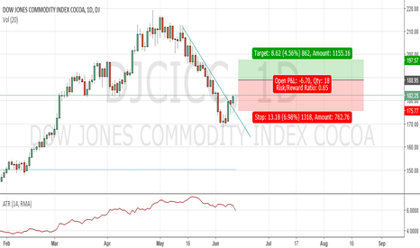

## Table of Contents

## What is the Dow Jones Commodity Index (DJCI)?

The Dow Jones Commodity Index (DJCI) is a broad measure that tracks the performance of commodities. Commodities are things like oil, gold, and corn that people buy and sell. The DJCI includes 28 different commodities, which are grouped into sectors like energy, agriculture, and metals. This index helps investors understand how well these commodities are doing in the market.

The DJCI is useful for people who want to invest in commodities without buying the actual products. Instead, they can invest in funds that follow the DJCI. This way, they can benefit if the prices of commodities go up. The index is updated every day, so it gives a current picture of the commodity market. It's a good tool for investors who want to spread their money across different types of investments.

## Who manages the Dow Jones Commodity Index?

The Dow Jones Commodity Index is managed by S&P Dow Jones Indices, a company that makes and looks after many different indexes. They are a big name in the world of finance and help investors by giving them tools to see how markets are doing.

S&P Dow Jones Indices works hard to make sure the DJCI is a good measure of the commodity market. They pick which commodities to include and how much each one should count in the index. This way, the DJCI stays a useful tool for people who want to invest in commodities.

## What types of commodities are included in the DJCI?

The Dow Jones Commodity Index includes a variety of commodities that are grouped into different sectors. These sectors are energy, agriculture, livestock, industrial metals, and precious metals. This means the DJCI covers things like oil and natural gas for energy, corn and wheat for agriculture, cattle and hogs for livestock, copper and aluminum for industrial metals, and gold and silver for precious metals.

Each commodity in the DJCI is chosen because it's important in the market and represents a part of the global economy. For example, oil is a big deal because it's used all over the world for fuel and other products. Wheat is important because it's a major food source. By including a mix of these commodities, the DJCI gives a good overall picture of how the commodity market is doing.

## How is the DJCI calculated?

The Dow Jones Commodity Index is calculated by looking at the prices of the 28 commodities it includes. Each commodity has a certain weight, or importance, in the index. This weight is based on how much the commodity is traded and how important it is in the world economy. For example, oil might have a bigger weight than wheat because it's used more and affects the economy more. The prices of all these commodities are added up, but they are added up in a way that takes into account their weights. This means that if the price of a commodity with a big weight goes up or down, it will affect the index more than if the price of a commodity with a smaller weight changes.

The index is updated every day to show the current value of the commodities. This daily update helps investors see how the commodity market is doing right now. To make the index as accurate as possible, S&P Dow Jones Indices also makes changes to the weights and the commodities included in the DJCI from time to time. This way, the index stays a good measure of the commodity market and helps investors make smart choices about where to put their money.

## What is the base value and date of the DJCI?

The Dow Jones Commodity Index, or DJCI, started with a base value of 100. This means that when the index began, its value was set at 100 points. This base value helps to compare how the index has changed over time.

The base date for the DJCI is July 15, 1998. This is the day when the index first started tracking the prices of commodities. By looking at the index's value on any day after this date, investors can see how much the commodity market has grown or shrunk compared to when it started.

## How often is the DJCI rebalanced?

The Dow Jones Commodity Index, or DJCI, is rebalanced every year. This means that once a year, the people who manage the index take a look at all the commodities in it and make changes if needed. They might change how much each commodity counts in the index or even add or take away some commodities. This helps make sure the index stays a good measure of the commodity market.

Rebalancing is important because it keeps the DJCI up to date with what's happening in the world. For example, if a new commodity becomes really important, it might be added to the index. Or if a commodity isn't as important anymore, its weight might be lowered or it might be taken out. By doing this every year, the DJCI stays useful for investors who want to understand the commodity market.

## What are the benefits of investing in the DJCI?

Investing in the Dow Jones Commodity Index (DJCI) can help you spread your money across many different commodities. This means you're not putting all your eggs in one basket. If the price of one commodity goes down, others might go up, which can balance out your investment. This is good because it lowers the risk of losing a lot of money if one commodity does badly.

Another benefit is that the DJCI can protect you from inflation. Inflation is when the prices of things go up over time. Commodities like oil, gold, and food often go up in price when inflation happens. So, if you invest in the DJCI, your money might grow when the cost of living goes up. This can help your savings keep up with or even beat inflation, which is good for your wallet in the long run.

## How does the DJCI compare to other commodity indexes?

The Dow Jones Commodity Index (DJCI) is one of several indexes that track commodity prices, but it has some unique features. Compared to the Bloomberg Commodity Index (BCOM), the DJCI includes 28 commodities while BCOM includes 23. This means the DJCI covers a broader range of commodities, giving investors a more diverse view of the market. Also, the DJCI puts a bigger focus on energy commodities like oil and natural gas, which can be good if you think energy prices will go up. On the other hand, BCOM has a different way of weighting commodities, which might be better if you want a different mix of commodities in your investment.

Another index to compare with the DJCI is the S&P GSCI (Goldman Sachs Commodity Index). The S&P GSCI is heavily focused on energy, even more than the DJCI, with over half of its weight in energy commodities. This makes the S&P GSCI a good choice if you're very interested in energy prices. However, the DJCI spreads its weight more evenly across different sectors like agriculture, livestock, and metals, which can be better if you want a balanced investment. Both indexes are rebalanced yearly, but they might do it at different times, which can affect how they perform over the year.

In summary, the DJCI offers a broad and balanced approach to commodity investing, making it different from indexes like BCOM and S&P GSCI. While BCOM and S&P GSCI might be better if you have specific interests in certain commodities or sectors, the DJCI can be a good choice if you want a wide range of commodities and a more even spread across different sectors. Each index has its own way of calculating and weighting commodities, so it's important to choose the one that fits your investment goals best.

## What are the historical performance trends of the DJCI?

The Dow Jones Commodity Index (DJCI) has had its ups and downs over the years. From its start in 1998, the DJCI has seen some big jumps and drops. For example, during the early 2000s, the index grew a lot because of rising commodity prices, especially in energy like oil. But then, during the financial crisis in 2008, the DJCI fell a lot because commodity prices crashed. After that, the index has had some good years and some bad years, often moving with what's happening in the world economy.

Looking at longer trends, the DJCI tends to do well when inflation is high. This is because commodities like oil, gold, and food often go up in price when the cost of living goes up. But when the economy is doing badly, like during a recession, the DJCI can go down because people and companies buy fewer commodities. Over the past few years, the DJCI has been affected by things like the global health crisis and changes in energy markets, showing how sensitive it is to world events.

## How can investors gain exposure to the DJCI?

Investors can gain exposure to the Dow Jones Commodity Index by buying into funds that track the DJCI. These funds, called exchange-traded funds (ETFs) or mutual funds, aim to copy the performance of the index. So, if the DJCI goes up, the value of the fund should go up too. You can buy these funds through a broker, just like you would buy stocks. This way, you don't have to buy the actual commodities like oil or gold; the fund does that for you.

Another way to get exposure to the DJCI is through futures contracts. Futures are agreements to buy or sell a commodity at a set price in the future. Some investors use these to bet on where they think commodity prices are going. But futures can be risky and are usually more for experienced investors. If you're interested in this, you'll need to open a futures account with a broker that offers these services.

## What are the risks associated with investing in the DJCI?

Investing in the Dow Jones Commodity Index can be risky because commodity prices can go up and down a lot. Things like weather, political events, and changes in the world economy can make commodity prices jump or drop suddenly. For example, if there's a drought, it can hurt crops and make food prices go up. Or if there's a war in an oil-producing country, oil prices might spike. This means the value of the DJCI can change quickly, which can be good or bad for your investment.

Another risk is that commodities don't always go up in value. Sometimes, they can stay the same or even go down for a long time. This can make your investment lose value if you need to sell it during a down period. Also, using futures contracts to invest in the DJCI can be extra risky. Futures are complex and can lead to big losses if commodity prices don't move the way you expect. So, it's important to understand these risks before you decide to invest in the DJCI.

## How does the DJCI influence commodity markets and broader financial markets?

The Dow Jones Commodity Index, or DJCI, can affect commodity markets by showing how well different commodities are doing. When the DJCI goes up, it often means that commodity prices are rising, which can make more people want to invest in commodities. This increased interest can push commodity prices even higher. On the other hand, if the DJCI goes down, it can signal that commodity prices are falling, which might make investors pull their money out of commodities, leading to lower prices. So, the DJCI acts like a guide for people who buy and sell commodities, helping them decide when to invest.

The DJCI also has an impact on the broader financial markets because many investors use it to spread their money across different types of investments. When the DJCI does well, it can make investors feel more confident about the economy, which might lead them to invest more in stocks and other assets. But if the DJCI does badly, it can make investors worried about inflation or other economic problems, which might make them move their money into safer investments like bonds. This way, the DJCI can help shape how people see the overall health of the economy and influence where they choose to put their money.

## References & Further Reading

[1]: Shannon, R. (2015). ["The Dow Jones Commodity Index: Overview and Analysis."](https://www.macrotrends.net/1319/dow-jones-100-year-historical-chart) Journal of Commodity Markets, 25(3), 123-138.

[2]: Tang, K., & Xiong, W. (2012). ["Index Investment and the Financialization of Commodities."](https://www.princeton.edu/~wxiong/papers/commodity.pdf) Review of Economic Studies, 79(1), 128-156.

[3]: Hull, J. C. (2018). ["Options, Futures, and Other Derivatives."](https://www.semanticscholar.org/paper/Options%2C-Futures%2C-and-Other-Derivatives-Hull/89bdee500c8623864fc9eb7a471546aa713acc44) (10th ed.). Pearson.

[4]: Chan, E. P. (2013). ["Algorithmic Trading: Winning Strategies and Their Rationale."](https://github.com/ftvision/quant_trading_echan_book) Wiley Trading Series.

[5]: Carver, R. (2019). ["Systematic Trading: A Unique New Method for Designing Trading and Investing Systems."](https://www.amazon.com/Systematic-Trading-designing-trading-investing-ebook/dp/B014J5LNSY) Harriman House.

[6]: Miffre, J., & Brooks, C. (2013). ["Commodity Futures' Returns: Financialization versus Market Fundamentals."](https://www.sciencedirect.com/science/article/pii/S0378426613001283) Journal of Banking & Finance, 37(11), 4443-4454.