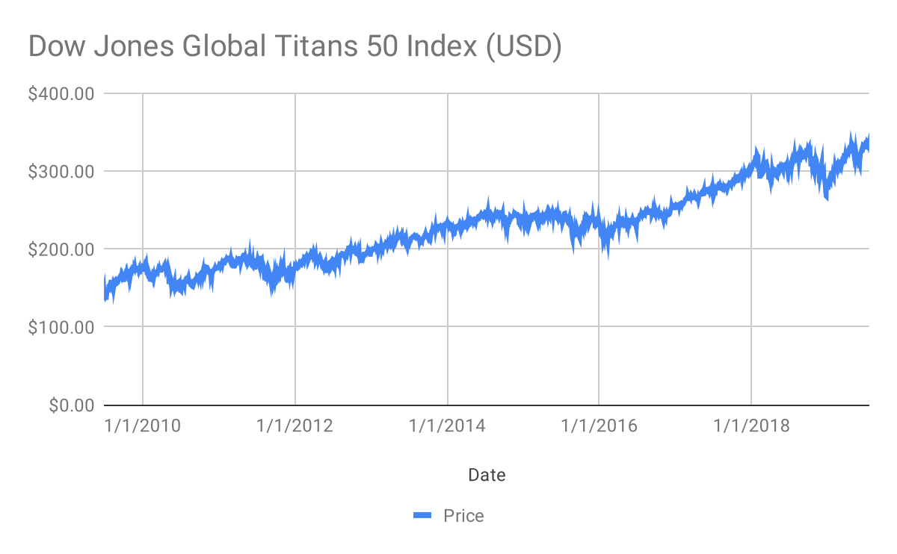

## Table of Contents

## What is the Dow Jones Global Titans 50 Index?

The Dow Jones Global Titans 50 Index is a stock market index made up of 50 of the biggest and most influential companies in the world. These companies come from different countries and industries, but they are all leaders in their fields. The index is used to show how these top companies are doing overall, giving investors a way to see the performance of global business leaders.

This index is important because it helps investors understand how the biggest companies around the world are performing. By looking at the Dow Jones Global Titans 50 Index, people can get a sense of the health of the global economy. The companies in the index are chosen based on their size, how much they are traded, and their financial stability, making the index a good measure of global economic trends.

## How is the Dow Jones Global Titans 50 Index constructed?

The Dow Jones Global Titans 50 Index is made by picking the 50 biggest and most important companies from around the world. These companies come from many different countries and types of businesses. To be included, a company must be very big, have a lot of its stock traded, and be financially stable. The index is checked and updated every six months to make sure it still represents the top global companies.

The way the index is built is based on how much each company is worth in the market. This means that companies with a higher market value have a bigger effect on the index. For example, if a big company's stock price goes up a lot, it can make the whole index go up more than if a smaller company's stock price changes. This method helps show how the biggest companies are doing and gives a good picture of the global economy.

## What are the eligibility criteria for companies to be included in the Dow Jones Global Titans 50 Index?

To be included in the Dow Jones Global Titans 50 Index, a company must meet several important criteria. It needs to be one of the biggest companies in the world, based on its market value. The company also needs to have a lot of its stock traded every day, which shows that it is important and people are interested in it. Another key [factor](/wiki/factor-investing) is financial stability, meaning the company should be strong and not likely to fail soon.

The index is reviewed twice a year, in March and September, to make sure it still includes the top 50 companies. During these reviews, companies might be added or removed based on their current performance and size. This helps keep the index a good measure of the biggest and most influential companies around the world.

## How often is the Dow Jones Global Titans 50 Index rebalanced?

The Dow Jones Global Titans 50 Index is rebalanced twice a year. This happens in March and September to make sure the index still shows the top 50 companies in the world.

During these times, the index is checked to see if any companies should be added or taken out. This helps keep the index up to date and a good way to see how the biggest companies are doing globally.

## What sectors are represented in the Dow Jones Global Titans 50 Index?

The Dow Jones Global Titans 50 Index includes companies from many different sectors. Some of the main sectors you can find in the index are technology, finance, health care, energy, and consumer goods. These sectors are important parts of the global economy, and the companies in them are leaders in their fields.

The index is made to show how the biggest and most influential companies around the world are doing. By having companies from different sectors, the index gives a good picture of what is happening in the global market. This mix helps investors see how different parts of the economy are performing and make better choices about where to put their money.

## How does the Dow Jones Global Titans 50 Index compare to other global indices?

The Dow Jones Global Titans 50 Index is different from other global indices because it focuses on the 50 biggest and most important companies in the world. Other indices, like the MSCI World Index or the FTSE All-World Index, might include hundreds or even thousands of companies from many countries. The Dow Jones Global Titans 50 Index is smaller and more focused, which means it can give a clearer picture of how the top global companies are doing.

Another difference is that the Dow Jones Global Titans 50 Index is rebalanced twice a year, in March and September. This keeps the index up to date with the biggest companies. Other indices might be rebalanced at different times or less often. This regular update helps the Dow Jones Global Titans 50 Index stay a good measure of the global economy's top performers.

Both the Dow Jones Global Titans 50 Index and other global indices help investors understand the global market, but they do it in different ways. The Dow Jones Global Titans 50 Index gives a focused view of the biggest companies, while other indices might show a broader picture of the market. This makes the Dow Jones Global Titans 50 Index a useful tool for investors who want to see how the world's leading companies are doing.

## What is the historical performance of the Dow Jones Global Titans 50 Index?

The Dow Jones Global Titans 50 Index has had good performance over the years. It started in 1999 and has shown steady growth. The index has gone up and down with the global economy, but overall, it has done well. This is because it includes the biggest and most important companies in the world, which tend to do better over time.

During big economic events, like the financial crisis in 2008 or the COVID-19 pandemic in 2020, the index dropped a lot. But it also bounced back quickly. This shows that the companies in the index are strong and can recover from tough times. Investors who put money into the Dow Jones Global Titans 50 Index have seen good returns over the long term, even with the ups and downs along the way.

## How can investors gain exposure to the Dow Jones Global Titans 50 Index?

Investors can gain exposure to the Dow Jones Global Titans 50 Index by buying exchange-traded funds (ETFs) or mutual funds that track the index. These funds are made to follow the performance of the index, so when the index goes up or down, the value of the fund does the same. This is an easy way for investors to put money into the biggest and most important companies in the world without having to pick each company themselves.

Another way to invest in the Dow Jones Global Titans 50 Index is by buying stocks of the companies that are in the index. This means investors would need to research and pick the individual companies they want to invest in. This can be more work, but it also gives investors more control over their investments. By choosing which companies to buy, investors can focus on the ones they think will do the best.

## What are the risks associated with investing in the Dow Jones Global Titans 50 Index?

Investing in the Dow Jones Global Titans 50 Index comes with some risks that investors should know about. One big risk is that the index can go up and down a lot because it includes only the biggest companies in the world. These companies are often in industries like technology and finance, which can be affected by big events like economic crises or changes in the law. If something bad happens to these industries, the whole index might drop, and investors could lose money.

Another risk is that the index is focused on just 50 companies, which means it's not as spread out as other indices that include more companies. If a few of these 50 companies do badly, it can have a big effect on the whole index. Also, because the index is made up of companies from different countries, changes in currency values can affect how much money investors make or lose. It's important for investors to think about these risks and how they might affect their investments.

## How does the methodology of the Dow Jones Global Titans 50 Index affect its performance?

The way the Dow Jones Global Titans 50 Index is made affects how it does over time. It only picks the 50 biggest companies in the world, so it's more focused than other indices that include lots more companies. This means that if these big companies do well, the index can go up a lot. But if they do badly, the whole index can drop quickly. The index is checked and updated every six months, which helps keep it up to date with the biggest companies. This regular update can help the index stay strong, but it also means that changes in the top companies can affect how the index performs.

Another thing that affects the index's performance is how much each company is worth in the market. The index gives more weight to companies that are worth more, so if a big company's stock price changes a lot, it can move the whole index more than if a smaller company's stock price changes. This can make the index go up and down a lot, especially if the big companies are in industries like technology or finance that can be affected by big events. Investors need to think about these things when they decide to put money into the index.

## What are some notable companies currently included in the Dow Jones Global Titans 50 Index?

The Dow Jones Global Titans 50 Index includes some of the biggest and most important companies in the world. Companies like Apple, Microsoft, and Amazon are part of the index. These are all technology companies that make things like computers, software, and online shopping services. Another company in the index is JPMorgan Chase, which is a big bank that helps people and businesses with their money. These companies are leaders in their fields and help show how the global economy is doing.

Other notable companies in the index come from different industries. For example, there's ExxonMobil, which is a huge energy company that finds and sells oil and gas. There's also Johnson & Johnson, a health care company that makes medicines and medical supplies. These companies are very big and important, so they have a big effect on the index. By looking at how these companies are doing, investors can get a good idea of what's happening in the world's biggest industries.

## How does the Dow Jones Global Titans 50 Index contribute to global investment strategies?

The Dow Jones Global Titans 50 Index is a helpful tool for people who want to invest their money around the world. It includes the 50 biggest and most important companies from different countries and industries. By looking at this index, investors can see how these top companies are doing and make choices about where to put their money. If the index goes up, it might mean that the global economy is doing well, and investors might want to buy more stocks. If it goes down, they might decide to be more careful with their investments.

This index also helps investors spread their money across different countries and industries. Because it includes companies from places like the United States, Europe, and Asia, and from sectors like technology, finance, and health care, it gives a good picture of the global market. This can make investing safer because if one part of the world or one industry does badly, other parts might still do well. By using the Dow Jones Global Titans 50 Index, investors can have a more balanced and thoughtful approach to putting their money into the global market.

## References & Further Reading

[1]: ["Dow Jones Global Titans 50 Index Methodology"](https://www.spglobal.com/spdji/en/indices/equity/dow-jones-global-titans-50-index/) from S&P Dow Jones Indices.

[2]: ["Algorithmic Trading: Winning Strategies and Their Rationale"](https://books.google.com/books/about/Algorithmic_Trading.html?id=WAlFDwAAQBAJ) by Ernie Chan

[3]: ["Advances in Financial Machine Learning"](https://www.amazon.com/Advances-Financial-Machine-Learning-Marcos/dp/1119482089) by Marcos Lopez de Prado

[4]: ["Investopedia: Algorithmic Trading"](https://www.investopedia.com/terms/a/algorithmictrading.asp) - Detailed explanation of algorithmic trading concepts and strategies.

[5]: ["Evidence-Based Technical Analysis: Applying the Scientific Method and Statistical Inference to Trading Signals"](https://www.amazon.com/Evidence-Based-Technical-Analysis-Scientific-Statistical/dp/0470008741) by David Aronson