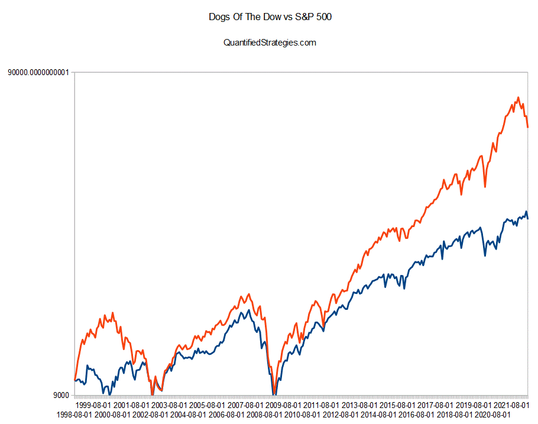

In the ever-evolving world of finance, indices play a crucial role in representing a segment of the stock market. These indices serve as benchmarks, helping investors to gauge market trends and make informed investment decisions. One such significant index is the Dow Jones Global Titans 50.

The Dow Jones Global Titans 50 Index comprises 50 of the world's largest multinational corporations, spanning various industries—such as technology, consumer goods, and healthcare—that derive substantial revenue from global markets. By including only the top-tier companies weighted by market capitalization and financial performance, the Dow Jones Global Titans 50 provides a snapshot of the global economic landscape.



In this context, the article focuses on the potential for incorporating algorithmic trading within this index. Algorithmic trading, or algo trading, refers to the use of computer programs to execute trades at high speeds and volumes, leveraging mathematical models to scan market data and capitalize on opportunities faster than a human could. This technology is increasingly utilized for its efficiency in managing trades across different time zones and market conditions, especially for indices with global constituents such as the Dow Jones Global Titans 50.

The exploration here goes beyond the mere adoption of algo trading strategies, aiming to highlight both the benefits and challenges associated with its application in this particular index. As we proceed, the significance of the Dow Jones Global Titans 50 within the global financial markets will be examined, setting the foundation for understanding why it matters and how algorithmic trading can play a transformative role.

## Table of Contents

## What is the Dow Jones Global Titans 50 Index?

The Dow Jones Global Titans 50 Index is a stock market index that represents a collection of 50 of the largest and most influential multinational corporations worldwide. These companies are selected based on their significant market capitalization and financial performance. The index is designed to reflect the economic contribution of these global behemoths across various key industries, including technology, consumer goods, healthcare, and more. 

One of the defining characteristics of the Dow Jones Global Titans 50 Index is its industry diversity. Companies included in the index span several sectors, which helps provide a comprehensive view of the global economic landscape. Each company within the index is a leader in its respective field, commanding substantial revenue streams that originate from multiple countries. This international revenue generation aligns with the index's global focus, underscoring the importance of multinational corporations in today's interconnected markets.

The index uses market capitalization as a primary criterion for its composition, meaning that larger companies with higher stock market values have a greater influence on the index's performance. As such, the market capitalization of a company is calculated by multiplying its share price by its total number of outstanding shares. This weighting methodology ensures that the index accurately reflects the economic footprint of its constituent companies in line with their respective market strengths.

Additionally, the selection of companies is not solely based on size; financial performance also plays a crucial role. Metrics such as revenue growth, profit margins, and market share are crucial in identifying the corporations worthy of inclusion. This rigorous selection process ensures that the index remains both relevant and representative of the key players driving global economic trends. 

In summary, the Dow Jones Global Titans 50 Index stands as a benchmark for assessing the performance of some of the most significant multinational corporations in various industries, shedding light on their economic role and impact on global markets.

## Algorithmic Trading: An Overview

Algorithmic trading, often known as algo trading, involves the execution of financial trades using automated and pre-programmed trading instructions. These instructions are based on variables like time, price, and [volume](/wiki/volume-trading-strategy), enabling trades to be executed at speeds and frequencies far exceeding those of a human trader. The rapid advances in technology and the rise of high-frequency trading have further accentuated the importance of [algorithmic trading](/wiki/algorithmic-trading) in modern financial markets.

At its core, algo trading leverages complex mathematical models and algorithms to scan vast arrays of market data. These algorithms identify trading opportunities by analyzing market trends, price patterns, and other financial indicators almost instantaneously. The primary aim is to execute trades at optimal prices while minimizing market impact and manual intervention.

Common strategies in algorithmic trading encompass a variety of approaches:

1. **Statistical Arbitrage**: This strategy involves the simultaneous buying and selling of securities to profit from tiny price discrepancies that are statistically expected to converge over time. Algorithms are designed to pinpoint these disparities based on historical pricing relationships, and trades are executed to exploit them.

   ```python
   # Example in Python to illustrate a simple statistical arbitrage
   import numpy as np

   def find_arbitrage_opportunity(prices_a, prices_b):
       spread = prices_a - prices_b
       mean_spread = np.mean(spread)
       if spread[-1] < mean_spread:
           # Buy A, Sell B
           return 'Buy A, Sell B'
       else:
           # Sell A, Buy B
           return 'Sell A, Buy B'
   ```

2. **Trend Following**: This strategy exploits the directional movement of asset prices by taking long positions in upward-trending markets and short positions in downward-trending ones. Unlike statistical arbitrage, trend-following strategies do not predict price movements; rather, they respond to existing trends.

3. **Market Making**: Market making involves providing liquidity to the market by simultaneously placing buy and sell orders. The goal is to profit from the bid-ask spread, the difference between the buying and selling prices. This strategy requires rapid execution and often benefits from low latency in order to manage the inventory effectively and adjust to market conditions.

Algorithmic trading has reshaped financial markets by enhancing trading efficiency, reducing transaction costs, and improving the accuracy of trade executions. The sophistication and speed offered by algorithmic systems continue to advance with the development of [machine learning](/wiki/machine-learning) and [artificial intelligence](/wiki/ai-artificial-intelligence), setting the stage for future innovations in automated trading solutions.

## Why Use Algo Trading with the Dow Jones Global Titans 50?

Algorithmic trading, often referred to as algo trading, is a powerful tool when applied to the Dow Jones Global Titans 50 Index. This index, composed of 50 of the world's most prominent multinational corporations, offers unique trading opportunities that can be effectively leveraged through algorithmic strategies.

The concentration of global giants within the Dow Jones Global Titans 50 Index ensures substantial [liquidity](/wiki/liquidity-risk-premium). Liquidity is crucial for traders as it allows large orders to be executed swiftly without causing significant price changes. High liquidity within the index minimizes slippage, the difference between the expected price of a trade and the actual price, thus optimizing execution efficiency. For instance, assuming a high liquidity market, a trader could execute a trade for a large block of shares with minimal impact on the stock price, thereby preserving potential profit margins.

Furthermore, the global nature of these corporations means that they operate across multiple international markets and time zones, offering a wide range of market opportunities. Algo trading systems are adept at managing trades on such a global scale due to their ability to process vast amounts of market data in real-time. This capability allows them to adjust trading strategies quickly to capitalize on market [volatility](/wiki/volatility-trading-strategies) and price movements across different regions. 

For example, an algorithm could be designed to trade whenever the price of a certain stock deviates from its historical average by a specified threshold, known as a mean-reversion strategy. With Python, a simple implementation for such an algorithm could look like this:

```python
import numpy as np

def mean_reversion_strategy(prices, window=20, threshold=1.5):
    mean = np.mean(prices[-window:])
    std_dev = np.std(prices[-window:])

    if prices[-1] > mean + (threshold * std_dev):
        return "Sell"
    elif prices[-1] < mean - (threshold * std_dev):
        return "Buy"
    else:
        return "Hold"

# Example prices for a particular stock
stock_prices = [100, 102, 101, 103, 105, 104, 107, 108, 106, 110]

decision = mean_reversion_strategy(stock_prices)
print(f"Trading decision: {decision}")
```

This environment is further enhanced by the high market capitalization of the included companies. A higher market capitalization generally implies more frequent trading and data availability, which are essential inputs for refined algorithmic models. Algorithms can exploit small inefficiencies and capitalize on small, frequent price oscillations that are characteristic of high-cap stocks.

In conclusion, the inherent qualities of the Dow Jones Global Titans 50 Index, primarily its liquidity, market capitalization, and global market presence, make it an ideal candidate for algorithmic trading. These factors collectively reduce risks related to slippage and enable efficient trade management across diverse market conditions, enhancing the potential for profitable ventures through sophisticated algorithmic strategies.

## Challenges of Algo Trading in the DJGT 50 Index

Algorithmic trading in the Dow Jones Global Titans 50 Index faces several challenges that must be navigated for successful implementation. A significant challenge is the inherent market volatility which can lead to sudden and unpredictable market behavior. Volatility often necessitates rapid adjustments to trading algorithms to align with the swiftly changing market conditions. For example, during periods of financial uncertainty, the index can experience sharp price movements driven by investor sentiment and macroeconomic factors. These changes require algorithms to be highly responsive and adaptive to maintain profitability and manage risks effectively.

In addition to market volatility, regulatory factors present another layer of complexity. The Dow Jones Global Titans 50 Index comprises companies from various countries, each with their own regulatory frameworks. This international scope means that algorithms must be flexible and adaptable to comply with different regulatory requirements, such as varying trading hours, transaction reporting obligations, and market restrictions. This complexity requires rigorous monitoring and regular updates to ensure that the trading strategies are both compliant and efficient across all jurisdictions.

Moreover, algorithmic traders must also contend with the risk of regulatory changes which can occur with little warning, potentially affecting trading strategies overnight. Algorithms need to be designed with a capacity for rapid adaptation to these changes to preserve their effectiveness and compliance.

Overall, navigating these challenges necessitates a comprehensive approach that includes the development of sophisticated algorithms capable of real-time adaptation to market volatility and regulatory compliance. This requires continual refinement and innovation in algorithmic strategies to ensure they remain effective in the constantly evolving financial landscape of the Dow Jones Global Titans 50 Index.

## Technological and Risk Management Considerations

Implementing a robust technology infrastructure is essential for the success of algorithmic trading, particularly within indices like the Dow Jones Global Titans 50. A solid infrastructure ensures that trading algorithms can efficiently process vast amounts of data, execute trades with minimal latency, and adapt to rapidly changing market conditions. Key components include high-performance computing systems, low-latency networking solutions, and advanced data storage capabilities.

Risk management is another critical [factor](/wiki/factor-investing). To mitigate market risk, algorithms can incorporate stop-loss orders and dynamic hedging strategies. Market liquidity risk can be addressed by ensuring that trades are executed in highly liquid market environments and by employing adaptive order placement techniques that minimize market impact. Operational risks, such as system failures or data inaccuracies, can be mitigated with comprehensive backup systems, rigorous testing, and redundancy protocols.

Continuous monitoring and optimization of trading algorithms are vital in maintaining competitiveness. Monitoring involves real-time scrutiny of algorithm performance and market conditions to quickly identify and address any anomalies or inefficiencies. Optimization requires constant refinement of algorithms to enhance performance metrics like execution speed, accuracy, and profitability. This process often leverages machine learning and advanced statistical methods to analyze historical data and predict future trends.

Python code can assist in these tasks. For example, high-frequency data analysis can be performed using libraries such as Pandas and NumPy. Here's a simple example:

```python
import pandas as pd
import numpy as np

# Load historical market data
data = pd.read_csv('market_data.csv')

# Calculate moving average
data['Moving_Avg'] = data['Close'].rolling(window=20).mean()

# Identify trading signals
data['Signal'] = np.where(data['Close'] > data['Moving_Avg'], 1, 0)

# Simple backtesting
data['Strategy_Return'] = data['Signal'].shift(1) * data['Return']
cumulative_returns = (1 + data['Strategy_Return']).cumprod()

# Output results
cumulative_returns.plot(title='Cumulative Strategy Returns')
```

Such technological implementations and risk management strategies play a crucial role in the successful deployment of algorithmic trading within the Dow Jones Global Titans 50 Index. They ensure the ability to capture market opportunities while effectively managing potential risks, thus providing a competitive edge in the complex and fast-paced landscape of global trading.

## Conclusion

The Dow Jones Global Titans 50 Index serves as an attractive target for algorithmic trading initiatives, primarily due to its composition of globally influential corporations with substantial market capitalizations. The index provides the advantage of high liquidity and market depth, which are essential attributes for the efficient operation of algorithmic trading systems. Such characteristics help minimize the negative impact of slippage and enhance trade execution efficiency.

Despite the clear benefits, the environment for algorithmic trading within the Dow Jones Global Titans 50 presents its set of challenges, namely market volatility and diverse regulatory landscapes. Nevertheless, the potential for higher returns in this index remains compelling. Algorithmic trading platforms can capitalize on the diverse market opportunities offered by the index's global constituents, optimizing trades across varying time zones and conditions.

Technology advancements are expected to further refine and enhance the capabilities of algorithmic trading systems. Machine learning and artificial intelligence offer promises of heightened predictive accuracy and adaptive strategies. These technological innovations will likely extend the reach of algorithmic trading, making it an even more integral component within global indices like the Dow Jones Global Titans 50. As these technologies evolve, they will continue to bolster the efficacy and efficiency of trading strategies, facilitating more sophisticated market analysis and execution.

## References

Investopedia offers a wealth of information on trading and indices that can provide valuable insights into algorithmic trading and its application within major indices like the Dow Jones Global Titans 50. Their articles discuss fundamental concepts and advanced strategies, giving readers a comprehensive understanding of the financial markets and algorithmic trading techniques.

The S&P Dow Jones Indices documentation on the Dow Jones Global Titans 50 Index provides essential details about the index's composition, selection criteria, and weighting methodology. This documentation is critical for understanding the nature of the companies included in the index and how they are represented.

Industry expert articles on algorithmic trading strategies and market analysis are indispensable resources for anyone looking to explore the nuances of algo trading. These articles often address technical aspects, algorithm design, market opportunities, and risk management considerations, making them valuable for traders and investors seeking to enhance their trading capabilities.

## References & Further Reading

[1]: ["Dow Jones Global Titans 50 Index Methodology"](https://www.spglobal.com/spdji/en/indices/equity/dow-jones-global-titans-50-index/) from S&P Dow Jones Indices.

[2]: ["Algorithmic Trading: Winning Strategies and Their Rationale"](https://books.google.com/books/about/Algorithmic_Trading.html?id=WAlFDwAAQBAJ) by Ernie Chan

[3]: ["Advances in Financial Machine Learning"](https://www.amazon.com/Advances-Financial-Machine-Learning-Marcos/dp/1119482089) by Marcos Lopez de Prado

[4]: ["Investopedia: Algorithmic Trading"](https://www.investopedia.com/terms/a/algorithmictrading.asp) - Detailed explanation of algorithmic trading concepts and strategies.

[5]: ["Evidence-Based Technical Analysis: Applying the Scientific Method and Statistical Inference to Trading Signals"](https://www.amazon.com/Evidence-Based-Technical-Analysis-Scientific-Statistical/dp/0470008741) by David Aronson