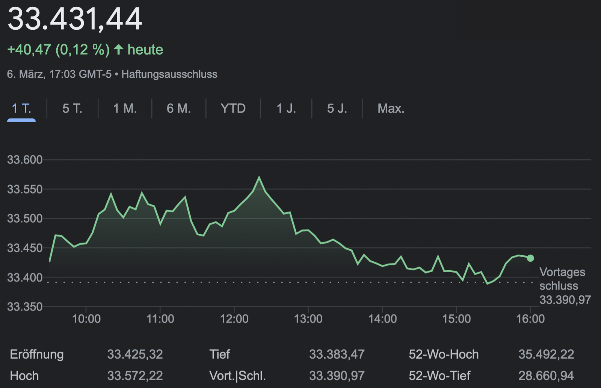

## Table of Contents

## What is the Dow Jones Industrial Average (DJIA)?

The Dow Jones Industrial Average, often called the Dow or DJIA, is a stock market index that shows how 30 big companies in the United States are doing. It was created by Charles Dow in 1896. These companies are from different industries like technology, finance, and healthcare. The DJIA is used to give a quick look at how the overall stock market is performing. When people say the "Dow is up" or "Dow is down," they are talking about whether the average stock price of these 30 companies has gone up or down.

The DJIA is calculated by adding up the stock prices of the 30 companies and then dividing by a special number called the "Dow Divisor." This divisor changes over time to account for things like stock splits and dividends. Even though it only includes 30 companies, the DJIA is very important because it is one of the oldest and most watched stock market indexes in the world. Many people use it to get a sense of the health of the U.S. economy.

## How many companies are included in the DJIA?

The DJIA includes 30 big companies. These companies come from different areas like tech, finance, and health. The DJIA helps people see how the overall stock market is doing by looking at these 30 companies.

The DJIA was started by Charles Dow in 1896. It's one of the oldest ways to check the stock market. Even though it only has 30 companies, it's very important because many people watch it to understand the U.S. economy.

## What types of companies are typically included in the DJIA?

The DJIA includes companies from different industries like technology, finance, and healthcare. This mix helps show how the overall U.S. economy is doing. Some examples of companies in the DJIA are Apple, which makes phones and computers, and JPMorgan Chase, which is a big bank. These companies are all very large and important in their fields.

The DJIA tries to represent the whole U.S. economy by picking big companies from different areas. This way, if one industry is doing well and another is not, the DJIA can still give a good overall picture. The companies in the DJIA are chosen carefully to make sure they show what's happening in the economy as a whole.

## How is the DJIA calculated?

The DJIA is calculated by adding up the stock prices of the 30 companies in the index and then dividing by a special number called the "Dow Divisor." This divisor is not a simple number like 30 because it changes over time. It adjusts for things like stock splits, dividends, and other corporate actions that might change the value of the stocks without changing the actual performance of the companies.

The Dow Divisor started as 30 when the DJIA was first created, but now it is much smaller. As of my last update, it was around 0.15. This smaller number means that even small changes in stock prices can lead to bigger changes in the DJIA. The divisor is adjusted to keep the index stable and to make sure it accurately reflects the market's performance. This way, the DJIA gives a good snapshot of how the 30 big companies are doing and helps people understand the overall health of the U.S. economy.

## What is the history behind the creation of the DJIA?

The Dow Jones Industrial Average, or DJIA, was created by Charles Dow in 1896. Charles Dow was one of the founders of Dow Jones & Company, which is a big company that gives financial news and data. He wanted to make a simple way for people to see how the stock market was doing. So, he picked 12 big companies to start with, like railroads and cotton oil companies. These were the main industries at that time. The DJIA was a new idea and helped people understand the economy better.

Over time, the DJIA changed a lot. It grew from 12 companies to 30 companies. The types of companies in the DJIA also changed as the economy changed. Now, it includes companies from technology, finance, and healthcare, among others. Even though it only has 30 companies, the DJIA is very important because it is one of the oldest and most watched stock market indexes in the world. People still use it to get a quick look at how the U.S. economy is doing.

## How often is the DJIA updated?

The DJIA is updated all the time during the trading day. The stock market is open from 9:30 AM to 4:00 PM Eastern Time, Monday through Friday. During these hours, the prices of the 30 companies in the DJIA are changing, so the DJIA number changes too. You can see the DJIA number updating every few seconds on financial websites and TV channels.

Outside of trading hours, the DJIA doesn't change. It stays the same until the market opens again the next day. But, people can still see the last number from the end of the previous trading day. This helps them understand how the market was doing when it closed.

## What are some major events that have significantly impacted the DJIA?

One big event that affected the DJIA was the Great Depression in the 1930s. It started with the stock market crash in 1929, which made the DJIA drop a lot. This crash was so bad that it caused many people to lose their jobs and their money. The DJIA took a long time to recover from this, showing how hard the economy was hit.

Another important event was Black Monday in 1987. On that day, the DJIA fell by more than 22% in just one day. This was the biggest one-day drop in the history of the DJIA. It scared a lot of people and made them worry about the economy. But, the government and the market worked to fix things, and the DJIA started to go up again after a while.

More recently, the DJIA was affected by the global financial crisis in 2008. This crisis started with problems in the housing market and spread to the whole economy. The DJIA dropped a lot during this time, showing how serious the crisis was. It took several years for the DJIA to get back to where it was before the crisis, but it did recover eventually.

## How does the DJIA compare to other major stock indices like the S&P 500 and Nasdaq?

The DJIA, S&P 500, and Nasdaq are all important stock market indexes, but they are different in some ways. The DJIA has 30 big companies from different industries. It's one of the oldest indexes and people watch it a lot to see how the U.S. economy is doing. The S&P 500, on the other hand, has 500 companies. It's bigger and tries to show how the whole U.S. stock market is doing. The Nasdaq is different because it focuses more on technology and internet companies. It has more than 3,000 companies, but many of them are in tech.

These indexes are calculated differently too. The DJIA adds up the stock prices of its 30 companies and divides by a special number called the Dow Divisor. The S&P 500 and Nasdaq use a different way called market capitalization. This means they look at the total value of each company, not just the stock price. Because of these differences, the DJIA might go up or down differently than the S&P 500 or Nasdaq. For example, if tech companies are doing really well, the Nasdaq might go up a lot more than the DJIA or S&P 500.

## What are the criteria for a company to be added or removed from the DJIA?

The criteria for a company to be added or removed from the DJIA are decided by a special group called the Averages Committee. This group looks at many things when they think about changing the companies in the DJIA. They want the DJIA to show what's happening in the U.S. economy, so they pick companies that are big and important in their industries. They also think about how much the company is worth and how many people know about it. If a company is doing really well and is a big part of the economy, it might be added to the DJIA.

Sometimes, a company is removed from the DJIA if it's not doing as well as before or if it's not as important to the economy anymore. The committee might also take out a company if it goes through big changes, like being bought by another company. When a company is removed, the committee picks a new one to take its place. They try to keep the DJIA balanced so it still shows a good picture of the economy. This way, the DJIA stays useful for people who want to understand how the stock market is doing.

## How does the DJIA influence the global financial markets?

The DJIA is a big deal in the world of money. When the DJIA goes up or down, it can affect how people feel about the whole U.S. economy. Since the U.S. is a big part of the world's economy, what happens to the DJIA can make other countries' stock markets move too. For example, if the DJIA drops a lot, people might start to worry and sell their stocks in other countries, making those markets go down as well. This is because many people and businesses around the world watch the DJIA to get a sense of what's happening in the U.S. and plan their own investments based on that.

The DJIA can also affect things like money exchange rates. If the DJIA is doing well, it might make the U.S. dollar stronger because more people want to invest in the U.S. A stronger dollar can make it harder for other countries to sell things to the U.S. because their products become more expensive for Americans. On the other hand, if the DJIA goes down, the U.S. dollar might get weaker, which can help other countries sell more to the U.S. because their products become cheaper. So, the DJIA doesn't just affect the U.S.; it can have a big impact on the whole world's money and trade.

## What are the criticisms and limitations of the DJIA as a market indicator?

Some people think the DJIA isn't the best way to understand how the whole stock market is doing. One big reason is that it only has 30 companies. The U.S. stock market has thousands of companies, so looking at just 30 might not give a full picture. Also, the DJIA uses a special way to calculate its number called the Dow Divisor. This way can make small changes in stock prices seem bigger than they really are. This can make the DJIA seem like it's moving a lot when the market isn't changing that much.

Another problem is that the DJIA doesn't look at how big each company is. It just adds up the stock prices and divides them. Other indexes, like the S&P 500, look at how much each company is worth, which can give a better idea of the market. The DJIA also doesn't change very often, so it might not always show new trends or important companies in the economy. For example, if a new tech company becomes really big, it might not be in the DJIA for a while. So, while the DJIA is useful, it has some limits that people need to think about when they use it to understand the stock market.

## How can investors use the DJIA to make informed investment decisions?

Investors can use the DJIA to get a quick look at how the U.S. stock market is doing. If the DJIA is going up, it might mean that the economy is doing well, and it could be a good time to invest in stocks. On the other hand, if the DJIA is going down, it might be a sign that the economy is struggling, and investors might want to be more careful. By watching the DJIA, investors can see trends and make decisions based on whether the market is going up or down.

The DJIA can also help investors understand how different industries are doing. Since the DJIA includes companies from various sectors like technology, finance, and healthcare, investors can see which parts of the economy are strong or weak. For example, if tech companies in the DJIA are doing well, it might be a good time to invest in other tech stocks. By looking at the DJIA, investors can get a sense of the overall market and make smarter choices about where to put their money.

## What is the composition and calculation of the DJIA?

The Dow Jones Industrial Average (DJIA) distinguishes itself from other major stock indices due to its unique price-weighted structure. This means that the index is calculated as a simple average of the prices of its underlying components, rather than being weighted by market capitalization, which is a common approach in other indices like the S&P 500. In a price-weighted index, each stock contributes to the index level in direct proportion to its price per share. Consequently, higher-priced stocks have a more significant impact on the movement of the index than lower-priced ones, irrespective of the company's size or market value.

The DJIA comprises 30 prominent companies, primarily based in the United States, that are leaders in their respective industries. These companies are selected by the editors of The Wall Street Journal, which take into account various factors including the company's reputation, sustained growth, and interest from investors. The composition of the DJIA has evolved over time, initially reflecting the industrial sector but currently incorporating companies from diverse sectors such as technology, healthcare, and consumer goods, to more accurately represent the broader U.S. economy.

The calculation of the DJIA involves summing the prices of all 30 stocks and dividing by a divisor. The divisor is a crucial aspect of the index and is adjusted to ensure continuity in the index value, especially during corporate actions like stock splits, dividends, or spinoffs. For instance, when a stock split occurs, the price of the affected stock decreases, which would ordinarily lower the index value if not adjusted. However, the divisor is recalibrated to neutralize the effect and maintain the index's consistency.

Mathematically, the DJIA can be expressed as:

$$
\text{DJIA} = \frac{\sum_{i=1}^{n} P_i}{D}
$$

Where $P_i$ is the price of the $i^{th}$ stock in the index, $n$ is the number of stocks (currently 30), and $D$ is the divisor, which is constantly updated to account for changes like stock splits. 

The adjustment of the divisor for corporate actions ensures that such events do not distort the index's performance, preserving its integrity as a benchmark for economic health and market trends. This method underscores the DJIA's role in reflecting current market conditions while allowing for historical comparisons that remain unaffected by such corporate events.

## References & Further Reading

[1]: ["The Little Book of Common Sense Investing: The Only Way to Guarantee Your Fair Share of Stock Market Returns"](https://www.amazon.com/Little-Book-Common-Sense-Investing/dp/1119404509) by John C. Bogle

[2]: Jones, Charles. (1991). ["A Century of Stock Market Liquidity and Trading Costs."](https://papers.ssrn.com/sol3/papers.cfm?abstract_id=313681): Cambridge University Press.

[3]: ["Dow 36,000: The New Strategy for Profiting From the Coming Rise in the Stock Market"](https://en.wikipedia.org/wiki/Dow_36,000) by James K. Glassman and Kevin A. Hassett

[4]: ["Algorithmic Trading and DMA: An introduction to direct access trading strategies"](https://archive.org/details/algorithmictradi0000john) by Barry Johnson

[5]: Graham, Benjamin. (1973). ["The Intelligent Investor: The Definitive Book on Value Investing."](https://www.amazon.com/Intelligent-Investor-Definitive-Investing-Essentials/dp/0060555661) Harper Business. 

[6]: Ripley, Barbara and Rotblut, Charles. (2014). ["The Individual Investor's Guide to the Top Mutual Funds."](https://www.aaii.com/journal/article/the-individual-investors-guide-to-the-top-mutual-funds-2014) American Association of Individual Investors.

[7]: Shleifer, Andrei, and Vishny, Robert W. (1997). ["The Limits of Arbitrage"](https://onlinelibrary.wiley.com/doi/full/10.1111/j.1540-6261.1997.tb03807.x), The Journal of Finance, 52(1), 35-55.