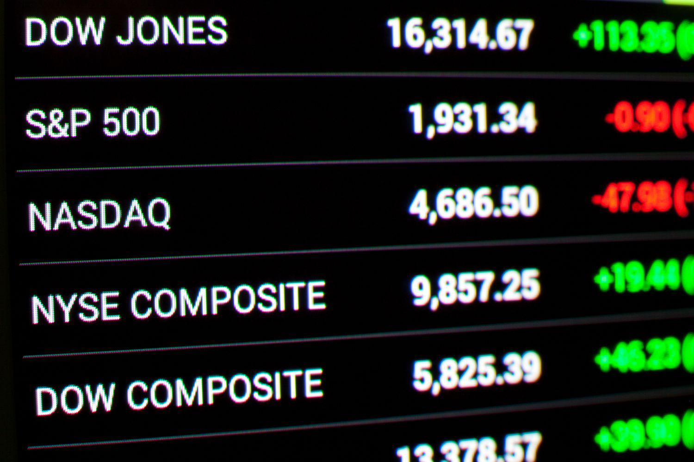

The Dow Jones Industrial Average (DJIA) holds a prominent position as one of the most widely followed stock market indices globally. Established in 1896 by Charles Dow and Edward Jones, the DJIA has evolved into a critical barometer of the overall health of the U.S. economy. Comprising 30 major publicly traded companies, known as blue-chip stocks, the DJIA reflects the performance of significant sectors such as finance, technology, healthcare, and consumer goods. Its historical significance and influence make it an essential tool for investors, economists, and policymakers when analyzing economic trends and investment strategies.

Algorithmic trading, a modern innovation in financial markets, has been reshaping trading strategies over the past few decades. By employing complex mathematical models and leveraging computational power, algorithmic trading facilitates rapid and precise execution of trades. It allows traders to manage large volumes of shares across multiple platforms, reacting almost instantaneously to market conditions. This transformation has created an environment where sophisticated algorithms can analyze data and identify patterns that would be imperceptible through manual methods.



The objective of this article is to explore the intersection of DJIA calculation and algorithmic trading. By examining the methodologies behind DJIA's calculation and the role of algorithmic trading, the article aims to provide insights into how these elements interact and influence modern financial markets. This exploration will shed light on the impact of technology on traditional indices and the emerging strategies in trading these well-known components of the stock market.

## Table of Contents

## Understanding the Dow Jones Industrial Average

The Dow Jones Industrial Average (DJIA), established in 1896 by Charles Dow and Edward Jones, is one of the world's most widely recognized stock market indices. It serves as a key barometer of the overall health of the U.S. economy, providing insight into investor sentiment and economic trends. Originally, the DJIA included 12 companies from leading American industries, but it has since evolved to include 30 of the largest and most influential blue-chip companies.

The selection criteria for the DJIA are not rigidly defined, but the index typically comprises established companies that are leaders in their respective industries, representing a variety of sectors, including technology, finance, consumer goods, and healthcare. This composition aims to reflect the broader U.S. economy, offering a snapshot of industrial performance and market conditions.

The DJIA is unique in its calculation methodology, employing a price-weighted approach rather than the more common market capitalization-weighted method. This means that each component stock influences the index in proportion to its price per share, rather than its overall market value. This approach can lead to significant impacts from higher-priced stocks, even if these companies have smaller market capitalizations.

To calculate the DJIA, the sum of the prices of all 30 component stocks is divided by a divisor, which is adjusted to account for stock splits, dividends, and other structural changes that could affect the index value. The formula can be expressed as follows:

$$
\text{DJIA} = \frac{\sum \text{Price of Component Stocks}}{\text{Dow Divisor}}.
$$

The Dow Divisor is a [factor](/wiki/factor-investing) that ensures the index's continuity and accuracy despite changes in the structure of its components. This allows the DJIA to serve as a consistent indicator of stock market performance over time, despite corporate actions that could affect the individual stock prices. 

Understanding the intricacies of the DJIA helps analysts, investors, and policymakers interpret market trends, making it a crucial component of financial analysis and trading strategies.

## The Calculation Behind the Dow

The Dow Jones Industrial Average (DJIA) is one of the most renowned stock market indices, representing 30 major publicly traded companies in the United States. Its calculation provides insights into the overall market and economic conditions. Unique in its methodology, the DJIA employs a price-weighted approach, which differs from other indices like the S&P 500 that use market capitalization weights.

The calculation of the DJIA is based on a simple formula:

$$
\text{DJIA} = \frac{\sum \text{Price of constituent stocks}}{\text{Dow Divisor}}
$$

In this formula, the sum of the prices of the 30 blue-chip stocks is divided by the Dow Divisor. The Dow Divisor is a critical component that ensures the continuity of the index value in the face of stock splits, dividends, and changes in the lineup of constituent companies.

### Dow Divisor and Its Importance

The Dow Divisor is a factor used to smooth out changes in the index caused by corporate actions that do not reflect genuine changes in market values, such as stock splits or changes in the index’s components. Historically, the divisor was equivalent to the number of companies in the index. However, various adjustments have been made over time. Today, the divisor is a number less than one, amplifying the effect of price changes in individual stocks on the index.

### Example of DJIA Calculation

Consider a simplified scenario involving three hypothetical companies A, B, and C with stock prices of $100, $200, and $300, respectively. Suppose the Dow Divisor is set at 0.1. To calculate the DJIA:

1. Compute the sum of the stock prices:
$$
   \text{Sum of Prices} = 100 + 200 + 300 = 600

$$

2. Divide the sum by the Dow Divisor:
$$
   \text{DJIA} = \frac{600}{0.1} = 6000

$$

If company A undergoes a 2-for-1 stock split, its new stock price becomes $50. Without an adjustment in the divisor, the index would inaccurately reflect this change. The divisor is adjusted to maintain consistency, calculated so that the index value before the split equals the index value after the split. 

For efficient recalculations and adjustments when splits or component replacements occur, mathematical recalibrations using historical data adjust the divisor to reflect the total value creation more accurately. This ensures that the DJIA stands as a stable, consistent gauge for evaluating market movements.

### Python Example

To simulate this calculation in Python:

```python
# Original stock prices
prices = [100, 200, 300]
dow_divisor = 0.1

# Initial DJIA calculation
djia_initial = sum(prices) / dow_divisor
print(f"Initial DJIA: {djia_initial}")

# Stock split adjustment for company A (2-for-1 split)
prices[0] = 50  # Adjusted price post-split

# Recalculate DJIA
djia_adjusted = sum(prices) / dow_divisor
print(f"Adjusted DJIA: {djia_adjusted}")
```

In this example, a manual adjustment to the Dow Divisor would be required in practice to maintain the index value before and after structural changes, showcasing the significance of its role in the index’s calculation framework.

## Algorithmic Trading and the Dow Jones

Algorithmic trading, also known as algo-trading, has revolutionized financial markets through the use of advanced algorithms to automate trading. Its primary benefits include speed, accuracy, and capacity for executing large volumes of trades. These characteristics make it especially impactful when trading stocks comprising the Dow Jones Industrial Average (DJIA), allowing traders to capitalize on small stock price discrepancies that might be unnoticeable with manual trading.

Speed is one of the core advantages of [algorithmic trading](/wiki/algorithmic-trading). Trades can be executed in fractions of a second, far faster than human capability, enabling traders to respond instantaneously to market changes. Accuracy is another key benefit, as algorithms follow predefined instructions precisely, minimizing the risk of human error. Additionally, these systems can handle vast quantities of trades simultaneously, something that would be unattainable through human effort alone.

Algorithms analyze market data by continuously scanning real-time information, such as price quotes, market [volume](/wiki/volume-trading-strategy), and news feeds. They can incorporate sophisticated techniques, including statistical modeling and [machine learning](/wiki/machine-learning), to identify trading opportunities. For example, algorithms can detect price patterns that suggest future movements, enabling them to buy low and sell high with precision.

There are several types of algorithmic trading strategies applicable to DJIA stocks. One common approach is statistical [arbitrage](/wiki/arbitrage), which involves exploiting price discrepancies between correlated stocks within the DJIA. By predicting the expected price convergence of these stocks, algorithms can execute trades that profit from temporary inefficiencies.

Another strategy often employed is [trend following](/wiki/trend-following), which involves tracking the [momentum](/wiki/momentum) of DJIA stocks and executing trades based on anticipated price direction. This could involve algorithms identifying upward trends in stock prices and initiating buy orders with the expectation that the trend will continue.

Additionally, algorithms used in [market making](/wiki/market-making) provide [liquidity](/wiki/liquidity-risk-premium) to DJIA stocks by simultaneously posting buy and sell orders. The objective is to profit from the bid-ask spread while maintaining a neutral market position. This strategy contributes to greater market efficiency and tighter spreads.

To illustrate a basic algorithmic trading strategy in Python, consider a simple moving average crossover strategy. This strategy involves buying a stock when a short-term moving average crosses above a long-term moving average, and selling when it crosses below.

```python
import pandas as pd
import numpy as np

# Sample data: assume df contains DJIA stock historical prices with columns 'Date' and 'Close'
df = pd.read_csv('djia_data.csv', parse_dates=['Date'], index_col='Date')

# Calculate moving averages
df['Short_MA'] = df['Close'].rolling(window=20).mean()
df['Long_MA'] = df['Close'].rolling(window=50).mean()

# Generate trading signals
df['Signal'] = np.where(df['Short_MA'] > df['Long_MA'], 1.0, 0.0)  # Buy signal
df['Position'] = df['Signal'].diff()  # Trade positions

# Execute trades based on signals
df['Buy'] = np.where(df['Position'] == 1, df['Close'], np.nan)
df['Sell'] = np.where(df['Position'] == -1, df['Close'], np.nan)

print(df[['Close', 'Short_MA', 'Long_MA', 'Signal', 'Buy', 'Sell']].dropna())
```

This example showcases the fundamental operations of an algorithmic trading system: data acquisition, signal generation, and trade execution. Such systems, particularly when optimized and tailored to specific securities like DJIA stocks, can significantly enhance trading efficiency and profitability.

## How Algorithmic Trading Works with the DJIA

Algorithmic trading involves the use of advanced mathematics and computational power to automate and optimize trading decisions. In the context of the Dow Jones Industrial Average (DJIA), algorithmic trading leverages sophisticated algorithms to process vast amounts of market data, identify trading opportunities, and execute trades with enhanced speed and precision.

Statistical arbitrage is one strategy employed in algorithmic trading that involves profiting from price inefficiencies or discrepancies among blue-chip stocks within the DJIA. Traders use statistical models to predict price movements and identify temporary anomalies. A common approach in this strategy is pairs trading, where two correlated stocks are identified. If one stock diverges from its historical correlation with the other, the trader may buy the underperforming stock and sell the outperforming one, assuming that they will eventually revert to their mean relationship.

Market making is another strategy whereby algorithmic traders provide liquidity to the market by continuously buying and selling stocks at quoted bid and ask prices. Algorithms swiftly adjust these quotes based on market conditions and inventory levels to capture the bid-ask spread. This constant buying and selling help maintain efficient markets and tight spreads for DJIA stocks.

Trend following strategies capitalize on the momentum of stock prices. By utilizing mathematical models such as moving averages or other technical indicators, these algorithms identify established price trends and generate signals to buy or sell based on the direction of the trend. This strategy assumes that stocks exhibiting strong trends will continue moving in the same direction.

Here's a simple Python example illustrating a moving average crossover strategy, which is a basic trend-following technique commonly used in algorithmic trading:

```python
import pandas as pd
import numpy as np

# Sample data for DJIA stock prices
data = {'Date': pd.date_range(start='1/1/2022', periods=100),
        'Close': np.random.rand(100) * 100 + 100}  # Random stock prices
df = pd.DataFrame(data)

# Calculate moving averages
short_window = 20
long_window = 50
df['Short_MA'] = df['Close'].rolling(window=short_window, min_periods=1).mean()
df['Long_MA'] = df['Close'].rolling(window=long_window, min_periods=1).mean()

# Generate trading signals
df['Signal'] = 0
df['Signal'][short_window:] = np.where(
    df['Short_MA'][short_window:] > df['Long_MA'][short_window:], 1, 0)

# Calculate positions
df['Position'] = df['Signal'].diff()

# Display the signals and positions
print(df[['Date', 'Close', 'Short_MA', 'Long_MA', 'Signal', 'Position']])
```

This code calculates short-term and long-term moving averages for a given DJIA stock and generates buy/sell signals based on the crossover of these moving averages. A "buy" signal occurs when the short-term moving average crosses above the long-term moving average, and a "sell" signal is generated when it crosses below.

Algorithmic trading strategies for the DJIA aim to enhance efficiency and capitalize on market opportunities while minimizing human error. However, they depend heavily on data quality, computational power, and the robustness of the implemented algorithms.

## Challenges and Risks of DJIA Algorithmic Trading

Algorithmic trading, while transforming the landscape of financial markets with efficiency and precision, brings forth significant challenges and risks, particularly when applied to indices like the Dow Jones Industrial Average (DJIA). Understanding these potential pitfalls is crucial for traders, financial institutions, and regulators.

Algorithmic trading can amplify market [volatility](/wiki/volatility-trading-strategies) due to the sheer speed and volume at which trades are executed. Algorithms react to market conditions within milliseconds, leading to situations known as "flash crashes," where rapid selling or buying can cause sharp price movements in a very short period. A notable example is the Flash Crash of May 6, 2010, when the DJIA dropped nearly 1,000 points in a matter of minutes, only to recover most of those losses by the end of the trading day. This incident highlighted the profound impact that algorithmic trading can have on market stability.

Technical failures represent another significant risk. Trading algorithms are complex software systems that require robust and reliable technological infrastructure to function correctly. Hardware malfunctions, software bugs, network outages, or errors in the algorithmic logic can lead to catastrophic trading errors, resulting in financial losses and market disruptions. For instance, the infamous glitch in a major trading firm’s algorithm, which led to an erroneous buy and sell flood, reinforced the need for testing and fail-safes in algorithmic systems.

Regulatory considerations are also a critical aspect of managing the risks associated with algorithmic trading on the DJIA. The rapid advancement in trading technology has necessitated revised regulatory frameworks to ensure market integrity and protect investors. Regulations such as the U.S. Securities and Exchange Commission's (SEC) Rule 15c3-5, which requires brokers to implement risk management controls before providing access to the markets, exemplify efforts to mitigate these risks. Furthermore, market participants are encouraged to adopt rigorous risk management practices, such as setting appropriate triggering and stopping parameters within trading algorithms to prevent runaway trades.

Ultimately, as the adoption of algorithmic trading grows, it is imperative for traders and organizations to not only focus on developing sophisticated algorithms but also emphasize building resilient infrastructure, adhering to strict regulatory standards, and implementing comprehensive risk management strategies to safeguard market stability.

## Future of DJIA and Algorithmic Trading

The future of the Dow Jones Industrial Average (DJIA) and algorithmic trading is intricately linked with advancements in [artificial intelligence](/wiki/ai-artificial-intelligence) (AI) and machine learning. These technologies are poised to revolutionize trading strategies by offering deeper, more nuanced insights into market trends and behaviors. By leveraging AI, trading algorithms can process vast amounts of data far beyond human capacity, identifying subtle patterns that might influence market movements.

AI and machine learning facilitate sophisticated analyses, transforming raw data into actionable intelligence. This can include sentiment analysis derived from news articles and social media, which helps traders anticipate market shifts. Machine learning models can also be trained on historical data to predict future stock prices with increasing accuracy. Techniques such as supervised learning, where models learn from labeled datasets, play a crucial role. For instance, given a set of historical DJIA performances, a machine learning model can predict possible future outcomes based on past patterns.

Predictive modeling is another critical area where AI shines. Complex algorithms, such as neural networks and decision trees, enable traders to forecast market conditions. Neural networks, inspired by the human brain's architecture, learn from the data fed into them. They adjust continuously, improving the accuracy of predictions over time. A [neural network](/wiki/neural-network) might use features such as previous day prices, trading volume, and macroeconomic indicators to predict the DJIA's next day closing price.

Regulatory balance is vital to maintaining market stability as these technologies evolve. The high-speed nature of algorithmic trading demands robust regulatory frameworks to prevent market manipulation and ensure transparency. Regulators must adapt to the increasing complexity of trading algorithms, implementing measures that prevent unintended consequences, such as flash crashes, which can result from automated trading systems malfunctioning or behaving unpredictably. This involves continuous monitoring and updating of regulations to account for new algorithmic strategies and technologies.

In conclusion, while AI and machine learning offer transformative potential for trading strategies involving the DJIA, the focus must remain on balancing innovation with effective regulation. As AI-driven trading strategies become more prevalent, ensuring market stability will be critical to fostering an environment where technology enhances rather than disrupts the integrity of financial markets. Stakeholders, including traders, regulators, and investors, must remain vigilant to the evolving landscape, embracing the benefits of technological advancements while managing associated risks.

## Conclusion

The integration of algorithmic trading within Dow Jones Industrial Average (DJIA) strategies has fundamentally transformed how investors approach stock market interactions. Algorithmic trading leverages advanced computational techniques and mathematical models to execute trades with precision and speed, enabling market participants to react swiftly to market changes and optimize trading outcomes. This technological transformation has democratized access to sophisticated trading strategies, allowing both institutional and retail investors to participate in practices that were once the preserve of professional traders.

As algorithmic trading continues to evolve, striking a balance between technological innovation and risk management becomes increasingly crucial. The rapid pace and high volume of trades driven by algorithms can amplify market volatility, posing potential risks. Ensuring robust infrastructure and implementing stringent risk management frameworks are essential to mitigate these challenges. Moreover, regulatory bodies play a vital role in overseeing algorithmic trading practices, safeguarding market integrity, and maintaining investor confidence.

For investors, staying informed about ongoing developments in algorithmic trading and DJIA strategies is imperative. The landscape of financial markets is continuously shaped by technological advancements, and understanding these changes enables investors to make informed decisions. By keeping abreast of innovations and regulatory updates, investors can navigate the complexities of algorithmic trading and capitalize on its potential benefits while managing associated risks effectively.

In summary, the intersection of algorithmic trading and the DJIA represents a significant evolution in financial markets. It highlights the importance of embracing technological advancements responsibly, ensuring that innovations are accompanied by comprehensive risk management strategies to foster stable and secure markets.

## References & Further Reading

### References & Further Reading

For those interested in expanding their understanding of the Dow Jones Industrial Average (DJIA) and the intricacies of algorithmic trading, the following resources offer comprehensive insights:

1. **Books:**
   - *"A Random Walk Down Wall Street: The Time-Tested Strategy for Successful Investing"* by Burton G. Malkiel. This book provides a foundational understanding of the stock markets, including indices like the DJIA, and introduces readers to various trading strategies.
   - *"Algorithmic Trading: Winning Strategies and Their Rationale"* by Ernie Chan. This resource is invaluable for those interested in the technical aspects of algorithmic trading, offering strategies and practical algorithms.
   - *"The Little Book of Stock Market Cycles"* by Jeffrey A. Hirsch. This book gives readers an understanding of historical stock trends and cycles, which is crucial for DJIA-related strategies.

2. **Articles:**
   - "The Dow Jones Industrial Average: A Century of Market History" by Jeremy Siegel, published in *Financial Analysts Journal*. This article provides a historical perspective on the DJIA's role and significance.
   - "Algorithmic Trading and High-Frequency Trading: An Overview" by David Easley, Marcos López de Prado, and Maureen O'Hara, featured in *Quantitative Finance*. It explains the principles of algorithmic trading and its impact on market dynamics, including those involving major indices like the DJIA.

3. **Online Resources:**
   - The official Dow Jones Indexes website (www.djindexes.com) provides up-to-date information on the current composition and performance of the DJIA.
   - Investopedia’s tutorial on "Algorithmic Trading" offers accessible articles aimed at beginners looking to understand how algorithmic systems function within the stock market.
   - Kaggle (www.kaggle.com) hosts datasets related to stock market trading, along with Python notebooks that can provide practical examples of algorithmic trading techniques applied to DJIA stocks.

4. **Academic Journals:**
   - *The Journal of Finance* often publishes scholarly articles on algorithmic trading and its implications on indices like the DJIA.
   - *Journal of Trading* covers research papers specifically focused on innovations in trading algorithms and their performance metrics.

5. **Software and Tools:**
   - Python libraries such as Pandas, NumPy for data manipulation, and sklearn for machine learning provide a practical toolkit for developing and testing algorithmic trading models.
   - Trading platforms like QuantConnect offer cloud-based environments for algorithm development and backtesting against historical DJIA data.

These resources provide a blend of theoretical knowledge and practical application suitable for anyone interested in the financial markets and algorithmic trading, with a particular focus on the DJIA.