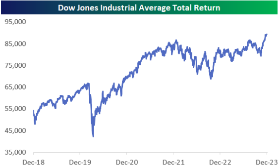

## Table of Contents

## What is the Dow Jones Industrial Average (DJIA)?

The Dow Jones Industrial Average, often called the Dow or DJIA, is a stock market index that shows how 30 large, publicly-owned companies in the United States are doing. It was created by Charles Dow in 1896 to give people a quick way to see if the stock market was going up or down. These 30 companies are from different industries like technology, health care, and finance. The index is calculated by adding up the stock prices of these companies and then dividing by a special number called the divisor, which changes over time to keep the index accurate.

The DJIA is important because it is one of the oldest and most well-known stock market indexes. Many people watch it to get a sense of how the overall economy is doing. When the Dow goes up, it usually means that the stock market and the economy are doing well. When it goes down, it can mean that people are worried about the economy. However, the Dow only represents a small part of the whole stock market, so it's not a complete picture of everything that's happening.

## How is the DJIA calculated?

The DJIA is calculated by adding up the stock prices of the 30 companies in the index and then dividing by a special number called the divisor. The divisor changes over time to make sure the index stays accurate even when things like stock splits or dividends happen. A stock split is when a company decides to divide its shares into more shares, and a dividend is when a company pays money to its shareholders. The divisor helps keep the index fair and consistent.

The calculation starts with the sum of the prices of all 30 stocks. For example, if the total price of all the stocks is $4,000, and the divisor is 0.152, you would divide $4,000 by 0.152 to get the DJIA value. This would give you a Dow Jones value of about 26,316. The divisor is a small number, so even small changes in stock prices can lead to big changes in the DJIA. This method of calculation is different from other indexes, like the S&P 500, which use a different way to weigh the stocks.

## What does a record high in the DJIA indicate?

A record high in the DJIA means that the total value of the 30 companies in the index has reached a level higher than it has ever been before. It shows that these companies are doing well and that investors are feeling confident about the economy. When the DJIA hits a new high, it often makes the news because it can be a sign that the stock market and the economy are strong.

However, a record high in the DJIA doesn't mean everything is perfect. It only represents a small part of the whole stock market, so other parts might not be doing as well. Also, just because the DJIA is at a record high doesn't mean it will keep going up. The stock market can be unpredictable, and there can still be ups and downs even after hitting a record high.

## What was the highest recorded value of the DJIA and when did it occur?

The highest recorded value of the Dow Jones Industrial Average was 40,077.40 points. This record high happened on May 16, 2024. When the DJIA reaches a new high like this, it means that the 30 companies in the index are doing really well, and investors are feeling good about the economy.

However, a record high in the DJIA doesn't mean everything is perfect. It only shows how a small group of companies is doing, and other parts of the stock market might not be doing as well. Also, even after hitting a record high, the stock market can still go up and down, so it's important to keep watching it.

## What factors contributed to the DJIA reaching its record high?

The DJIA reached its record high because many things were going well for the 30 companies in the index. These companies were making more money, and people were feeling good about the economy. Big companies like Apple, Microsoft, and Johnson & Johnson were doing really well, which helped push the DJIA up. Also, the economy was growing, and there were more jobs, so people had more money to spend and invest.

Another reason the DJIA hit its record high was because interest rates were low. When interest rates are low, it's cheaper for companies to borrow money to grow their businesses. This can help them make more money and make their stock prices go up. Also, when people see the stock market going up, they often want to invest more, which can push stock prices even higher. All these things together helped the DJIA reach its highest point ever.

## How does the DJIA's record high compare to other major stock indices?

When the DJIA hit its record high of 40,077.40 points on May 16, 2024, it showed that the 30 companies in the index were doing really well. But the DJIA is just one part of the stock market, and other major indices like the S&P 500 and the Nasdaq also tell us about how the market is doing. The S&P 500, which looks at 500 big companies, is often seen as a better way to see how the whole market is doing. Around the same time the DJIA hit its record, the S&P 500 was also doing well, but it wasn't at its highest point ever.

The Nasdaq, which has a lot of technology companies, was also doing pretty well when the DJIA hit its record high. The Nasdaq had been setting new highs earlier in 2024, which shows that tech companies were doing really well. So, while the DJIA's record high is important, it's also good to look at other indices like the S&P 500 and the Nasdaq to get a fuller picture of how the stock market is doing. Each index tells us about different parts of the market, and together they help us understand the overall health of the economy.

## What are the economic implications of the DJIA hitting a record high?

When the DJIA hits a record high, it means that the 30 big companies in the index are doing really well. This can be good news for the economy because it shows that these companies are making more money and people are feeling good about investing. More jobs might be created, and people might spend more money, which can help the economy grow. But, it's important to remember that the DJIA only looks at a small part of the stock market, so it's not the whole story.

Even though a record high in the DJIA can be a good sign, it doesn't mean everything is perfect. Other parts of the economy might not be doing as well, and the stock market can still go up and down. Sometimes, when the stock market is at a high point, it can make people worry about a bubble, where prices are too high and might fall soon. So, while a record high in the DJIA can be exciting, it's important to look at other things too, like other stock indices and economic reports, to really understand what's going on with the economy.

## How have historical record highs of the DJIA influenced market trends?

When the DJIA hits a record high, it often makes people feel good about the stock market and the economy. They might think that things are going well and decide to invest more money. This can lead to more people buying stocks, which can push stock prices even higher. For example, after the DJIA hit a record high in 2013, the market kept going up for a while because people were feeling confident. But, sometimes, a record high can also make people worry that the market is too high and might fall soon. This can make some people sell their stocks to be safe, which can cause the market to go down.

Looking back at history, record highs in the DJIA have sometimes been followed by big changes in the market. In 1929, the DJIA hit a record high just before the stock market crashed, leading to the Great Depression. More recently, the DJIA hit a record high in early 2020, but then the market fell a lot because of the COVID-19 pandemic. So, while a record high can be a good sign, it doesn't always mean the market will keep going up. It's important to look at other things too, like what's happening in the economy and other parts of the stock market, to understand what might happen next.

## What are the key companies included in the DJIA that contributed to the record high?

The DJIA's record high was helped a lot by big companies like Apple, Microsoft, and Johnson & Johnson. Apple makes iPhones and computers, and they were selling a lot of them. Microsoft makes software like Windows and Office, and they were doing well too. Johnson & Johnson makes medicine and health products, and they were making more money than before. These companies are really important in the DJIA because they are big and their stock prices going up helped push the whole index to a new high.

Other companies like Goldman Sachs, which is a big bank, and UnitedHealth Group, which helps people with their health insurance, also did well. Goldman Sachs makes money by helping other companies and people with their money, and they were doing good business. UnitedHealth Group was helping more people get health care, which made them more money. All these companies together helped the DJIA reach its highest point ever on May 16, 2024.

## How do global economic conditions affect the DJIA's performance?

Global economic conditions can really affect how the DJIA does. If the world economy is doing well, companies in the DJIA might make more money because they can sell their products and services to more people around the world. For example, if countries like China or Europe are growing, companies like Apple or Boeing might sell more iPhones or airplanes there, which can make their stock prices go up and help the DJIA. Also, when other countries have strong economies, their investors might want to put money into the U.S. stock market, which can push the DJIA higher.

On the other hand, if the global economy is not doing well, it can hurt the DJIA. If there's a big problem like a financial crisis or a global health issue, like the COVID-19 pandemic, companies might make less money because people aren't buying as much. This can make their stock prices go down, which can pull the DJIA down too. For example, when the global economy slowed down during the 2008 financial crisis, the DJIA fell a lot because many companies were struggling. So, what's happening in the world can have a big impact on the DJIA.

## What technical analysis indicators were significant in predicting the DJIA's record high?

Technical analysis helps people guess where the stock market might go by looking at past prices and patterns. When the DJIA was getting close to its record high, some important indicators were the moving averages and the Relative Strength Index (RSI). Moving averages, like the 50-day and 200-day moving averages, show the average price of the DJIA over a certain time. If the DJIA's price was going above these lines, it meant the market was strong and might keep going up. The RSI measures how fast prices are changing and if the market is overbought or oversold. If the RSI was high but not too high, it suggested the DJIA could keep climbing without being too risky.

Another important indicator was the trend lines. When the DJIA was making higher highs and higher lows, it showed a strong uptrend. This means the DJIA was going up more than it was going down, which is a good sign for reaching a record high. Also, chart patterns like the "cup and handle" or "bull flag" were seen before the record high. These patterns suggest that after a small dip, the DJIA might continue to go up. So, by watching these indicators, people could see that the DJIA was likely to hit a new record high.

## What are the potential risks and future outlook for the DJIA following a record high?

After the DJIA hits a record high, there are some risks to think about. One big risk is that the market might be in a bubble, where prices are too high and could fall soon. If people start to think the market is too expensive, they might sell their stocks, which can make the DJIA go down. Another risk is that something bad could happen in the world, like a financial crisis or a big health problem, which can make companies lose money and pull the DJIA down. Also, if interest rates go up, it can make it harder for companies to borrow money and grow, which can hurt their stock prices and the DJIA.

Looking ahead, the future of the DJIA depends on a lot of things. If the economy keeps growing and companies keep making more money, the DJIA might keep going up. But, it's hard to predict the future because so many things can change. It's important to watch other parts of the economy and the world to get a good idea of what might happen next. Even though the DJIA hit a record high, it can still go up and down, so it's good to be ready for anything.

## What is the Understanding of the Dow Jones Industrial Average?

The Dow Jones Industrial Average (DJIA) is one of the most widely recognized stock market indices in the world, often used as a barometer of the overall health of the United States economy. Comprising 30 prominent publicly traded companies, the DJIA represents a diverse range of industries and sectors, reflecting broader economic trends.

The DJIA is calculated using a price-weighted method, which means that stocks with higher prices have a greater impact on the index's movement. The formula used to compute the DJIA can be represented as:

$$
\text{DJIA} = \frac{\sum P_i}{D}
$$

where $P_i$ represents the price of each stock in the index, and $D$ denotes the Dow Divisor, a constant that is periodically adjusted to account for events like stock splits or changes in the index composition.

The history of the DJIA dates back to its inception in 1896, when Charles Dow, a Wall Street Journal editor, introduced it as a means to gauge the performance of the industrial sector. Initially comprised of 12 stocks, the index has evolved over time to include a broader range of companies, reflecting shifts in the U.S. economy from manufacturing to more service-oriented sectors.

Companies within the DJIA are selected primarily from those listed on the New York Stock Exchange and are categorized across diverse sectors including technology, healthcare, consumer goods, and financials. Some notable constituents of the DJIA include Apple Inc. (technology sector), Johnson & Johnson (healthcare sector), and Goldman Sachs (financial sector). These companies are chosen based on a variety of factors, including their market capitalization, trading [volume](/wiki/volume-trading-strategy), and representation of their respective industries.

The DJIA's significance lies not only in its historical value and longevity but also in its role as a proxy for investor sentiment and economic conditions within the United States. Despite its limitations, such as being price-weighted rather than market cap-weighted, the DJIA continues to be a crucial tool for analysts, investors, and policymakers in assessing the state of the economy.

## References & Further Reading

[1]: ["Algorithmic Trading: Winning Strategies and Their Rationale"](https://www.wiley.com/en-us/Algorithmic+Trading%3A+Winning+Strategies+and+Their+Rationale-p-9781118460146) by Ernest P. Chan

[2]: Hendershott, T., Jones, C. M., & Menkveld, A. J. (2011). ["Does Algorithmic Trading Improve Liquidity?"](https://onlinelibrary.wiley.com/doi/full/10.1111/j.1540-6261.2010.01624.x) The Journal of Finance, 66(1), 1-33.

[3]: Kirilenko, A. A., Kyle, A. S., Samadi, M., & Tuzun, T. (2017). ["The Flash Crash: The Impact of High-Frequency Trading on an Electronic Market."](https://onlinelibrary.wiley.com/doi/abs/10.1111/jofi.12498) The Journal of Finance, 72(3), 967-998.

[4]: Aldridge, I. (2013). ["High-Frequency Trading: A Practical Guide to Algorithmic Strategies and Trading Systems."](https://www.ahmetbeyefendi.com/wp-content/uploads/2020/07/High-Frequency-Trading-Irene-Aldridge.pdf) Wiley Finance.

[5]: Harris, L. (2003). ["Trading and Exchanges: Market Microstructure for Practitioners."](https://academic.oup.com/book/52292) Oxford University Press.