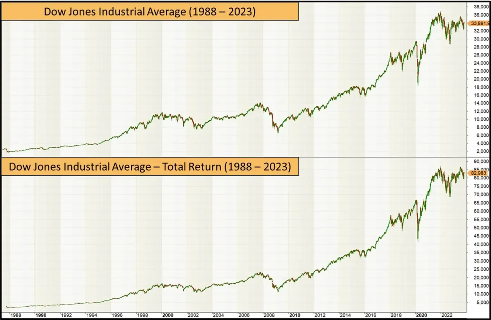

## Table of Contents

## What is the Dow Jones Industrial Average (DJIA)?

The Dow Jones Industrial Average, often called the Dow or DJIA, is a stock market index that shows how 30 large, publicly-owned companies in the United States are doing. It was created by Charles Dow in 1896 to give people an idea of the overall health of the stock market. The companies in the Dow are from different industries, like technology, finance, and healthcare. The index is calculated by adding up the stock prices of these companies and then dividing by a special number called the "Dow Divisor." This helps to show changes in the market.

People often use the Dow to see how the stock market is doing overall. When the Dow goes up, it usually means that the stock market is doing well, and when it goes down, it can mean that the market is not doing so well. However, the Dow only shows a part of the whole market because it only includes 30 companies. Other indexes, like the S&P 500, include more companies and might give a fuller picture of the market. Still, the Dow is very popular and is often mentioned in the news.

## How is the yield of the DJIA calculated?

The yield of the Dow Jones Industrial Average (DJIA) is not a standard calculation like the yield of a bond or a dividend yield of a stock. Instead, when people talk about the "yield" of the DJIA, they are usually referring to the average dividend yield of the 30 companies that make up the index. To find this, you add up the dividend yields of all 30 companies and then divide by 30. The dividend yield for each company is calculated by taking the annual dividend per share and dividing it by the current stock price of that company.

This average dividend yield gives investors an idea of the income they might expect from the DJIA if they owned all the stocks in the index in the same proportions. However, it's important to remember that the DJIA itself does not pay dividends. You would need to buy the individual stocks to receive those dividends. Also, the yield can change over time because stock prices and dividend payments can go up or down.

## What components make up the DJIA?

The Dow Jones Industrial Average, or DJIA, is made up of 30 big companies from the United States. These companies come from different industries, like technology, health care, and finance. Some of the companies you might know are Apple, Microsoft, and Walmart. The DJIA tries to show how well these big companies are doing, which can give us an idea about the health of the whole stock market.

The list of companies in the DJIA changes sometimes. The people who manage the index, called the S&P Dow Jones Indices, decide which companies should be in the DJIA. They look at things like how big the company is, how much it is traded, and if it represents its industry well. When a company is added or removed, it is a big deal and often makes the news. Right now, the DJIA includes companies like Boeing, Coca-Cola, and Nike, along with many others.

## Why is the yield of the DJIA important for investors?

The yield of the Dow Jones Industrial Average (DJIA) is important for investors because it gives them an idea of the income they could get if they owned all the stocks in the DJIA. This is useful for people who want to make money from dividends, which are payments companies make to their shareholders. By looking at the yield, investors can see how much money they might get back from their investment every year, compared to the price they paid for the stocks.

Even though the DJIA itself doesn't pay dividends, knowing the average yield can help investors decide if the DJIA is a good place to put their money. If the yield is high, it might mean the stocks are a good deal because they are paying more in dividends compared to their price. But if the yield is low, it might mean the stocks are expensive, and investors might get less income from them. So, the yield helps investors make smart choices about where to invest their money.

## How does the DJIA yield compare to other market indices?

The yield of the Dow Jones Industrial Average (DJIA) can be compared to other market indices like the S&P 500 and the Nasdaq Composite to see how they stack up in terms of the income they might provide to investors. The DJIA includes 30 big companies from different industries, while the S&P 500 has 500 companies, and the Nasdaq Composite includes all the stocks listed on the Nasdaq exchange, which is known for tech companies. Because of these differences, the yields can be quite different. For example, the S&P 500 often has a higher yield than the DJIA because it includes more companies, some of which might pay higher dividends.

The yield of the DJIA might be lower than the S&P 500 because the DJIA focuses on big, well-known companies that might not always pay the highest dividends. On the other hand, the Nasdaq Composite might have an even lower yield because it includes a lot of tech companies, which often pay less in dividends than companies in other industries. So, when investors are looking at where to put their money, they might choose the S&P 500 for a higher yield, or the DJIA if they want to invest in well-known, stable companies, or the Nasdaq if they are more interested in tech stocks, even if the yield is lower.

## What historical trends can be observed in the DJIA yield?

Over the years, the yield of the Dow Jones Industrial Average (DJIA) has gone through many changes. In the past, the yield was often higher than it is today. This is because many companies used to pay bigger dividends. For example, during the 1970s and 1980s, the DJIA yield was often around 4% to 6%. This was good for people who wanted to make money from dividends because they got more money back from their investments. But as time went on, companies started to pay less in dividends and used their money for other things, like growing their businesses. So, the yield of the DJIA started to go down.

Today, the yield of the DJIA is usually lower than it used to be. In recent years, it has been around 2% to 3%. This means that people who invest in the DJIA now might not get as much money back from dividends as they did in the past. But the yield can still change a lot depending on what is happening in the economy and with the companies in the DJIA. For example, if the stock market goes down, the yield might go up because the prices of the stocks go down, but the dividends stay the same. So, even though the yield is lower now, it is still something that investors watch closely to see how their investments are doing.

## How do economic cycles affect the DJIA yield?

Economic cycles, like booms and busts, can change the yield of the Dow Jones Industrial Average (DJIA). During a boom, when the economy is doing well, companies might make more money and pay bigger dividends. But at the same time, the prices of their stocks might go up a lot. This can make the yield go down because the yield is the dividend divided by the stock price. So, even if dividends go up, if the stock prices go up more, the yield will be lower. 

On the other hand, during a bust, when the economy is not doing well, stock prices might go down. If companies keep paying the same dividends, the yield can go up because the stock prices are lower. This is why the yield can be higher during tough economic times. But sometimes, if the economy is really bad, companies might cut their dividends to save money, which can make the yield go down even if stock prices are low. So, economic cycles can make the DJIA yield move up and down in different ways.

## What are the factors that influence changes in the DJIA yield?

The yield of the Dow Jones Industrial Average (DJIA) can change because of many things. One big thing is the dividends that the companies in the DJIA pay. If these companies start paying more money to their shareholders, the yield can go up. But if they pay less, the yield can go down. Another thing that can change the yield is the price of the stocks. If the stock prices go up a lot, the yield can go down because the yield is calculated by dividing the dividend by the stock price. So, even if the dividend stays the same, a higher stock price means a lower yield.

Another [factor](/wiki/factor-investing) that can influence the DJIA yield is the overall health of the economy. When the economy is doing well, companies might make more money and pay bigger dividends. But at the same time, people might want to buy more stocks, which can make the stock prices go up. This can make the yield go down. On the other hand, if the economy is not doing well, stock prices might go down. If companies keep paying the same dividends, the yield can go up because the stock prices are lower. But if the economy is really bad, companies might cut their dividends to save money, which can make the yield go down even if stock prices are low.

## How can investors use the DJIA yield to make investment decisions?

Investors can use the DJIA yield to help decide if they want to invest in the stocks that make up the Dow Jones Industrial Average. The yield tells them how much money they might get back from their investment every year, just from the dividends that the companies pay. If the yield is high, it might mean that the stocks are a good deal because they are paying more in dividends compared to their price. This can be good for people who want to make money from dividends. But if the yield is low, it might mean the stocks are expensive, and investors might get less income from them. So, by looking at the yield, investors can decide if the DJIA is a good place to put their money right now.

Another way investors can use the DJIA yield is to compare it with other investment options. For example, they might look at the yield of the S&P 500 or the Nasdaq Composite to see which one might give them more income. If the DJIA yield is lower than these other indexes, investors might choose to invest in those instead. Also, the yield can help investors understand what is happening in the economy. If the yield is going up, it might mean that stock prices are going down, which could be a sign that the economy is not doing well. On the other hand, if the yield is going down, it might mean that stock prices are going up, which could be a sign of a strong economy. By keeping an eye on the DJIA yield, investors can make smarter choices about where to put their money.

## What are the limitations of using the DJIA yield as a market indicator?

Using the DJIA yield as a market indicator has some limitations. One big problem is that the DJIA only includes 30 companies. This means it doesn't show what is happening with all the other companies in the market. So, the DJIA yield might not give a full picture of the whole market. Also, the companies in the DJIA are big and well-known, but they might not pay the highest dividends. This can make the yield lower than other parts of the market, which might not be a good sign of how the whole market is doing.

Another limitation is that the DJIA yield can change a lot because of things like stock prices and dividends. If stock prices go up a lot, the yield can go down even if the dividends stay the same. This can make it hard to use the yield to understand what is happening in the market. Also, the DJIA yield doesn't tell investors everything they need to know. It only shows how much money they might get back from dividends, but it doesn't say anything about how much the stocks might grow in value. So, investors need to look at other things too, like the overall health of the economy and other market indicators, to make good investment choices.

## How does the DJIA yield correlate with dividend policies of its constituent companies?

The yield of the Dow Jones Industrial Average (DJIA) is closely tied to the dividend policies of the 30 companies that make up the index. When these companies decide to increase their dividends, the overall yield of the DJIA can go up. This is because the yield is calculated by adding up the dividends of all the companies and dividing by the total value of the stocks. So, if more companies start paying bigger dividends, the yield will be higher. On the other hand, if the companies cut their dividends, the yield will go down. This is why the dividend policies of the companies in the DJIA are so important for the yield.

However, the yield can also change even if the dividend policies stay the same. This happens when the prices of the stocks go up or down. If the stock prices go up a lot, the yield can go down because the dividends are spread over a bigger value. But if the stock prices go down, the yield can go up because the same dividends are now spread over a smaller value. So, while the dividend policies of the companies in the DJIA are a big part of what affects the yield, they are not the only thing. The prices of the stocks also play a big role in how the yield changes over time.

## What advanced statistical methods can be used to forecast future DJIA yield movements?

To forecast future movements in the DJIA yield, advanced statistical methods like time series analysis can be used. Time series analysis looks at how the yield has changed over time and tries to find patterns. One popular method is called ARIMA, which stands for AutoRegressive Integrated Moving Average. ARIMA can help predict future yield by looking at past data and seeing how the yield has moved up and down. Another method is GARCH, which stands for Generalized Autoregressive Conditional Heteroskedasticity. GARCH is good at predicting how much the yield might change in the future, not just if it will go up or down.

Another useful method is regression analysis, which can look at how different things affect the DJIA yield. For example, regression analysis can help see how changes in the economy, like interest rates or inflation, might change the yield. Machine learning techniques, like neural networks, can also be used to forecast the DJIA yield. These methods can find complex patterns in the data that might be hard for people to see. By using a lot of different data, like stock prices, dividends, and economic indicators, [machine learning](/wiki/machine-learning) can make very detailed predictions about how the yield might move in the future.

## What is the Dow Jones Industrial Average (DJIA) and how can it be understood?

The Dow Jones Industrial Average (DJIA) is a prominent stock market index that represents 30 significant publicly traded companies based in the United States. This index plays a crucial role as a barometer for evaluating the overall health of the U.S. stock market and the broader economy. By tracking the performance of these select companies, the DJIA provides investors with a snapshot of market trends and economic health.

### Calculation Methodology

The DJIA is calculated using a price-weighted metric, meaning that stocks with higher prices have a more significant impact on the index's overall performance. To compute the index, the sum of the prices of the included stocks is divided by a divisor, which is adjusted to account for stock splits, dividends, and other corporate actions that may affect individual stock prices. The formula can be expressed as:

$$
\text{DJIA} = \frac{\sum \text{Price of 30 companies}}{\text{Divisor}}
$$

The divisor is a critical component that ensures continuity of the index over time, enabling it to accurately reflect changes in the market without distortions from non-market influences.

### Key Companies and Sectors

The DJIA includes a diverse array of companies across various sectors, providing a broad representation of the U.S. economy. Some notable companies within the index include:

- **Apple Inc.** (Technology sector), known for its consumer electronics and software.
- **The Boeing Company** (Aerospace sector), a leading manufacturer of airplanes.
- **Goldman Sachs Group Inc.** (Financial sector), a major investment banking firm.
- **Coca-Cola Company** (Consumer Goods sector), recognized globally for its beverage products.

These companies are selected based on their market capitalization, industry leadership, and influence on the American economy. The sectors represented cover technology, finance, healthcare, consumer goods, energy, and industrials, ensuring a comprehensive overview of economic activities.

### Historical Performance

Historically, the DJIA has had a significant impact on the financial markets and is often used as a benchmark for investors. Since its inception in 1896, the index has reflected the economic shifts of the United States. For instance, during the 1929 stock market crash and the subsequent Great Depression, the DJIA experienced a substantial decline, underscoring the severity of the economic downturn. Conversely, in recent decades, periods of economic growth, such as the tech boom of the 1990s and post-2008 recovery, have seen the DJIA reaching new heights.

The DJIA's long-term upward trajectory exemplifies the resilience and growth of the U.S. economy. However, it is important for investors to recognize that the index does not represent the entire market, as it consists of only 30 companies. Despite this limitation, the DJIA remains a valuable tool for assessing market sentiment and economic performance.

As the landscape of global finance continues to evolve, understanding how the DJIA functions and its role in the stock market helps investors make informed decisions and anticipate future market developments.

## What is the yield in the context of the DJIA?

Yield refers to the earnings generated and realized on an investment over a specific period. In the context of the Dow Jones Industrial Average (DJIA), yield is an essential metric that investors use to assess the performance of their investment in the included stocks. For DJIA stocks, yield is typically calculated based on the dividends that companies distribute to shareholders, and it is measured as the dividend yield. 

### Calculating Yield for DJIA Stocks

The yield for DJIA stocks is primarily calculated as the dividend yield, which can be formulated as:

$$
\text{Dividend Yield} = \left( \frac{\text{Annual Dividends Per Share}}{\text{Price Per Share}} \right) \times 100\%
$$

This formula expresses the relationship between the annual dividends a stock pays relative to its current share price, providing a percentage that helps investors understand what they might earn relative to their investment size.

### Importance of Dividend Yield

Dividend yield stands as a significant component of total return, which encompasses all gains from an investment, including capital gains and dividends. In a volatile market, dividends become a more reliable portion of returns, offering investors a steady income stream even when stock prices fluctuate. Moreover, companies with consistent dividend yields are often considered financially stable, indicating potential robust future performance.

### Factors Affecting Yield

Several factors influence the yield of DJIA components. Economic conditions play an extensive role; during economic recessions, firms might cut dividends to preserve cash, directly affecting yields. Conversely, in economic expansions, companies often have more [liquidity](/wiki/liquidity-risk-premium) to increase dividend payouts. Corporate policies also heavily influence yields. For example, a firm's decision to reinvest in growth or to deleverage by repaying debt might impact its dividend distribution strategy.

### Historical Yield Trends

Historically, the DJIA’s dividend yield has fluctuated with broader economic trends and market cycles. During economic downturns, yields might decline as companies conserve cash, while during booms, yields often rise as firms distribute more profits. An examination of historical yield trends can offer insights into future performance, helping investors predict how current economic conditions might affect future dividends.

In conclusion, understanding yield in the context of the DJIA is vital for constructing a well-informed investment strategy. It provides an essential lens for evaluating prospective returns, allowing investors to make decisions aligned with their financial goals.

## References & Further Reading

[1]: Malkiel, B. (2007). ["A Random Walk Down Wall Street: The Time-Tested Strategy for Successful Investing."](https://yourknowledgedigest.org/wp-content/uploads/2020/04/a-random-walk-down-wall-street.pdf) W. W. Norton & Company.

[2]: O'Neil, W. J. (2009). ["How to Make Money in Stocks: A Winning System in Good Times and Bad."](https://www.amazon.com/How-Make-Money-Stocks-Winning/dp/0071614133) McGraw-Hill Education.

[3]: Thorp, E. (2006). ["Beat the Market: A Scientific Stock Market System."](https://archive.org/details/beatmarketscient00thor) Random House.

[4]: Lopez de Prado, M. (2018). ["Advances in Financial Machine Learning."](https://www.amazon.com/Advances-Financial-Machine-Learning-Marcos/dp/1119482089) Wiley.

[5]: Chan, E. P. (2008). ["Quantitative Trading: How to Build Your Own Algorithmic Trading Business."](https://github.com/ftvision/quant_trading_echan_book) Wiley.