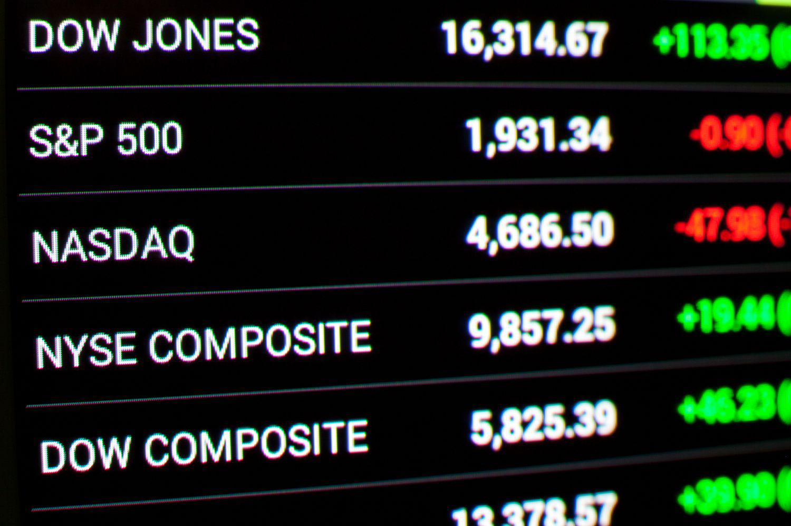

The Dow Jones Stock Market Index, formally known as the Dow Jones Industrial Average (DJIA), is a quintessential measure of the U.S. equity market and one of the most trusted indicators of the economic health of the United States. It comprises 30 significant publicly-traded companies in the U.S., spanning various sectors, excluding transportation and utilities. Since its inception in 1896 by Charles Dow and Edward Jones, the DJIA has gained immense importance in both domestic and global finance as a proxy for broader market trends and economic movements. More than just a collection of stock prices, it symbolizes the performance of well-established companies, often referred to as blue-chip stocks.

The advent of algorithmic trading has markedly transformed the landscape of financial markets, including pivotal indices like the Dow Jones. Algorithmic trading involves the use of computer programs to execute trades at high speeds based on pre-defined criteria. This technological evolution has democratized access to complex trading strategies, which were once the exclusive domain of large financial institutions. Its emergence is a testament to the impact of technology on finance, pushing the industry towards precision, speed, and automation.



The intersection of the DJIA and algorithmic trading is an area of increasing intrigue. As algorithms execute trades based on real-time data, they influence market dynamics and, consequently, the movements of indices like the Dow Jones. This progression towards automated trading strategies has redefined how market indexes are tinkered with, presenting both opportunities and challenges for different classes of investors.

Understanding how these automated strategies impact the DJIA is crucial for investors seeking to navigate this rapidly evolving market environment. This article aims to explore the implications of algorithmic trading on the Dow Jones, highlighting its transformative effects on trading strategies and offering insights into what this means for investors today. The essential balance between traditional investment principles and cutting-edge technological advancements becomes ever more significant as market players embrace the full potential of automation.

## Table of Contents

## Understanding the Dow Jones Industrial Average

The Dow Jones Industrial Average (DJIA) is one of the most well-known and longstanding stock market indices globally. It was established on May 26, 1896, by Charles Dow and Edward Jones, co-founders of Dow Jones & Company. Initially, the DJIA consisted of 12 industrial companies, reflecting the industrial focus of the United States economy at the time. These companies were prominent players in sectors like railroads, cotton, gas, sugar, tobacco, and oil. The index has since evolved, expanding both in size and scope to better represent the diverse economic landscape of the United States.

The DJIA is considered a primary indicator of the economic health of the United States. As a price-weighted index, the DJIA is calculated by summing the prices of its 30 constituent companies' stocks and dividing by a divisor, which accounts for stock splits and other adjustments. This methodology distinguishes it from other indices like the S&P 500, which are market-capitalization-weighted.

$$
\text{DJIA} = \frac{\sum \text{Price of Component Stocks}}{\text{Divisor}}
$$

The DJIA acts as a barometer of the US economy by reflecting investor sentiment and the business performance of major corporations across a variety of sectors. Although its price-weighted nature is sometimes criticized for giving disproportionate influence to companies with higher stock prices, it remains a widely followed indicator.

Among its components, the DJIA includes major corporations such as Apple Inc., The Boeing Company, and Coca-Cola Company. These companies are leaders in their respective industries, ranging from technology and aviation to consumer products and healthcare. The presence of these giants ensures that the DJIA provides a broad perspective on the economic strength and trends within critical sectors of the economy.

The composition of the DJIA has evolved significantly since its inception, with numerous changes reflecting economic trends and shifts in industrial prominence. Originally dominated by manufacturing and resource extraction companies, the index now includes companies from technology, finance, and healthcare. Updates to the index are generally intended to ensure it remains a relevant and accurate representation of the current US economic landscape.

Recent changes in the DJIA composition include the addition and removal of companies, often indicative of broader economic shifts. For example, in August 2020, Salesforce, Amgen, and Honeywell were added to the index, replacing ExxonMobil, Pfizer, and Raytheon Technologies. These changes highlighted the growing influence of technology and biotechnology while reducing the weight of traditional energy and defense sectors.

Overall, the DJIA continues to serve as a critical snapshot of the market and economic trends in the United States, offering investors valuable insight while simultaneously adapting to the ever-changing economic environment.

## Algorithmic Trading: A Game Changer

Algorithmic trading refers to the use of computer programs to execute trading strategies at high speeds and volumes, often far surpassing human capabilities. It involves creating algorithms, or sets of rules and instructions, to automate trading decisions in the financial markets. These algorithms analyze multiple markets simultaneously, identify trading opportunities, and execute trades based on predefined criteria. 

Unlike traditional trading, which relies heavily on human intuition and decision-making, [algorithmic trading](/wiki/algorithmic-trading) removes emotional biases and operates with full reliance on data. Human traders may take minutes or even hours to analyze information and execute trades, but algorithms can process data and perform transactions in milliseconds. This fundamental difference is one of the critical reasons large financial institutions prefer algorithmic techniques over manual methods.

The primary advantage algorithmic trading holds is its unmatched speed and precision. In a market where every millisecond counts, being able to execute trades faster than competitors can lead to significant profit gains. Algorithms can also precisely calculate optimal trade sizes to minimize market impact, while simultaneously managing and adapting to risk much faster than a human could.

The technology underlying algorithmic trading is powered by advances in [artificial intelligence](/wiki/ai-artificial-intelligence) (AI) and [machine learning](/wiki/machine-learning). These technologies enable algorithms to learn and adapt from historical data, improving trade execution strategies. Machine learning models, for example, can uncover patterns or anomalies that might not be evident through traditional analysis.

In Python, libraries such as TensorFlow or scikit-learn may be used to develop these machine learning models. Here's a simple Python example illustrating how an algorithm might choose trades based on moving averages:

```python
import pandas as pd

# Sample data, typically retrieved via an API from a financial data provider
data = pd.DataFrame({
    'price': [100, 102, 101, 105, 107, 103, 108, 110, 115, 112]
})

# Calculate moving averages
data['short_moving_avg'] = data['price'].rolling(window=3).mean()
data['long_moving_avg'] = data['price'].rolling(window=5).mean()

# Example trading logic: buy when short-term moving average is higher than the long-term
data['signal'] = 0
data['signal'][data['short_moving_avg'] > data['long_moving_avg']] = 1

print(data)
```

Algorithmic trading has notably impacted major stock market indices, including the Dow Jones Industrial Average (DJIA). For instance, the 2010 "Flash Crash" was a significant market event where algorithmic trading was implicated in a rapid and severe market drop. This incident highlighted both the power and peril of algorithmic trading, demonstrating how it can create substantial [volatility](/wiki/volatility-trading-strategies) in a matter of minutes.

Furthermore, algorithms contribute to market depth and [liquidity](/wiki/liquidity-risk-premium), which generally make markets more efficient. However, they also pose risks such as technical failures and unintended feedback loops that can lead to events like sudden price drops or 'flash crashes'. Thus, while algorithmic trading has modernized market dynamics, it also raises questions about market stability and resilience, necessitating careful oversight and regulation.

## Impact of Algo Trading on the Dow Jones

Algorithmic trading, or algo trading, significantly influences the movements of the Dow Jones Index by automating large volumes of trades with [high frequency](/wiki/high-frequency-trading), precision, and speed. This technique relies on complex algorithms that consider multiple market variables to execute trades optimally. As a result, algo trading can be a powerful force in shaping market trends and dynamics.

### Benefits of Algorithmic Trading

One of the primary benefits of algorithmic trading is increased liquidity. By facilitating the quick buying and selling of large quantities of stocks, algo trading ensures that there is always a ready market for shares. This increased liquidity can lead to narrower bid-ask spreads, leading to reduced transaction costs for investors. Moreover, algorithms can execute trades at optimal conditions, considering factors such as price, timing, and [volume](/wiki/volume-trading-strategy), which can enhance market efficiency.

### Risks Associated with Algo Trading

Despite its advantages, algo trading carries inherent risks. One of the most significant is the possibility of flash crashes. These are rapid, deep, and volatile market price movements that can occur within a very short period, often due to erroneous or order-driven strategies. Such events can lead to temporary liquidity droughts and heightened volatility, undermining market stability. Moreover, the complex nature of algorithms may contribute to errors or unforeseen interactions within the trading programs, potentially resulting in significant market disturbances.

### Examples of Algo Trading-Induced Movements

Several historical instances illustrate the impact of algorithmic trading on market movements. Notably, the Flash Crash of May 6, 2010, witnessed the Dow Jones Industrial Average plummet nearly 1,000 points within minutes before partially rebounding. The crash was largely attributed to a large sell order executed by an algorithm, which induced a chain reaction among other automated systems, thereby exacerbating the decline.

### Regulatory Environment

The regulatory framework for algorithmic trading aims to mitigate these risks and ensure market integrity. In the United States, the Securities and Exchange Commission (SEC) and the Commodity Futures Trading Commission (CFTC) have established rules to oversee and regulate high-frequency trading ([HFT](/wiki/high-frequency-trading-strategies)) activities. These regulations include stringent requirements for algorithm testing, risk management protocols, and real-time monitoring systems to detect and prevent potential market disruptions.

Furthermore, the establishment of circuit breakers—mechanisms designed to temporarily halt trading in response to significant index price swings—serves as a safety net against extreme volatility. These measures help maintain orderly market conditions and protect the interests of all market participants, including those engaging in or affected by algorithmic trading.

In conclusion, while algorithmic trading offers distinct advantages in terms of liquidity and cost efficiency, it also presents challenges and risks that require careful oversight and regulation. As the influence of algorithms continues to grow, understanding their role and implications for indices like the Dow Jones is crucial for market participants and regulators alike.

## Strategies for Investors in the Age of Algo Trading

As algorithmic trading takes a definitive hold on financial markets, retail investors are faced with both challenges and opportunities. Leveraging insights from algorithmic trading can help investors make more informed decisions. Algorithms can process vast amounts of data at lightning speed, identifying patterns that may not be immediately apparent to human traders. Retail investors, though not necessarily direct users of high-frequency trading (HFT) systems, can benefit from understanding the trends and patterns that algorithms are likely to identify. For example, algorithms often capitalize on small price discrepancies across various platforms, providing opportunities for astute investors to follow suit, especially in the context of the Dow Jones Industrial Average (DJIA).

Exchange-Traded Funds (ETFs) and mutual funds continue to play significant roles in this landscape. ETFs, which often track indices like the DJIA, benefit from the liquidity and reduced transaction costs provided by algorithmic trading. They allow investors to gain exposure to algorithm-driven market dynamics without having to engage directly in individual stock trades. Mutual funds also gain from automation through more efficient portfolio management and rebalancing strategies. Retail investors can utilize these tools to diversify their portfolios and indirectly tap into algorithmic trading strategies.

Practical advice for investors aiming to navigate a market dominated by algorithms involves a combination of technology and traditional strategies. Investors should consider using robo-advisors or algorithmic platforms tailored to consumer needs. These platforms offer a range of services from automatic portfolio rebalancing to implementing specific investment strategies based on risk tolerance. Additionally, continuous education on market trends and technological advancements is crucial. Understanding the basics of algorithm-driven trends and having access to robust analytical tools can help investors identify key opportunities and mitigate risks.

Risk management techniques have become increasingly important in the context of high-frequency trading. The volatile nature of HFT can lead to significant price swings, frequently creating a riskier environment. Retail investors should employ stop-loss strategies and limit orders to protect against unforeseen market movements. Diversification remains a key risk management technique, as it spreads exposure across different assets and reduces dependency on any single market movement.

Balancing long-term and short-term perspectives becomes crucial as automation increases market pace. Short-term strategies might leverage the rapid execution and data insights provided by algos, while long-term strategies should focus on [fundamental analysis](/wiki/fundamental-analysis) and consistent historical trends. Long-term investors, focusing on the underlying health of the companies within the Dow, should incorporate algorithm-derived insights to validate or question long-term hypotheses.

Ultimately, staying adaptable and informed allows investors to harmonize traditional investment wisdom with modern technological advancements, ensuring they are not left behind in a rapidly evolving financial ecosystem.

## The Future of Algorithmic Trading and the Dow Jones

As we look towards the future of algorithmic trading and its implications for the Dow Jones Industrial Average (DJIA), several emerging trends and technological advancements are poised to shape the landscape of financial markets.

**Speculations on Future Trends in Algo Trading**

Algorithmic trading is set to continue its trajectory of growth, with increasing reliance on advanced technologies such as artificial intelligence (AI) and machine learning. These technologies are expected to drive more sophisticated trading strategies, enabling algorithms to adapt dynamically to market conditions and optimize trading decisions. One anticipated development is the expansion of predictive analytics, allowing algorithms to incorporate complex data sets and forecast market movements with greater accuracy. 

**Implications for Trading Strategies**

The rapid advancement in computing power and data analytics is likely to result in the creation of more efficient and nuanced trading algorithms. The integration of AI could lead to the development of self-learning algorithms that continuously refine their strategies based on historical performance and new data inputs. For instance, sentiment analysis using natural language processing (NLP) could become a standard feature, giving traders insights into market sentiment and potential impacts on the DJIA.

**Predictions for Human Traders vs. Automated Systems**

In the next decade, the role of human traders may shift significantly as automated systems assume more responsibilities in routine trading tasks. However, human oversight will remain crucial, particularly in areas requiring judgment, such as strategy formulation and risk management. While automated systems can process large volumes of data at high speed, the critical thinking and intuition of human traders will still be needed to interpret complex market scenarios and make strategic decisions.

**Potential Changes in Regulation**

As algorithmic trading becomes more prevalent, regulatory bodies are likely to implement more rigorous oversight to mitigate risks associated with automated trading, such as market manipulation and flash crashes. Future regulations may focus on ensuring transparency in algorithmic trading strategies, requiring firms to disclose the nature and impact of their algorithms on market dynamics. Additionally, regulations could mandate stress testing of algorithms to assess their behavior under extreme market conditions, enhancing market stability.

**Balanced Approach to Investing in Technological Advances**

In navigating the evolving landscape of algorithmic trading, investors are encouraged to maintain a balanced approach by blending traditional investment wisdom with modern technology. While algorithmic trading offers benefits such as efficiency and cost reduction, it also presents challenges that require prudent risk management. Investors should consider diversifying their portfolios and employing strategies that can safeguard against potential market volatility induced by automated trading activities.

In conclusion, the future of algorithmic trading holds both opportunities and challenges for financial markets, including the DJIA. As technology continues to evolve, it is essential for investors, traders, and regulatory bodies to adapt and collaborate, ensuring that the advancements in algorithmic trading contribute positively to the stability and efficiency of global financial markets.

## Conclusion

In conclusion, the intersection of the Dow Jones Industrial Average (DJIA) and algorithmic trading constitutes a significant transformation in modern financial markets. Algorithms, leveraging the power of technology, have redefined trading by increasing speed, precision, and efficiency. This shift has resulted in improved liquidity and reduced transaction costs, thereby altering how markets operate and are perceived.

The transformative impact of algorithmic trading is evident in its ability to influence market dynamics, as seen in various case studies that illustrate its substantial effects on major indices like the DJIA. This phenomenon underscores the necessity for investors to remain informed and adaptable, as the pace of technological advancement shows no signs of slowing. By staying current, investors can better navigate the risks and opportunities presented by algorithm-driven markets.

Merging traditional investment approaches with cutting-edge technology is crucial. While algorithms offer advantages, the foundational principles of investing, such as diversification and risk management, remain essential. This hybrid strategy allows investors to harness the benefits of automation while safeguarding their portfolios against volatility and unforeseen events.

As we move forward, it is imperative for readers to actively explore additional resources to deepen their understanding of finance and technology. This ongoing learning journey equips investors to make informed decisions in an era where the landscape is incessantly reshaped by advancements in algorithmic trading and other technological innovations. Engaging with educational materials, attending seminars, and participating in discussions are actionable steps that encourage continuous learning and adaptation in this ever-evolving field.

## References & Further Reading

[1]: Bergstra, J., Bardenet, R., Bengio, Y., & Kégl, B. (2011). ["Algorithms for Hyper-Parameter Optimization."](https://papers.nips.cc/paper/4443-algorithms-for-hyper-parameter-optimization) Advances in Neural Information Processing Systems 24.

[2]: ["Advances in Financial Machine Learning"](https://www.amazon.com/Advances-Financial-Machine-Learning-Marcos/dp/1119482089) by Marcos Lopez de Prado

[3]: ["Evidence-Based Technical Analysis: Applying the Scientific Method and Statistical Inference to Trading Signals"](https://www.amazon.com/Evidence-Based-Technical-Analysis-Scientific-Statistical/dp/0470008741) by David Aronson

[4]: ["Machine Learning for Algorithmic Trading"](https://github.com/stefan-jansen/machine-learning-for-trading) by Stefan Jansen

[5]: ["Quantitative Trading: How to Build Your Own Algorithmic Trading Business"](https://www.amazon.com/Quantitative-Trading-Build-Algorithmic-Business/dp/1119800064) by Ernest P. Chan