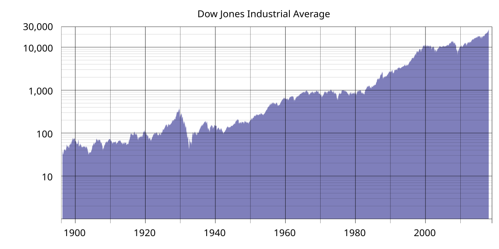

## Table of Contents

## What is the Dow Jones Stock Market Index?

The Dow Jones Stock Market Index, often just called the Dow, is a way to measure how well the stock market is doing. It looks at the stock prices of 30 big companies in the United States. These companies are from different industries like technology, finance, and healthcare. The Dow is one of the oldest and most well-known stock market indexes. It was created by Charles Dow in 1896.

The Dow Jones Index is calculated by adding up the stock prices of the 30 companies and then dividing by a special number called the divisor. This divisor changes over time to account for things like stock splits and dividends. When the Dow goes up, it usually means that the stock market is doing well, and when it goes down, it can mean that the market is not doing as well. People watch the Dow to get a quick idea of how the overall market is performing.

## How is the Dow Jones Industrial Average calculated?

The Dow Jones Industrial Average, or the Dow, is calculated by adding up the stock prices of 30 big companies and then dividing that total by a special number called the divisor. This divisor is not a simple number like 30 because it changes over time to make sure the index stays accurate. For example, if a company does a stock split, the divisor is adjusted so the Dow's value doesn't change just because of the split.

The divisor is important because it helps keep the Dow fair and accurate. When a company's stock price changes, it affects the total value of the Dow. But the divisor makes sure that changes in the stock prices are reflected correctly in the index. The divisor is updated whenever there are changes in the companies included in the Dow or when there are corporate actions like stock splits or dividends. This way, the Dow gives a good snapshot of how these 30 companies, and by extension the broader market, are doing.

## What companies are included in the Dow Jones Index?

The Dow Jones Industrial Average includes 30 big companies from different industries. Some of these companies are Apple, Microsoft, and Amazon from the technology sector. There are also companies like Goldman Sachs and JPMorgan Chase from the finance sector. Other companies in the Dow come from industries like healthcare, with companies like Johnson & Johnson, and consumer goods, with companies like Procter & Gamble.

The list of companies in the Dow changes sometimes. When a company is no longer seen as a good fit for the index, it might be replaced by another company. For example, Walgreens Boots Alliance was added to the Dow in 2018, replacing General Electric. The companies in the Dow are chosen to represent a good mix of the U.S. economy, so the index can give a clear picture of how the market is doing overall.

## How often is the Dow Jones Index updated?

The Dow Jones Index is updated all the time during the trading day. This means that every time one of the 30 companies' stock prices changes, the Dow changes too. The trading day starts at 9:30 AM and ends at 4:00 PM Eastern Time, from Monday to Friday. So, the Dow is always moving during these hours.

At the end of each trading day, the final value of the Dow is recorded. This closing value is what people usually talk about when they say the Dow went up or down. You can check the Dow's value at any time during the day, but the closing value is important because it shows where the market ended up for that day.

## What is the history of the Dow Jones Index?

The Dow Jones Index, also known as the Dow Jones Industrial Average, was created by Charles Dow in 1896. At that time, it started with just 12 companies, mostly from industries like railroads and cotton. The idea was to give people a quick way to see how the stock market was doing by looking at these important companies. Over the years, the Dow grew to include 30 companies from different parts of the economy, making it a better reflection of the overall market.

The Dow has seen many big events and changes in the economy. It went through times like the Great Depression in the 1930s when the market crashed, and more recent events like the 2008 financial crisis. Each time, the Dow showed how the market was affected. The list of companies in the Dow changes too, to keep up with what's important in the economy. For example, technology companies like Apple and Microsoft were added to show how big tech has become. Even though it's been around for over 125 years, the Dow keeps being a key way for people to check the health of the stock market.

## How does the Dow Jones Index influence the stock market?

The Dow Jones Index is like a big sign that shows how the stock market is doing. It looks at the stock prices of 30 big companies in the U.S. When the Dow goes up, it often means that people feel good about the economy and are buying more stocks. When it goes down, it can mean that people are worried and selling their stocks. Because the Dow is so well-known, it can affect how people feel about the market. If the Dow is doing well, more people might want to invest, which can push stock prices up even more.

The Dow doesn't control the stock market, but it can make a big difference in how people act. For example, if the Dow drops a lot in one day, it might make the news, and people might start to worry. This worry can lead to more selling, which can make stock prices go down even more. On the other hand, if the Dow is going up steadily, it can make people feel more confident, and they might buy more stocks. So, while the Dow is just one way to measure the market, it can have a big impact on what people do with their money.

## What are the criteria for a company to be included in the Dow Jones Index?

To be included in the Dow Jones Index, a company needs to be big and important in the U.S. economy. The people who manage the Dow look for companies that are leaders in their industries. They also want the companies to be well-known and stable. The Dow tries to show a good mix of different parts of the economy, so they pick companies from many different areas like technology, finance, and healthcare.

The decision to add or remove a company from the Dow is made by a special committee. They think about how well a company is doing and if it fits well with the other companies in the index. Sometimes, they might take out a company that is not doing as well or if it doesn't represent the economy as well anymore. They might add a new company that is growing fast and becoming more important. This way, the Dow keeps showing a good picture of the U.S. stock market.

## How does the Dow Jones Index compare to other major indices like the S&P 500?

The Dow Jones Index and the S&P 500 are both ways to measure how the stock market is doing, but they look at different groups of companies. The Dow Jones Index, or just the Dow, looks at 30 big companies in the U.S. It's been around since 1896 and is one of the oldest ways to check the market. The S&P 500, on the other hand, looks at 500 companies, which makes it a broader view of the market. It started in 1957 and is seen as a better way to see how the whole U.S. economy is doing because it includes more companies from different industries.

Even though the Dow only looks at 30 companies, it's still very important because it's so well-known. When people talk about the stock market on the news, they often mention the Dow. The S&P 500 is also very important, but it's seen as a more complete picture of the market. The Dow can move a lot because it's based on fewer companies, so a big change in one company's stock price can affect the whole index more. The S&P 500, with more companies, doesn't move as much from one company's changes, making it a smoother measure of the market.

## What are the economic indicators that correlate with movements in the Dow Jones Index?

The Dow Jones Index often moves along with several important economic indicators. One key indicator is the Gross Domestic Product (GDP), which measures the total value of all goods and services produced in the U.S. When GDP is growing, it usually means the economy is doing well, and this can make the Dow go up. Another important indicator is unemployment. When fewer people are out of work, it's a good sign for the economy, and the Dow might go up because people have more money to spend. Interest rates set by the Federal Reserve also matter a lot. If interest rates are low, it's easier for companies to borrow money and grow, which can push the Dow higher.

Other indicators that can affect the Dow include inflation and consumer confidence. Inflation measures how much prices are going up. If inflation is high, it can make people and companies feel less sure about the future, and the Dow might go down. Consumer confidence shows how people feel about their finances and the economy. When people feel good, they spend more, and this can help the Dow go up. All these indicators together give a big picture of the economy, and the Dow often moves in the same direction as these signs.

## How can investors use the Dow Jones Index to make investment decisions?

Investors can use the Dow Jones Index to get a quick idea of how the stock market is doing. Since the Dow looks at 30 big companies, it can show if the market is going up or down. If the Dow is going up, it might mean that it's a good time to invest because the market is doing well. On the other hand, if the Dow is going down, it might be a sign to be careful or wait before buying more stocks. Investors can also look at how the Dow moves over time to see if there are patterns or trends that can help them decide when to buy or sell.

Another way investors use the Dow is to compare it with other parts of their investments. For example, if an investor's stocks are not doing as well as the Dow, it might be time to think about changing their investments. The Dow can also be used to see how certain industries are doing. If the Dow is going up but a specific industry in an investor's portfolio is going down, they might want to move their money to other industries that are doing better. By keeping an eye on the Dow, investors can make smarter choices about where to put their money.

## What are some common misconceptions about the Dow Jones Index?

One common misconception about the Dow Jones Index is that it shows how the whole stock market is doing. While the Dow is important and well-known, it only looks at 30 big companies. This means it doesn't give a full picture of the market like the S&P 500, which looks at 500 companies. So, the Dow can move a lot because it's based on fewer companies, and a big change in one company's stock price can affect the whole index more than it would in a broader index.

Another misconception is that the Dow is a good measure of the economy. While it can give some clues about how the economy is doing, it's not perfect. The Dow can go up even if the economy is not doing so well, and it can go down even if the economy is strong. This is because the Dow is just one part of the economy, and other things like interest rates, inflation, and unemployment also matter a lot. So, it's important to look at many different signs, not just the Dow, to understand the economy better.

## What advanced statistical methods are used to analyze trends in the Dow Jones Index?

Advanced statistical methods help people understand the Dow Jones Index better. One method is called time series analysis. This looks at how the Dow changes over time and tries to find patterns or trends. For example, it can help see if the Dow goes up and down in a certain way every year or if there are other patterns. Another method is regression analysis, which can show how the Dow is affected by things like interest rates, inflation, or other economic indicators. By using regression, people can see how much each of these things matters to the Dow's movements.

Another useful method is called moving averages. This helps smooth out the ups and downs of the Dow to see the bigger picture. For example, a 50-day moving average looks at the average of the last 50 days, which can help investors see if the Dow is trending up or down over time. There's also something called volatility analysis, which looks at how much the Dow moves around. If the Dow is very volatile, it means it's changing a lot, and this can be important for investors to know. These methods help investors and analysts make better guesses about where the Dow might be heading next.

## What is the Understanding of the Dow Jones Industrial Average?

The Dow Jones Industrial Average (DJIA) is one of the most well-known and longstanding stock market indices globally. It was established on May 26, 1896, by Charles Dow and Edward Jones, co-founders of Dow Jones & Company. Initially, the DJIA consisted of 12 industrial companies, reflecting the industrial focus of the United States economy at the time. These companies were prominent players in sectors like railroads, cotton, gas, sugar, tobacco, and oil. The index has since evolved, expanding both in size and scope to better represent the diverse economic landscape of the United States.

The DJIA is considered a primary indicator of the economic health of the United States. As a price-weighted index, the DJIA is calculated by summing the prices of its 30 constituent companies' stocks and dividing by a divisor, which accounts for stock splits and other adjustments. This methodology distinguishes it from other indices like the S&P 500, which are market-capitalization-weighted.

$$
\text{DJIA} = \frac{\sum \text{Price of Component Stocks}}{\text{Divisor}}
$$

The DJIA acts as a barometer of the US economy by reflecting investor sentiment and the business performance of major corporations across a variety of sectors. Although its price-weighted nature is sometimes criticized for giving disproportionate influence to companies with higher stock prices, it remains a widely followed indicator.

Among its components, the DJIA includes major corporations such as Apple Inc., The Boeing Company, and Coca-Cola Company. These companies are leaders in their respective industries, ranging from technology and aviation to consumer products and healthcare. The presence of these giants ensures that the DJIA provides a broad perspective on the economic strength and trends within critical sectors of the economy.

The composition of the DJIA has evolved significantly since its inception, with numerous changes reflecting economic trends and shifts in industrial prominence. Originally dominated by manufacturing and resource extraction companies, the index now includes companies from technology, finance, and healthcare. Updates to the index are generally intended to ensure it remains a relevant and accurate representation of the current US economic landscape.

Recent changes in the DJIA composition include the addition and removal of companies, often indicative of broader economic shifts. For example, in August 2020, Salesforce, Amgen, and Honeywell were added to the index, replacing ExxonMobil, Pfizer, and Raytheon Technologies. These changes highlighted the growing influence of technology and biotechnology while reducing the weight of traditional energy and defense sectors.

Overall, the DJIA continues to serve as a critical snapshot of the market and economic trends in the United States, offering investors valuable insight while simultaneously adapting to the ever-changing economic environment.

## References & Further Reading

[1]: Bergstra, J., Bardenet, R., Bengio, Y., & Kégl, B. (2011). ["Algorithms for Hyper-Parameter Optimization."](https://papers.nips.cc/paper/4443-algorithms-for-hyper-parameter-optimization) Advances in Neural Information Processing Systems 24.

[2]: ["Advances in Financial Machine Learning"](https://www.amazon.com/Advances-Financial-Machine-Learning-Marcos/dp/1119482089) by Marcos Lopez de Prado

[3]: ["Evidence-Based Technical Analysis: Applying the Scientific Method and Statistical Inference to Trading Signals"](https://www.amazon.com/Evidence-Based-Technical-Analysis-Scientific-Statistical/dp/0470008741) by David Aronson

[4]: ["Machine Learning for Algorithmic Trading"](https://github.com/stefan-jansen/machine-learning-for-trading) by Stefan Jansen

[5]: ["Quantitative Trading: How to Build Your Own Algorithmic Trading Business"](https://www.amazon.com/Quantitative-Trading-Build-Algorithmic-Business/dp/1119800064) by Ernest P. Chan