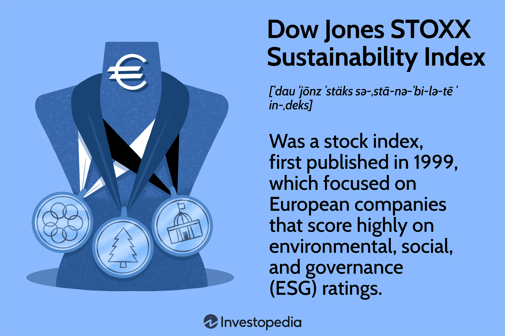

## Table of Contents

## What is the Dow Jones STOXX Sustainability Index?

The Dow Jones STOXX Sustainability Index is a stock market index that focuses on companies that are good at being sustainable. This means they care about the environment, treat their employees well, and are honest in how they do business. The index is made by looking at companies in Europe and choosing the ones that do the best in these areas.

This index helps people who want to invest their money in a way that also helps the world. By investing in the companies in this index, people can support businesses that are trying to make a positive difference. It shows that you can make money and still care about important issues like the environment and fairness.

## When was the Dow Jones STOXX Sustainability Index launched?

The Dow Jones STOXX Sustainability Index was launched in 1999. This was a time when more people started caring about how companies treated the environment and their workers.

The index was created to help people invest in companies that are good at being sustainable. It looks at companies in Europe and picks the ones that do the best in areas like the environment, how they treat their employees, and being honest in their business practices.

## What are the key criteria for inclusion in the Dow Jones STOXX Sustainability Index?

The Dow Jones STOXX Sustainability Index picks companies based on how well they do in three main areas: environment, social, and governance. For the environment, they look at how a company affects things like air, water, and land. They want companies that work to reduce pollution and use resources in a smart way. In the social area, they check how companies treat their workers, if they are fair and safe, and how they help the communities around them. Governance is about how honest and open a company is in its business practices, and how well it is run.

To be included in the index, a company needs to score well in these areas compared to other companies in its industry. The index looks at companies all over Europe and picks the best ones. This means that a company that wants to be in the index needs to show it is doing better than others at being sustainable. It's not just about making money; it's about making the world a better place too.

## How does the Dow Jones STOXX Sustainability Index measure company performance?

The Dow Jones STOXX Sustainability Index measures company performance by looking at how well they do in three areas: environment, social, and governance. For the environment, the index checks if a company is doing things to help the planet, like reducing pollution and using resources wisely. In the social area, it looks at how companies treat their workers, if they keep them safe, and how they help the community around them. Governance is about how honest and open a company is, and how well it is run.

To be included in the index, a company needs to score better than others in its industry in these three areas. The index compares companies all over Europe and picks the ones that are doing the best at being sustainable. This means that a company has to show it's doing more than just making money; it needs to be helping the world too.

## What are the main differences between the Dow Jones STOXX Sustainability Index and its successors?

The Dow Jones STOXX Sustainability Index, launched in 1999, was one of the first indexes to focus on sustainability. It looks at companies in Europe and picks the ones that do well in three areas: environment, social, and governance. It helps people invest in companies that care about the planet and treat people well. Over time, newer indexes like the EURO STOXX 50 [ESG](/wiki/esg-investing) Index and the STOXX Global ESG Leaders Index have been created. These newer indexes build on what the original index did but have some differences.

The main differences between the Dow Jones STOXX Sustainability Index and its successors are in the way they pick companies and the areas they focus on. The newer indexes might use different methods to measure sustainability, like looking at more specific details or using different data. They also might cover a wider range of companies, not just in Europe but around the world. This means they can give investors more choices and a broader view of sustainable investing. Both types of indexes aim to help people invest in a way that is good for the world, but the successors try to improve on the original ideas.

## Can you name the successors of the Dow Jones STOXX Sustainability Index?

The Dow Jones STOXX Sustainability Index, started in 1999, was one of the first indexes to focus on how companies care about the environment, how they treat people, and how they run their business. It helped people invest in companies that try to make the world better. Over time, new indexes were created to build on this idea.

Two of the main successors are the EURO STOXX 50 ESG Index and the STOXX Global ESG Leaders Index. The EURO STOXX 50 ESG Index looks at the top companies in Europe that do well in areas like the environment, social responsibility, and good governance. The STOXX Global ESG Leaders Index goes even further by including companies from all over the world, not just Europe. Both of these new indexes try to improve on the original by using different ways to measure how sustainable a company is and by looking at a wider range of companies.

## How have the methodologies of the successors evolved from the original index?

The original Dow Jones STOXX Sustainability Index, launched in 1999, was a pioneer in focusing on how companies perform in environmental, social, and governance areas. It helped people invest in companies that care about the world by looking at companies in Europe and [picking](/wiki/asset-class-picking) the ones that do well in these areas. The index used a broad approach to measure sustainability, looking at general performance in each of the three categories.

The successors, like the EURO STOXX 50 ESG Index and the STOXX Global ESG Leaders Index, have evolved by using more detailed and specific criteria to measure sustainability. They look at more specific data points within the environmental, social, and governance categories, which helps them give a clearer picture of a company's sustainability efforts. For example, they might consider things like a company's carbon emissions, how they handle waste, or their policies on human rights.

Another key evolution is that these newer indexes cover a broader range of companies. While the original index focused only on Europe, the EURO STOXX 50 ESG Index still looks at European companies but with a more refined approach, and the STOXX Global ESG Leaders Index goes global, including companies from all over the world. This gives investors more options and a wider view of sustainable investing, helping them support companies that are making positive changes on a larger scale.

## What impact has the Dow Jones STOXX Sustainability Index had on corporate sustainability practices?

The Dow Jones STOXX Sustainability Index has had a big impact on how companies think about being sustainable. When it started in 1999, it was one of the first indexes to focus on how companies treat the environment, their workers, and how they run their business. This made companies pay more attention to these areas because being included in the index could attract investors who care about sustainability. Companies started to see that being good to the planet and people wasn't just the right thing to do, but it could also help their business grow.

Over time, more companies began to change their ways to meet the index's standards. They started to use less energy, reduce waste, and treat their workers better. This helped create a culture where companies compete to be more sustainable, not just to make more money. The index showed that you can do well in business while also doing good for the world. It encouraged other indexes to follow suit, leading to more options for investors who want to support sustainable companies.

## How do investors use the Dow Jones STOXX Sustainability Index and its successors in their investment strategies?

Investors use the Dow Jones STOXX Sustainability Index and its successors to find companies that are good at being sustainable. They look at the companies in the index to see which ones care about the environment, treat their workers well, and run their business honestly. By investing in these companies, people can support businesses that are trying to make the world a better place. This type of investing is called sustainable or ESG (environmental, social, and governance) investing. It's popular among people who want their money to help the planet and society, not just make more money.

The successors of the Dow Jones STOXX Sustainability Index, like the EURO STOXX 50 ESG Index and the STOXX Global ESG Leaders Index, give investors even more options. These newer indexes look at more specific details about how companies are sustainable and include companies from around the world, not just Europe. This helps investors find the best sustainable companies no matter where they are. By using these indexes, investors can build a portfolio that matches their values and supports companies that are working to make a positive difference.

## What are the criticisms or limitations of the Dow Jones STOXX Sustainability Index and its successors?

The Dow Jones STOXX Sustainability Index and its successors have some criticisms and limitations. One big issue is that they might not always pick the best companies for being sustainable. They use certain rules to decide which companies to include, but these rules can miss important things. For example, a company might score well in one area like the environment but not do so well in how it treats its workers. Also, the data they use can sometimes be old or not very detailed, which means the index might not show the whole picture of how sustainable a company really is.

Another limitation is that these indexes can be hard to understand for regular people. They use a lot of complicated terms and numbers, which can make it tough for someone who isn't an expert to know if they're making a good investment. Plus, some people think that focusing too much on sustainability scores might make investors miss out on other important things, like how well a company is doing overall. This can be a problem because a company that's great at being sustainable might not always be the best investment if it's not making money or growing.

## How do the performance metrics of the successors compare to the original Dow Jones STOXX Sustainability Index?

The successors of the Dow Jones STOXX Sustainability Index, like the EURO STOXX 50 ESG Index and the STOXX Global ESG Leaders Index, have improved on the original index's performance metrics by using more detailed and specific data. While the original index looked at broad categories like environment, social, and governance, the successors dive deeper into these areas. They use more specific data points, such as a company's carbon emissions, waste management, and human rights policies, to give a clearer picture of a company's sustainability efforts. This detailed approach helps investors see which companies are truly leading in sustainability.

The EURO STOXX 50 ESG Index focuses on the top companies in Europe, similar to the original index, but with a more refined selection process. It often performs well because it picks companies that are strong in both sustainability and financial performance. On the other hand, the STOXX Global ESG Leaders Index includes companies from all over the world, which can lead to a more diverse and potentially higher-performing portfolio. Both successors tend to offer better insights and possibly better returns for investors who care about sustainability, compared to the original index, which had a narrower focus on European companies.

## What future developments are expected for the indices following the Dow Jones STOXX Sustainability Index?

The future of the indices following the Dow Jones STOXX Sustainability Index looks promising as they continue to evolve to meet the growing demand for sustainable investing. One expected development is the use of even more detailed and real-time data to assess companies' sustainability efforts. This could mean looking at things like a company's real-time carbon emissions, water usage, and social impact. By using more up-to-date information, these indices can give investors a clearer and more accurate picture of which companies are truly leading in sustainability. This would help investors make better choices about where to put their money.

Another future development might be the inclusion of more sectors and regions in the indices. Right now, the STOXX Global ESG Leaders Index already looks at companies worldwide, but there's room to grow. In the future, these indices could cover even more types of businesses and countries, giving investors a wider range of sustainable options. As more people care about how their investments affect the world, these indices will keep getting better at helping people find the best companies to support. This could lead to a bigger and more diverse group of companies working to make the world a better place.

## References & Further Reading

[1]: Chaboud, A. P., Chiquoine, B., Hjalmarsson, E., & Vega, C. (2014). ["Rise of the Machines: Algorithmic Trading in the Foreign Exchange Market."](https://www.jstor.org/stable/43612951) The Journal of Finance.

[2]: Eccles, R. G., Ioannou, I., & Serafeim, G. (2014). ["The Impact of Corporate Sustainability on Organizational Processes and Performance."](https://www.jstor.org/stable/24550546) Management Science.

[3]: López de Prado, M. (2018). ["Advances in Financial Machine Learning."](https://www.amazon.com/Advances-Financial-Machine-Learning-Marcos/dp/1119482089) Wiley.

[4]: Matallín-Sáez, J. C., Soler-Domínguez, A., & Tortosa-Ausina, E. (2016). ["Does Sustainability Assurance Influence the Relationship Between ESG Performance and Financial Performance?"](https://onlinelibrary.wiley.com/doi/10.1111/beer.12196) Sustainable Development.

[5]: Brogaard, J., Hendershott, T., & Riordan, R. (2014). ["High-Frequency Trading and Price Discovery."](https://academic.oup.com/rfs/article-abstract/27/8/2267/1582754) The Review of Financial Studies.