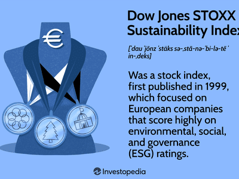

Sustainability has increasingly become a focal point within investment strategies, driven by growing awareness of environmental, social, and governance (ESG) issues among investors. This paradigm shift underscores the importance of incorporating sustainable practices into investment decisions, prompting the development of specialized indices like the Dow Jones Sustainability World Index (DJSI World). Launched in 1999, the DJSI World serves as a benchmark for evaluating the sustainability performance of leading global companies. It reflects a growing commitment to integrating ESG factors into financial markets, aligning investment portfolios with long-term sustainability goals.

Alongside this shift towards sustainable investing, algorithmic trading (algo trading) has emerged as a vital component of modern financial markets. Algo trading involves the use of complex algorithms and technology to execute trades at high speed and efficiency, making it a preferred strategy for many traders and institutions. This method of trading allows market participants to respond rapidly to market events and execute large volumes of trades with minimal human intervention. The fusion of technology and finance through algorithmic trading has fundamentally transformed how investments are conducted, offering both opportunities and challenges.



This article examines the intricate methodology of the Dow Jones Sustainability World Index and its implications for algorithmic trading strategies. As sustainability indices continue to grow in prominence, understanding their framework becomes crucial for developing effective trading strategies that balance financial returns with ESG considerations. The convergence of sustainable investing and algorithmic trading represents a significant evolution in financial markets, necessitating a deeper understanding of both domains to capitalize on emerging trends.

## Table of Contents

## Understanding the Dow Jones Sustainability World Index (DJSI World)

The Dow Jones Sustainability World Index (DJSI World) was established in 1999 to provide a comprehensive assessment and continuous monitoring of the sustainability performance of major companies worldwide. This index specifically seeks to identify and include the top 10% of the largest 2,500 companies within the S&P Global Broad Market Index that excel based on sustainability criteria. The focus primarily lies in the realms of environmental, social, and governance (ESG) factors, crucial components in modern sustainable investing.

S&P Dow Jones Indices, in collaboration with RobecoSAM, is responsible for maintaining the DJSI World. This partnership is pivotal as it marries financial market insights with specialized expertise in sustainability, ensuring that the index remains robust and reflective of current ESG practices. RobecoSAM, now part of S&P Global since 2019, contributes its extensive experience and methodology in sustainable investment, applying rigorous evaluation metrics to review companies annually.

The index's selection process involves a detailed corporate sustainability assessment, which serves to measure the companies' ESG performance. This assessment goes beyond mere compliance; it encourages corporations to integrate sustainable practices into their core business strategies. The selection also considers industry-specific criteria, acknowledging that sustainability challenges and best practices can vary significantly across different sectors.

By including only the companies that meet high sustainability standards, the DJSI World not only incentivizes corporations to adopt responsible business practices but also provides investors with a reliable benchmark for sustainable investment decisions. The index's emphasis on high [ESG](/wiki/esg-investing) performers reflects a growing recognition in global markets that long-term financial performance is closely linked to sustainable business practices.

## Methodology of the DJSI World

The Dow Jones Sustainability World Index (DJSI World) employs a distinctive methodology, emphasizing a market-cap weighted approach based on free-float calculations. This methodology ensures the index reflects each company's actual market impact, accounting for the number of shares available for trading. 

The annual assessment process involves companies being evaluated on their sustainability criteria. These criteria are firmly grounded in environmental, social, and governance (ESG) dimensions. Assessments are conducted rigorously and scores are updated every September, allowing the index to remain relevant with evolving corporate strategies and market conditions. This annual thoroughness ensures the index remains aligned with the latest sustainable practices and approaches of major corporations.

The DJSI World’s evaluation framework includes an exhaustive analysis of economic, environmental, and social metrics. Within each category, specific criteria tailored to different industries are employed, allowing for precise benchmarking across diverse sectors. Economic metrics may include indicators such as corporate governance structure, codes of conduct, and risk management protocols. Environmental indicators might encompass a company's approach to climate change, resource conservation, and emission management. Social criteria typically consider labor practices, human rights, and community engagement.

Moreover, the assessment incorporates media reviews to monitor controversies and corporate behavior that may not be fully captured in the formal disclosures. Such reviews provide additional context to ESG evaluations, ensuring that companies are held to account for both their internal policies and their broader societal impact.

The refinement of these metrics, combined with a comprehensive data-driven approach, provides investors with a clear view of companies that are leading in sustainability efforts. This enables stakeholders to make informed decisions, aligned with both financial objectives and ethical considerations.

## Impact of the DJSI World on Investment Strategies

The Dow Jones Sustainability World Index (DJSI World) is increasingly being utilized by investors to construct socially responsible investment portfolios. This trend is largely driven by the growing awareness of sustainability in long-term investment planning. Private wealth managers, in particular, rely on the index as a benchmark to align portfolios with prevailing global sustainability trends, thereby ensuring that investments are not only financially robust but also socially and environmentally conscious.

The DJSI World's combination of transparency and methodological rigor makes it an attractive tool for investors who prioritize both investment returns and sustainability. The index employs comprehensive evaluation criteria, integrating evaluations across environmental, social, and governance (ESG) dimensions. This rigorous methodology ensures that only companies demonstrating high standards in these areas are included, thereby facilitating responsible investment decisions.

For institutional investors, the DJSI World serves as a guide for benchmarking and performance measurement. Its emphasis on best-in-class companies within different industries ensures that investors can compare the sustainability performance of different assets effectively. By maintaining high standards for inclusion, the index supports investors in avoiding companies that may present unseen long-term financial risks associated with poor ESG practices.

Moreover, the transparency of the DJSI World is fundamental to its appeal. Investors can scrutinize the methodology and criteria used, leading to increased confidence in the index's composition. This openness enables investors to understand how their investments align with sustainability goals, meeting the demands of those who seek both financial returns and societal impact.

The strategic use of sustainability indices like the DJSI World can result in enhanced long-term value creation. As markets and regulations shift towards emphasizing sustainable practices, investment strategies that incorporate ESG factors are expected to outperform those that do not. This aligns with the increasing body of evidence suggesting that well-governed companies with sustainable practices tend to offer better risk-adjusted returns.

In summary, the DJSI World is a pivotal tool for constructing investment strategies that are socially responsible and sustainable. By offering a reliable benchmark and maintaining high standards for inclusion, it enables investors to align their financial goals with global sustainability objectives, thereby fostering a portfolio that is both resilient and ethically sound.

## Integrating Algo Trading with Sustainability Indices

Algorithmic trading (algo trading) has become increasingly relevant for managing investments based on sustainability indices like the Dow Jones Sustainability World Index (DJSI World). An algo trading system, when integrated with such indices, can efficiently respond to real-time market changes and incorporate environmental, social, and governance (ESG) criteria in investment decisions.

These sophisticated algorithms utilize a combination of sustainability scores and traditional market data to enhance portfolio performance. By continuously analyzing incoming data, these systems can make informed trading decisions that align with the sustainability objectives embedded in indices like the DJSI World. The mathematical models often employ real-time data processing techniques to facilitate timely responses to changes in market dynamics and ESG news.

For example, an algorithm could be coded in Python to adjust portfolio holdings based on ESG scores provided by the DJSI World. Here is a basic outline of such a Python program:

```python
import pandas as pd

# Example data frames containing ESG scores and market prices
esg_scores_df = pd.DataFrame({'Company': ['A', 'B', 'C'], 'ESG_Score': [82, 75, 90]})
market_prices_df = pd.DataFrame({'Company': ['A', 'B', 'C'], 'Price': [100, 150, 200]})

# Function to adjust holdings based on ESG score
def adjust_portfolio(esg_df, market_df, threshold=80):
    selected_companies = esg_df[esg_df['ESG_Score'] >= threshold]
    holdings = market_df[market_df['Company'].isin(selected_companies['Company'])]
    return holdings.set_index('Company')

# Example of adjusting portfolio holdings
optimized_holdings = adjust_portfolio(esg_scores_df, market_prices_df)
print(optimized_holdings)
```

While designing such algorithms, traders should consider the dynamic nature of sustainability indices. They must build systems capable of adapting as companies are added or removed from the DJSI World, or as their ESG scores fluctuate. This adaptability can be built into the algorithm by integrating predictive analytics and [machine learning](/wiki/machine-learning) techniques which can forecast potential index changes based on historic ESG data and market trends.

Challenges such as ensuring the accuracy and timeliness of ESG data, as well as balancing sustainability goals with financial returns, are crucial considerations in integrating algo trading with sustainability indices. As algo trading evolves, tackling these challenges and leveraging the opportunities presented by indexes like the DJSI World will be key to achieving a forward-looking, adaptive investment strategy.

## Challenges and Considerations

Maintaining a balance between sustainability and financial returns when integrating [algorithmic trading](/wiki/algorithmic-trading) with indices like the Dow Jones Sustainability World Index (DJSI World) presents several challenges and considerations. One primary challenge lies in the inherent trade-offs between prioritizing sustainability and achieving optimal financial performance. Investors and algorithm developers often grapple with incorporating robust Environmental, Social, and Governance (ESG) criteria without sacrificing returns. This requires sophisticated modeling to accurately [factor](/wiki/factor-investing) in both ESG performance and traditional financial metrics.

Access to timely and precise ESG data is critical. Algorithmic trading strategies depend heavily on real-time data to execute trades that capitalize on market opportunities or minimize risks. However, ESG data can often be less standardized and slower to update than traditional financial datasets, possibly leading to suboptimal trading decisions. Developers must prioritize data accuracy and ensure integration with high-quality ESG databases. This could involve partnerships with data providers or in-house development of data collection and validation processes.

Moreover, the dynamic nature of the DJSI World, which undergoes annual assessments, poses an additional layer of complexity. Companies may be added to or removed from the index based on their updated sustainability evaluations. Algorithmic strategies must, therefore, be adaptive enough to respond to these changes promptly. This necessitates the use of flexible algorithms capable of recalibrating their holdings in response to constituent changes in the index, ensuring alignment with the latest sustainability credentials.

Developers might incorporate elements like machine learning to forecast potential changes in ESG scores. For instance, models could predict sustainability score movements using historical data and news sentiment analysis. Here is a simple Python pseudocode illustrating how one might begin to model such predictions:

```python
import pandas as pd
from sklearn.model_selection import train_test_split
from sklearn.ensemble import RandomForestRegressor

# Sample ESG data loading
esg_data = pd.read_csv('esg_scores.csv')

# Feature selection and splitting data
features = esg_data[['financial_metric1', 'financial_metric2', 'sentiment_score']]
target = esg_data['esg_score']

# Train-test split
X_train, X_test, y_train, y_test = train_test_split(features, target, test_size=0.3, random_state=42)

# Model training
model = RandomForestRegressor(n_estimators=100, random_state=42)
model.fit(X_train, y_train)

# ESG score prediction
predicted_scores = model.predict(X_test)
```

Overall, the complexity of balancing sustainability with financial returns in algorithmic trading lies in the need for continuous evaluation and responsiveness to evolving ESG landscapes. Algorithm developers must be prepared to navigate these challenges by leveraging real-time data analytics, adaptive algorithms, and predictive modeling techniques to ensure robust and sustainable trading strategies.

## Conclusion

The Dow Jones Sustainability World Index (DJSI World) provides investors with a robust framework for incorporating sustainability into their investment strategies. By focusing on environmental, social, and governance (ESG) criteria, the DJSI World encourages a holistic approach to evaluating corporate performance, beyond traditional financial metrics. This index not only highlights leading companies committed to sustainable practices but also serves as a benchmark for socially responsible investment portfolios. 

As algorithmic trading, known for its precision and speed, becomes increasingly prevalent, the integration of ESG considerations presents unique opportunities along with certain challenges. Algorithms capable of processing large datasets can effectively evaluate ESG scores and market trends, optimizing portfolio decisions in alignment with sustainable investment goals. However, these systems must be equipped to handle the dynamic nature of sustainability indices, where regular updates and the potential exclusion of companies demand a level of adaptability and ongoing assessment.

The successful integration of the DJSI World into trading strategies hinges on a comprehensive understanding of its methodology and the implications of sustainability indices. As the emphasis on sustainable investing continues to grow, embracing these indices can position investors for a future where financial returns are balanced with ethical responsibility.

## References & Further Reading

[1]: ["The Dow Jones Sustainability Indices: Annual Review 2021"](https://press.spglobal.com/2021-11-12-S-P-Dow-Jones-Indices-Announces-Dow-Jones-Sustainability-Indices-2021-Review-Results) by S&P Global

[2]: Eccles, R. G., Ioannou, I., & Serafeim, G. (2014). ["The Impact of Corporate Sustainability on Organizational Processes and Performance."](https://papers.ssrn.com/sol3/papers.cfm?abstract_id=1964011) Management Science, 60(11), 2835-2857.

[3]: Larcker, D. F., & Watts, E. (2020). ["Where’s the Greenium?"](https://www.sciencedirect.com/science/article/pii/S0165410120300148) Rock Center for Corporate Governance at Stanford University Working Paper No. 240

[4]: Lee, L., Faff, R., & Langfield-Smith, K. (2009). ["Revisiting the Vexing Question: Does Superior Corporate Social Performance Lead to Improved Financial Performance?"](https://journals.sagepub.com/doi/10.1177/031289620903400103) Australian Journal of Management, 34(1), 21-49.

[5]: ["Handbook on Sustainable Investments: Background Information and Practical Examples for Institutional Asset Owners"](https://www.amazon.com/Handbook-Sustainable-Investments-Information-Institutional-ebook/dp/B078XKYT4B) by Swiss Sustainable Finance

[6]: Rifkin, J. (2019). ["The Green New Deal: Why the Fossil Fuel Civilization Will Collapse by 2028, and the Bold Economic Plan to Save Life on Earth."](https://www.amazon.com/Green-New-Deal-Civilization-Collapse/dp/1250253209) St. Martin's Press

[7]: Whelan, T., & Fink, C. (2016). ["The Comprehensive Business Case for Sustainability."](https://hbr.org/2016/10/the-comprehensive-business-case-for-sustainability) Harvard Business Review.