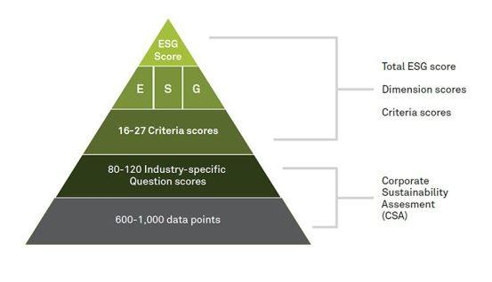

## Table of Contents

## What is the Dow Jones Sustainability World Index?

The Dow Jones Sustainability World Index is a stock market index that focuses on companies that are leaders in sustainability. It includes companies from around the world that are doing well in areas like environmental protection, social responsibility, and good governance. The index is created by S&P Dow Jones Indices and RobecoSAM, a company that researches how sustainable companies are.

This index helps investors find companies that are not only good at making money but also good at taking care of the planet and its people. By investing in the companies listed in the index, people can support businesses that are trying to make the world a better place. The index is updated every year to make sure it includes the most sustainable companies.

## Who manages the Dow Jones Sustainability World Index?

The Dow Jones Sustainability World Index is managed by two companies: S&P Dow Jones Indices and RobecoSAM. S&P Dow Jones Indices is a big company that makes lots of different stock market indexes. They help people track how the stock market is doing. RobecoSAM is a company that focuses on how sustainable companies are. They look at how companies treat the environment, their workers, and how they run their business.

Together, S&P Dow Jones Indices and RobecoSAM work to pick the best companies for the Dow Jones Sustainability World Index. They check these companies every year to make sure they are still doing well in sustainability. This helps investors find companies that are good for the planet and good at making money.

## What are the main objectives of the Dow Jones Sustainability World Index?

The main goal of the Dow Jones Sustainability World Index is to help people invest in companies that are good for the world. It looks at companies from all over the world and picks the ones that are doing the best in terms of taking care of the environment, treating their workers well, and running their business in a fair way. This helps investors find companies that are not just making money but also trying to make the world a better place.

Another important objective is to encourage companies to be more sustainable. By showing which companies are doing well in sustainability, the index can push other companies to improve. It also gives investors a way to support these good companies with their money, which can help make the whole economy more sustainable. The index is updated every year to make sure it always includes the best companies in sustainability.

## How is a company selected for inclusion in the Dow Jones Sustainability World Index?

A company is selected for the Dow Jones Sustainability World Index by looking at how well it does in three main areas: taking care of the environment, treating people well, and running its business fairly. RobecoSAM, the company that helps manage the index, sends out a questionnaire to companies all over the world. This questionnaire asks detailed questions about what the company does to be sustainable. Companies that want to be in the index fill out this questionnaire and send it back to RobecoSAM.

After getting the questionnaires back, RobecoSAM looks at the answers and gives each company a score. They compare the scores of companies in the same industry to see which ones are doing the best. Only the top companies in each industry make it into the index. This way, the index always includes the best companies in sustainability from around the world. The selection process happens every year, so companies need to keep doing well to stay in the index.

## What are the key criteria used to assess companies for the Dow Jones Sustainability World Index?

The key criteria for assessing companies for the Dow Jones Sustainability World Index focus on three main areas: how they treat the environment, how they treat their people, and how they run their business fairly. For the environment, companies are looked at for things like how much they pollute, how they use resources like water and energy, and what they do to help the planet. For treating people well, the index checks how companies treat their workers, if they are safe at work, and if the company helps the community around them. 

For running the business fairly, the index looks at how the company is managed, if they are honest in their business dealings, and if they follow the rules. RobecoSAM sends out a questionnaire to companies all over the world, asking detailed questions about these areas. Companies that want to be in the index fill out this questionnaire and send it back. RobecoSAM then scores the companies based on their answers and compares them to others in the same industry. Only the top companies in each industry make it into the index.

## How does the methodology of the Dow Jones Sustainability World Index differ from other sustainability indices?

The Dow Jones Sustainability World Index has a special way of [picking](/wiki/asset-class-picking) companies that is different from other sustainability indices. It looks at companies from all over the world and focuses on three main areas: how they treat the environment, how they treat their people, and how they run their business fairly. Every year, a company called RobecoSAM sends out a detailed questionnaire to companies. They ask about things like pollution, worker safety, and how the company is managed. Only the top companies in each industry make it into the index, which makes sure the index always includes the best of the best in sustainability.

Other sustainability indices might use different methods. For example, some might focus more on just the environment or just on social issues. Some indices might not compare companies to others in their industry, but instead, they might set a general standard that any company can meet. The Dow Jones Sustainability World Index is unique because it looks at a wide range of sustainability issues and uses a detailed questionnaire to get a lot of information from companies. This thorough approach helps make sure that the companies in the index are truly leaders in sustainability.

## What role does the Corporate Sustainability Assessment (CSA) play in the methodology?

The Corporate Sustainability Assessment (CSA) is a big part of how the Dow Jones Sustainability World Index picks companies. It's a detailed questionnaire that RobecoSAM sends to companies all over the world. The questionnaire asks about things like how the company treats the environment, how it takes care of its workers, and if it runs its business in a fair way. Companies that want to be in the index have to fill out this questionnaire and send it back. This helps RobecoSAM understand how sustainable each company really is.

After getting the questionnaires back, RobecoSAM looks at the answers and gives each company a score. They then compare these scores to other companies in the same industry to see who is doing the best. Only the top companies in each industry make it into the Dow Jones Sustainability World Index. This way, the index always includes the best companies in sustainability. The CSA is important because it helps make sure the index is full of companies that are truly trying to make the world a better place.

## How are the weights assigned to different sustainability criteria in the index?

The weights assigned to different sustainability criteria in the Dow Jones Sustainability World Index are decided based on how important each criterion is for a company's overall sustainability. RobecoSAM, the company that helps manage the index, looks at three main areas: how the company treats the environment, how it treats its people, and how it runs its business fairly. Each of these areas is broken down into smaller parts, like pollution, worker safety, and management honesty. The weights are set so that the most important parts for each industry get more attention. This means that some criteria might be more important for one industry than another.

For example, in an industry where water use is a big issue, the weight for water management might be higher. RobecoSAM uses a detailed questionnaire to gather information from companies and then scores them on each criterion. The scores are then combined using the weights to get a total sustainability score for each company. This way, the index can show which companies are doing the best job in sustainability, based on what matters most for their industry.

## What are the recent changes or updates to the methodology of the Dow Jones Sustainability World Index?

The Dow Jones Sustainability World Index has made some changes to its methodology to keep up with the latest ideas about sustainability. One big change is that they now put more focus on climate change. They look at how companies are doing in terms of cutting down their greenhouse gas emissions and moving to cleaner energy. They also pay more attention to how companies are dealing with risks from climate change. This means that companies that are doing a good job in these areas might get a higher score.

Another change is that the index now looks at how companies are handling social issues like human rights and diversity. They ask companies more questions about these topics in their questionnaire. This helps make sure that the companies in the index are not just good for the environment but also good for people. These changes help the index stay up to date and keep picking the best companies in sustainability from around the world.

## How does the Dow Jones Sustainability World Index handle sector-specific sustainability issues?

The Dow Jones Sustainability World Index takes care of different sustainability issues in each industry by looking at what is most important for that industry. For example, if an industry uses a lot of water, the index will pay more attention to how companies in that industry manage their water use. They do this by asking detailed questions in their yearly questionnaire and giving more weight to the answers about water management. This way, the index can tell which companies are doing the best job in their own industry, even if what matters most changes from one industry to another.

The index also updates its focus every year to keep up with new ideas about what is important for sustainability. For instance, if climate change becomes a bigger issue, the index might ask more questions about how companies are reducing their greenhouse gas emissions. They might also look at how companies are planning for climate risks. By doing this, the Dow Jones Sustainability World Index makes sure it is always picking the best companies in sustainability, no matter what industry they are in or what the latest sustainability issues are.

## Can you explain the process of data collection and verification used in the index's methodology?

The Dow Jones Sustainability World Index collects data by sending out a detailed questionnaire to companies all over the world. This questionnaire asks about how the company treats the environment, how it takes care of its workers, and if it runs its business in a fair way. Companies that want to be in the index fill out this questionnaire and send it back to RobecoSAM, the company that helps manage the index. RobecoSAM then looks at the answers and gives each company a score. They compare these scores to other companies in the same industry to see who is doing the best.

To make sure the data is correct, RobecoSAM does not just take the companies' word for it. They also check the information against other sources like public reports, news articles, and data from other organizations. This helps make sure that the companies are telling the truth about their sustainability efforts. If RobecoSAM finds any problems with the data, they might ask the company for more information or even change the company's score. This careful checking helps keep the index full of companies that are truly leaders in sustainability.

## What are the challenges and criticisms faced by the methodology of the Dow Jones Sustainability World Index?

The Dow Jones Sustainability World Index faces some challenges and criticisms. One big challenge is keeping the data accurate. Even though RobecoSAM checks the information companies give them, it can be hard to make sure everything is true. Companies might want to look better than they really are, so they might not tell the whole truth about their sustainability efforts. Another challenge is that the index has to keep up with new ideas about what sustainability means. As people learn more about the environment and social issues, what is important can change, and the index has to change with it.

There are also some criticisms of the methodology. Some people think the index might not be tough enough on companies. They worry that companies can get into the index without doing as much as they should for the environment or their workers. Others say the index focuses too much on big companies and might not give smaller companies a fair chance. Also, some critics think the index should ask more about certain issues, like how companies treat their workers or their impact on local communities. These criticisms show that while the index tries to pick the best companies in sustainability, there is always room for improvement.

## References & Further Reading

[1]: ["The Dow Jones Sustainability Indices: Annual Review 2021"](https://press.spglobal.com/2021-11-12-S-P-Dow-Jones-Indices-Announces-Dow-Jones-Sustainability-Indices-2021-Review-Results) by S&P Global

[2]: Eccles, R. G., Ioannou, I., & Serafeim, G. (2014). ["The Impact of Corporate Sustainability on Organizational Processes and Performance."](https://papers.ssrn.com/sol3/papers.cfm?abstract_id=1964011) Management Science, 60(11), 2835-2857.

[3]: Larcker, D. F., & Watts, E. (2020). ["Where’s the Greenium?"](https://www.sciencedirect.com/science/article/pii/S0165410120300148) Rock Center for Corporate Governance at Stanford University Working Paper No. 240

[4]: Lee, L., Faff, R., & Langfield-Smith, K. (2009). ["Revisiting the Vexing Question: Does Superior Corporate Social Performance Lead to Improved Financial Performance?"](https://journals.sagepub.com/doi/10.1177/031289620903400103) Australian Journal of Management, 34(1), 21-49.

[5]: ["Handbook on Sustainable Investments: Background Information and Practical Examples for Institutional Asset Owners"](https://www.amazon.com/Handbook-Sustainable-Investments-Information-Institutional-ebook/dp/B078XKYT4B) by Swiss Sustainable Finance

[6]: Rifkin, J. (2019). ["The Green New Deal: Why the Fossil Fuel Civilization Will Collapse by 2028, and the Bold Economic Plan to Save Life on Earth."](https://www.amazon.com/Green-New-Deal-Civilization-Collapse/dp/1250253209) St. Martin's Press

[7]: Whelan, T., & Fink, C. (2016). ["The Comprehensive Business Case for Sustainability."](https://hbr.org/2016/10/the-comprehensive-business-case-for-sustainability) Harvard Business Review.