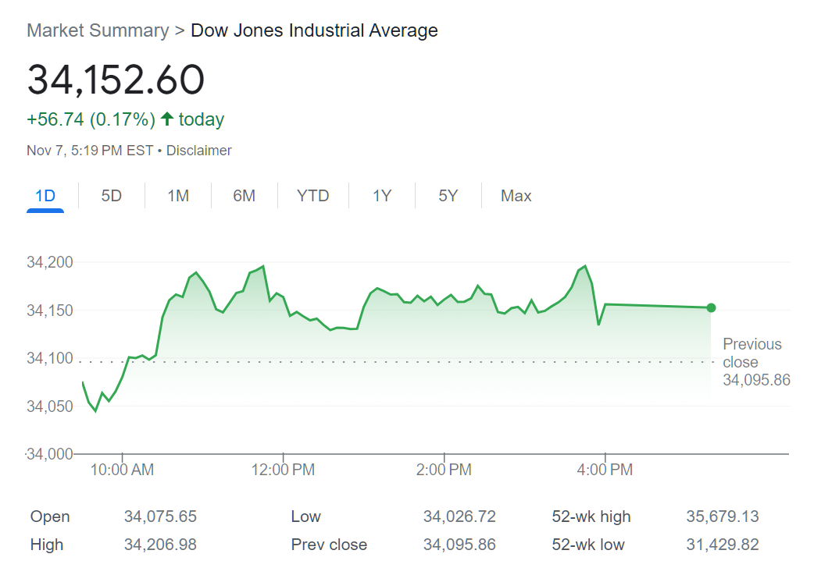

## Table of Contents

## What is the Dow Jones U.S. Total Market Index?

The Dow Jones U.S. Total Market Index is a stock market index that measures the performance of almost all the stocks traded in the United States. It includes big companies, small companies, and everything in between, making it a broad and comprehensive measure of the U.S. stock market. This index is often used by investors to get a general idea of how the entire market is doing.

The index is made up of thousands of stocks, covering different industries and sectors. This wide range helps to give a complete picture of the market's health. Investors and financial analysts use this index to compare the performance of their own investments against the overall market. It's a useful tool for understanding trends and making informed investment decisions.

## How is the Dow Jones U.S. Total Market Index different from other market indices?

The Dow Jones U.S. Total Market Index is different from other market indices because it tries to include almost every stock in the U.S., not just the big ones. Some other indices, like the Dow Jones Industrial Average, only include a small number of large companies. The Total Market Index covers a much wider range of companies, from tiny startups to huge corporations. This makes it a good way to see how the whole market is doing, not just a part of it.

Another difference is that the Dow Jones U.S. Total Market Index is weighted by the market value of each company, which means bigger companies have a bigger impact on the index. Other indices might use different methods, like equal weighting where each company has the same impact, or price weighting where the stock price decides the impact. This difference in how the index is calculated can lead to different results and insights about the market's performance.

## What types of companies are included in the Dow Jones U.S. Total Market Index?

The Dow Jones U.S. Total Market Index includes a wide variety of companies from all over the United States. This means it has companies of all sizes, from small startups to big corporations. It doesn't matter if the company is new or old, as long as it is traded on a U.S. stock exchange, it can be part of this index.

The index also covers companies from different industries. This includes technology companies, banks, factories, stores, and many others. By including so many different types of companies, the index gives a good overall picture of how the entire U.S. stock market is doing.

## How is the performance of the Dow Jones U.S. Total Market Index calculated?

The performance of the Dow Jones U.S. Total Market Index is calculated by looking at the market value of all the companies in the index. This means they add up the value of all the stocks in the index. The index is weighted, which means bigger companies have a bigger impact on the total value. If a big company's stock price goes up or down a lot, it will change the index more than if a small company's stock price changes.

To figure out how much the index has changed over time, they compare the total value now to the total value in the past. If the total value is higher now, the index has gone up. If it's lower, the index has gone down. This way, the index shows how well the whole U.S. stock market is doing, based on all the companies included in it.

## What are the historical performance trends of the Dow Jones U.S. Total Market Index?

The Dow Jones U.S. Total Market Index has shown a general upward trend over the long term, reflecting the overall growth of the U.S. economy and the stock market. Since its inception, the index has experienced periods of significant growth, often driven by strong economic conditions, technological advancements, and favorable government policies. For example, during the tech boom of the late 1990s and the recovery following the 2008 financial crisis, the index saw substantial gains. However, it's important to note that these periods of growth are interspersed with downturns, such as during the dot-com bubble burst in the early 2000s and the global financial crisis in 2008, where the index experienced significant declines.

Despite these fluctuations, the long-term trend of the Dow Jones U.S. Total Market Index has been positive, demonstrating the resilience and growth potential of the U.S. stock market. Over decades, the index has provided investors with a way to participate in the overall growth of the economy, with average annual returns that have historically been positive. This performance underscores the importance of a long-term investment perspective, as short-term [volatility](/wiki/volatility-trading-strategies) can be smoothed out over time, leading to substantial growth for those who remain invested.

## How can investors use the Dow Jones U.S. Total Market Index to guide their investment decisions?

Investors can use the Dow Jones U.S. Total Market Index to get a good idea of how the whole U.S. stock market is doing. By looking at the index, they can see if the market is going up or down. If the index is going up, it might be a good time to invest in stocks because the market is doing well. If the index is going down, it might be a time to be careful or wait before buying more stocks. Investors can also compare their own investments to the index to see if they are doing better or worse than the market as a whole. This can help them decide if they need to change their investment strategy.

Another way investors can use the Dow Jones U.S. Total Market Index is to invest in funds that try to match the index's performance. These are called index funds or ETFs (exchange-traded funds). By investing in these funds, investors can own a little piece of all the companies in the index, which spreads out their risk. This can be a good choice for people who want to invest in the market but don't want to pick individual stocks. It's a simple way to invest in the growth of the U.S. economy over time.

## What are the advantages of investing in funds that track the Dow Jones U.S. Total Market Index?

Investing in funds that track the Dow Jones U.S. Total Market Index has several advantages. One big advantage is that it's a simple way to invest in the whole U.S. stock market. These funds include a wide range of companies, from small startups to big corporations, across different industries. This means you don't have to pick individual stocks, which can be hard and risky. Instead, you can own a little bit of everything, which spreads out your risk. If one company or industry does badly, it won't hurt your investment as much because you're invested in so many others.

Another advantage is that these funds tend to have lower costs. Because they just try to match the performance of the index, they don't need to pay for expensive research or active management. This means the fees you pay to invest in these funds are usually lower than for other types of funds. Over time, these lower fees can add up to big savings, which can make your investment grow more. Also, since the Dow Jones U.S. Total Market Index has shown good long-term growth, investing in funds that track it can be a good way to benefit from the overall growth of the U.S. economy.

## What are the potential risks associated with investing in the Dow Jones U.S. Total Market Index?

Investing in the Dow Jones U.S. Total Market Index comes with some risks that investors should be aware of. One risk is that the entire stock market can go down. If the economy is not doing well, or if there's a big event like a financial crisis, the index can drop a lot. This means your investment could lose value, even though you're invested in a broad range of companies. Another risk is that the index might not perform as well as other investments. If you invest in specific stocks or other types of funds, you might be able to get better returns than just following the market.

Another thing to consider is that the Dow Jones U.S. Total Market Index is weighted by the market value of companies. This means that big companies have a bigger impact on the index. If these big companies do badly, it can pull down the whole index, even if smaller companies are doing well. Also, while index funds that track the Dow Jones U.S. Total Market Index usually have lower fees, there are still costs involved. These fees might eat into your returns over time, so it's important to look at the expense ratio of any fund you're thinking about investing in.

## How does the Dow Jones U.S. Total Market Index adjust for market capitalization and sector weighting?

The Dow Jones U.S. Total Market Index adjusts for market capitalization by giving bigger companies more influence on the index. This means that if a big company's stock price goes up or down a lot, it will change the index more than if a small company's stock price changes. The index adds up the value of all the stocks in it, and the bigger the company, the more its stock price affects the total value. This way, the index shows how the market as a whole is doing, with more weight given to the performance of larger companies.

The index also takes into account different sectors of the economy. It includes companies from all kinds of industries, like technology, finance, manufacturing, and retail. This helps to give a complete picture of how the whole market is doing, not just one part of it. By including a wide range of sectors, the index can show if certain parts of the economy are doing better or worse than others. This can be useful for investors who want to understand the overall health of the market and make informed decisions about their investments.

## What role does the Dow Jones U.S. Total Market Index play in the broader financial market?

The Dow Jones U.S. Total Market Index is a big deal in the financial world because it gives a full picture of how the whole U.S. stock market is doing. It includes almost every stock that's traded in the U.S., from small companies to huge ones. This means it shows the health of the entire market, not just a part of it. Investors, financial analysts, and even regular people use this index to understand if the market is going up or down. It helps them make decisions about buying or selling stocks and planning for the future.

The index also affects how people invest their money. Many people put their money into funds that try to copy the performance of the Dow Jones U.S. Total Market Index. These are called index funds or ETFs. By investing in these funds, people can own a piece of all the companies in the index without having to pick individual stocks. This spreads out their risk and can be a safe way to invest in the growth of the U.S. economy over time. Because the index is so important, it plays a big role in how people think about and manage their investments.

## How has the composition of the Dow Jones U.S. Total Market Index changed over time?

The Dow Jones U.S. Total Market Index has changed a lot over the years because the companies in the U.S. have changed. When the index started, it included many of the big companies that were around at that time. But as new companies grow and old ones fade away, the index has to keep up. For example, in the past, there might have been more manufacturing companies in the index. Now, there are more technology companies because they have become a bigger part of the economy. The index gets updated regularly to make sure it still shows a good picture of the whole market.

These changes also happen because companies get bought or go out of business. If a company in the index gets bought by another company, it might be taken out of the index. And if a company goes bankrupt, it will also be removed. At the same time, new companies that start trading on the stock market can be added to the index. This keeps the index fresh and relevant. By including a wide range of companies, the Dow Jones U.S. Total Market Index can show how the U.S. economy is growing and changing over time.

## What advanced strategies can be employed using the Dow Jones U.S. Total Market Index for portfolio diversification?

One advanced strategy for using the Dow Jones U.S. Total Market Index for portfolio diversification is to combine it with other asset classes. By investing in an index fund that tracks the Dow Jones U.S. Total Market Index, you can get exposure to a broad range of U.S. stocks. But to spread out your risk even more, you can also invest in other types of assets like bonds, real estate, or even international stocks. This way, if the U.S. stock market goes down, your other investments might help balance out your losses. It's like not putting all your eggs in one basket.

Another strategy is to use the Dow Jones U.S. Total Market Index as a benchmark for sector rotation. This means you can look at how different sectors within the index are performing and adjust your investments accordingly. For example, if you see that technology companies in the index are doing really well, you might decide to invest more in technology stocks. On the other hand, if you see that a certain sector is not doing so great, you might want to reduce your investments in that area. By keeping an eye on the index and making these adjustments, you can try to improve your portfolio's performance and manage risk better.

## References & Further Reading

[1]: ["Understanding Stock Market Indexes"](https://www.liberatedstocktrader.com/stock-market-indices-explained/) by Investopedia

[2]: ["Algorithmic Trading: Winning Strategies and Their Rationale"](https://www.wiley.com/en-us/Algorithmic+Trading%3A+Winning+Strategies+and+Their+Rationale-p-9781118746912) by Ernest P. Chan

[3]: ["Market Microstructure Invariance: Theory and Empirical Tests"](https://haas.berkeley.edu/wp-content/uploads/20130607_Kyle_Obizhaeva_INVARIANCE_79_BERKELEY.pdf) - Journal of Economic Perspectives, by Albert S. Kyle and Anna A. Obizhaeva

[4]: ["The Handbook of Portfolio Mathematics: Formulas for Optimal Allocation & Leverage"](https://www.amazon.com/Handbook-Portfolio-Mathematics-Formulas-Allocation/dp/0471757683) by Ralph Vince

[5]: ["Algorithmic and High-Frequency Trading"](https://www.amazon.com/Algorithmic-High-Frequency-Trading-Mathematics-Finance/dp/1107091144) by Álvaro Cartea, Sebastian Jaimungal, and José Penalva

[6]: ["Inside the Black Box: A Simple Guide to Quantitative and High-Frequency Trading"](https://www.amazon.com/Inside-Black-Box-Quantitative-Frequency/dp/1118362411) by Rishi K. Narang