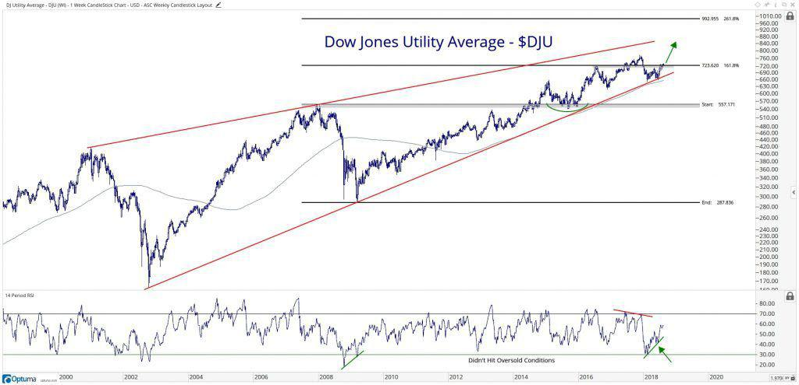

## Table of Contents

## What is the Dow Jones Utility Average?

The Dow Jones Utility Average is a stock market index that tracks the performance of utility companies in the United States. It includes companies that provide services like electricity, gas, and water. This index is important because it gives investors an idea of how well utility companies are doing as a group.

The Dow Jones Utility Average is one of the smaller indexes created by Dow Jones & Company. It only has 15 companies in it, which makes it easier to understand compared to bigger indexes. People often look at this index to see if utility stocks are a good investment, especially because these companies usually offer stable dividends.

## How is the Dow Jones Utility Average calculated?

The Dow Jones Utility Average is calculated by adding up the stock prices of the 15 companies in the index and then dividing that total by a special number called the divisor. The divisor is adjusted over time to account for things like stock splits and changes in the companies that make up the index. This way, the average stays accurate and reflects the true performance of the utility companies.

The divisor makes sure that the index value doesn't jump around too much when a company's stock splits or when a new company is added or removed. For example, if a company's stock price suddenly doubles because of a stock split, the divisor would be changed so that the overall index value doesn't double as well. This keeps the Dow Jones Utility Average a reliable measure of how utility stocks are doing over time.

## Which companies are included in the Dow Jones Utility Average?

The Dow Jones Utility Average includes 15 companies that provide services like electricity, gas, and water. Some of these companies are American Electric Power, Duke Energy, and Exelon. These are big companies that help keep homes and businesses running by supplying power and other important services.

Other companies in the index are NextEra Energy, Southern Company, and Dominion Energy. These companies work hard to make sure people have the energy they need. The index also includes smaller companies like AES Corporation and CenterPoint Energy, which also play an important role in the utility sector.

## What is the historical performance of the Dow Jones Utility Average?

The Dow Jones Utility Average has been around for a long time and has shown steady growth over the years. It's not as wild as some other stock indexes because utility companies usually don't change a lot. People like to invest in these companies because they often pay good dividends, which means you get money back regularly just for owning the stock. Over the last few decades, the index has gone up, but it can also go down when the economy is not doing well.

If you look at the long-term history, the Dow Jones Utility Average has had its ups and downs but generally moves upward over time. For example, during the 2008 financial crisis, the index dropped a lot, but it bounced back in the years after. This shows that even when things get tough, the utility sector can recover. Investors who hold onto their utility stocks for a long time often see their investments grow, making it a good choice for people who want a stable place to put their money.

## How does the Dow Jones Utility Average compare to other major indices?

The Dow Jones Utility Average is different from other major indices like the Dow Jones Industrial Average and the S&P 500. The Dow Jones Utility Average only has 15 companies, all from the utility sector. This makes it smaller and more focused compared to the Dow Jones Industrial Average, which has 30 companies from different industries, and the S&P 500, which has 500 companies from all over the economy. Because it's smaller and focused on utilities, the Dow Jones Utility Average can be less exciting but more stable than the others.

When you look at how these indices perform over time, the Dow Jones Utility Average usually grows slower than the Dow Jones Industrial Average and the S&P 500. This is because utility companies don't change as much as other industries. They provide essential services like electricity and water, so their stocks are often seen as safe investments. But this also means they don't grow as fast as tech or other high-growth sectors. So, if you want a steady investment with regular dividends, the Dow Jones Utility Average might be a good choice, but if you're looking for bigger gains, you might want to look at the other indices.

## What factors influence the Dow Jones Utility Average?

The Dow Jones Utility Average is influenced by many things. One big factor is how well the economy is doing. When the economy is strong, people and businesses use more electricity, gas, and water, which can make utility companies do better. But if the economy is weak, people might use less, and that can hurt the companies in the index. Another factor is interest rates. When interest rates go up, it can be harder for utility companies to borrow money to build new power plants or fix old ones, which can affect their stock prices.

Another thing that can change the Dow Jones Utility Average is what's happening in the energy market. If the price of natural gas or coal goes up, it can make it more expensive for utility companies to produce energy, and that can affect their profits. Also, new laws and rules about the environment can make a big difference. If there are new rules that make it harder or more expensive to use certain kinds of energy, utility companies might have to spend more money to follow them, which can impact their stock prices and the overall index.

## How can investors use the Dow Jones Utility Average to make investment decisions?

Investors can use the Dow Jones Utility Average to help them decide if they want to put their money into utility companies. This index shows how well the utility sector is doing overall. If the index is going up, it might mean that utility stocks are a good investment right now. Investors who like steady, safe investments might find utility stocks attractive because these companies usually pay good dividends. So, by watching the Dow Jones Utility Average, investors can see if it's a good time to buy or sell utility stocks.

Another way investors can use the Dow Jones Utility Average is to compare it with other big indexes like the Dow Jones Industrial Average or the S&P 500. If the utility index is doing better than these other indexes, it might mean that utility stocks are a better choice right now. But if the other indexes are growing faster, investors might want to put their money into different kinds of companies. By looking at how the Dow Jones Utility Average is doing compared to other indexes, investors can make smarter choices about where to invest their money.

## What are the advantages of investing in companies listed in the Dow Jones Utility Average?

One big advantage of investing in companies listed in the Dow Jones Utility Average is that they are usually very stable. Utility companies provide essential services like electricity, gas, and water, which people need no matter what the economy is doing. This means their stocks don't go up and down as much as other stocks, making them a safe choice for investors who want to avoid big risks. Another advantage is that utility companies often pay good dividends. Dividends are like a bonus that companies give to their shareholders, and because utility companies are usually profitable and steady, they can afford to pay these dividends regularly.

Another advantage is that utility companies can be a good way to diversify your investments. If you already have a lot of money in other types of stocks, adding some utility stocks can help balance out your portfolio. When other parts of the economy are doing poorly, utility stocks might still be doing okay, which can help protect your money. Plus, with the world moving towards more renewable energy, some utility companies are investing in new technologies like solar and wind power, which could mean more growth opportunities in the future.

## What are the risks associated with investing in the Dow Jones Utility Average?

One risk of investing in companies in the Dow Jones Utility Average is that they can be affected by changes in laws and regulations. Governments might make new rules about how utility companies can produce and sell energy, especially when it comes to protecting the environment. These new rules can make it more expensive for utility companies to do business, which can hurt their profits and stock prices. Also, if interest rates go up, it can be harder for these companies to borrow money to build new power plants or fix old ones, which can also affect their financial health.

Another risk is that utility stocks might not grow as fast as other types of stocks. If you're looking for big gains in a short time, utility stocks might not be the best choice because they usually grow more slowly. They are good for people who want steady, safe investments, but if the economy is doing really well, other sectors like technology or consumer goods might do better. So, if you put all your money into utility stocks, you might miss out on bigger opportunities in other parts of the market.

## How has the composition of the Dow Jones Utility Average changed over time?

The Dow Jones Utility Average has changed a lot since it started. At first, it had different companies than it does now. As time went on, some companies were taken out and new ones were added. This happened because the companies that make up the index want it to show the best picture of the utility sector. For example, if a company stops being a big part of the utility industry, it might be replaced by a new company that is doing better.

These changes help keep the Dow Jones Utility Average up to date and useful for investors. The people who manage the index look at things like how big a company is, how much it is worth, and how important it is to the utility sector. This way, the index can still be a good way to see how utility companies are doing overall. Even though the companies in the index change, the goal stays the same: to show how the utility industry is doing over time.

## What economic indicators are most closely correlated with the Dow Jones Utility Average?

The Dow Jones Utility Average is closely tied to a few important economic indicators. One big one is interest rates. When interest rates go up, it can be harder for utility companies to borrow money to build new power plants or fix old ones. This can make their stocks go down. Another important indicator is how well the economy is doing overall. When the economy is strong, people and businesses use more electricity, gas, and water, which can make utility companies do better. But if the economy is weak, people might use less, and that can hurt the companies in the index.

Another economic indicator that affects the Dow Jones Utility Average is inflation. Inflation means prices are going up, and this can make it more expensive for utility companies to buy the things they need to produce energy. If inflation is high, it can hurt their profits and make their stock prices go down. Also, changes in the energy market, like the price of natural gas or coal, can have a big impact. If these prices go up, it can make it more expensive for utility companies to produce energy, which can affect their stock prices and the overall index.

## How do global events impact the performance of the Dow Jones Utility Average?

Global events can have a big impact on the Dow Jones Utility Average. For example, if there's a big problem in another country, like a war or a natural disaster, it can make the price of energy go up. This is because utility companies might have to pay more for things like natural gas or coal, which they use to make electricity. When these prices go up, it can hurt the profits of utility companies, and their stock prices might go down. Also, if there's a global economic crisis, people might use less electricity and other services, which can also hurt the companies in the index.

Another way global events can affect the Dow Jones Utility Average is through changes in laws and rules. For example, if a lot of countries start making new rules about using less fossil fuels and more renewable energy, utility companies might have to spend a lot of money to change how they make energy. This can be good in the long run, but in the short term, it can make their stock prices go down. Also, if there's a big change in the world's economy, like a big drop in the stock market, it can make investors nervous and they might sell their utility stocks, which can make the index go down too.

## What is the Dow Jones Utility Average (DJUA) and how is it understood?

The Dow Jones Utility Average (DJUA) is a distinctive element within the constellation of financial indices, specifically crafted to track the performance of 15 premier utility companies in the United States. As a price-weighted index, the DJUA diverges from more commonly recognized indices, such as the Dow Jones Industrial Average (DJIA), by concentrating exclusively on the utility sector. This sector includes companies predominantly engaged in the production and distribution of electricity, gas, and water, essential services that underscore their critical role in daily operations and economic infrastructure.

The DJUA's price-weighted methodology assigns weights to each stock based on its price, as opposed to its market capitalization. This means that higher-priced stocks have a greater impact on the index's movement than lower-priced stocks. The calculation of the DJUA can be represented by:

$$
\text{DJUA} = \frac{\sum_{i=1}^{n} P_i}{D}
$$

where $P_i$ represents the price of each of the 15 stocks in the index and $D$ is the Dow divisor, a figure adjusted for corporate actions like stock splits and dividends to maintain the index's continuity.

The creation of the DJUA serves a specific purpose: segregating utility stocks from the more diversified DJIA, allowing investors and analysts to obtain a clearer perspective of sector-specific trends without the noise introduced by companies in other industries. This separation underscores the unique characteristics of utility companies, which tend to have stable earnings and dividends, partly due to the essential nature of their services and the heavy regulation under which they operate.

The criteria for inclusion in the DJUA are stringent and vital for providing a reliable indicator for economic analysts. To qualify for the index, companies must be prominent players in the utility sector with a significant presence and influence on the market. This selection process ensures that the DJUA remains a robust measure of the utility sector's health, reflecting changes in industry conditions and macroeconomic factors. By encapsulating leading utility companies, the DJUA offers analysts a focused lens through which to interpret economic shifts, particularly those related to energy demand, regulatory modifications, and infrastructure developments.

Overall, the DJUA serves as an essential tool for economic analysis, offering insights into a sector that is a bellwether for broader economic trends. The utility sector's unique characteristics, captured by the DJUA's focused composition, make it indispensable for investors and analysts aiming to understand and anticipate economic currents.

## References & Further Reading

[1]: Bergstra, J., Bardenet, R., Bengio, Y., & Kégl, B. (2011). ["Algorithms for Hyper-Parameter Optimization."](https://dl.acm.org/doi/10.5555/2986459.2986743) Advances in Neural Information Processing Systems 24.

[2]: ["Advances in Financial Machine Learning"](https://www.amazon.com/Advances-Financial-Machine-Learning-Marcos/dp/1119482089) by Marcos Lopez de Prado

[3]: ["Evidence-Based Technical Analysis: Applying the Scientific Method and Statistical Inference to Trading Signals"](https://www.amazon.com/Evidence-Based-Technical-Analysis-Scientific-Statistical/dp/0470008741) by David Aronson

[4]: ["Machine Learning for Algorithmic Trading"](https://github.com/stefan-jansen/machine-learning-for-trading) by Stefan Jansen

[5]: ["Quantitative Trading: How to Build Your Own Algorithmic Trading Business"](https://www.amazon.com/Quantitative-Trading-Build-Algorithmic-Business/dp/1119800064) by Ernest P. Chan