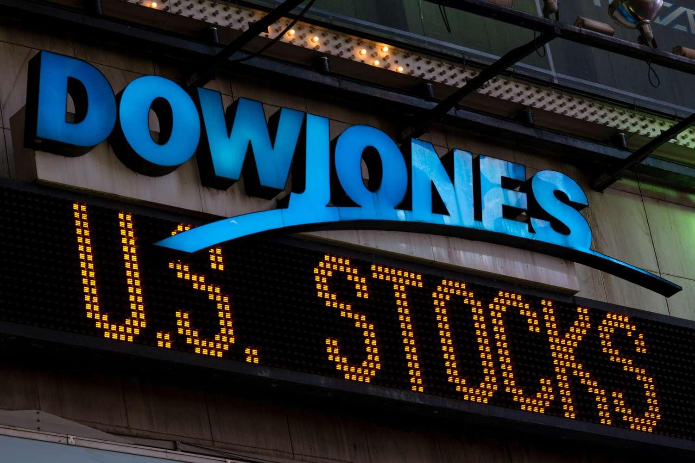

## Table of Contents

## What is the Dow Jones Industrial Average (DJIA)?

The Dow Jones Industrial Average, often called the Dow or DJIA, is a stock market index that shows how 30 large, publicly-owned companies based in the United States are doing. These companies come from different industries like technology, healthcare, and finance. The DJIA is one of the oldest and most well-known stock market indexes. It was created by Charles Dow in 1896 to give people a quick way to see how the overall stock market was performing.

The DJIA is calculated by adding up the stock prices of the 30 companies and then dividing by a special number called the "Dow Divisor." This divisor changes over time to account for things like stock splits and dividends. When the DJIA goes up, it usually means that the stock market is doing well, and when it goes down, it might mean the market is not doing as well. People often use the DJIA to get a general idea of how the U.S. economy is doing, even though it only represents a small part of the whole market.

## How many companies are included in the Dow Jones?

The Dow Jones Industrial Average includes 30 companies. These companies are big and are from different parts of the U.S. economy, like technology, health care, and finance. The Dow Jones is used to show how well these big companies are doing in the stock market.

People watch the Dow Jones to get an idea of how the whole stock market is doing. It's one of the oldest ways to measure the stock market, starting back in 1896. Even though it only looks at 30 companies, it's a popular way to see if the economy is doing well or not.

## What types of companies are typically included in the Dow Jones?

The Dow Jones Industrial Average includes 30 big companies from the United States. These companies come from different parts of the economy, like technology, health care, and finance. Some examples of companies in the Dow Jones are Apple, which makes iPhones, and Johnson & Johnson, which makes medicine and health products. The companies in the Dow Jones are chosen because they are important and well-known in their industries.

The Dow Jones is used to show how well these big companies are doing in the stock market. When the Dow Jones goes up, it usually means that these companies are doing well and that the stock market is doing well too. When it goes down, it might mean that the companies are not doing as well. People watch the Dow Jones to get a quick idea of how the economy is doing, even though it only looks at 30 companies out of thousands in the market.

## How is the Dow Jones calculated?

The Dow Jones Industrial Average, or DJIA, is calculated by adding up the stock prices of the 30 companies that are part of it. But it's not just a simple average. After adding up the prices, you divide the total by a special number called the "Dow Divisor." This divisor changes over time to make sure the DJIA reflects the true changes in the stock market. For example, if a company splits its stock, the divisor adjusts so the DJIA doesn't jump or drop just because of the split.

The Dow Divisor is important because it keeps the DJIA accurate. If a company's stock price goes up or down, or if there's a stock split or a dividend, the divisor changes to make sure the DJIA still shows the right picture of the market. This way, when you see the DJIA going up or down, you know it's because the companies are actually doing better or worse, not just because of some math trick. So, the DJIA gives people a quick and easy way to see how these 30 big companies, and the stock market in general, are doing.

## What is the history behind the creation of the Dow Jones?

The Dow Jones Industrial Average was created by Charles Dow in 1896. Charles Dow was a journalist and one of the founders of Dow Jones & Company, which is a big name in financial news. He wanted to make a simple way for people to understand how the stock market was doing. So, he picked 12 big companies from different industries and started calculating their average stock prices. This was the beginning of the Dow Jones Industrial Average, or DJIA.

Over time, the DJIA changed a lot. It started with just 12 companies, but now it includes 30. The companies in the DJIA are picked because they are important and well-known in their fields. The list of companies has changed many times to keep up with the economy. For example, old companies like General Electric have been replaced by newer ones like Apple. Even though it only looks at 30 companies, the DJIA is still a popular way for people to get a quick idea of how the stock market and the economy are doing.

## How does the Dow Jones influence the stock market?

The Dow Jones Industrial Average, or DJIA, is a big deal in the stock market. It's like a report card that shows how 30 big companies in the U.S. are doing. When the DJIA goes up, it often means that people feel good about the stock market and the economy. This can make more people want to buy stocks, which can push stock prices up even more. On the other hand, if the DJIA goes down, it might make people worried, and they might sell their stocks, which can make prices go down even more.

The DJIA doesn't control the stock market, but it can influence how people feel about it. Because it's so well-known, when the DJIA moves a lot, news channels and newspapers talk about it a lot. This can make people think the whole market is doing well or badly, even though the DJIA only looks at 30 companies out of thousands. So, the DJIA can start a chain reaction where people's feelings about the market change, which can then affect what they do with their money.

## What are some major events that significantly impacted the Dow Jones?

The Dow Jones has seen many big events that changed its numbers a lot. One of the biggest was the stock market crash of 1929, which started the Great Depression. On October 29, 1929, called "Black Tuesday," the Dow Jones fell a lot, and it kept falling for years. This crash made a lot of people lose their money and jobs, and it took a long time for the Dow Jones to get back to where it was before.

Another big event was the 9/11 terrorist attacks in 2001. When the attacks happened, the stock market closed for a few days. When it opened again, the Dow Jones dropped a lot because people were scared and unsure about what would happen next. It took some time for the Dow Jones to recover from this shock.

The financial crisis of 2008 also had a huge impact on the Dow Jones. It started with problems in the housing market, and then big banks started to fail. On September 29, 2008, the Dow Jones had its biggest one-day point drop ever at that time. The crisis made the Dow Jones fall a lot, and it took years for it to get back to where it was before the crisis started.

## How does the Dow Jones compare to other major stock indices like the S&P 500 and Nasdaq?

The Dow Jones Industrial Average, or DJIA, is different from other big stock market indices like the S&P 500 and the Nasdaq because it looks at fewer companies. The DJIA only tracks 30 big companies, while the S&P 500 follows 500 of the biggest companies in the U.S. The Nasdaq, on the other hand, includes more than 3,000 companies, with a lot of them being in technology and internet businesses. Because the DJIA looks at fewer companies, it's not as good at showing what's happening in the whole stock market compared to the S&P 500, which covers more of the market.

Another difference is how they are calculated. The DJIA is calculated by adding up the stock prices of its 30 companies and then dividing by a special number called the "Dow Divisor." This way of calculating can make the DJIA sensitive to big changes in the stock prices of just a few companies. The S&P 500 and Nasdaq, however, are calculated using a market capitalization method, which means they take into account how much the companies are worth, not just their stock prices. This makes the S&P 500 and Nasdaq better at showing the overall health of the market because they consider the size of the companies they track.

## What are the criteria for a company to be added to or removed from the Dow Jones?

The companies in the Dow Jones are picked based on a few important things. They need to be big and well-known in their industry. They should also represent different parts of the U.S. economy, like technology, health care, and finance. The people who run the Dow Jones, called the Dow Jones Index Committee, look at these things when deciding if a company should be added or taken out. They also think about how the company's stock price fits with the other companies in the Dow Jones, because the way the Dow Jones is calculated can be affected by big changes in stock prices.

Sometimes, a company might be taken out of the Dow Jones if it's not doing well or if another company would be a better fit. For example, if a company goes bankrupt or gets bought by another company, it might be removed. Also, if a new company becomes really important in its industry, it might be added to the Dow Jones to keep it up to date with the economy. The goal is to make sure the Dow Jones always shows a good picture of how the big companies in the U.S. are doing.

## How do changes in the Dow Jones affect investment strategies?

Changes in the Dow Jones can make people change their investment strategies. When the Dow Jones goes up, it often means that people feel good about the economy. This can make investors want to buy more stocks, thinking that prices will keep going up. They might put more money into the market or move their money from safer investments like bonds to riskier ones like stocks. On the other hand, if the Dow Jones goes down a lot, it can make investors worried. They might start selling their stocks to avoid losing more money, or they might move their money into safer investments to protect it.

The Dow Jones can also affect how investors pick their stocks. If a company in the Dow Jones is doing really well, it might make investors want to buy that company's stock or other stocks in the same industry. For example, if Apple's stock goes up and helps the Dow Jones go up, investors might think that other tech companies will do well too. But if a company in the Dow Jones is doing badly, investors might sell that stock or avoid other stocks in the same industry. So, the Dow Jones can guide investors in deciding which stocks to buy or sell based on how the market is doing.

## What are the criticisms and limitations of the Dow Jones as a market indicator?

The Dow Jones has some problems as a way to measure the stock market. One big problem is that it only looks at 30 companies. This is a very small part of the whole stock market, which has thousands of companies. So, the Dow Jones might not show what's really happening in the market. Also, the way it's calculated can be tricky. It uses a special number called the "Dow Divisor" to figure out the average, and this can make the Dow Jones sensitive to big changes in just a few companies' stock prices. This means that if one big company's stock goes up or down a lot, it can change the whole Dow Jones a lot, even if the rest of the market is staying the same.

Another problem with the Dow Jones is that it doesn't take into account how big the companies are. It just adds up their stock prices and divides by the Dow Divisor. Other ways to measure the market, like the S&P 500, look at how much the companies are worth, not just their stock prices. This can make the Dow Jones less accurate because bigger companies should have more impact on the market. Also, the companies in the Dow Jones can change, but they don't change very often. This means the Dow Jones might not always show the newest and most important parts of the economy. So, while the Dow Jones is famous and easy to understand, it has some limits that people should think about when they use it to understand the stock market.

## How can investors use the Dow Jones to make informed decisions?

Investors can use the Dow Jones to get a quick idea of how the stock market is doing. When the Dow Jones goes up, it often means that people feel good about the economy and might want to buy more stocks. This can be a sign for investors to think about putting more money into the market or moving their money from safer investments like bonds to riskier ones like stocks. On the other hand, if the Dow Jones goes down a lot, it can make investors worried. They might decide to sell their stocks to avoid losing more money or move their money into safer investments to protect it.

The Dow Jones can also help investors pick which stocks to buy or sell. If a company in the Dow Jones is doing really well and helping the Dow Jones go up, investors might want to buy that company's stock or other stocks in the same industry. For example, if Apple's stock goes up and helps the Dow Jones, investors might think that other tech companies will do well too. But if a company in the Dow Jones is doing badly, investors might sell that stock or avoid other stocks in the same industry. So, by watching the Dow Jones, investors can get clues about which parts of the market might be good to invest in or stay away from.

## What types of algorithms are used in trading the Dow Jones?

Traders engaged in the Dow Jones Industrial Average (DJIA) use a variety of algorithms designed to enhance trading efficiency and capitalize on market dynamics. Among these, trend-following systems are prevalent, primarily because they help traders identify and act upon shifts in market sentiment. These systems utilize historical data to predict future price movements, relying on trend indicators such as moving averages. The logic underpinning these systems often follows the equation:

$$
\text{Signal} = \text{Moving Average}_{\text{short-term}} - \text{Moving Average}_{\text{long-term}}
$$

where a positive signal indicates a potential buying opportunity, while a negative signal suggests selling.

Moreover, [statistical [arbitrage](/wiki/arbitrage)](/wiki/statistical-arbitrage) models are pivotal in exploiting pricing inefficiencies among the DJIA's components. These models deploy statistical and econometric techniques to determine the probabilistic mispricing of assets, typically engaging in mean reversion strategies. The core idea is to buy undervalued stocks and sell overvalued ones, assuming prices will revert to their historical mean.

Volume-Weighted Average Price (VWAP) and Time-Weighted Average Price (TWAP) algorithms are employed when executing large orders on the DJIA to minimize market impact. The VWAP strategy breaks down a large order over a trading period, ensuring execution close to the average price of the stock, calculated as:

$$
\text{VWAP} = \frac{\sum (\text{Price}_i \times \text{Volume}_i)}{\sum \text{Volume}_i}
$$

Similarly, TWAP focuses on evenly distributing trades over the specified period, ensuring a consistent purchase or sale rate, aligning with the average price over time, and avoiding sudden market disruptions.

Black-box algorithms, though contentious due to their opacity, enable automated trading decisions based on the DJIA's conditions. Such systems encapsulate proprietary logic and are characterized by their autonomous decision-making capability, often optimizing for speed and efficiency without human intervention. Despite their advantages, these algorithms present challenges regarding transparency and potential for unintended market impacts.

Overall, the use of diverse algorithmic strategies in trading the Dow Jones highlights the fusion of quantitative analysis and technological prowess in modern financial markets, each designed to exploit specific market opportunities while managing risks.

## References & Further Reading

[1]: Aldridge, I. (2013). ["High-Frequency Trading: A Practical Guide to Algorithmic Strategies and Trading Systems"](https://www.wiley.com/en-us/High-Frequency+Trading%3A+A+Practical+Guide+to+Algorithmic+Strategies+and+Trading+Systems%2C+2nd+Edition-p-9781118343500). Wiley.

[2]: Cartea, Á., Jaimungal, S., & Penalva, J. (2015). ["Algorithmic and High-Frequency Trading"](https://assets.cambridge.org/97811070/91146/frontmatter/9781107091146_frontmatter.pdf). Cambridge University Press.

[3]: "Securities and Exchange Commission. Report on the May 6, 2010 Flash Crash." Retrieved from [SEC](https://www.sec.gov/news/studies/2010/marketevents-report.pdf).

[4]: Narang, R. K. (2013). ["Inside the Black Box: A Simple Guide to Quantitative and High-Frequency Trading"](https://onlinelibrary.wiley.com/doi/book/10.1002/9781118662717). Wiley.

[5]: Hasbrouck, J., & Saar, G. (2013). ["Low-latency trading"](https://www.sciencedirect.com/science/article/abs/pii/S1386418113000165), Journal of Financial Markets, 16(4), 646-679.