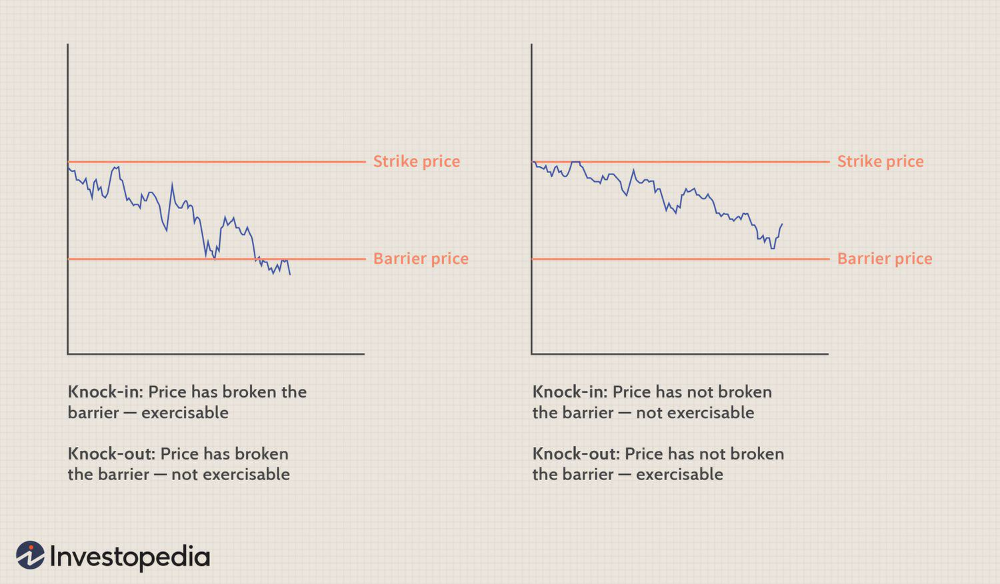

This article explores the concept of down-and-out options, a specialized form of exotic financial derivatives that plays a distinctive role in the financial markets. Down-and-out options are a type of barrier option characterized by their unique knockout feature. This feature renders the option void if the price of the underlying asset falls to or below a predetermined barrier level during the option's life. As such, these options are integral to the versatile strategies employed within option trading and algorithmic trading contexts.

Barrier options, including down-and-out options, form a subset of exotic options that are more complex than traditional vanilla options. These instruments appeal to seasoned investors and financial professionals who seek to implement precise strategies that standard options might not support. Understanding the mechanics and potential use cases of down-and-out options is crucial for market participants looking to navigate the intricate landscape of derivatives trading.



Within the broader spectrum of options trading, down-and-out options provide unique advantages and risks. They offer a cost-effective means to achieve specific exposure or hedging while introducing the risk of becoming invalidated once the barrier level is reached. This characteristic of down-and-out options makes them both a practical tool for risk management and a subject of interest in advanced trading strategies.

In the context of algorithmic trading, down-and-out options can be integrated into more complex trading systems, leveraging automation and computational models to align trading decisions with market conditions. The rise of data-driven techniques, including machine learning and advanced analytics, allows for more accurate prediction of barrier events and supports automated decision-making processes related to these options.

In summary, this article aims to demystify the complex nature of down-and-out options, offering a detailed analysis tailored to seasoned investors and financial professionals. Through a comprehensive examination of how these derivatives function and their applications within diverse trading strategies, we endeavor to provide valuable insights into optimizing trading outcomes using down-and-out options.

## Table of Contents

## Understanding Down-and-Out Options

Down-and-out options represent a specific subclass of barrier options, defined by their unique mechanism of becoming void if the underlying asset's price drops to or below a predetermined barrier level. These financial derivatives are categorized as knock-out options due to their characteristic of "knocking out" or ceasing to exist upon breaching the barrier.

The mechanic of down-and-out options centers around the barrier level, which acts as a threshold influencing both the option's existence and payoff. Upon initiation, such options are structured with a strike price and a barrier price, both crucial in determining the option's life span and potential payout. The strike price is the level at which the holder can buy (in the case of a call option) or sell (in the case of a put option) the underlying asset, while the barrier price is a destabilizing element that leads to the option's nullification if breached.

Mathematically, the valuation of down-and-out options requires adjustments to the conventional Black-Scholes model, which is often employed for pricing standard options. This involves incorporating a [factor](/wiki/factor-investing) that accounts for the barrier feature, typically reducing the option's premium in comparison to a similar vanilla option without the barrier constraint. The pricing equation for a down-and-out call option might look like:

$$

C_{\text{do}} = C_{\text{vanilla}} - \text{adjustment term based on barrier}
$$

where $C_{\text{do}}$ is the price of the down-and-out call option, and $C_{\text{vanilla}}$ represents the price of an equivalent vanilla call option.

The implications of such a mechanism are significant for the life and payout conditions of the option. If the barrier level is not breached during the option's life, the payoff is similar to that of a standard option, determined by the intrinsic value at expiration, $\max(0, S_T - K)$ for call options, where $S_T$ is the price of the underlying asset at expiration and $K$ is the strike price.

Conversely, if the barrier is breached, the option becomes null and void, providing no payout regardless of the intrinsic value at expiry. This conditional framework poses a unique risk-reward profile, where the reduced premium cost of these options reflects the risk of total loss if the barrier condition is triggered.

In summary, understanding down-and-out options necessitates an appreciation for their dual yet intertwined components: the strike and barrier prices, which collectively dictate the option's active or void status, and thus its potential financial reward or forfeiture. This interplay forms the crux of utilizing down-and-out options in advanced trading strategies, often as a more tailored tool for specific market outlooks and hedging needs.

## Benefits and Drawbacks of Down-and-Out Options

Down-and-out options, as a subset of barrier options, present a distinctive cost structure that can be advantageous for hedging strategies. Their defining characteristic—becoming null and void if the underlying asset price falls below a specified barrier—means that they generally trade at a lower premium compared to vanilla options. This cost-effectiveness makes them an attractive choice for investors seeking to mitigate portfolio risks without incurring high upfront costs.

However, the benefits of down-and-out options are tempered by their inherent risks. The very mechanism that makes them less expensive also introduces a significant drawback: the potential for complete loss of the option's value. If the underlying asset price hits or falls below the barrier, the option is extinguished and the investor loses the entire premium paid. This feature necessitates a careful assessment of the underlying asset's price [volatility](/wiki/volatility-trading-strategies) and the probability of breaching the barrier.

The risk-reward dynamics of down-and-out options hinge on the strategic positioning of the barrier price. When the barrier is set pragmatically, considering historical volatility and market trends, these options can serve as effective tools for hedging against downside risks while keeping initial costs low. For instance, in periods of stable market conditions where the likelihood of a breach is minimal, down-and-out options offer an appealing risk management strategy. Conversely, in highly volatile markets, the risk of barrier breach may outweigh the cost benefits.

Furthermore, down-and-out options cater to specific trading strategies that align with their unique risk profiles. They are particularly suitable for traders who possess a robust understanding of market dynamics and can forecast asset price movements with relative accuracy. By incorporating historical data analysis and probabilistic models, investors can better evaluate the potential outcomes and integrate these options into broader portfolio strategies.

For quantitative traders or those leveraging statistical models, the inclusion of down-and-out options demands an analytical approach. Consider employing Python for simple simulations of price movements to estimate the likelihood of a barrier breach. For example:

```python
import numpy as np

def simulate_barrier_breach(initial_price, barrier, volatility, time_horizon, num_simulations):
    breaches = 0
    for _ in range(num_simulations):
        simulated_price = initial_price
        for _ in range(time_horizon):
            # Simulate daily returns assuming normal distribution
            daily_return = np.random.normal(0, volatility)
            simulated_price *= (1 + daily_return)
            if simulated_price <= barrier:
                breaches += 1
                break
    return breaches / num_simulations

# Example parameters
initial_price = 100
barrier = 90
volatility = 0.01  # Daily volatility
time_horizon = 252  # Trading days in a year
num_simulations = 1000

breach_probability = simulate_barrier_breach(initial_price, barrier, volatility, time_horizon, num_simulations)
print(f"Estimated Probability of Barrier Breach: {breach_probability:.2%}")
```

This code provides a basic framework to quantify the probability of a barrier breach, which aids investors in determining the suitability of down-and-out options within their trading strategies. Ultimately, the decision to employ these options should be driven by a comprehensive analysis of market conditions, risk tolerance, and strategic objectives.

## Practical Applications in Trading Strategies

Down-and-out options serve as a strategic instrument in various trading scenarios, primarily utilized by financial institutions for hedging and risk management. Unlike standard options, these barrier options are designed to become void if the price of the underlying asset falls below a specific barrier level, thereby offering cost-effective solutions for sophisticated trading needs.

Large financial institutions employ down-and-out options to hedge against potential downturns. For instance, a portfolio manager holding long positions in a volatile stock may incorporate down-and-out put options as a protective measure. These options enable the manager to minimize losses if the stock price plummets, while benefiting from lower premiums compared to vanilla options due to the added barrier condition. The effectiveness of such hedging lies in precise barrier placement, which requires an understanding of both market conditions and the specific asset's behavior.

Portfolio managers leverage down-and-out options to address various risk factors inherent in long positions. By setting the barrier level based on historical price data and volatility estimates, they can tailor these options to fit specific risk profiles. This approach provides a flexible yet robust mechanism for safeguarding against sudden market drops, leaving room for portfolio growth during stable or bullish phases.

In terms of pricing, down-and-out options diverge from standard vanilla options primarily due to the barrier feature. The valuation of these options involves calculating the probability that the underlying asset will not breach the barrier before expiration. This involves solving complex differential equations or using numerical methods such as Monte Carlo simulations or finite difference methods. The introduction of a barrier affects the option's delta, gamma, vega, and other Greeks, necessitating adjustments in pricing models. For example, the Black-Scholes model, widely used for vanilla options, is insufficient as it assumes continuous monitoring of the barrier, necessitating alternative approaches like the Crank-Nicolson method for more accurate pricing assessments.

Here's a simple Python snippet that demonstrates how one might simulate the path of an asset price and determine if it breaches a predetermined barrier:

```python
import numpy as np

def simulate_asset_path(S0, mu, sigma, barrier, T, dt):
    np.random.seed(0)  # for reproducibility
    n_steps = int(T / dt)
    path = np.zeros(n_steps)
    path[0] = S0
    for t in range(1, n_steps):
        z = np.random.normal()
        path[t] = path[t-1] * np.exp((mu - 0.5 * sigma**2) * dt + sigma * np.sqrt(dt) * z)
        if path[t] < barrier:
            return "Barrier Breached"
    return "No Barrier Breach"

# Parameters
S0 = 100  # Initial stock price
mu = 0.05  # Drift or expected return
sigma = 0.2  # Volatility
barrier = 90  # Barrier level
T = 1  # Time to maturity in years
dt = 0.01  # Time step in years

result = simulate_asset_path(S0, mu, sigma, barrier, T, dt)
print(result)
```

This script sets a basic framework for simulating asset paths and checking whether the price falls below a predetermined barrier. It can be adapted and expanded for more complex simulations and sensitivity analyses, serving as a foundational tool for financial analysts and algorithm developers working with down-and-out options.

## Algorithmic Trading Integration

Algorithmic trading has revolutionized the finance industry by allowing traders to implement and execute complex trading strategies with minimal human intervention. Down-and-out options, a type of exotic derivative, provide unique opportunities for automated trading systems. These options cease to exist if the underlying asset's price falls to a certain barrier level, thus offering distinct risk and reward profiles that can be leveraged using algorithmic techniques.

Integrating down-and-out options into [algorithmic trading](/wiki/algorithmic-trading) systems involves using [machine learning](/wiki/machine-learning) algorithms to evaluate these options' viability and accurately price them. Machine learning can enhance the pricing models of down-and-out options by analyzing historical data to identify patterns and trends that might not be apparent through traditional statistical methods. Techniques such as support vector machines, random forests, and neural networks can be employed to predict future price movements and the likelihood of the barrier being breached, which is critical for determining the fair value of these options.

For example, one could use a supervised learning model to analyze historical data of the underlying asset, incorporating features such as price volatility, moving averages, and macroeconomic indicators. This model could be trained to forecast the probability of the asset reaching the barrier level before expiration. The predicted probabilities can then be integrated into a pricing framework, such as the Monte Carlo simulation, to generate a distribution of possible outcomes and assess the option's expected value.

Here is a basic Python snippet demonstrating how machine learning might be used to predict the likelihood of breaching the barrier:

```python
import numpy as np
from sklearn.model_selection import train_test_split
from sklearn.ensemble import RandomForestClassifier
from sklearn.metrics import accuracy_score

# Sample historical data
# Columns: [price, volatility, days_to_expiration, barrier_breached(1: Yes, 0: No)]
data = np.array([
    [50, 0.2, 30, 0],
    [48, 0.25, 45, 1],
    # Add more rows of historical data
])

# Features and target variable
X = data[:, :3]  # price, volatility, days_to_expiration
y = data[:, 3]   # barrier_breached

# Train/test split
X_train, X_test, y_train, y_test = train_test_split(X, y, test_size=0.2, random_state=42)

# Classifier training
clf = RandomForestClassifier(n_estimators=100, random_state=42)
clf.fit(X_train, y_train)

# Predict and evaluate
y_pred = clf.predict(X_test)
accuracy = accuracy_score(y_test, y_pred)
print(f"Model accuracy: {accuracy:.2f}")
```

In addition, the integration of data analytics facilitates the monitoring and adjustment of trading strategies in real-time. By continuously analyzing the stream of market data, model predictions can be updated dynamically, allowing traders to adapt their position sizes and hedge ratios instantaneously as market conditions evolve.

Advanced algorithmic trading setups may incorporate machine learning to optimize trade execution and rebalance portfolios in response to changes in market dynamics. This involves not only assessing the current risk of breaching the barrier but also modeling the entire lifecycle of a trade, from inception to closure, maximizing returns while minimizing risk exposure.

In summary, the algorithmic integration of down-and-out options could considerably enhance a trading strategy's sophistication and performance, helping traders make informed decisions and capitalize on opportunities swiftly.

## Conclusion

In summary, down-and-out options present a nuanced financial instrument for experienced traders and financial analysts seeking sophisticated strategies in option trading. The unique feature of these options, becoming void if the underlying asset reaches a specified lower barrier, lends itself to cost-effective hedging and potential capital savings. While this characteristic poses the inherent risk of losing the option's entire value if the barrier is breached, it simultaneously offers an opportunity for traders to acquire options at a lower premium compared to traditional models. 

The strategic value of incorporating down-and-out options lies in their ability to enhance portfolio diversification and offer targeted risk management solutions. By leveraging the conditional nature of these options, traders can fine-tune their exposure to market volatilities, thus tailoring their investment strategies to specific market forecasts and risk tolerances.

We highly encourage seasoned traders and financial analysts to explore these exotic options for their potential benefits in diversification and risk mitigation. Furthermore, we invite feedback and discussions from the trading community to foster innovative applications and analyses of down-and-out options. Such exchanges can lead to deeper insights and advancements in utilizing these options effectively within diverse trading strategies, contributing to an evolved understanding and application in the field of financial derivatives.

## References & Further Reading

[1]: Hull, J. C. (2012). ["Options, Futures, and Other Derivatives."](https://www.semanticscholar.org/paper/Options%2C-Futures%2C-and-Other-Derivatives-Hull/89bdee500c8623864fc9eb7a471546aa713acc44) Pearson.

[2]: Haug, E. G. (2007). ["The Complete Guide to Option Pricing Formulas."](https://www.amazon.com/Complete-Guide-Option-Pricing-Formulas/dp/0071389970) McGraw-Hill.

[3]: Bouzoubaa, M., & Osseiran, W. (2010). ["Exotic Options and Hybrids: A Guide to Structuring, Pricing and Trading."](https://www.amazon.com/Exotic-Options-Hybrids-Structuring-Pricing/dp/0470688033) Wiley Finance.

[4]: MacKenzie, D. (2006). ["An Engine, Not a Camera: How Financial Models Shape Markets."](https://academic.oup.com/mit-press-scholarship-online/book/20588) MIT Press.

[5]: Glasserman, P. (2003). ["Monte Carlo Methods in Financial Engineering."](https://link.springer.com/book/10.1007/978-0-387-21617-1) Springer.

[6]: Taleb, N. N. (1997). ["Dynamic Hedging: Managing Vanilla and Exotic Options."](https://archive.org/details/dynamichedgingma0000tale) Wiley.

[7]: Thijssen, J. J. J. (2006). ["Real Options: Exercise Timing and Competition."](https://www.sciencedirect.com/science/article/abs/pii/S0304406812000389) Springer Science & Business Media.