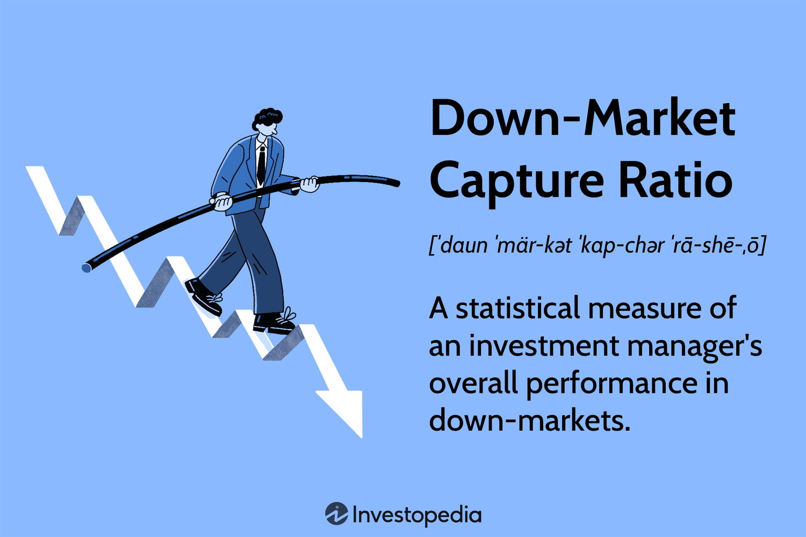

The world of finance employs numerous metrics to evaluate investment performance. An important metric among these is the down-market capture ratio. This ratio plays a crucial role in understanding how well an investment strategy performs, especially during unfavorable market conditions, and is particularly significant for algorithmic trading strategies.

Algorithmic trading, which relies on predefined algorithms to execute trades with precision and speed, benefits from a clear understanding of performance across various market cycles. The down-market capture ratio specifically measures a portfolio's resilience during market declines by comparing its returns against a benchmark index during these periods. When this ratio is less than 100%, it suggests that the investment strategy or manager has successfully mitigated losses better than the overall market, which is a desirable outcome for investors seeking to protect capital during downturns.

Understanding this ratio in conjunction with the up-market capture ratio, which assesses performance during market upswings, is vital. Together, these metrics provide a more complete picture of a strategy's performance across market conditions, allowing investors to gauge the robustness of investment strategies over time.

Grasping the importance of the down-market capture ratio is fundamental for portfolio management. It aids investors in identifying strategies that can withstand market volatility, thus ensuring more stable portfolios. As financial markets continue to experience rapid changes, the utility of these metrics is expected to garner increased attention, especially within the growing domain of algorithmic trading.

## Table of Contents

## Understanding Down-Market Capture Ratio

The down-market capture ratio serves as a critical metric for evaluating how well an investment portfolio or a strategy performs during periods when market indices are trending downwards. This ratio is particularly insightful for investors looking to assess the relative resilience of their investment strategies during economic downturns or bearish market phases.

Mathematically, the down-market capture ratio is calculated by dividing the manager's returns by the benchmark returns during periods when the benchmark shows a decline. The formula can be expressed as follows:

$$
\text{Down-Market Capture Ratio} = \left( \frac{\text{Portfolio Return during Down Market}}{\text{Benchmark Return during Down Market}} \right) \times 100
$$

This ratio is presented as a percentage. A down-market capture ratio below 100 signifies that the investment strategy or portfolio has declined less than the benchmark index during the downturn. Consequently, a ratio under 100 is indicative of superior performance in protecting value in falling markets.

For instance, if a specific strategy reports a 4% decline when the benchmark has dipped by 5%, the down-market capture ratio would be calculated as:

$$
\text{Down-Market Capture Ratio} = \left( \frac{-4\%}{-5\%} \right) \times 100 = 80
$$

A ratio of 80% here implies that the strategy has effectively mitigated losses, performing better than the overall market.

The interpretation of this ratio is crucial for portfolio managers and investors who prioritize downside protection. An investment strategy boasting a low down-market capture ratio may be attractive to risk-averse investors who seek to minimize potential losses during adverse market conditions.

## The Role of Up-Market Capture Ratio

The up-market capture ratio evaluates an investment strategy's performance during periods of market appreciation. It is calculated by comparing the returns of a portfolio to those of a benchmark index during up-market phases. This ratio is pivotal for investors seeking strategies that maximize returns when market conditions are favorable.

An investor typically aims for an up-market capture ratio greater than 100%. Such a ratio suggests that the investment strategy outperforms the benchmark in rising markets, delivering superior returns. For example, an up-market capture ratio of 120% indicates that the strategy has captured 120% of the benchmark's gains in up-market conditions.

Investors frequently analyze both the up-market and down-market capture ratios to assess an investment strategy comprehensively. A strategy that maintains a high up-market capture ratio while keeping a low down-market capture ratio is preferable. This combination demonstrates the ability to capitalize on market gains effectively while minimizing losses during downturns, thus achieving favorable risk-adjusted returns.

Mathematically, the up-market capture ratio is calculated by:

$$
\text{Up-Market Capture Ratio} = \left( \frac{\text{Portfolio Return during Up-Markets}}{\text{Benchmark Return during Up-Markets}} \right) \times 100
$$

In conclusion, understanding the up-market capture ratio alongside the down-market capture ratio is crucial for making informed investment decisions, allowing investors to align their strategies with specific market conditions and growth objectives.

## Calculating Total Capture Ratio

To understand the overall effectiveness of an investment strategy, the total capture ratio is utilized. This metric is calculated by dividing the up-market capture ratio by the down-market capture ratio. Mathematically, it can be expressed as:

$$
\text{Total Capture Ratio} = \frac{\text{Up-Market Capture Ratio}}{\text{Down-Market Capture Ratio}}
$$

A total capture ratio greater than one signifies that a strategy has been adept at capturing gains during market upturns while effectively mitigating losses during downturns. This suggests that the strategy performs well not only when the market is favorable but also protects the portfolio in adverse conditions. Analysts and investors use this ratio to gauge the balance between risk and reward across different market environments. By examining both up-market and down-market conditions, the total capture ratio offers a holistic view of an investment strategy's potential in diverse financial climates.

## Financial Metrics in Algorithmic Trading

Algorithmic trading is a systematic approach to executing orders using automated and pre-programmed trading instructions. This methodology leverages sophisticated mathematical models to generate orders and execute trades with minimal human intervention, eliminating emotional bias. 

Key performance metrics are crucial in evaluating the effectiveness and reliability of [algorithmic trading](/wiki/algorithmic-trading) strategies. Among these metrics, the Sharpe ratio is widely used. It measures the risk-adjusted return of an investment by comparing the excess return over the risk-free rate with the investment's standard deviation. A higher Sharpe ratio indicates a more favorable risk-adjusted performance. Mathematically, the Sharpe ratio is expressed as:

$$
\text{Sharpe Ratio} = \frac{R_p - R_f}{\sigma_p}
$$

where $R_p$ is the portfolio return, $R_f$ is the risk-free rate, and $\sigma_p$ is the standard deviation of the portfolio returns.

Maximum drawdown is another critical metric, representing the largest percentage loss from a peak to a trough of an investment before a new peak is achieved. It helps in understanding the potential risk of the trading strategy during adverse market conditions. A smaller maximum drawdown is preferred as it indicates less severe losses.

Volatility metrics, like standard deviation and beta, provide insights into the fluctuations of a trading strategy's returns. Standard deviation measures the [dispersion](/wiki/dispersion-trading) of returns, while beta assesses the strategy's sensitivity to market movements. 

Capture ratios, such as the up-market and down-market capture ratios, complement these traditional metrics by evaluating the strategy's performance relative to a benchmark in different market phases. They offer a nuanced view by highlighting how well the strategy captures gains in up markets and how effectively it mitigates losses in down markets.

For the effective implementation of algorithmic trading strategies, aligning these metrics with financial objectives is essential. They ensure that the algorithms are not only generating desirable returns but are also operating within acceptable risk parameters, thus maintaining the strategy's overall stability.

## Case Studies and Examples

Consider a hypothetical investment strategy that demonstrates a down-market capture ratio of 85. This measurement indicates the strategy's ability to mitigate losses during market downturns when compared to a relevant benchmark index. In simpler terms, the strategy falls only 85% as much as the benchmark during a declining market, showcasing its relative resilience.

If this same investment strategy showcases an up-market capture ratio of 120, it means that the strategy not only recovers but also outperforms the benchmark in upward market conditions, achieving 120% of the benchmark's gains. Such performance indicates that the strategy is adept at capturing gains when market conditions are favorable.

To assess the comprehensive effectiveness of this strategy, the total capture ratio is calculated. This is done by dividing the up-market capture ratio by the down-market capture ratio:

$$
\text{Total Capture Ratio} = \frac{\text{Up-Market Capture Ratio}}{\text{Down-Market Capture Ratio}} = \frac{120}{85} \approx 1.41
$$

A total capture ratio greater than one, as seen with 1.41, illustrates that the strategy excels in leveraging positive market movements while effectively limiting negative impacts during downturns. This balanced performance is particularly beneficial for portfolio managers and investors as it signifies robust strategy execution across varying market climates.

Such case studies exemplify the value of integrating down-market and up-market capture ratios as core components of strategy evaluation. They underscore the quantitative insights these metrics provide, enabling investors to make more informed decisions about risk management and portfolio optimization. These scenarios underscore the importance of active monitoring and strategy adjustment in aligning with overarching financial goals.

## Conclusion

Understanding and applying the down-market and up-market capture ratios provide significant insights into investment strategy performance. These metrics enable investors and portfolio managers to gauge a strategy's ability to mitigate losses during market downturns and capitalize on gains during market upswings. By analyzing these ratios, investors can make informed decisions and adjust their portfolios to better align with their risk tolerance and return objectives.

As financial markets continue to evolve, characterized by increasing complexity and [volatility](/wiki/volatility-trading-strategies), the relevance of these capture ratios in algorithmic and active trading strategies becomes even more critical. Algorithmic trading platforms, driven by advanced algorithms and [machine learning](/wiki/machine-learning), can leverage these metrics to enhance decision-making processes and achieve improved returns. The ability to systematically assess performance across different market conditions ensures that trading algorithms remain robust and adaptive.

Moreover, incorporating these metrics allows for a more nuanced understanding of an investment strategy's performance beyond simplistic measures of return. By offering a comprehensive view, capture ratios aid in constructing resilient portfolios that withstand diverse market scenarios. As such, they form an integral component of modern investment strategies, particularly within the context of dynamically shifting market environments.

## References & Further Reading

[1]: Fabozzi, F. J., Focardi, S. M., & Kolm, P. N. (2010). ["Quantitative Equity Investing: Techniques and Strategies."](https://www.semanticscholar.org/paper/Quantitative-Equity-Investing%3A-Techniques-and-Fabozzi-Focardi/1c49a2a53919f7e65cb96f16691b8ff726fd3cd7) Wiley Finance.

[2]: Grinold, R. C., & Khan, R. N. (1999). ["Active Portfolio Management: A Quantitative Approach for Producing Superior Returns and Controlling Risk."](https://www.amazon.com/Active-Portfolio-Management-Quantitative-Controlling/dp/0070248826) McGraw-Hill.

[3]: Martin, R. D., & Simin, T. T. (2003). ["Outlier-Resistant Echolocation of Returns."](https://www.jstor.org/stable/4480512) Journal of Business and Economic Statistics.

[4]: Silvis, J. J. et al. (2017). ["Deep Hedge: A Financial Trading System Based on Deep Learning."](https://www.jomh.org/articles/10.22514/jomh.2024.208) Proceedings of the 25th Conference on Advances in Neural Information Processing Systems.

[5]: Damodaran, A. (2012). ["Investment Valuation: Tools and Techniques for Determining the Value of Any Asset,"](https://books.google.com/books/about/Investment_Valuation.html?id=5SRHAAAAQBAJ) 3rd Edition. Wiley Finance.