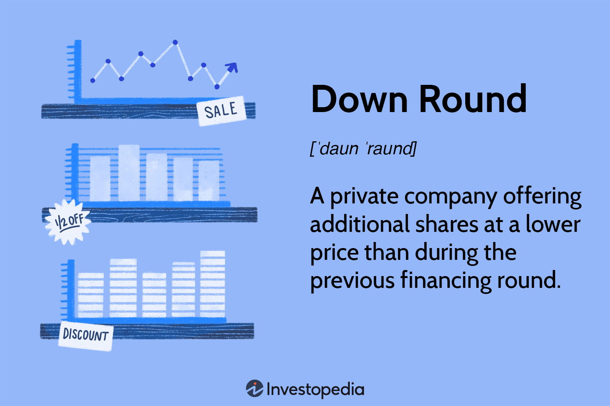

Venture capital down rounds are a significant phenomenon impacting today's financial markets, with far-reaching implications for startups, investors, and trading strategies. A down round occurs when a company raises capital at a valuation lower than in previous funding rounds. This reflects a decline in the company’s perceived value and can signal challenges such as unmet milestones or unfavorable market conditions. In recent years, the frequency of down rounds has increased, influenced by a volatile economic environment and intensified competition.

The rise in down rounds has noteworthy implications for algorithmic trading, a method of executing orders using automated and pre-programmed trading instructions. Algorithmic trading relies heavily on data and market signals to make rapid trading decisions. The prevalence of down rounds can alter the landscape of investment, as they can cause fluctuations in market conditions and stock volatility.



Understanding the impact of down rounds on algorithmic trading strategies is increasingly important for traders and investors. Down rounds may lead to shifts in market sentiment and investor confidence, affecting the data inputs and models used in trading algorithms. These shifts can impact the behavior of markets and potentially reveal new trading opportunities or risks, requiring traders to adapt their strategies accordingly.

Navigating these changes effectively demands a thorough comprehension of how down rounds influence various market factors. By integrating knowledge of venture capital movements into algorithmic trading strategies, traders can better position themselves to leverage market dynamics and manage risk in fluctuating conditions.

## Table of Contents

## Understanding Down Rounds in Venture Capital

A "down round" in venture capital refers to a financing event where a startup raises capital at a valuation lower than its previous funding round. This phenomenon typically manifests due to declining market valuations, intensified competition, or the failure to meet projected business milestones. These rounds are often seen as indicative of a company adjusting to a more conservative growth trajectory or reacting to external and internal pressures, prompting a reassessment of its overall valuation.

Market valuation drops are a primary trigger for down rounds. This can occur when broader economic conditions lead to a decrease in investor enthusiasm for high-risk investments, subsequently reducing startup valuations across the board. Heightened competition within a sector can also prompt down rounds, as rivalries may inhibit a company's market share and growth prospects, leading investors to reassess their willingness to invest at previously elevated valuations. Furthermore, startups failing to meet set milestones such as revenue targets, market expansion, or product development can lose investor confidence, directly impacting their valuation during subsequent funding rounds.

The effect of down rounds on startup valuations and investor sentiment can be profound. For startups, a down round can lead to a lower valuation, indicating potential challenges in scaling operations or addressing market needs. This can significantly alter the negotiation dynamics with investors, who may demand more equity or favorable terms to compensate for the perceived risk. From an investor's perspective, a down round may generate concerns regarding the company's future performance and sustainability, potentially resulting in a more cautious investment approach.

For existing shareholders, the implications of a down round can be substantial. Shareholders may face dilution of their ownership stakes, as new shares are often issued at the lower valuation to attract new investors. This dilution can reduce the proportionate control and economic interest of existing shareholders. Moreover, down rounds can impact company morale, as they may be perceived internally as a setback, affecting employee motivation and retention. Consequently, management often needs to address these morale issues by reinforcing the company's long-term vision and adapting operational strategies to align with the new financial landscape.

Understanding the dynamics of down rounds is crucial for stakeholders, as they not only reflect a company's current challenges but also shape its future strategic options.

## Impact of Down Rounds on Algo Trading

Algorithmic trading, commonly known as algo trading, employs computer programs that execute pre-defined trading instructions based on various factors including price, timing, and [volume](/wiki/volume-trading-strategy). These algorithms are designed to make data-driven decisions at speeds and frequencies that a human trader cannot achieve. The effectiveness of these algorithms is largely dependent on the stability and predictability of the markets they operate in.

Down rounds, which occur when a company raises capital at a lower valuation than in previous funding rounds, can have significant implications for [algorithmic trading](/wiki/algorithmic-trading). One of the primary effects is on stock price [volatility](/wiki/volatility-trading-strategies). When a company undergoes a down round, it often signals to the market that the perceived value of the company has decreased. This can lead to increased trading activity as investors react to the news, either by liquidating their positions or by short-selling, expecting further declines. An increase in trading activity naturally leads to higher stock price volatility, which can directly impact trading algorithms that [factor](/wiki/factor-investing) in volatility as a component of their decision-making processes.

Market sentiment plays a crucial role in this scenario. Sentiment refers to the overall attitude of investors toward a particular security or the financial market as a whole. In the context of down rounds, negative sentiment can proliferate rapidly, influencing investor confidence and behavior. Algorithmic trading models need to account for these shifts in sentiment because they can affect price movements and trading volumes. Algorithms that integrate sentiment analysis, perhaps using natural language processing techniques to gauge news headlines or social media chatter, may better adapt to the repercussions of down rounds.

Investor behavior changes resulting from down rounds may give rise to market anomalies, presenting unique trading opportunities. For instance, if widespread negative sentiment leads to an overcorrection in a stock's price, astute algorithms might identify these discrepancies and capture gains as the market stabilizes. Conversely, the uncertainty and increased volatility due to down rounds can also elevate risk, as algorithms may misinterpret short-term noise as long-term trends.

Overall, while down rounds create challenges for algorithmic trading by destabilizing market conditions and altering investor sentiment, they also present opportunities for algorithms that are designed to capitalize on volatility and shifts in sentiment. Adapting algorithms to these dynamics is critical for maintaining robust trading strategies in uncertain market environments.

## Market Volatility and Trading Opportunities

Market volatility refers to the degree of variation in the price of a financial instrument over time. In trading strategies, volatility is an essential factor, providing both opportunities and risks. High volatility often leads to larger price swings, which can offer traders the potential for significant gains but also increases the risk of losses. The standard deviation of return rates is commonly used as a measure of volatility:

$$
\sigma = \sqrt{\frac{1}{N-1} \sum_{i=1}^{N} (R_i - \bar{R})^2}
$$

where $R_i$ represents each rate of return, $\bar{R}$ is the average rate of return, and $N$ is the number of observations.

Venture capital down rounds can exacerbate market volatility by negatively impacting investor confidence and stock valuations. A down round occurs when a company's valuation decreases between funding rounds, often leading to a reevaluation of its stock prices. This reevaluation can trigger a cascade of trading activities as investors adjust their portfolios in response to the new valuation landscape, creating heightened volatility. Market participants may react by reassessing risk, leading to shifts in supply and demand dynamics across markets.

For algorithmic traders, down round-induced volatility represents both a challenge and an opportunity. On the one hand, increased volatility can lead to lucrative trading opportunities. Algorithms designed to capitalize on short-term price movements can exploit these fluctuations, potentially generating significant profits. Sophisticated trading models might incorporate [momentum](/wiki/momentum) indicators or volatility-based strategies to predict short-term trends and execute trades with precision. An example of a simple Python code for calculating the Moving Average Convergence Divergence (MACD), a momentum indicator, is as follows:

```python
import pandas as pd

def calculate_macd(prices, short_window=12, long_window=26, signal_window=9):
    short_ema = prices.ewm(span=short_window, adjust=False).mean()
    long_ema = prices.ewm(span=long_window, adjust=False).mean()
    macd = short_ema - long_ema
    signal = macd.ewm(span=signal_window, adjust=False).mean()
    return macd, signal

prices = pd.Series([...])  # Example price data
macd, signal = calculate_macd(prices)
```

However, trading in highly volatile markets also carries inherent risks. The speed and magnitude of price changes can lead to increased transaction costs and slippage, where the execution price differs from the expected price. Moreover, sudden shifts in market sentiment might render traditional trading algorithms less effective if they are not adaptive to rapid changes. This necessitates robust risk management strategies, such as setting appropriate stop-loss limits and diversifying trading assets to cushion against adverse market movements.

In summary, market volatility serves as a double-edged sword in trading strategies. For algo traders, understanding the implications of venture capital down rounds is crucial for optimizing their strategies to harness potential profits while managing risks effectively. Adaptive algorithms and comprehensive risk management practices are essential tools for navigating the challenges associated with high volatility in markets influenced by down rounds.

## Strategies for Algo Traders Amid Down Rounds

In periods of venture capital down rounds, algorithmic traders face heightened risks and uncertainties. However, by adopting specific strategies, these traders can effectively navigate these tumultuous times and potentially capitalize on emerging opportunities.

### Adaptive Algorithms

Adaptive algorithms are crucial for managing the rapid changes in market dynamics that accompany down rounds. These algorithms are designed to automatically adjust to new information and evolving market conditions. Key to this adaptability is [machine learning](/wiki/machine-learning) techniques such as [reinforcement learning](/wiki/reinforcement-learning), where algorithms learn optimal trading strategies through trial and error. An adaptive algorithm can recalibrate parameters like risk tolerance and trade execution speed in response to fluctuating market volatility. For example, a basic implementation using Python might involve updating model weights based on new data inputs:

```python
import numpy as np

# Simple adaptation in a reinforcement learning model
def update_weights(current_weights, learning_rate, reward, prediction_error):
    adjustment = learning_rate * prediction_error * reward
    new_weights = current_weights + adjustment
    return new_weights

# Assume some initial conditions
initial_weights = np.array([0.5, 0.5])
learning_rate = 0.01
reward = 1.0
prediction_error = 0.2

new_weights = update_weights(initial_weights, learning_rate, reward, prediction_error)
```

### Sentiment Analysis Tools

Integrating sentiment analysis tools is a strategic approach to assess and understand investor perceptions during down rounds. Sentiment analysis involves processing and analyzing textual data from news articles, social media, and financial reports to measure market sentiment. This can provide insights into investor confidence and potential market movements. Tools like Natural Language Processing (NLP) can automate this process. For instance, traders can use sentiment scores derived from news headlines to adjust trading strategies in real time, capturing shifts in investor mood before they manifest in the market.

### Diversification and Risk Management

Diversification remains a fundamental risk management strategy, even more so during down rounds. By spreading investments across various assets or sectors, traders can reduce the impact of a downturn in any single investment. Algorithmically, this can be achieved by developing a robust portfolio optimization model that considers correlations between asset classes.

Moreover, enhancing risk management capabilities is essential. Traders should implement stop-loss orders and other hedging mechanisms to protect against significant downturns. Algorithms can also employ techniques such as Value at Risk (VaR) and Expected Shortfall (ES) to quantify and manage potential losses under adverse market conditions.

Overall, during down rounds, a combination of adaptive algorithms, sentiment analysis integration, and robust diversification and risk management strategies can empower algorithmic traders to mitigate risks and leverage potential opportunities in the market.

## Conclusion

Venture capital down rounds significantly influence algorithmic trading strategies, underscoring the necessity for integrating market sentiment and volatility. Down rounds, characterized by a decrease in a startup's valuation compared to previous funding rounds, often lead to increased market volatility and shifts in investor sentiment. These factors are crucial for algorithmic trading systems, which rely on data-driven decisions. The altered market conditions post-down rounds can introduce anomalies and trading opportunities, driven by the fluctuations in stock prices and investor confidence.

To effectively navigate this environment, algorithmic traders must continuously adapt and enhance their strategies. This involves refining algorithms to incorporate real-time sentiment analysis and adjust to the heightened volatility that typically accompanies down rounds. Sentiment analysis tools can provide valuable insights into investor perceptions, allowing algorithms to better predict market movements and adjust trading positions accordingly.

Additionally, traders should focus on diversification and risk management strategies to mitigate potential risks associated with volatile markets. This might include developing adaptive algorithms that can quickly respond to sudden market changes and implementing hedging techniques to protect investments.

As the interplay between venture capital activities and market conditions evolves, the relationship between venture capital movements and algorithmic trading will likely become more dynamic. Traders who can swiftly adjust their strategies to incorporate these changes will be better positioned to capitalize on the opportunities presented by down rounds, while minimizing associated risks. Continuous innovation and responsiveness will be crucial for traders aiming to thrive in such an environment.

## References & Further Reading

[1]: ["Quantitative Trading: How to Build Your Own Algorithmic Trading Business"](https://www.amazon.com/Quantitative-Trading-Build-Algorithmic-Business/dp/1119800064) by Ernest P. Chan

[2]: ["Advances in Financial Machine Learning"](https://www.amazon.com/Advances-Financial-Machine-Learning-Marcos/dp/1119482089) by Marcos Lopez de Prado

[3]: Bergstra, J., Bardenet, R., Bengio, Y., & Kégl, B. (2011). ["Algorithms for Hyper-Parameter Optimization."](https://dl.acm.org/doi/10.5555/2986459.2986743) Advances in Neural Information Processing Systems 24.

[4]: ["Evidence-Based Technical Analysis: Applying the Scientific Method and Statistical Inference to Trading Signals"](https://www.amazon.com/Evidence-Based-Technical-Analysis-Scientific-Statistical/dp/0470008741) by David Aronson

[5]: ["Machine Learning for Algorithmic Trading"](https://github.com/stefan-jansen/machine-learning-for-trading) by Stefan Jansen