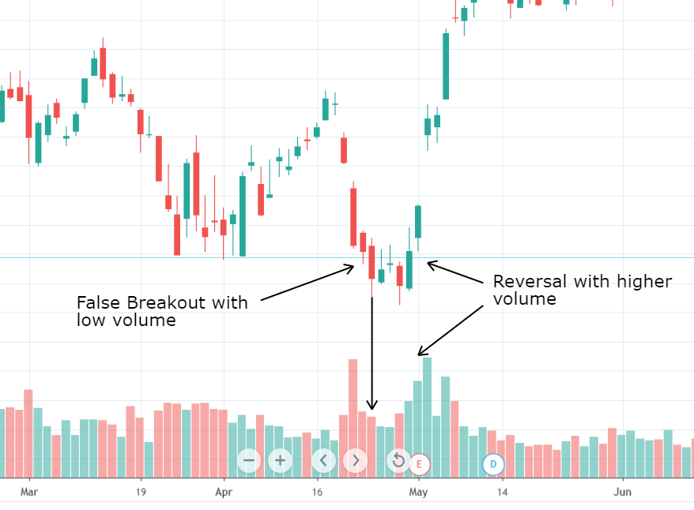

The stock market operates as a highly dynamic financial environment where securities are bought and sold, allowing investors to gain exposure to the growth of companies and governments. This marketplace is influenced by a myriad of factors, including economic indicators, interest rates, and investor sentiment. Central to the operation of the stock market is the concept of trade volume, which represents the total quantity of shares or contracts traded for a particular security over a specified period. Volume serves as a key indicator for traders and investors, offering insight into the strength or weakness of a market move and providing clues about future price movements.

Trade volume is further categorized into 'up volume' and 'down volume'. Up volume refers to the trading volume on a day when the stock price closes higher than its previous close, signifying bullish sentiment. Conversely, down volume occurs when the security's closing price is lower than its previous close, indicating bearish sentiment. Down volume is an important parameter as it helps in assessing the intensity of selling pressure in the market. When high down volume accompanies a decrease in prices, it may signal strong downward momentum and potential continuation of the trend.



Algorithmic trading has become an integral part of modern financial markets. It involves using computer algorithms to execute trading orders rapidly and efficiently, guided by pre-defined criteria like timing, price, and volume. This technology-driven trading method enhances market liquidity and can help streamline trading processes by minimizing human errors. The relevance of algorithmic trading has increased with its ability to analyze large volumes of market data in real-time and execute trades with high precision.

For algorithmic traders, understanding down volume trends is crucial. Algorithms can be programmed to incorporate volume analysis into their trading decisions, allowing traders to react proactively to changes in market conditions. Down volume analysis helps in identifying potential trend reversals or confirmations, thus assisting traders in optimizing their strategies. Analyzing these trends can also play a vital role in risk management, enabling traders to limit their exposure during potential downtrends or to capitalize on oversold conditions. The integration of down volume analysis into algorithmic trading systems is vital for maintaining a competitive edge in today's fast-evolving financial markets.

## Table of Contents

## Understanding Down Volume in Security Trading

Down volume in security trading refers to the trading volume associated with a decrease in a security's price during a specific period. It is a key indicator for traders aiming to understand market sentiment and the dynamics of price movements. 

Unlike up volume, which is linked to price increases, down volume occurs when the trading activity is concentrated on selling rather than buying, suggesting bearish market conditions. Down volume is crucial as it often precedes further price declines, acting as a warning signal for potential downtrends.

To measure down [volume](/wiki/volume-trading-strategy), traders utilize several indicators and metrics. One common approach is the volume down-day ratio, which compares the volume on days when the price falls to the overall trading volume. Technical indicators such as the On-Balance Volume (OBV) can also provide insights. The OBV calculates a cumulative total that adds volume on up-days and subtracts volume on down-days, helping traders gauge whether recent down volumes might signal upcoming price changes.

Down volume can significantly impact stock prices. A high down volume may increase selling pressure, leading to further price drops. Conversely, a decrease in selling activity, despite high down volume, might suggest a potential price reversal if other indicators align.

Common patterns associated with down volume include the infamous "selling climax," where a sharp and high-volume decline sets the stage for a potential market bottom or "oversold" condition. Another pattern is the "distribution phase," where sustained down volumes over time might indicate that informed investors are liquidating positions, often preceding a prolonged bear market.

Understanding these patterns and metrics is essential for traders looking to make informed decisions, using down volume as a strategic tool within their broader trading approach.

## Algorithmic Trading and Its Relevance

Algorithmic trading, often abbreviated as algo trading, refers to the use of computer algorithms to automate trading decisions. It involves the execution of orders based on predetermined criteria, which can encompass a wide range of conditions such as timing, price, and volume. This method removes human emotions from trading decisions, aiming to increase efficiency and profitability in financial markets. Typically, these algorithms follow a set of coded instructions based on technical analysis, statistical formulas, or custom strategies unique to individual traders or institutions.

### Types of Algorithms Commonly Used in Trading

There are several types of algorithms utilized in trading, each serving different purposes and strategies:

1. **Trend Following Algorithms**: These algorithms focus on identifying market trends and making trades that align with those trends. They often use technical indicators like moving averages to decide when to enter or exit trades.

2. **Arbitrage Algorithms**: These algorithms exploit price discrepancies between different markets or securities. They are designed to identify and execute trades rapidly to profit from these temporary differences.

3. **Market Making Algorithms**: These algorithms provide liquidity to markets by continuously quoting buy and sell prices, capturing the bid-ask spread.

4. **Volume-Weighted Average Price (VWAP) Algorithms**: These aim to execute orders that match the volume-weighted average price of a security over a specified period.

5. **Statistical Arbitrage Algorithms**: These use statistical and econometric models to identify and exploit price discrepancies among related securities.

6. **Machine Learning-Driven Algorithms**: Leveraging advanced machine learning techniques, these algorithms analyze vast amounts of data to identify trading opportunities, adapting to evolving market conditions.

### Benefits of Using Algorithms for Trading in Relation to Volume Analysis

Algorithms offer significant benefits when used in conjunction with volume analysis:

- **Speed and Efficiency**: Algorithms can process and analyze large volumes of data instantly, executing trades much faster than human traders could.

- **Accuracy**: By minimizing human errors, algorithmic trading can improve the precision of trading decisions, especially in volume analysis where minute fluctuations are critical.

- **Consistent Strategy Execution**: Algorithms ensure that trading strategies are applied consistently, without deviation, which is particularly beneficial in handling large volumes of data and transactions efficiently.

- **Scalability**: Algorithms can handle growing datasets and larger transaction volumes seamlessly, making them scalable with market demands.

### Challenges Faced by Algo Traders in Volatile Markets

Algo traders encounter various challenges, especially in volatile market conditions:

- **Slippage**: In fast-moving markets, the price at which a trade is executed may differ from the expected price, affecting profitability.

- **Latent Market Dangers**: Sudden market shifts can render algorithms ineffective if they rely on outdated data or parameters not suited to the current market climate.

- **Reliability and System Failures**: Technical glitches, such as software bugs or connectivity issues, can disrupt trading operations, leading to significant financial losses.

- **Regulatory Compliance**: Keeping abreast of changing regulations to ensure algorithms adhere to legal standards can be complex and resource-intensive.

### Importance of Integrating Volume Analysis in Trading Algorithms

The integration of volume analysis in trading algorithms is vital due to its significant impact on market insights. Volume is a primary indicator of market activity, providing clues about the strength of a price trend or the potential for a reversal. By analyzing volume data, algorithms can:

- Enhance decision-making accuracy by correlating price movements with trading volume.
- Identify liquidity levels, improving the timing and execution of trades.
- Adapt to market changes, such as the onset of high-impact events that typically see significant volume shifts.

Incorporating robust volume analysis within trading algorithms ensures more informed and strategically sound trading decisions, crucial for maintaining a competitive edge in fast-paced financial markets.

## Strategies for Trading Down Volume

Trading strategies that focus on down volume aim to capitalize on the insights provided by decreased trading activity, which can indicate a variety of market conditions such as impending reversals, market weakness, or the exhaustion of particular trends.

### Overview of Trading Strategies

1. **Contrarian Strategies**:
   Contrarian trading based on down volume involves taking positions opposite to the prevailing market direction. A prolonged decrease in volume could suggest waning [momentum](/wiki/momentum), prompting contrarian traders to initiate positions that anticipate a reversal. This approach requires meticulous analysis of volume trends alongside other technical indicators to identify potential entry and [exit](/wiki/exit-strategy) points.

2. **Breakout Strategies**:
   Breakout strategies utilize down volume to identify periods of low [volatility](/wiki/volatility-trading-strategies) and reduced trading activity, often indicating consolidation phases. Traders monitor down volume to anticipate breakouts, entering trades as price moves significantly in either direction, often with increased volume that confirms the [breakout](/wiki/breakout-trading).

3. **Volume Divergence Strategies**:
   Traders employing volume divergence strategies look for discrepancies between price movements and volume trends. When prices ascend but down volume prevails, it may signal underlying weakness and forthcoming price declines. Such divergences signal potential short-selling opportunities.

### Case Studies of Successful Down Volume Trading Strategies

While specific case studies often involve proprietary strategies, well-documented examples include significant market events where volume analysis provided clear signals. For instance, during the 2008 financial crisis, a persistent decrease in volume provided early warnings of market sentiment shifts, allowing astute traders to adjust their portfolios accordingly.

### Mitigating Risks Associated with Low Volume

Trading during periods of low volume carries inherent risks such as increased volatility and the potential for price manipulation. To mitigate these risks, traders can use:
- **Stop-Loss Orders**: Setting stop-loss orders can limit potential losses by automatically triggering a sale when prices fall to a certain level.
- **Position Sizing**: Managing trade sizes based on volume conditions helps mitigate exposure to risk during low volume periods.

### Role of Data Analytics and Machine Learning

Data analytics and [machine learning](/wiki/machine-learning) enhance down volume strategies by providing sophisticated tools for pattern recognition and predictive modeling. Machine learning algorithms can process vast datasets to detect subtle correlations between volume changes and price movements, refining strategy effectiveness. A simple Python example includes using machine learning libraries like scikit-learn to perform volume prediction:

```python
from sklearn.ensemble import RandomForestRegressor
from sklearn.model_selection import train_test_split
import numpy as np

# Sample features (e.g., previous volumes, market indices) and target (future volume)
X = np.array([[100, 200], [200, 250], [150, 230], [300, 320]])
y = np.array([210, 260, 240, 330])

# Split data into training and test sets
X_train, X_test, y_train, y_test = train_test_split(X, y, test_size=0.2, random_state=42)

# Create and train the model
model = RandomForestRegressor(n_estimators=100, random_state=42)
model.fit(X_train, y_train)

# Predict future volume
predictions = model.predict(X_test)
```

### Backtesting for Optimization

Backtesting allows traders to evaluate how their down volume strategies perform under historical market conditions. A systematic approach to [backtesting](/wiki/backtesting) involves:
- **Historical Data Analysis**: Utilizing historical volume and price data to simulate trades.
- **Performance Metrics**: Calculating metrics like Sharpe ratio, maximum drawdown, and total returns to assess strategy viability.

By continuously refining strategies through backtesting, traders can enhance their ability to predict and respond to market shifts effectively, ultimately leading to improved decision-making processes in live trading environments.

## Tools and Platforms Supporting Down Volume Analysis

Introduction to popular trading platforms that support volume analysis can provide traders with vital insights into market trends and potential price movements. These platforms often integrate sophisticated tools and analytics to facilitate comprehensive volume analysis, which includes both up and down volume scenarios. Some renowned trading platforms that incorporate volume analysis capabilities include MetaTrader 5, TradeStation, and NinjaTrader.

**Features to look for in trading software for volume analysis** involve several key components. Firstly, real-time data feeds are essential, enabling traders to assess up-to-the-minute volume information. Additionally, customizable charting tools that incorporate indicators like the On-Balance Volume (OBV) or the Volume Price Trend (VPT) can provide deeper insights into volume movements. Moreover, historical data analysis and backtesting functionalities are crucial for validating trading strategies based on past market conditions. User-friendly interfaces that simplify complex data interpretation can also enhance the efficiency of volume analysis.

**Analytical tools specifically designed for tracking down volume** are critical in identifying bearish trends and potential sell signals. Tools such as Volume Oscillators, Volume At Price (VAP), and Cumulative Volume Index (CVI) are commonly employed by traders focusing on down volume. These tools help quantify the magnitude of selling pressure relative to buying interest, offering insights into potential market shifts.

**AI and machine learning are enhancing volume analysis tools** by automating the identification of volume patterns and trends. These technologies can analyze vast amounts of data more efficiently than human traders, recognizing subtle volume indicators that may precede market movements. For example, machine learning algorithms can be designed to categorize volume patterns and predict future price actions, providing a competitive edge in fast-moving markets.

A **comparison of free vs. premium tools for volume analysis** often reveals key distinctions in terms of data accessibility and analytical depth. Free tools may offer basic volume indicators and limited historical data, suitable for novice traders. In contrast, premium tools generally provide comprehensive features such as advanced analytical capabilities, extensive data histories, and integrated AI functions, catering to professional traders seeking robust volume analysis solutions.

In conclusion, platforms and tools supporting down volume analysis are integral to modern trading practices. By leveraging advanced technologies and sophisticated analytical tools, traders can gain valuable insights into market dynamics and improve their trading strategies accordingly.

## Case Studies and Real-life Examples

Historical market events provide a rich context for understanding the role of down volume in security trading. One prominent example is the 2008 financial crisis. During the period leading up to the crash, analysts observed significant spikes in down volume. The surge in sell orders reflected a growing lack of confidence in the market, which subsequently led to a sharp decline in stock prices. The down volume data acted as a prelude to the eventual market correction, highlighting its predictive value in financial analyses.

Numerous traders and companies have built successful strategies around volume-focused approaches. Traders like Paul Tudor Jones have historically emphasized volume analytics as a cornerstone of their trading strategies. Tudor Jones famously used patterns in trading volume to anticipate significant market shifts, notably during the Black Monday crash in 1987, enabling him to execute timely short positions that resulted in substantial profits.

From past market downturns, one of the major lessons learned is the importance of monitoring volume indicators as a part of risk management. During the Dot-com bubble burst in 2000, traders who closely watched down volume trends were better positioned to exit overvalued positions before prices plummeted. These events underscore the necessity for traders to incorporate volume trends, especially down volume, into their analytical frameworks as a precaution against sudden market reversals.

A notable case study illustrating the influence of down volume predictions is the 2020 coronavirus market downturn. Algorithmic traders equipped with sophisticated volume analysis tools were able to detect unusual down volume activity in sectors such as travel and hospitality. These early warnings enabled them to adjust their strategies, either by hedging their positions or reallocating assets to more resilient sectors, thus mitigating potential losses.

In recent market scenarios, the implications of down volume are evident in the rise of meme stocks such as GameStop in 2021. During phases of high volatility, down volume patterns were often seen amidst the buying frenzy. Traders who successfully navigated these swings were those who paid close attention to the shifting volumes, using this data to gauge sentiment and market direction. This case further illustrates that even in the age of social media-driven trading, traditional volume analysis continues to serve as a critical tool in understanding market dynamics.

In conclusion, these case studies and real-life scenarios reinforce the integral role of down volume analysis in executing informed trading strategies. Whether during crises or in everyday trading, understanding volume patterns can offer valuable insights and improve decision-making processes, ultimately fostering more resilient trading practices.

## Future of Down Volume Analysis in Algo Trading

Algorithmic trading, which leverages computer algorithms to execute trades at high speed and volume, is continuously evolving, notably in the analysis of trading volumes such as down volume. Down volume refers to periods when the trading volume decreases as prices fall, often indicating market trends and investor sentiment that are pivotal for algorithmic strategies.

### Emerging Trends in Algorithmic Trading Focusing on Down Volume

Recent developments in [algorithmic trading](/wiki/algorithmic-trading) point towards a greater focus on down volume analysis. Algorithms are being designed to assess volume patterns intricately, identifying potential market shifts before they occur. This includes the use of complex mathematical models and machine learning techniques to detect subtle changes in trading volumes, signals of potential downtrends, or reversals. 

Advanced algorithms are now capable of not just reacting to market changes but predicting them by analyzing historical data and recognizing patterns. With the increase in available data due to the proliferation of electronic trading platforms, traders can leverage down volume data to make more accurate predictions about market trends.

### The Potential Influence of AI Advancements on Volume Analysis

Artificial intelligence (AI) has the potential to significantly enhance down volume analysis. AI-driven technologies, particularly those utilizing [deep learning](/wiki/deep-learning), can process vast amounts of data more efficiently and accurately than traditional methods. These technologies can identify complex patterns in trading data that human traders might overlook.

For example, AI can be used to train models that predict future downtrends by analyzing historical volume and price data. These models can differentiate normal market fluctuations from significant changes in volume that could suggest a major market move. The integration of AI could lead to algorithms that refine their strategies in real-time, adapting to current market conditions quickly.

### Predictions for How the Landscape of Volume Trading May Evolve

The landscape of volume trading is expected to evolve with technologies like AI becoming commonplace. In the future, trading strategies are likely to rely heavily on predictive analytics, with algorithms that can forecast down volume occurrences before they affect stock prices. Traders will increasingly depend on real-time data processing capabilities, allowing them to make split-second decisions based on the latest market information.

Moreover, the integration of advanced data analytics tools will lead to more nuanced trade strategies that account for a broader range of market signals. This may include the development of hybrid strategies that incorporate both fundamental and technical analyses to capitalize on down volume data effectively.

### The Role of Regulatory Changes Affecting Volume-Based Trading Strategies

Regulatory changes will also play a significant role in shaping the future of volume-based trading strategies. With increasing scrutiny on high-frequency trading and market manipulation, regulators may impose stricter guidelines on how trading algorithms can interpret and act on volume data. 

Potential regulations could focus on ensuring transparency and fairness in how algorithms operate, particularly concerning market [liquidity](/wiki/liquidity-risk-premium) and stability. Traders may need to adapt their strategies to comply with new rules, possibly by increasing their reliance on transparent, auditable algorithms.

### Conclusion on the Growing Necessity of Down Volume Analysis in Trading

As trading environments become more complex, the necessity of down volume analysis will continue to grow. Algorithmic traders who harness this data effectively will have a significant advantage, allowing them to anticipate market movements and mitigate risks associated with volatility. The integration of AI and machine learning technologies holds the promise of transforming how down volume data is analyzed, enabling more strategic and insightful trading decisions. In this rapidly changing financial landscape, understanding and leveraging down volume trends is crucial for success in algorithmic trading.

## References & Further Reading

[1]: Bergstra, J., Bardenet, R., Bengio, Y., & Kégl, B. (2011). ["Algorithms for Hyper-Parameter Optimization."](https://papers.nips.cc/paper/4443-algorithms-for-hyper-parameter-optimization) Advances in Neural Information Processing Systems 24.

[2]: ["Advances in Financial Machine Learning"](https://www.amazon.com/Advances-Financial-Machine-Learning-Marcos/dp/1119482089) by Marcos Lopez de Prado

[3]: ["Evidence-Based Technical Analysis: Applying the Scientific Method and Statistical Inference to Trading Signals"](https://www.amazon.com/Evidence-Based-Technical-Analysis-Scientific-Statistical/dp/0470008741) by David Aronson

[4]: ["Machine Learning for Algorithmic Trading"](https://github.com/stefan-jansen/machine-learning-for-trading) by Stefan Jansen

[5]: ["Quantitative Trading: How to Build Your Own Algorithmic Trading Business"](https://www.amazon.com/Quantitative-Trading-Build-Algorithmic-Business/dp/1119800064) by Ernest P. Chan