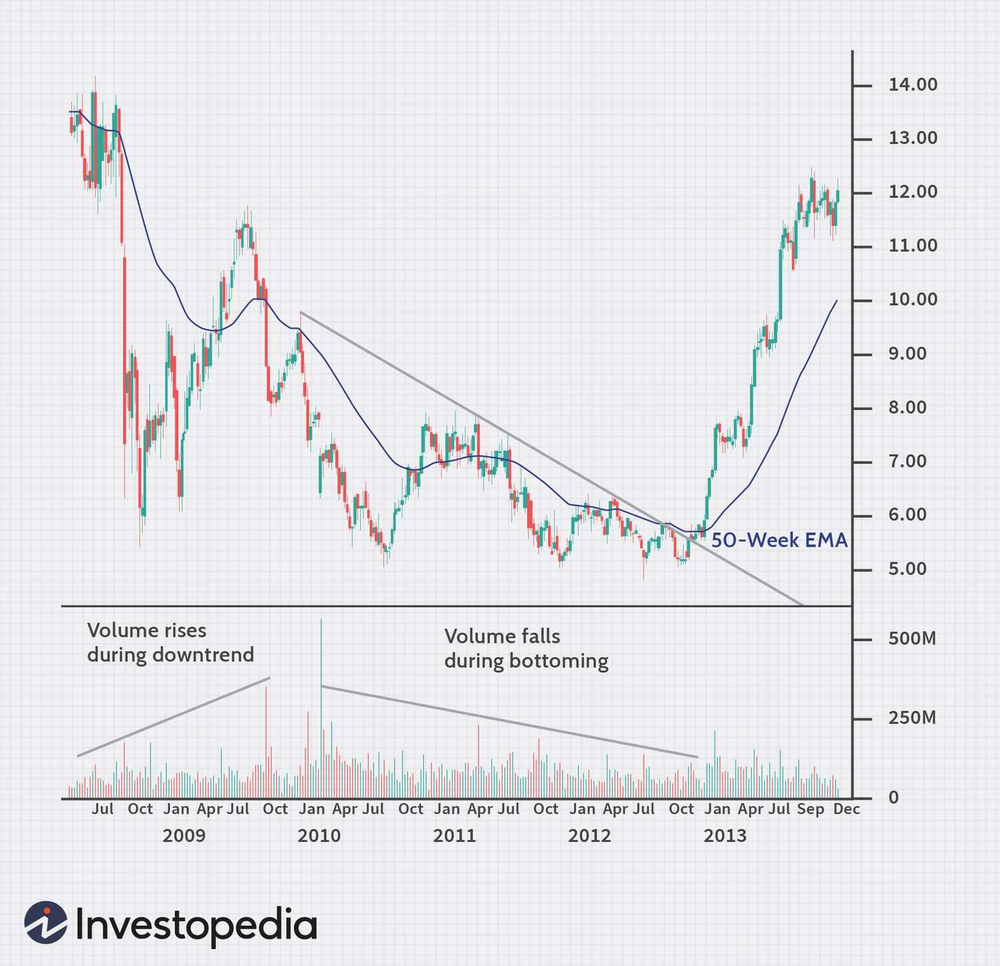

## Table of Contents

## What is down volume in securities?

Down volume in securities refers to the total number of shares traded when the price of a security goes down during a trading day. It is an important measure used by investors and analysts to understand market trends and the strength of price movements. When the down volume is high, it suggests that more people are selling the security, which can indicate bearish sentiment in the market.

This measure is often compared to up volume, which is the total number of shares traded when the price of a security goes up. By looking at the ratio of up volume to down volume, investors can get a sense of the overall market direction. For example, if the down volume is significantly higher than the up volume over a period of time, it might suggest that the market is trending downwards, and vice versa.

## How is down volume calculated?

Down volume is calculated by adding up the number of shares traded in all the transactions where the price of the security went down during a trading day. For example, if a stock had three trades where the price dropped, and the volumes of those trades were 100 shares, 200 shares, and 300 shares, the down volume for that day would be 600 shares.

This measure helps investors see how much trading activity is happening on the downside. If the down [volume](/wiki/volume-trading-strategy) is very high, it means a lot of people are selling the stock when the price is falling. This can be a sign that people are worried about the stock and think its price might keep going down. By comparing down volume to up volume, which is the total shares traded when the price goes up, investors can get a better idea of whether the market is moving up or down.

## Why is down volume important for investors?

Down volume is important for investors because it shows how many people are selling a stock when its price is going down. If a lot of shares are being traded on down days, it means more people are trying to sell the stock than buy it. This can tell investors that other people might be worried about the stock and think its price might keep falling. By looking at down volume, investors can get clues about what other people think about the stock and the market.

Investors also compare down volume to up volume, which is the number of shares traded when the price goes up. By looking at both, investors can see if the market is moving up or down. If down volume is much higher than up volume over time, it can be a sign that the market is trending downwards. This helps investors make smarter choices about when to buy or sell their stocks.

## What does high down volume indicate about a security?

High down volume on a security means that a lot of people are selling it when its price is going down. This usually shows that investors are worried about the security and think its price might keep falling. When you see high down volume, it's like seeing a lot of people running away from the security, which can be a sign that something might be wrong.

By comparing the down volume to the up volume, which is the number of shares traded when the price goes up, investors can tell if the security is getting more popular or less popular. If the down volume is much higher than the up volume over time, it can mean that more and more people are losing faith in the security. This can help investors decide if it's a good time to sell their shares or wait for a better moment.

## How does down volume differ from up volume?

Down volume and up volume are two ways to measure how many shares of a stock are traded. Down volume is the total number of shares traded when the stock price goes down during a trading day. On the other hand, up volume is the total number of shares traded when the stock price goes up. So, down volume shows how much trading happens when people are selling the stock at a lower price, while up volume shows how much trading happens when people are buying the stock at a higher price.

These two measures help investors understand what other people think about the stock. If the down volume is high, it means a lot of people are selling the stock when the price is falling, which can show that people are worried about it. If the up volume is high, it means a lot of people are buying the stock when the price is going up, which can show that people are feeling good about it. By comparing down volume and up volume, investors can see if more people are buying or selling the stock and decide if they should do the same.

## Can down volume be used to predict market trends?

Down volume can help investors guess where the market might be heading. If you see a lot of down volume over several days, it means many people are selling their stocks when the price is going down. This could be a sign that the market might keep going down because more people are worried and want to sell their stocks before the price drops even more.

By comparing down volume to up volume, which is the number of shares traded when the price goes up, investors can get a better idea of the market's direction. If down volume is much higher than up volume for a while, it might mean the market is in a downward trend. But remember, down volume is just one piece of the puzzle. It's important to look at other things too, like news about the economy or company reports, to make the best guesses about where the market is going.

## What are some common misconceptions about down volume?

One common misconception about down volume is that it always means a stock or the market is going to keep going down. People might think if they see a lot of down volume one day, the price will keep dropping. But down volume just shows what happened that day. It doesn't tell you what will happen next. Other things, like news or company reports, can change the market's direction.

Another misconception is that down volume is the only thing you need to look at to understand the market. Some people might focus only on down volume and ignore up volume, which is the number of shares traded when the price goes up. But to really understand the market, you need to look at both down volume and up volume together. This helps you see if more people are buying or selling the stock.

## How do traders use down volume in technical analysis?

Traders use down volume in technical analysis to understand how people are feeling about a stock or the market. They look at down volume to see if a lot of people are selling the stock when the price is going down. If the down volume is high, it might mean that people are worried about the stock and think the price might keep falling. This can help traders decide if it's a good time to sell their own shares or if they should wait and see what happens next.

Traders also compare down volume to up volume, which is the number of shares traded when the price goes up. By looking at both, they can see if the market is moving up or down. If down volume is much higher than up volume over time, it might be a sign that the market is in a downward trend. This helps traders make better choices about when to buy or sell their stocks. But they don't just look at down volume alone; they use it along with other information to make their decisions.

## What role does down volume play in market sentiment analysis?

Down volume is important for understanding how people feel about the market. It shows how many people are selling a stock when its price is going down. If the down volume is high, it means a lot of people are worried about the stock and think its price might keep falling. This can tell investors that other people are not feeling good about the stock, which can affect their own decisions about buying or selling.

Traders use down volume along with up volume, which is the number of shares traded when the price goes up, to get a better idea of market sentiment. If down volume is much higher than up volume over time, it might mean that more people are losing faith in the stock or the market. By looking at these volumes, investors can understand if the general feeling is positive or negative and make smarter choices about their investments.

## How does down volume correlate with other market indicators?

Down volume can tell us a lot when we look at it with other market indicators. For example, if we see high down volume and the market's average price is also going down, it might mean that more people are selling their stocks because they're worried. This can be a sign that the market might keep going down. Another thing to look at is the trading volume, which is the total number of shares traded in a day. If the down volume is a big part of the total trading volume, it can show that the market is feeling more negative.

Another important indicator to compare with down volume is the market's moving averages. Moving averages help us see the average price of a stock over time. If down volume is high and the stock price is also below its moving average, it can mean that the stock is in a downward trend. This helps investors decide if it's a good time to sell their stocks or wait for a better moment. By looking at down volume along with these other indicators, investors can get a better picture of what's happening in the market and make smarter choices.

## What advanced strategies involve using down volume data?

Traders can use down volume data in a strategy called volume analysis to make better guesses about where the market is heading. They look at how much down volume there is compared to up volume over time. If they see a lot of down volume day after day, it might mean the market is in a downward trend. Traders can use this information to decide if it's a good time to sell their stocks before the price drops even more. They might also use down volume along with other things like moving averages and price charts to get a clearer picture of the market's direction.

Another strategy is called the volume-weighted average price (VWAP). Traders use VWAP to see if a stock is being bought or sold at a price that's better or worse than the average. If the down volume is high and the stock price is below the VWAP, it can mean that more people are selling the stock at a lower price than the average. This can tell traders that the stock might keep going down. By looking at down volume and VWAP together, traders can make smarter choices about when to buy or sell their stocks.

## How has the interpretation of down volume evolved with modern trading technologies?

The way people understand down volume has changed a lot because of new trading technologies. In the past, traders had to wait for the end of the day to see the down volume numbers. Now, with computers and the internet, traders can see down volume in real time. This means they can make quicker decisions about buying or selling stocks. Also, new tools let traders look at down volume in different ways, like with charts and graphs, which makes it easier to spot patterns and trends.

Modern trading platforms also let traders use down volume along with other data, like up volume and moving averages, to get a better picture of the market. For example, they can use software to see how down volume compares to up volume over time, which helps them guess where the market might be going. This has made down volume a more important part of how traders understand and react to the market.

## References & Further Reading

[1]: Bergstra, J., Bardenet, R., Bengio, Y., & Kégl, B. (2011). ["Algorithms for Hyper-Parameter Optimization."](https://papers.nips.cc/paper/4443-algorithms-for-hyper-parameter-optimization) Advances in Neural Information Processing Systems 24.

[2]: ["Advances in Financial Machine Learning"](https://www.amazon.com/Advances-Financial-Machine-Learning-Marcos/dp/1119482089) by Marcos Lopez de Prado

[3]: ["Evidence-Based Technical Analysis: Applying the Scientific Method and Statistical Inference to Trading Signals"](https://www.amazon.com/Evidence-Based-Technical-Analysis-Scientific-Statistical/dp/0470008741) by David Aronson

[4]: ["Machine Learning for Algorithmic Trading"](https://github.com/stefan-jansen/machine-learning-for-trading) by Stefan Jansen

[5]: ["Quantitative Trading: How to Build Your Own Algorithmic Trading Business"](https://www.amazon.com/Quantitative-Trading-Build-Algorithmic-Business/dp/1119800064) by Ernest P. Chan