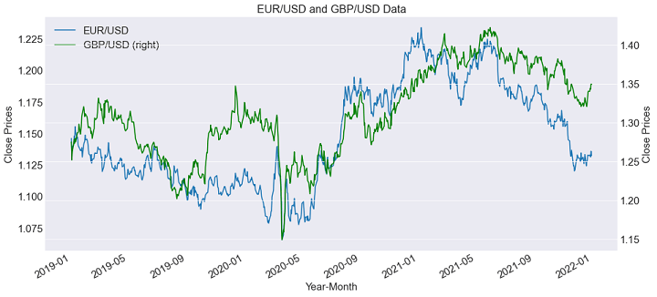

## Table of Contents

## What is the yFinance library and why is it useful for downloading Forex price data?

The yFinance library is a Python tool that lets you easily get financial data from Yahoo Finance. It's like a helper that can fetch stock prices, forex rates, and other financial info just by using simple code commands. You don't need to go to the Yahoo Finance website and copy data by hand; yFinance does it for you automatically.

It's really useful for downloading Forex price data because it makes the process quick and easy. If you're studying currency markets or building a trading app, you can use yFinance to pull in the latest exchange rates without any hassle. This saves you time and helps you focus on analyzing the data instead of spending hours collecting it.

## How do you install the yFinance library in Python?

To install the yFinance library in Python, you need to use a tool called pip, which is like a package manager for Python. Open your command prompt or terminal, and type in the command `pip install yfinance`. Hit enter, and pip will download and install the yFinance library for you. It's pretty quick and easy, and you'll see messages telling you how it's going.

Once it's done, you can start using yFinance in your Python scripts. Just make sure to include `import yfinance as yf` at the beginning of your code. This tells Python that you want to use the yFinance library, and you can start fetching financial data right away.

## What are the basic steps to download Forex price data using yFinance?

To download Forex price data using yFinance, first you need to import the library in your Python script. You do this by writing `import yfinance as yf` at the top of your code. This lets you use yFinance's tools. Next, you need to tell yFinance which currency pair you want data for. For example, if you want data for the EUR/USD pair, you create a Ticker object like this: `ticker = yf.Ticker("EURUSD=X")`. This tells yFinance to look up the EUR/USD exchange rate.

After setting up the Ticker object, you can download the price data. You do this by calling the `history` method on your Ticker object. For example, `data = ticker.history(period="max")` will get you all the historical data available for the EUR/USD pair. You can change the `period` parameter to get data for different time frames, like "1d" for one day or "1mo" for one month. Once you have the data, you can use it in your Python script to analyze or display the Forex prices.

## How can you specify the time range for the Forex data you want to download?

When you want to download Forex data for a specific time range, you can use the `history` method with the `start` and `end` parameters. For example, if you want data from January 1, 2022, to December 31, 2022, you would write `data = ticker.history(start="2022-01-01", end="2022-12-31")`. This tells yFinance to give you the data just for that year. It's like asking for a specific part of the book instead of the whole thing.

You can also use the `period` parameter if you want data for a common time frame like a day, a week, or a month. For example, `data = ticker.history(period="1mo")` will get you data for the last month. This is handy if you want recent data without picking exact dates. Both ways let you focus on the time range that's important for your analysis or project.

## What types of Forex data can you retrieve with yFinance, and how do you specify them?

With yFinance, you can get different types of Forex data like the opening price, closing price, highest price, and lowest price for a currency pair each day. You can also get the volume of trades, which shows how many times people bought or sold that currency pair. This data helps you see how the price of the currency changed over time and how popular it was to trade.

To specify the types of data you want, you use the `history` method on your Ticker object. When you call `history`, it gives you a DataFrame with columns for 'Open', 'High', 'Low', 'Close', and 'Volume' by default. If you want only certain types of data, you can select them from the DataFrame after you get it. For example, if you just want the closing prices, you can use `data['Close']` to look at only that column.

## How do you handle and process the downloaded Forex data in Python?

Once you've downloaded Forex data using yFinance, you can start handling and processing it in Python. The data comes in a DataFrame, which is like a big table where each row is a day and each column is a type of data like 'Open', 'High', 'Low', 'Close', and 'Volume'. You can use Python's pandas library to work with this DataFrame. For example, you can select specific columns, like the closing prices, by using `data['Close']`. You can also do simple calculations, like finding the average closing price over a period of time, using `data['Close'].mean()`.

To make the data easier to understand, you might want to create charts or graphs. You can use libraries like matplotlib or seaborn to do this. For instance, to plot the closing prices over time, you could use `data['Close'].plot()`. This will show you a line graph where the x-axis is the date and the y-axis is the closing price. You can also add more details to your graphs, like labels and titles, to make them clearer. This way, you can see trends and patterns in the Forex data that might be hard to spot just by looking at numbers.

## What are common errors you might encounter when using yFinance to download Forex data, and how do you resolve them?

When you use yFinance to download Forex data, you might run into some common errors. One error is a "ConnectionError" which happens if your internet connection is not working well. Another error is a "RateLimitError" which means you're asking for too much data too quickly, and Yahoo Finance is telling you to slow down. You might also see a "KeyError" if the data you're looking for isn't available, like if you try to get data for a currency pair that Yahoo Finance doesn't have.

To fix these errors, you can try a few things. For a "ConnectionError", make sure your internet is working and try again. If you get a "RateLimitError", wait a little bit before asking for more data, or break your data requests into smaller chunks so you're not asking for everything at once. For a "KeyError", double-check the currency pair you're using to make sure it's correct and available on Yahoo Finance. Sometimes, you might need to try a different currency pair or check if Yahoo Finance has updated their data.

## How can you automate the process of downloading Forex data at regular intervals using yFinance?

To automate downloading Forex data at regular intervals using yFinance, you can use Python's `schedule` library. First, you write a function that uses yFinance to download the Forex data you want. Then, you set up the `schedule` library to run this function at the times you choose, like every hour or every day. You can do this by telling `schedule` to call your function at a specific interval. After setting it up, you need to keep your Python script running all the time, so it can keep checking the schedule and downloading the data when it's supposed to.

Keeping your script running all the time can be done with a `while` loop that never stops. This loop will keep checking the schedule and running your function to download the Forex data at the right times. You can also save the data to a file after each download, so you have a record of all the Forex data you've collected over time. This way, you can automate the process and always have the latest Forex data without having to do it manually.

## What are the limitations of using yFinance for Forex data, and how can you overcome them?

Using yFinance to get Forex data has some limits. One big limit is that the data might not be perfect. Sometimes, there can be missing info or the numbers might not be exactly right. This can happen because yFinance gets its data from Yahoo Finance, and Yahoo Finance might not always have all the data you need. Another limit is that you can only get data for certain currency pairs. If you want data for a pair that Yahoo Finance doesn't have, you're out of luck. Also, if you try to download too much data too fast, you might get a "RateLimitError" and have to wait before you can get more data.

To get around these limits, you can try a few things. If the data from yFinance isn't good enough, you might want to use another tool or website that gives you better data. There are other places online where you can get Forex data, like from financial data providers or APIs. If you need data for a currency pair that yFinance doesn't have, you can look for another source that does have it. And if you keep getting "RateLimitError", you can slow down your requests or break them into smaller pieces. This way, you can still get the Forex data you need, even if yFinance has some limits.

## How can you integrate yFinance with other Python libraries to enhance Forex data analysis?

You can make yFinance work better with other Python libraries to do more with your Forex data. For example, you can use pandas to clean up and organize the data you get from yFinance. Pandas is great at handling big tables of data, so you can use it to sort, filter, and do math on your Forex numbers. After getting the data with yFinance, you can use pandas to find averages, spot trends, and make the data easier to understand. You can also use numpy, which is good at doing fast calculations, to do things like find the standard deviation of prices or calculate how much prices have changed over time.

Another way to make your Forex analysis better is by using plotting libraries like matplotlib or seaborn. These libraries can turn your data into graphs and charts, which can help you see patterns and changes in the Forex market. For example, after downloading data with yFinance and organizing it with pandas, you can use matplotlib to draw a line graph of the closing prices over time. This visual way of looking at the data can help you understand it better than just looking at numbers. By combining yFinance with these other tools, you can do a lot more with your Forex data and make smarter decisions.

## What advanced techniques can you use with yFinance to optimize Forex data retrieval and analysis?

To make getting and looking at Forex data with yFinance even better, you can use some smart tricks. One way is to use multi-threading or multi-processing. This means you can ask for data from different currency pairs at the same time, instead of one after the other. It's like having several helpers working together to get the job done faster. You can also use caching, which means saving the data you've already downloaded so you don't have to get it again. This saves time and helps you avoid hitting Yahoo Finance's limits on how much data you can ask for.

Another cool trick is to use machine learning to predict future Forex prices. After you get the data with yFinance, you can use libraries like scikit-learn to train models on past prices and try to guess what will happen next. This can help you make better trading decisions. You can also use time series analysis to look at how prices change over time and find patterns that might be hard to see just by looking at the numbers. By combining these advanced techniques with yFinance, you can get more out of your Forex data and make smarter choices.

## How does yFinance compare to other libraries or APIs for downloading Forex price data in terms of functionality and performance?

yFinance is a handy tool for getting Forex price data because it's easy to use and free. It lets you download data for many currency pairs from Yahoo Finance with just a few lines of code. But, it has some limits. Sometimes the data might not be perfect, and you can only get data for certain currency pairs. Also, if you try to download too much data too fast, you might have to wait before you can get more. Compared to other tools, yFinance is good for quick and simple tasks, but it might not be the best choice if you need very accurate or special data.

Other libraries and APIs, like those from financial data providers like Alpha Vantage or Quandl, can give you more detailed and accurate Forex data. These tools often let you get data for more currency pairs and might have better data quality. But, they can be harder to use and might cost money. In terms of performance, yFinance is fast for small amounts of data, but if you need a lot of data or need it very quickly, other APIs might work better. So, yFinance is great for beginners or for simple projects, but for more advanced work, you might want to look at other options.

## What is Backtesting and Performance Analysis?

Backtesting is an essential step for evaluating the viability and effectiveness of trading strategies before deploying them in live market conditions. It involves simulating your trading strategy on historical data to assess its performance over time. By using the forex-python API, traders can conduct backtesting by accessing historical exchange rate data, which aids in reconstructing past market scenarios to test strategy outcomes.

### Utilizing Forex-python for Simulation

Forex-python provides functionalities to retrieve historical forex data. This capability is crucial for backtesting since it allows traders to simulate their strategies as if they were in real trading conditions. You can begin by fetching historical data using the `get_rates()` method from the `CurrencyRates` class. Here is a sample demonstration using Python:

```python
from forex_python.converter import CurrencyRates
import datetime

c = CurrencyRates()
start_date = datetime.datetime(2022, 1, 1)
end_date = datetime.datetime(2022, 12, 31)
historical_data = c.get_rates('USD', start_date, end_date)
```

Once you have your data, you can simulate trades, adjust your algorithm according to historical results, and refine your strategy for improved future performance.

### Plotting Trade Performance with Matplotlib

Visualization is key to understanding how well your strategy performed during backtesting. You can use the Matplotlib library to create various performance plots. This can include plotting the equity curve, daily returns, or cumulative returns, which provide insights into the [volatility](/wiki/volatility-trading-strategies) and overall trajectory of your account balance over time.

```python
import matplotlib.pyplot as plt

# Sample data representing cumulative returns over time
dates = [start_date + datetime.timedelta(days=i) for i in range((end_date-start_date).days)]
cumulative_returns = [calculate_returns(historical_data, date) for date in dates]

plt.plot(dates, cumulative_returns)
plt.title('Cumulative Returns Over Time')
plt.xlabel('Date')
plt.ylabel('Cumulative Returns')
plt.show()
```

This visualization aids in identifying trends, volatility, and turning points, which may prompt further analysis or strategy refinement.

### Key Performance Metrics

To analyze the effectiveness of your backtested strategy, focus on key performance metrics:

- **Sharpe Ratio**: A measure of risk-adjusted return, calculated by dividing the average return by the standard deviation of returns. It's a metric used to evaluate the sustainability of a trading strategy compared to a risk-free asset.

$$
Sharpe\ Ratio = \frac{E[R_p - R_f]}{\sigma_p}
$$

Where $E[R_p - R_f]$ is the expected return of the portfolio minus the risk-free rate, and $\sigma_p$ is the standard deviation of the portfolio's excess return.

- **Drawdown**: The peak-to-trough decline during a specific period, expressed as a percentage. It is vital for understanding the potential loss and recoverability of your strategy.

- **Overall Profitability**: The total returns generated by the strategy over the backtested period. This metric helps assess the raw financial benefit of employing the strategy.

### Refining Strategies Post-Analysis

Post backtesting, refining your strategy is crucial for enhancing future trading performance. Analyze identified weaknesses and strengths, and make necessary adjustments. This can involve changing parameter values, incorporating additional indicators, or optimizing entry and [exit](/wiki/exit-strategy) rules. Repeated backtesting after each refinement ensures your strategy is robust and adapted to the dynamic forex market, ultimately improving your overall trading outcomes.

By following these steps, traders can systematically evaluate their trading strategies, ensuring they operate efficiently before live deployment.

## References & Further Reading

[1]: ["Introduction to Algorithmic Trading Strategies"](https://onlinelibrary.wiley.com/doi/epdf/10.1002/9781119206033.fmatter) by Christopher L. Geczy, in The Oxford Handbook of Quantitative Asset Management.

[2]: Stewart, J. (2023). ["Why Python is Used for Algorithmic Trading"](https://www.interactivebrokers.com/campus/ibkr-quant-news/machine-learning-for-algorithmic-trading-in-python-a-complete-guide-part-i/).

[3]: ["Forex Trading: The Basics and the Strategies"](https://www.investopedia.com/articles/forex/11/why-trade-forex.asp) by Cory Mitchell at Investopedia.

[4]: ["Python for Finance: Mastering Data-Driven Finance"](https://books.google.com/books/about/Python_for_Finance.html?id=2qd9DwAAQBAJ) by Yves Hilpisch.

[5]: ["Algorithmic Trading & DMA: An introduction to Direct Access Trading Strategies"](https://www.amazon.com/Algorithmic-Trading-DMA-introduction-strategies/dp/0956399207) by Barry Johnson.