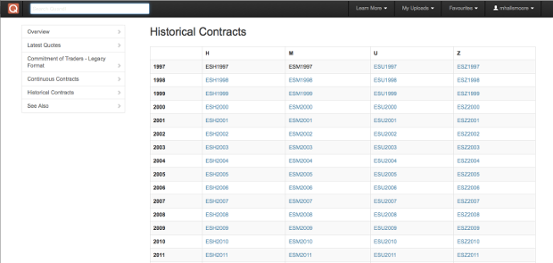

In the fast-paced world of algorithmic trading, access to accurate and comprehensive historical data is crucial. Traders use historical data to analyze past market behaviors, predict future trends, and ultimately, optimize their trading strategies. Among the various types of market data, futures data stands out as a valuable resource. This data encompasses information on contracts for commodities, indices, currencies, and other financial instruments, which can provide significant insights for developing and backtesting trading strategies.

Futures contracts are agreements to buy or sell an asset at a predetermined price at a specific time in the future, and they are widely used by various market participants for purposes such as hedging and speculation. Historical futures data allows traders to develop models that consider historical price movements, volumes, and other contract-specific information, thereby enabling robust simulations and tests of their trading algorithms before deploying them in live markets.



However, acquiring such data is often an expensive affair. Various financial data providers offer comprehensive datasets, but the cost of accessing these can be prohibitive, especially for individual traders and smaller firms. This cost barrier highlights the necessity for identifying free and reliable sources of historical futures data to democratize access to this crucial information.

This article explores the different avenues through which traders can access free historical futures data for algorithmic trading purposes. By leveraging free data resources, traders can enhance their algorithmic strategies without incurring additional financial burdens. This not only allows for more cost-effective trading operations but also empowers traders of all sizes to engage in data-driven decision-making, leading to potentially better-informed and more profitable trading activities.

## Table of Contents

## The Importance of Historical Futures Data in Algorithmic Trading

Historical futures data is integral to the success of algorithmic trading strategies due to its multifaceted utility in evaluating, developing, and refining these strategies. One of the primary uses of historical data is backtesting, which involves running trading algorithms on past market data to estimate how well they might perform in real-world trading scenarios. By simulating trades using historical data, traders can assess an algorithm's potential profitability, identify weaknesses, and make necessary adjustments to improve its robustness.

Understanding historical trends and patterns is essential for crafting trading strategies that are resilient to market fluctuations. Market [volatility](/wiki/volatility-trading-strategies), characterized by sudden price shifts, poses a challenge that can impact trading outcomes. By analyzing historical data, traders can identify periodical trends, volatility levels, and correlate these with specific events or market conditions. This understanding enables the development of algorithms that can adeptly manage dynamic market situations and minimize the risk of significant financial losses.

Risk management is another critical aspect where historical futures data proves invaluable. Detailed historical datasets allow traders to pinpoint unusual patterns, detect anomalies, or rare events that could disrupt trading strategies if not anticipated. For instance, historical data can reveal how certain futures contracts behave during economic recessions or geopolitical events. By incorporating this data into risk management frameworks, traders can create safeguards against potential market disruptions.

Access to comprehensive historical datasets is crucial for making informed trading decisions. The depth of historical information enhances the decision-making processes by providing context and a broader scope of market behaviors over time. Traders can thus formulate strategies that are not only responsive to recent trends but also resilient against historical precedents that may recur.

To sum up, historical futures data is a cornerstone in the realm of [algorithmic trading](/wiki/algorithmic-trading), underpinning the development and success of trading strategies through [backtesting](/wiki/backtesting), trend analysis, and effective risk management. Such historical insights form the basis of strategic decision-making in the trading environment, enabling traders to optimize their approaches for better performance.

## Sources of Free Historical Futures Data

Several platforms provide access to free historical futures data, offering varying levels of depth and granularity. Understanding these sources can help traders obtain valuable data without incurring additional costs.

Yahoo Finance is one of the most popular platforms for accessing free historical futures data. Although primarily known for its stock market information, Yahoo Finance offers historical data on futures as well. Traders can easily download the data in a user-friendly format, making it a practical starting point for many. Its accessibility and ease of use are significant advantages for those new to algorithmic trading or working with limited resources.

Quantiacs is another notable platform that provides free data to algorithm creators. It focuses not only on futures but also encompasses other asset classes. Quantiacs offers a comprehensive environment for backtesting as well as developing trading algorithms. Users can access futures data in a structured manner, supporting a wide range of strategies, from simple moving averages to complex [machine learning](/wiki/machine-learning) algorithms.

The Chicago Mercantile Exchange (CME), one of the world's largest financial derivatives exchanges, offers limited free historical data. By creating an account on the CME's website, traders can access a range of resources and datasets, albeit with some restrictions on the available depth and history. This availability can be particularly beneficial for specific futures contracts, considering CME's prominence in futures trading.

Open-source platforms, forums, and financial communities also present valuable avenues for obtaining historical futures data. Websites like Kaggle and forums dedicated to financial data can be excellent sources for datasets. However, traders must be cautious and validate the data's accuracy and reliability before use. These communities often share differing quality and formatting standards, requiring users to perform additional data cleaning and preparation.

In summary, these sources provide a foundation for traders seeking free historical futures data, each with its distinct features and considerations. While free data often comes with limitations, it remains an essential resource for beginner and budget-conscious traders aiming to enhance their algorithmic trading strategies.

## Utilizing Free Data for Developing Algorithms

Once the data is obtained, it can be integrated into various platforms such as QuantConnect, TradingView, or custom Python scripts to develop trading algorithms. These platforms are equipped with the tools needed for creating and evaluating trading strategies effectively.

**Data Cleaning and Preparation**

The initial step in utilizing free historical futures data is to ensure it is clean and prepared for analysis. This process involves removing any anomalies or errors, such as missing values, duplicates, or outliers, which could skew analysis results. Data should be standardized, with consistent formats for dates, values, and other parameters.

In Python, libraries like Pandas can be used for data cleaning. For example:

```python
import pandas as pd

# Load data
data = pd.read_csv('historical_futures_data.csv')

# Remove duplicates
data.drop_duplicates(inplace=True)

# Fill missing values
data.fillna(method='ffill', inplace=True)

# Convert date to datetime format
data['Date'] = pd.to_datetime(data['Date'])
```

**Developing Simple Strategies**

Simple trading strategies often rely on basic market indicators. Moving averages, relative strength index (RSI), and Bollinger Bands are popular tools that can help identify trends and potential entry or [exit](/wiki/exit-strategy) points.

For instance, a simple moving average crossover strategy, where trading signals are generated when a short-term moving average crosses a long-term moving average, can be easily implemented:

```python
# Calculate moving averages
data['SMA_20'] = data['Close'].rolling(window=20).mean()
data['SMA_50'] = data['Close'].rolling(window=50).mean()

# Generate buy/sell signals
data['Signal'] = 0
data.loc[data['SMA_20'] > data['SMA_50'], 'Signal'] = 1  # Buy
data.loc[data['SMA_20'] < data['SMA_50'], 'Signal'] = -1 # Sell
```

**Advanced Strategies with Machine Learning**

More sophisticated strategies can be crafted using machine learning models. These models are capable of uncovering latent patterns and relationships within historical data that may not be apparent through simple indicators. Techniques such as classification, regression, and clustering can predict price movements or categorize market conditions.

Utilizing libraries like Scikit-learn, traders can implement models such as decision trees, random forests, or support vector machines (SVM) to forecast future trends.

```python
from sklearn.ensemble import RandomForestClassifier

# Features and target
features = ['SMA_20', 'SMA_50']
X = data[features].dropna()
y = data['Signal']

# Train model
model = RandomForestClassifier()
model.fit(X, y)
```

**Optimizing Algorithms**

Optimization is key to enhancing the performance of trading algorithms. It involves the iterative adjustment of strategy parameters to improve predictive accuracy and reduce risks. This can be achieved through backtesting, where strategies are tested against historical data to evaluate their performance before live deployment.

Optimization methods include grid search and genetic algorithms for parameter tuning. These approaches can be implemented to fine-tune models, minimize false signals, and maximize returns.

Overall, through diligent data cleaning, strategic development, and optimization processes, traders can effectively leverage free historical futures data to develop robust algorithmic trading strategies. By iterating through simple and advanced techniques, traders can refine their algorithms to achieve better alignment with live market conditions.

## Challenges and Considerations

Accessing free historical futures data offers numerous advantages, primarily in reducing costs for traders. However, it comes with several inherent challenges and considerations that must be navigated to effectively use these resources.

Firstly, the completeness of datasets can vary significantly among free data providers. Many free sources may offer datasets with missing data points or limited frequency intervals, which can hinder comprehensive backtesting and analysis. For instance, while daily data might be readily available, obtaining minute-by-minute or tick-by-tick data could be restricted or missing altogether. This limitation can affect the granularity and precision of the trading algorithms.

Data quality is another critical concern. With free data sources, there is an increased risk of inaccuracies or inconsistencies. It is crucial to validate the accuracy of the data before incorporating it into trading models. Anomalies such as sudden price spikes or unexplained gaps need to be addressed to avoid skewed results in algorithm performance. Implementing data validation steps, such as cross-verifying with other data sources or using statistical methods to detect outliers, can help ensure data reliability.

Additionally, many free data providers impose restrictions on the historical coverage of their datasets. Often, the available data might only cover a few years, limiting the ability to perform long-term historical analysis. Geographic limitations might also exist where the data mainly encompasses certain markets or regions, which may not align with specific trading strategies targeting other areas.

Despite these challenges, diligent data handling and validation processes can render free resources highly beneficial, particularly for novice or budget-conscious traders. By being meticulous in verifying data integrity and filling gaps where possible, traders can leverage these free resources to their advantage without incurring additional costs. Maintaining regular updates of their data sources is essential to ensure the relevance and accuracy of their algorithmic strategies. This practice involves frequently checking for new data and integrating it with existing datasets to keep trading models tuned to the latest market conditions.

Ultimately, while accessing free historical futures data involves certain limitations and considerations, careful management and validation can mitigate potential drawbacks and enhance the development of effective trading algorithms.

## Conclusion

Assessing and utilizing free historical futures data is an integral part of crafting effective algorithmic trading strategies. By accessing a broad array of data sources and employing rigorous analysis techniques, traders can gain a significant advantage in comprehending market dynamics and trends. The ability to evaluate past market behaviors enhances the performance of trading algorithms by providing insights into potential future movements.

Despite challenges such as incomplete datasets or varying data quality, the strategic use of free data can substantially decrease costs associated with data acquisition. Methodical verification and thoughtful application of these resources can bolster strategy development, enabling traders to fine-tune algorithms based on historical patterns. For instance, backtesting a trading model using Python enables traders to iteratively optimize parameters to achieve desired performance metrics. 

```python
import numpy as np
import pandas as pd
from sklearn.model_selection import TimeSeriesSplit
from some_trading_library import HistoricalData, TradingStrategy

# Load historical futures data
data = HistoricalData('path/to/free/futures_data.csv')
prices = data.get_prices()

# Define a simple moving average strategy
class MovingAverageStrategy(TradingStrategy):
    def __init__(self, window):
        self.window = window

    def generate_signals(self, data):
        data['SMA'] = data['Close'].rolling(window=self.window).mean()
        data['Signal'] = np.where(data['Close'] > data['SMA'], 1, -1)
        return data

strategy = MovingAverageStrategy(window=20)
signals = strategy.generate_signals(prices)

# Cross-validation to evaluate the strategy
tscv = TimeSeriesSplit(n_splits=5)
for train_index, test_index in tscv.split(prices):
    train, test = prices.iloc[train_index], prices.iloc[test_index]
    strategy_params_tuning(train, test)
```

As technology evolves, ongoing exploration of emerging data sources and novel methodologies will further enhance algorithm development. The undeniable value of historical data lies in its capacity to provide a foundation upon which profitable trading strategies can be constructed. Even free data, when judiciously analyzed and applied, can unlock significant insights, empowering traders to stay competitive in the dynamic financial markets.

## References & Further Reading

[1]: Bergstra, J., Bardenet, R., Bengio, Y., & Kégl, B. (2011). ["Algorithms for Hyper-Parameter Optimization."](https://papers.nips.cc/paper/4443-algorithms-for-hyper-parameter-optimization) Advances in Neural Information Processing Systems 24.

[2]: ["Advances in Financial Machine Learning"](https://www.amazon.com/Advances-Financial-Machine-Learning-Marcos/dp/1119482089) by Marcos Lopez de Prado

[3]: ["Evidence-Based Technical Analysis: Applying the Scientific Method and Statistical Inference to Trading Signals"](https://www.amazon.com/Evidence-Based-Technical-Analysis-Scientific-Statistical/dp/0470008741) by David Aronson

[4]: ["Machine Learning for Algorithmic Trading"](https://github.com/stefan-jansen/machine-learning-for-trading) by Stefan Jansen

[5]: ["Quantitative Trading: How to Build Your Own Algorithmic Trading Business"](https://books.google.com/books/about/Quantitative_Trading.html?id=j70yEAAAQBAJ) by Ernest P. Chan