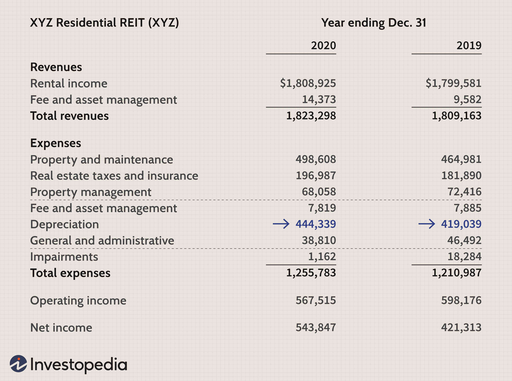

The world of real estate investment offers a myriad of structures and vehicles, catering to diverse investment objectives and strategies. Among these is the DownREIT, a specialized partnership between real estate owners and Real Estate Investment Trusts (REITs), focused on the acquisition and management of properties. DownREITs stand out due to their unique structure that allows real estate owners to defer capital gains taxes, a feature that offers significant tax planning advantages.

This article aims to provide a comprehensive exploration of the DownREIT framework, highlighting how it compares to other REIT structures, such as the more prevalent UPREITs. While both structures offer benefits in real estate investments, each presents distinct characteristics relating to tax implications and control over assets. The choice between them often rests on specific investor goals.

In addition to examining the structural differences and benefits of DownREITs, we will explore the role that algorithmic trading can play within these investment vehicles. Algorithmic trading introduces sophisticated tools for optimizing investment decisions, leveraging real-time data analysis to forecast market trends and enhance decision-making processes.

For investors, gaining a thorough understanding of DownREITs is crucial for diversifying portfolios and effectively managing tax obligations. By navigating the intricacies of DownREITs and utilizing modern tools like algorithmic trading, investors can strategically position themselves for success in the competitive landscape of real estate investment.

## Table of Contents

## What is a DownREIT?

A DownREIT is a unique investment structure where a real estate owner collaborates with a Real Estate Investment Trust (REIT) to control and acquire real estate assets, facilitating advantageous tax treatments. Primarily, this structure aims to defer capital gains taxes on the disposition of appreciated properties, making it an attractive option for property owners seeking tax efficiency.

The mechanism of a DownREIT involves the creation of a partnership between the REIT and the property owner. In this structure, the owner transfers their property to the partnership and, in return, receives operating units, which are analogous to shares. These units provide the owner with a stake in the partnership's ongoing cash flow, akin to dividends received from stock ownership. Additionally, the units can often be exchanged for REIT shares at a later date, providing liquidity and potential appreciation benefits.

DownREITs can be broadly categorized into two primary types based on the level of capital contribution from the REIT:

1. **Full Equity Contribution DownREITs**: In this model, the REIT may provide substantial capital into the partnership. This setup allows the REIT to leverage its financial strength and potentially stabilize the partnership's operations. The amount of operating units received by property owners depends on the valuation of contributed properties and capital input from the REIT.

2. **Partial Equity Contribution DownREITs**: Here, the REIT's capital contribution is limited. This structure often requires more intricate financial arrangements to balance interests between real estate owners and the REIT. It focuses on maximizing property owner control while still providing some liquidity and tax advantages.

Given these complex structures, careful planning is essential to avoid unintended tax liabilities. The intricacies of federal tax regulations, particularly the potential for certain transactions to be viewed by the Internal Revenue Service (IRS) as taxable events, demand astute tax planning and legal guidance. Thus, property owners and REITs must engage in thorough assessment and strategizing to structure DownREITs to preserve their intended benefits, notably the deferral of capital gains tax, while minimizing the risk of adverse tax impacts.

## How DownREITs Work

In a DownREIT structure, the relationship between real estate owners and a Real Estate Investment Trust (REIT) is centered around the contribution of properties to a partnership entity in exchange for operating units. This setup allows property owners to maintain a stake in the partnership's operational results, mirroring their initial investment's performance over time.

The involvement of the REIT in this structure can vary significantly based on its capital contributions. A limited contribution from the REIT might imply that the real estate owners retain a larger share of the operating cash flows and ultimately more control over the investment. Conversely, a substantial capital contribution from the REIT could lead to a redistribution of these cash flows, potentially enhancing the REIT's influence within the partnership.

A crucial feature of the DownREIT structure is the lockout agreement. This agreement restricts the sale of contributed assets for a predetermined period. The purpose of a lockout agreement is to stabilize the partnership by preventing abrupt changes in asset ownership, which could affect the partnership's financial and operational standing. The lockout period offers the necessary time for the partnership to optimize asset management and cash flow allocation strategies.

The distribution of partnership interests is another pivotal aspect that differs widely within DownREITs, shaping the returns and control each partner holds. These interests are contingent on multiple factors, including the perceived value of the contributed properties, the scale of the REIT's financial involvement, and negotiated terms between partners. The variability in partnership interests requires meticulous negotiation to align the goals of both the property owners and the REIT, ensuring that each party's investment objectives are met.

Understanding how these components interact is vital for investors and property owners considering a DownREIT structure, as it has direct implications on their potential returns and control over real estate assets.

## Comparing DownREITs and UPREITs

### Comparing DownREITs and UPREITs

Real Estate Investment Trusts (REITs) provide investors with diverse methods of entering the real estate market, particularly through structured entities like DownREITs and UPREITs (Umbrella Partnership REITs). Despite sharing core similarities, these two structures offer different avenues for managing properties and tax strategies.

UPREITs are structured such that the REIT itself does not directly own real estate properties. Instead, the REIT holds a partnership interest in an operating partnership that directly owns the real estate. This setup often appeals to property owners seeking to defer capital gains taxes through a tax-free exchange of property for operating partnership units. The simplicity of UPREIT structures makes them more prevalent among investors and operators, as they generally present fewer legal complexities and potentially more attractive tax implications. Through UPREITs, property owners can exchange their property for shares in the REIT, often providing [liquidity](/wiki/liquidity-risk-premium) and diversification benefits.

Conversely, DownREITs involve the property owner retaining a more direct interest and control over their real estate assets. In a DownREIT, the transaction usually results in the creation of a new partnership wherein the REIT may contribute cash or shares as part of the acquisition process. This allows property owners to maintain a greater degree of influence over the specific properties they contribute. The retention of this control can be critical for owners prioritizing a continued role in property management or seeking to control the timing of capital events.

When deciding between DownREIT and UPREIT structures, investors must evaluate their investment goals, with particular attention to tax deferral benefits and control over the property. A primary advantage of DownREITs is the opportunity to defer capital gains taxes, which can be beneficial for estate planning needs, allowing for a potential transfer of wealth without immediate tax repercussions. UPREITs may provide liquidity, access to broader investment opportunities, and the ability to hedge risks across diversified real estate portfolios.

The decision between opting for a DownREIT or an UPREIT should align closely with each investor's specific objectives and circumstances, including their desire for control, tax considerations, and investment horizons. Understanding the nuances of these structures can help in making informed decisions that align with broader strategic goals.

## The Role of Algorithmic Trading in Real Estate Investment

Algorithmic trading, widely recognized for its impact on financial markets, is increasingly employed in the real estate investment sector to refine strategies and enhance decision-making processes. This application leverages advanced computational techniques and data analysis to address the complexities inherent in Real Estate Investment Trusts (REITs), including DownREIT structures.

One of the primary advantages of [algorithmic trading](/wiki/algorithmic-trading) in real estate is its ability to perform real-time data analysis. This capability is crucial given the dynamic nature of real estate markets, where timely decisions can significantly affect investment outcomes. By processing vast amounts of market data swiftly, algorithms can recognize patterns and trends that inform strategic investments. This can be particularly beneficial for managing DownREIT investments, where decisions often rely on analyzing multifaceted data regarding property values, interest rates, and economic indicators.

Predictive modeling, an integral component of algorithmic trading, further enhances decision-making in REIT structures. Predictive models can forecast future market conditions, allowing investors to anticipate potential shifts and adjust their strategies accordingly. For instance, by using regression models or [machine learning](/wiki/machine-learning) algorithms, investors can estimate future property values or rental yields based on historical data, economic forecasts, and societal trends. This foresight enables more robust planning and risk management, a valuable asset when navigating the intricate structures and tax implications associated with DownREITs.

Investors can harness these algorithmic tools to specifically target market opportunities within complex investment structures. By implementing custom algorithms designed to identify undervalued properties or forecast growth in emerging markets, investors can gain a competitive edge. In the case of DownREITs, where partnership dynamics and tax deferral opportunities are central considerations, algorithmic insights can guide the retention or reallocation of assets to maximize returns while mitigating risks.

Integrating algorithmic trading within DownREIT investments presents the possibility of more informed and potentially profitable outcomes. Automated trading systems can execute transactions based on predefined criteria quickly and efficiently, limiting human error and emotional bias. This precision is advantageous in maintaining compliance with the specific legal and tax requirements of DownREIT agreements, ensuring that investors capitalize on deferral advantages without inadvertently triggering taxable events.

In summary, algorithmic trading offers significant potential for optimizing investment strategies in the real estate sector, especially within complex entities like DownREITs. By embracing these technological advancements, investors can enhance their analytical capabilities, predict market movements, and execute informed decisions, ultimately contributing to a more strategic and effective management of their real estate portfolios.

## Potential Challenges and Benefits of DownREITs

DownREITs provide investors with distinct opportunities, particularly in terms of tax deferral, but they come with inherent complexities. One of the significant advantages of a DownREIT is its ability to enable property owners to defer capital gains tax. When property is contributed to a DownREIT, the owner receives partnership units instead of cash, which helps postpone the recognition of capital gains. However, this deferral comes with its challenges. 

A primary concern for investors is the potential for the IRS to interpret certain transactions as taxable events. The complexity of DownREIT agreements can sometimes lead to misunderstandings or misinterpretations, resulting in unintended tax liabilities. To minimize such risks, it's crucial for investors to seek appropriate structuring and professional guidance. A well-structured DownREIT agreement ensures compliance with IRS regulations and takes advantage of available tax benefits while avoiding pitfalls.

Despite these challenges, DownREITs hold substantial benefits, especially concerning estate planning. By allowing for the deferral of taxes, DownREITs can serve as a powerful vehicle for transferring wealth to heirs without immediate tax consequences. This characteristic can be particularly advantageous in estate planning, enabling the seamless transition of wealth and assets over generations.

In summary, while DownREITs offer a compelling approach to real estate investment with their tax-deferral benefits, they require careful navigation of legal and tax frameworks. With thorough planning and expert advice, they can be instrumental in crafting effective estate and investment strategies.

## Conclusion

DownREITs present a sophisticated investment structure within the real estate market, characterized by both distinct challenges and unique opportunities. Understanding the differences between DownREITs and other Real Estate Investment Trust (REIT) structures is crucial for making strategic investment decisions. DownREITs allow property owners to defer capital gains taxes, offering considerable tax advantages over outright sale. However, they necessitate complex legal and financial planning to maximize these benefits while minimizing tax liabilities.

Algorithmic trading provides an innovative approach to optimizing these investment vehicles. By employing real-time data analysis and predictive modeling, investors can make more informed decisions, enhancing their ability to spot trends and capitalize on market opportunities. This computational approach can be particularly beneficial in navigating the complexities and dynamic nature of DownREIT structures.

For investors seeking to build a diversified real estate portfolio, DownREITs, with their potential for substantial tax benefits and opportunities for strategic property control, can serve as a valuable component. Success in these investments hinges on careful planning and the advice of seasoned professionals to navigate the intricate tax and legal landscapes effectively. Consequently, DownREITs offer a promising avenue for those looking to diversify and optimize their investment strategy in real estate.

## References & Further Reading

[1]: ["Taxation of Real Estate Investment Trusts (REITs)"](https://www.investopedia.com/articles/pf/08/reit-tax.asp) Internal Revenue Service (IRS)

[2]: Goolsby, C., & Warren, G. (2007). ["The Complete Guide to Real Estate Investment Trusts: How to Invest in REITs and Achieve Market-Beating Returns"](https://en.wikipedia.org/wiki/List_of_University_of_North_Texas_alumni)

[3]: McLaughlin, B., & Weiser, M. R. (2005). ["Real Estate Investment Trusts Handbook."](https://www.semanticscholar.org/paper/Investing-in-REITs-%3A-Real-estate-investment-trusts-Block/3f06a9e1b3022185e60403d8540af93f41f9faea) Aspen Publishers.

[4]: ["Algorithmic Trading: Winning Strategies and Their Rationale"](https://www.wiley.com/en-us/Algorithmic+Trading%3A+Winning+Strategies+and+Their+Rationale-p-9781118746912) by Ernest P. Chan

[5]: ["Real Estate Investment Trusts (REITs)"](https://www.investopedia.com/articles/mortgages-real-estate/10/real-estate-investment-trust-reit.asp) U.S. Securities and Exchange Commission