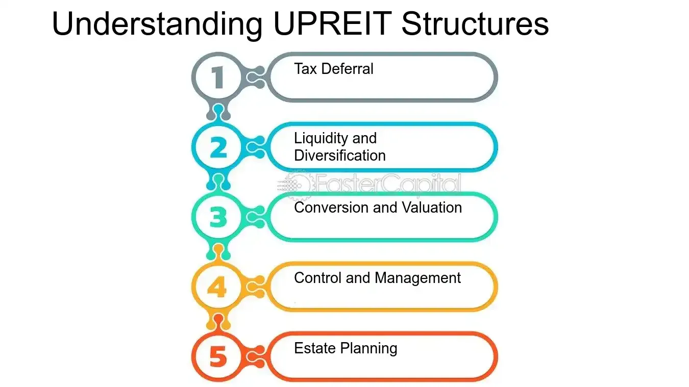

## Table of Contents

## What is a DownREIT?

A DownREIT is a type of real estate investment trust (REIT) structure where the REIT owns a controlling interest in a property-owning partnership. In this setup, property owners can contribute their properties to the partnership in exchange for units in the partnership and shares in the REIT. This allows property owners to defer capital gains taxes that they would have to pay if they sold their properties outright.

The DownREIT structure is beneficial for both the REIT and the property owners. For the REIT, it provides a way to grow its portfolio without having to buy properties directly, which can be costly and time-consuming. For property owners, it offers a way to diversify their investments and gain liquidity while still maintaining some control over their properties through the partnership. This structure is commonly used in the real estate industry to facilitate large-scale property transactions and investment opportunities.

## How does a DownREIT differ from a traditional REIT?

A DownREIT and a traditional REIT both deal with real estate investments, but they work a bit differently. A traditional REIT is a company that owns, operates, or finances income-generating real estate. It's like a big landlord that people can invest in by buying its shares. The REIT uses the money from shareholders to buy properties, and then it pays out most of its income as dividends to those shareholders. This way, investors can earn money from real estate without having to buy properties themselves.

A DownREIT, on the other hand, is a special kind of REIT where the REIT doesn't own the properties directly. Instead, it owns a big part of a partnership that holds the properties. People who own properties can join this partnership by giving their properties to it. In return, they get units in the partnership and some shares in the REIT. This setup helps property owners avoid paying a lot of taxes right away if they were to sell their properties directly. So, while a traditional REIT is more straightforward, a DownREIT offers a way for property owners to keep some control over their properties and still benefit from the REIT structure.

## What is the basic structure of a DownREIT?

A DownREIT is a special kind of real estate investment trust (REIT) that works through a partnership. In this setup, the REIT owns a big part of a partnership that holds properties. People who own properties can give their properties to this partnership. In return, they get units in the partnership and some shares in the REIT. This way, property owners can keep some control over their properties while also getting benefits from the REIT.

The main advantage of a DownREIT is that it helps property owners avoid paying a lot of taxes right away. If they sold their properties directly, they would have to pay capital gains taxes. But by joining the partnership, they can delay these taxes. This structure is good for the REIT too, because it can grow its portfolio without having to buy properties directly, which can be expensive and take a lot of time.

## What are the key components of a DownREIT?

A DownREIT is a special kind of real estate investment trust (REIT) that involves a partnership. In this setup, the REIT owns a big part of a partnership that holds properties. People who own properties can give their properties to this partnership. In return, they get units in the partnership and some shares in the REIT. This allows property owners to keep some control over their properties while also getting benefits from the REIT.

The main advantage of a DownREIT is that it helps property owners avoid paying a lot of taxes right away. If they sold their properties directly, they would have to pay capital gains taxes. But by joining the partnership, they can delay these taxes. This structure is good for the REIT too, because it can grow its portfolio without having to buy properties directly, which can be expensive and take a lot of time.

## How do DownREITs benefit property owners?

DownREITs help property owners in a big way by letting them avoid paying a lot of taxes right away. If a property owner were to sell their property outright, they would have to pay capital gains taxes on the profit. But with a DownREIT, they can give their property to a partnership and get units in that partnership plus shares in the REIT. This way, they can delay paying those taxes, which can save them a lot of money.

Another benefit for property owners is that they can still keep some control over their properties. Even though they've joined a partnership, they get units in it, which means they have a say in how things are run. Plus, they get shares in the REIT, which means they can enjoy the benefits of being part of a bigger real estate investment without having to manage everything themselves. This setup gives them more flexibility and the chance to diversify their investments.

## What are the tax implications of participating in a DownREIT?

When property owners join a DownREIT, they can delay paying capital gains taxes. Instead of selling their property outright and paying taxes on the profit right away, they can give their property to a partnership and get units in that partnership plus shares in the REIT. This means they don't have to pay taxes on the property's value right away, which can save them a lot of money.

However, there are still some tax rules to think about. When the property owner eventually sells their units in the partnership or their shares in the REIT, they will have to pay taxes on any profit they make. Also, if the partnership decides to sell the property, the property owner might have to pay taxes on their share of the profit from that sale. So, while DownREITs can help with tax delays, property owners need to plan for future tax payments too.

## Can you explain the operational mechanics of a DownREIT?

In a DownREIT, a real estate investment trust (REIT) owns a big part of a partnership that holds properties. People who own properties can give their properties to this partnership. In return, they get units in the partnership and some shares in the REIT. This setup helps the REIT grow its portfolio without having to buy properties directly, which can be expensive and take a lot of time. The property owners can keep some control over their properties through the partnership units they receive.

The main advantage for property owners in a DownREIT is that they can delay paying capital gains taxes. If they sold their properties outright, they would have to pay taxes on the profit right away. But by joining the partnership, they can put off those taxes. However, when they eventually sell their units in the partnership or their shares in the REIT, they will have to pay taxes on any profit they make. Also, if the partnership decides to sell the property, the property owner might have to pay taxes on their share of the profit from that sale.

## What are the advantages of DownREITs for investors?

DownREITs offer investors a way to get into real estate without having to buy properties themselves. When you invest in a DownREIT, you're buying shares in a REIT that owns a big part of a partnership that holds properties. This setup lets you enjoy the benefits of real estate investment, like [earning](/wiki/earning-announcement) money from rent and property value increases, without the hassle of managing properties directly. Plus, because the REIT can grow its portfolio by getting properties from other owners, it can keep expanding and possibly increase its value over time.

Another advantage for investors in DownREITs is the potential for tax benefits. Since the REIT structure lets property owners delay paying capital gains taxes, this can help the REIT have more money to invest and grow. This might lead to higher dividends for investors. Also, investors can diversify their investment by putting money into different properties through the REIT, which can spread out risk and increase the chance of steady returns.

## What are the potential risks associated with DownREITs?

One risk of investing in DownREITs is that they depend a lot on the health of the real estate market. If property values go down or if there's a big economic downturn, the value of the DownREIT can drop too. This means investors might lose money if they need to sell their shares when the market is bad. Also, since DownREITs are tied to specific properties through partnerships, problems with those properties, like high vacancy rates or maintenance issues, can hurt the DownREIT's performance.

Another risk is related to the tax situation. While DownREITs let property owners delay paying taxes, this can create a big tax bill later on. When the property is eventually sold by the partnership, or when the investor sells their shares, they'll have to pay taxes on any profit. This can be a lot of money, and it might be hard to predict how much it will be. So, investors need to think carefully about their future tax situation when they invest in a DownREIT.

Lastly, there's the risk of less control over the properties. Even though property owners get units in the partnership, the REIT still has a big say in how things are run. If the REIT makes decisions that don't work out well, like buying the wrong properties or managing them poorly, it can affect the returns for investors. This means investors have to trust that the REIT will manage things well, which isn't always guaranteed.

## How do DownREITs handle property management and development?

In a DownREIT, property management and development are handled through the partnership that owns the properties. The REIT, which has a big part of this partnership, works with property owners to make sure the properties are taken care of well. This means they might hire property managers to look after the day-to-day stuff like collecting rent, fixing things that break, and keeping the properties in good shape. The REIT also makes big decisions about what to do with the properties, like whether to fix them up, build new things, or sell them.

For development, the REIT might decide to use some of the money it gets from investors to improve the properties or build new ones. This can help the properties become more valuable over time, which is good for everyone in the partnership. The REIT will look at things like what kind of buildings are needed in the area, how much it will cost to build them, and how much money they can make from them. By doing this, the REIT tries to make the partnership's properties better and more profitable, which can lead to more money for the investors.

## Can you provide examples of successful DownREITs?

One example of a successful DownREIT is Vornado Realty Trust. Vornado has used the DownREIT structure to grow its portfolio without having to buy properties directly. They work with property owners who want to join their partnership. In return, these owners get units in the partnership and shares in Vornado. This has helped Vornado expand in places like New York and Washington, D.C., where they own lots of office buildings and shopping centers. By using the DownREIT model, Vornado has been able to manage and develop these properties well, making money for their investors.

Another example is Prologis, a company that focuses on industrial properties like warehouses. Prologis has used the DownREIT structure to bring in property owners who want to be part of their partnership. These owners give their warehouses to Prologis and get units in the partnership plus shares in the company. This has helped Prologis become one of the biggest owners of warehouses around the world. They manage and develop these properties to make them more valuable, which is good for everyone involved in the partnership.

## What are the future trends and regulatory considerations for DownREITs?

In the future, DownREITs might become more popular as a way for property owners and investors to work together. As more people look for ways to invest in real estate without buying properties themselves, DownREITs could grow. They let property owners delay paying taxes, which can be a big help. Also, as cities keep growing and changing, DownREITs might be used more to develop new buildings and fix up old ones. This could mean more chances for investors to make money from rent and property value increases.

There are also some rules and laws that DownREITs need to think about. Governments might change tax laws, which could affect how much money DownREITs can save on taxes. Also, rules about how REITs have to share their profits with investors might change. This could make it harder for DownREITs to work the way they do now. So, people who invest in DownREITs need to keep an eye on these rules and be ready to change their plans if things shift.

## References & Further Reading

[1]: ["Taxation of Real Estate Investment Trusts (REITs)"](https://www.investopedia.com/articles/pf/08/reit-tax.asp) Internal Revenue Service (IRS)

[2]: Goolsby, C., & Warren, G. (2007). ["The Complete Guide to Real Estate Investment Trusts: How to Invest in REITs and Achieve Market-Beating Returns"](https://en.wikipedia.org/wiki/List_of_University_of_North_Texas_alumni)

[3]: McLaughlin, B., & Weiser, M. R. (2005). ["Real Estate Investment Trusts Handbook."](https://www.semanticscholar.org/paper/Investing-in-REITs-%3A-Real-estate-investment-trusts-Block/3f06a9e1b3022185e60403d8540af93f41f9faea) Aspen Publishers.

[4]: ["Algorithmic Trading: Winning Strategies and Their Rationale"](https://www.wiley.com/en-us/Algorithmic+Trading%3A+Winning+Strategies+and+Their+Rationale-p-9781118746912) by Ernest P. Chan

[5]: ["Real Estate Investment Trusts (REITs)"](https://www.investopedia.com/articles/mortgages-real-estate/10/real-estate-investment-trust-reit.asp) U.S. Securities and Exchange Commission