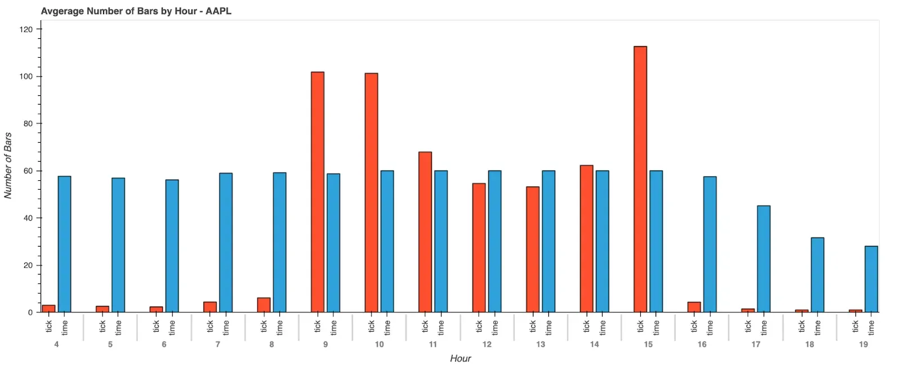

## Table of Contents

## What is downsampling in the context of pricing data?

Downsampling in the context of pricing data means reducing the amount of data points you have. Imagine you have prices recorded every minute, but you only need the prices every hour. Downsampling helps by taking that minute-by-minute data and turning it into hourly data, making it easier to handle and analyze.

This process is useful because it can make large datasets more manageable. If you're looking at stock prices, for example, you might not need to see every single price change. By downsampling, you can focus on the bigger trends over time, like how the price changes from hour to hour or day to day, instead of getting lost in the details of every minute.

## Why is downsampling important for analyzing pricing data?

Downsampling is important for analyzing pricing data because it makes the data easier to work with. When you have a lot of data, like prices recorded every minute, it can be hard to see the big picture. By downsampling, you can change that minute-by-minute data into hourly or daily data. This means you have fewer data points to look at, which makes it simpler to understand and analyze the trends over time.

Another reason downsampling is important is that it helps your computer work faster. When you have less data to process, your computer doesn't have to work as hard. This can be really helpful if you're using a program to look at the data or make charts. With downsampling, you can get your results quicker and spend more time figuring out what the data means instead of waiting for your computer to finish processing everything.

## What are the common methods used for downsampling pricing data?

One common method for downsampling pricing data is taking the average. Imagine you have prices recorded every minute, and you want to see the price every hour. You can take all the prices from that hour and find their average. This gives you one number for the hour instead of 60 numbers for each minute. This way, you can see the overall price trend without getting lost in all the small changes.

Another method is to pick the last value in each time period. For example, if you want to downsample from minute to hour, you can just use the price at the end of each hour. This method is good if you want to know the closing price for each period, like how stock markets report daily closing prices. It's simple and quick, but it might miss some of the price movements that happened during the hour.

A third method is to use the highest or lowest value in each time period. This can be useful if you're interested in the peak or trough prices. For instance, if you're looking at daily data and want to downsample to weekly, you could use the highest price of the week. This helps you understand the extremes in pricing, which can be important for making decisions based on price volatility.

## How does downsampling affect the accuracy of pricing analysis?

Downsampling can make your pricing analysis less accurate because you're using less data. When you downsample, you're taking a lot of prices and turning them into fewer numbers. This means you might miss some of the smaller changes that happen in the price. For example, if you downsample from minute to hour by taking the average, you won't see the big jump in price that might have happened in just one of those minutes. So, your analysis might not show the full story of how the price moved.

On the other hand, downsampling can help you see the bigger trends more clearly. When you have too much data, it can be hard to understand what's really going on. By downsampling, you can focus on the main changes in price over time, like how it goes up or down from hour to hour or day to day. This can make your analysis more useful for making decisions, even if it's not as detailed. So, downsampling can make your analysis simpler and more focused, but you need to remember that it might not show everything.

## What are the potential risks of downsampling pricing data?

Downsampling pricing data can make you miss important details. When you turn lots of prices into fewer numbers, you might not see the small changes that can be important. For example, if you're looking at stock prices and you downsample from minute to hour, you might miss a big price jump that happened in just one of those minutes. This could lead you to make a wrong decision because you didn't see the full picture of how the price moved.

Another risk is that downsampling can hide big changes in the price. If you're only looking at the average price for each hour or day, you might not see the highest or lowest prices that happened during that time. These highs and lows can be really important, especially if you're trying to understand how risky or volatile the price is. So, by downsampling, you might think the price is more stable than it really is, which could lead to surprises later on.

## Can you explain the difference between downsampling and upsampling in pricing data?

Downsampling and upsampling are two ways to change how much data you have when looking at pricing data. Downsampling means you take a lot of prices and turn them into fewer numbers. For example, if you have prices every minute, downsampling can help you see the price every hour instead. This makes the data easier to handle and can help you see the bigger trends in price changes, but you might miss some of the smaller details.

Upsampling is the opposite of downsampling. It means you take a few prices and turn them into more numbers. For example, if you only have prices every hour, upsampling can help you guess what the price might have been every minute. This can be useful if you need more detailed data, but it's not always accurate because you're making guesses about the prices in between the ones you know. So, upsampling can give you more data to work with, but it might not be as reliable as the original data.

## How do you choose the appropriate downsampling frequency for pricing data?

Choosing the right downsampling frequency for pricing data depends on what you need to see. If you're looking at stock prices and want to understand the big changes over time, you might downsample from minute to hour or even day. This helps you see the overall trend without getting lost in all the small changes. But if you're trying to catch quick price movements, like in high-frequency trading, you might keep the data at a shorter interval, like minutes or even seconds, so you don't miss important details.

It's also important to think about how much data you can handle. If you have a lot of data, downsampling to a longer time period, like from minutes to hours or days, can make it easier for your computer to process. This can help you get results faster and spend more time understanding what the data means. But remember, the more you downsample, the more details you might miss, so you need to find a balance that works for your analysis.

## What tools or software are commonly used for downsampling pricing data?

People often use tools like Microsoft Excel or Google Sheets to downsample pricing data. These programs are easy to use and many people already know how to work with them. You can take your data and use formulas to turn it into less data. For example, you can use the AVERAGE function to turn minute-by-minute prices into hourly prices. These tools are great because they let you see your data right away and make changes easily.

Another common tool is programming languages like Python or R. These are more powerful and can handle a lot of data quickly. In Python, you might use libraries like Pandas to downsample your data. Pandas has functions that can take your minute-by-minute prices and turn them into hourly or daily prices easily. R also has packages that can do this, like dplyr. These tools are good if you need to work with a lot of data and want to make your analysis faster and more detailed.

## How can downsampling help in reducing noise in pricing data?

Downsampling can help reduce noise in pricing data by smoothing out the small, random changes that happen all the time. Imagine you're looking at stock prices every minute. There might be a lot of tiny ups and downs that don't really mean much. When you downsample to hourly or daily prices, these small changes get averaged out, so you see a clearer picture of how the price is moving overall. This makes it easier to focus on the big trends instead of getting distracted by all the little wiggles.

By reducing noise, downsampling helps you make better decisions. If you're trying to understand how a stock is doing, you don't want to be confused by all the tiny price changes that happen every minute. Downsampling helps you see the main direction the price is going, like if it's going up or down over time. This can be really helpful for making choices about buying or selling, because you're looking at the bigger picture instead of getting lost in the details.

## What are the best practices for downsampling high-frequency pricing data?

When you're downsampling high-frequency pricing data, it's important to choose the right time period for your needs. If you want to see the big changes in price over time, you might downsample from minute to hour or even day. This helps you understand the overall trend without getting lost in all the small ups and downs. But if you need to catch quick price movements, like in high-frequency trading, you should keep the data at a shorter interval, like minutes or seconds, so you don't miss important details. Finding the right balance is key, so you see the trends you need without losing too much information.

Another best practice is to use the right method for downsampling. You can take the average price for each time period, which smooths out the small changes and gives you a clearer picture of the trend. Or, you can use the last price in each period, which is good if you're interested in the closing price. Sometimes, you might want to look at the highest or lowest price in each period to understand the extremes in pricing. Whichever method you choose, make sure it fits what you're trying to learn from the data. Also, using tools like Excel, Google Sheets, or programming languages like Python or R can make downsampling easier and help you get better results.

## How does downsampling impact predictive models based on pricing data?

Downsampling can change how well predictive models work with pricing data. When you downsample, you use less data, so your model might miss out on some important details. For example, if you're predicting stock prices and you downsample from minute to hour, you might not see a big price jump that happened in just one minute. This can make your predictions less accurate because you're not using all the information you could have.

On the other hand, downsampling can make your models run faster and easier to understand. With less data to process, your computer doesn't have to work as hard, and you can get your results quicker. Also, downsampling can help you see the big trends more clearly, which can be good for making predictions about how prices will move over time. So, while downsampling might make your predictions a bit less accurate, it can also make your analysis simpler and more focused on what's important.

## Can you discuss a case study where downsampling pricing data led to significant insights or improvements?

In a case study involving a major online retailer, downsampling pricing data from minute-by-minute to hourly intervals helped the company better understand customer behavior and optimize pricing strategies. The retailer initially had a huge amount of data, with prices changing every minute due to dynamic pricing algorithms. By downsampling to hourly data, they were able to see clearer patterns in how customers responded to different price points throughout the day. They found that certain products had higher demand during specific hours, which allowed them to adjust their pricing to maximize sales and profits.

This downsampling not only made the data easier to handle but also led to significant improvements in their pricing strategy. The retailer discovered that by raising prices during peak demand hours and lowering them during off-peak times, they could increase their overall revenue. The hourly data gave them a better view of the bigger trends without getting lost in the minute-by-minute noise. As a result, the company was able to make more informed decisions, leading to a 10% increase in sales within the first quarter of implementing the new strategy.

## What is Downsampling in Trading and How Does it Work?

Downsampling in trading refers to the reduction of data frequency to facilitate easier analysis and decision-making without sacrificing important insights. This method is particularly beneficial when dealing with high-frequency trading data, which often contains excessive noise. By focusing on meaningful market movements, traders and algorithms can make more informed decisions.

The downsampling process typically involves transforming transaction-level data into aggregated forms such as OHLCV (Open, High, Low, Close, Volume) bars. These are calculated over defined time intervals, such as minutes or hours, or based on specific criteria like [volume](/wiki/volume-trading-strategy) or price changes. For instance, a five-minute OHLCV bar aggregates trades occurring within each five-minute interval, providing a summarized view of market activities.

$$
\text{OHLCV Bar for Interval } i = \{ O_i, H_i, L_i, C_i, V_i \}
$$

Where:
- $O_i$ = opening price of the interval
- $H_i$ = highest price during the interval
- $L_i$ = lowest price during the interval
- $C_i$ = closing price of the interval
- $V_i$ = total traded volume in the interval

In [algorithmic trading](/wiki/algorithmic-trading), downsampling is instrumental in aligning strategies with varying market conditions. It allows for [backtesting](/wiki/backtesting) using simpler datasets, thereby minimizing computational requirements and enhancing system performance. By reducing the volume of data needed for strategy development, traders can tailor algorithms more effectively to current market situations, balancing between precision and computational efficiency.

Additionally, by strategically determining the granularity of downsampled data, traders can ensure that they capture essential market trends while reducing unnecessary details. This balance is critical for extracting actionable insights and optimizing trading operations.

## References & Further Reading

[1]: ["Advances in Financial Machine Learning"](https://www.amazon.com/Advances-Financial-Machine-Learning-Marcos/dp/1119482089) by Marcos Lopez de Prado

[2]: ["Machine Learning for Algorithmic Trading"](https://www.oreilly.com/library/view/machine-learning-for/9781839217715/) by Stefan Jansen

[3]: ["Quantitative Trading: How to Build Your Own Algorithmic Trading Business"](https://books.google.com/books/about/Quantitative_Trading.html?id=j70yEAAAQBAJ) by Ernest P. Chan

[4]: ["Evidence-Based Technical Analysis: Applying the Scientific Method and Statistical Inference to Trading Signals"](https://www.amazon.com/Evidence-Based-Technical-Analysis-Scientific-Statistical/dp/0470008741) by David Aronson

[5]: Bergstra, J., Bardenet, R., Bengio, Y., & Kégl, B. (2011). ["Algorithms for Hyper-Parameter Optimization."](https://proceedings.neurips.cc/paper/2011/file/86e8f7ab32cfd12577bc2619bc635690-Paper.pdf) Advances in Neural Information Processing Systems 24.