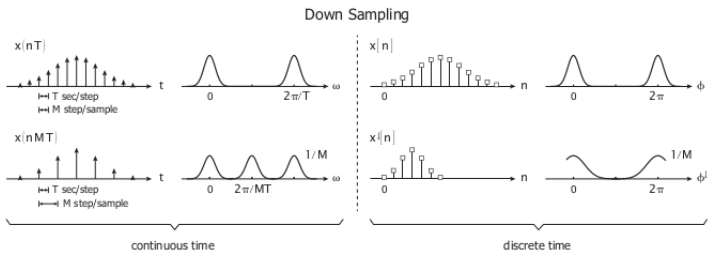

## Table of Contents

## What is downsampling in the context of digital signal processing?

Downsampling is a process used in digital signal processing where you take a digital signal and reduce the number of samples that represent it. Imagine you have a long list of numbers that show how a sound changes over time. Downsampling means you pick fewer numbers from that list, so the sound is represented with less detail. This can make the file smaller and easier to work with, but it might also make the sound less clear.

When you downsample, you need to be careful because just picking every nth sample can cause problems. This can lead to something called aliasing, where high-frequency parts of the sound get mixed up with lower frequencies, making the sound distorted. To avoid this, you usually filter the signal first to remove high frequencies before downsampling. This way, you keep the sound as clear as possible even with fewer samples.

## How does downsampling differ from upsampling?

Downsampling and upsampling are two opposite processes in digital signal processing. Downsampling means you take a digital signal and reduce the number of samples that represent it. Imagine you have a song and you want to make the file smaller. You do this by keeping only some of the data points that describe the song. This makes the file easier to store and send, but if you're not careful, the song might not sound as good because you lose some details.

Upsampling, on the other hand, is when you increase the number of samples in a digital signal. It's like taking that same song and adding more data points between the ones you already have. This can make the song sound smoother and more detailed, but it also makes the file bigger. When you upsample, you usually need to guess what the new data points should be, based on the existing ones. If done right, it can improve the quality of the song, but if done wrong, it might just make the file bigger without making it sound better.

## Why is downsampling used in image processing?

Downsampling is used in image processing to make images smaller and easier to work with. Imagine you have a big picture with lots of tiny dots, called pixels. Downsampling means you take some of those dots away, so the picture has fewer pixels. This makes the image file smaller, which is helpful when you want to save space on your computer or send the image quickly over the internet. It's like turning a detailed painting into a simpler sketch.

However, when you downsample an image, you have to be careful. If you just remove pixels without thinking, the picture might look blurry or blocky. To avoid this, you usually use special methods to decide which pixels to keep and how to make the image look good even with fewer pixels. This way, you can still see what's in the picture clearly, even though it's not as detailed as before.

## What are the basic steps involved in downsampling an audio signal?

Downsampling an audio signal means you take a sound file and make it use fewer numbers to describe it. Imagine you have a song, and it's like a long list of numbers that show how the sound changes over time. When you downsample, you pick fewer numbers from this list, so the song is described with less detail. This makes the file smaller and easier to work with, but it can also make the sound less clear if you're not careful.

To do downsampling right, you usually start by using a filter. This filter helps remove the high-pitched parts of the sound that could cause problems. Think of it like smoothing out the song so it doesn't have any sudden, sharp sounds. After you've filtered the sound, you can then pick fewer numbers from your list. This step is called decimation. By doing it this way, you keep the song sounding as good as possible even though it's now described with fewer numbers.

## Can downsampling cause loss of data? If so, how?

Yes, downsampling can cause loss of data. When you downsample, you're taking a detailed picture or sound and making it simpler by using fewer numbers to describe it. Imagine you have a drawing with lots of little dots. If you erase some of those dots to make the drawing smaller, you lose some of the details. The same thing happens with downsampling. You keep some of the numbers but throw away others, so you can't get the original picture or sound back exactly as it was.

To avoid losing too much detail, you can use special methods when downsampling. For example, you might smooth out the picture or sound first to make sure it doesn't look or sound too choppy after you take away some of the numbers. But even with these methods, you still lose some information because you're using fewer numbers to describe the same thing. So, downsampling always means you're trading off some detail for a smaller file.

## What is the Nyquist theorem and how does it relate to downsampling?

The Nyquist theorem is a rule that helps us understand how to capture sounds or pictures without losing important details. It says that if you want to record a sound or an image, you need to take samples at least twice as fast as the highest frequency in that sound or image. Think of it like trying to draw a fast-moving object. If you blink too slowly, you'll miss parts of the movement. But if you blink fast enough, you can see everything clearly. The Nyquist theorem tells us how fast we need to "blink" to capture all the details.

Downsampling relates to the Nyquist theorem because when you downsample, you're reducing the number of samples you have. If you don't do this carefully, you might end up with a sample rate that's too slow according to the Nyquist theorem. This can cause a problem called aliasing, where high-frequency details get mixed up with lower frequencies, making your sound or image distorted. To avoid this, you need to filter out the high frequencies before downsampling, so you're left with a signal that still follows the Nyquist theorem at the new, lower sample rate.

## How can downsampling be used to reduce the computational load in machine learning models?

Downsampling can help make machine learning models work faster and use less computer power. Imagine you're training a model to recognize pictures. If you use smaller versions of the pictures, the model doesn't have to look at as many tiny details. This means it can process the information quicker and needs less memory to do its job. By making the pictures simpler, you're making it easier for the computer to learn from them.

However, you have to be careful when you downsample for machine learning. If you make the pictures too simple, the model might miss important details and not learn as well. It's like trying to read a book with some pages missing; you might still get the main idea, but you could miss out on important parts of the story. So, you need to find a good balance where the pictures are small enough to help the computer work faster, but still detailed enough for the model to learn properly.

## What are the potential artifacts introduced by downsampling and how can they be mitigated?

When you downsample, you might see or hear things that weren't in the original picture or sound. These are called artifacts. One common artifact is called aliasing, which happens when you make the picture or sound too simple too quickly. It's like trying to draw a fast-moving car with too few lines; the car might look like it's moving in weird ways. Another artifact is called blocking, where the picture looks like it's made of small squares. This happens because you're using fewer numbers to describe the picture, and the computer has to guess how to fill in the gaps.

To make these artifacts less noticeable, you can use special tricks. One trick is to use a filter before you downsample. This filter smooths out the picture or sound so that when you make it simpler, it doesn't look or sound as choppy. Another trick is to be careful about how much you downsample. If you make the picture or sound too simple, you'll lose a lot of detail. So, you need to find a good balance where the file is smaller, but the picture or sound still looks or sounds good. By using these methods, you can make downsampling work better and keep the artifacts from ruining your picture or sound.

## What are some common algorithms used for downsampling in different fields?

In the world of images, one common way to downsample is by using the bilinear interpolation method. This is like taking a big picture and making it smaller by averaging the colors of nearby pixels. It helps make the smaller picture look smoother and less blocky. Another method used in image processing is the bicubic interpolation, which is a bit more complex but can make the downsampled image look even better by considering more surrounding pixels.

For audio signals, a popular downsampling technique is the use of low-pass filtering followed by decimation. This means you first smooth out the sound to remove high-pitched parts that could cause problems, then you pick fewer numbers from the sound's list of data points. This helps keep the sound clear even when you make it simpler. In machine learning, a common approach is to use pooling layers, especially in convolutional neural networks. These layers take groups of pixels and turn them into a single value, which makes the data simpler and easier for the computer to process.

Each of these methods has its own way of making things smaller while trying to keep as much detail as possible. The choice of method depends on what you're working with and what you need the final result to look or sound like. By using the right algorithm, you can downsample effectively and reduce the chances of losing important information.

## How does downsampling affect the frequency content of a signal?

Downsampling a signal means you're making it simpler by using fewer numbers to describe it. When you do this, you can change what the signal sounds like or looks like, especially in terms of its frequency content. Frequency is like the pitch of a sound or the detail in a picture. If you downsample without being careful, you might mix up the high-frequency parts with the lower ones. This can make the sound distorted or the picture look blurry. It's like trying to draw a fast-moving object with too few lines; the details get mixed up and it doesn't look right.

To avoid messing up the frequency content, you usually use a filter first. This filter smooths out the signal by removing the high-frequency parts that could cause problems. After you've done that, you can safely pick fewer numbers to represent the signal. This way, the sound or picture stays clear even though it's simpler. It's like smoothing out a rough sketch before you simplify it, so the final drawing still looks good. By doing this, you can downsample without losing too much of the important details in the signal's frequency content.

## What are the considerations for choosing the right downsampling factor in a specific application?

When you're picking the right downsampling factor for a specific job, you need to think about what you want to achieve. The downsampling factor is like deciding how much smaller you want to make your picture or sound. If you want the file to be really small, you might choose a big downsampling factor. But if you want to keep a lot of detail, you'll pick a smaller one. It's like choosing between a quick sketch or a detailed drawing. You also need to think about what the picture or sound will be used for. If it's for a website where speed matters, you might downsample more. But if it's for a high-quality print, you'll downsample less.

Another thing to consider is how downsampling will affect the quality of your picture or sound. If you downsample too much, you might lose important details and end up with a blurry or distorted result. This is called losing data. You need to find a balance where the file is small enough for your needs, but still looks or sounds good. To help with this, you can use filters to smooth out the signal before downsampling. This can help keep the quality high even when you're making the file smaller. By thinking about these things, you can choose the best downsampling factor for your specific job.

## How can advanced techniques like wavelet transforms be applied to improve downsampling results?

Wavelet transforms are a smart way to make downsampling better. Imagine you have a picture or a sound, and you want to make it simpler without losing too much detail. Wavelet transforms help by breaking down the picture or sound into different parts, kind of like taking apart a puzzle. Each part shows different levels of detail, from the big picture to the tiny details. When you downsample, you can keep the parts that are most important for what you need, and throw away the rest. This way, even though you're using fewer numbers to describe the picture or sound, you still keep the important details.

Using wavelet transforms for downsampling can make the results look or sound much better. Instead of just making everything simpler all at once, you can focus on keeping the parts that matter most. It's like deciding which pieces of a puzzle to keep to still see the main image clearly. By doing this, you can avoid problems like blurry pictures or distorted sounds. Wavelet transforms help you find the right balance between making the file smaller and keeping it clear, so you get the best possible results from downsampling.

## What are the techniques for downsampling?

Downsampling is a crucial element in algorithmic trading, facilitating the management of vast amounts of data by reducing its dimensionality. Several techniques are widely used in trading, each serving different purposes depending on the trading strategy and analytical requirements.

One fundamental technique is the **moving average**, which involves computing the average of a subset of data points and sliding this window across the entire dataset. The moving average helps smooth out short-term fluctuations and highlights longer-term trends. It is calculated as follows:

$$
\text{MA}_n = \frac{1}{n} \sum_{i=0}^{n-1} x_{t-i}
$$

where $\text{MA}_n$ is the moving average over $n$ time periods, and $x_{t-i}$ represents the data points.

**Decimation** is another technique, which reduces the sampling rate by retaining every $n$-th sample and discarding the rest. This simple method allows for rapid reduction of data size but can lead to significant information loss if not managed carefully. The choice of $n$ is critical and should align with the trading strategy's tolerance for data loss.

**Aggregation methods** involve summarizing data points over specified intervals, such as calculating the mean, median, maximum, or minimum. For instance, aggregating trade data by hourly intervals can provide insights into market trends without the noise present in minute-by-minute data. These methods are especially useful for observing macro patterns while minimizing micro-variability.

Choosing the appropriate technique requires consideration of the specific needs of the strategy. For example, strategies focusing on long-term trends might benefit more from moving averages, while high-frequency trading strategies might leverage advanced methods to retain critical short-term signals.

Advanced downsampling techniques incorporate [machine learning](/wiki/machine-learning) models that intelligently resample data. These models can identify and preserve essential market patterns while discarding irrelevant data. Techniques like autoencoders or Generative Adversarial Networks (GANs) are employed to dynamically resample data, a process that traditionally required manual intervention.

In Python, implementing these techniques can be straightforward using libraries such as Pandas or NumPy. An example of computing a simple moving average using Pandas is shown below:

```python
import pandas as pd

# Assuming 'data' is a DataFrame with a datetime index and a 'price' column
data['moving_average'] = data['price'].rolling(window=10).mean()
```

This line of code calculates a moving average with a window size of 10 time periods. For decimation, NumPy's slicing feature can be used to select every $n$-th data point, effectively downsampling the dataset.

Leveraging these techniques effectively requires a balance between signal retention and data simplification, ensuring the strategy maintains its efficacy despite reduced data volume.

## References & Further Reading

[1]: Bergstra, J., Bardenet, R., Bengio, Y., & Kégl, B. (2011). ["Algorithms for Hyper-Parameter Optimization."](https://papers.nips.cc/paper/4443-algorithms-for-hyper-parameter-optimization) Advances in Neural Information Processing Systems 24.

[2]: ["Advances in Financial Machine Learning"](https://www.amazon.com/Advances-Financial-Machine-Learning-Marcos/dp/1119482089) by Marcos Lopez de Prado

[3]: ["Evidence-Based Technical Analysis: Applying the Scientific Method and Statistical Inference to Trading Signals"](https://www.amazon.com/Evidence-Based-Technical-Analysis-Scientific-Statistical/dp/0470008741) by David Aronson

[4]: ["Machine Learning for Algorithmic Trading"](https://github.com/stefan-jansen/machine-learning-for-trading) by Stefan Jansen

[5]: ["Quantitative Trading: How to Build Your Own Algorithmic Trading Business"](https://books.google.com/books/about/Quantitative_Trading.html?id=j70yEAAAQBAJ) by Ernest P. Chan