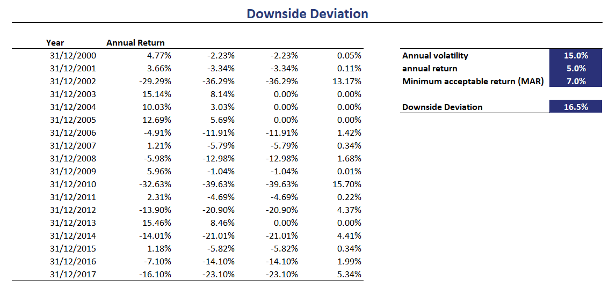

The world of investing is filled with complexities and risks, making it crucial for investors to understand and manage these risks to make informed decisions. The financial markets, characterized by constant fluctuations and uncertainties, present numerous challenges that demand a thorough analysis of potential outcomes. Financial metrics are indispensable tools that help investors assess these risks and evaluate investment opportunities more effectively. Among these metrics, downside deviation stands out as a significant measure of potential losses, offering a clear view of an investment's risk profile.

Downside deviation is particularly significant in the context of algorithmic trading, where automated systems execute trades based on sophisticated algorithms. These systems rely heavily on financial metrics to optimize trading strategies and manage risk effectively. By incorporating downside deviation, algorithmic trading systems can minimize exposure to potential losses while maximizing potential gains, ensuring that strategies are aligned with the investor's risk tolerance and financial goals.



In this article, we will explore the importance of financial metrics in the investing landscape, focusing on downside deviation as a key element for evaluating investment risks within algorithmic trading. We will discuss the role these metrics play in guiding decision-making and risk management strategies in modern financial markets. These insights are pivotal for traders and investors aiming to navigate the complexities of financial markets successfully and optimize their strategies in pursuit of favorable investment outcomes.

## Table of Contents

## Understanding Financial Metrics

Financial metrics serve as essential tools for investors and traders aiming to evaluate the performance and risk profile of their investment portfolios. These metrics provide a quantitative basis for assessing risk, enabling market participants to make informed decisions when comparing different investment opportunities and crafting personalized trading strategies.

Standard deviation is a key financial metric that measures the overall volatility of an asset. It captures the degree of variation from the average return, providing a holistic view of how much returns can deviate from the expectations. Mathematically, it is computed using the formula:

$$
\sigma = \sqrt{\frac{1}{N}\sum_{i=1}^{N}(R_i - \bar{R})^2}
$$

where $\sigma$ is the standard deviation, $N$ is the number of observations, $R_i$ represents each individual return, and $\bar{R}$ is the mean return.

While standard deviation accounts for both upward and downward movements in asset prices, downside deviation offers a nuanced approach by concentrating solely on potential losses. It specifically examines negative performance relative to a benchmark known as the minimum acceptable return (MAR). This makes downside deviation particularly useful for risk-averse investors focused on minimizing significant losses.

Calculating downside deviation involves the following steps:
1. Identify all returns that fall below the MAR.
2. Square these deviations to eliminate negative values.
3. Calculate the average of these squared deviations.
4. Derive the square root of this average to obtain the downside deviation.

Understanding these metrics is vital for any individual engaged in trading, especially within [algorithmic trading](/wiki/algorithmic-trading) systems. Algorithmic trading leverages complex algorithms to analyze extensive datasets, executing trades with increased speed and precision. Financial metrics like standard deviation and downside deviation are integral to these systems, guiding them in optimizing trading strategies and managing risk.

Incorporation of these metrics allows algorithmic traders to align their strategies with specific risk profiles, ensuring more robust decision-making. By quantifying risk through proven mathematical measures, traders and investors gain clearer insights into the potential [volatility](/wiki/volatility-trading-strategies) and downside risks associated with various investments, thus enabling a structured approach to risk assessment and strategy optimization.

## The Role of Downside Deviation

Downside deviation is a financial metric used to measure the risk associated with negative returns in an investment portfolio, thus providing a focused perspective on potential losses. Unlike standard deviation, which accounts for both positive and negative variations in returns, downside deviation specifically zeroes in on periods when the returns dip below a predetermined threshold, known as the Minimum Acceptable Return (MAR). This focus on downside risk makes it a crucial tool for risk-averse investors who prioritize minimizing potential losses over capturing upside gains.

The calculation of downside deviation involves several steps designed to quantify the degree to which returns fall below the MAR. First, the returns of the investment are collected over a specified period. Then, for each period where the return is below the MAR, the deviation from the MAR is squared. These squared deviations are averaged to obtain the mean of the downside deviations, and the square root of this mean is taken to provide the downside deviation value. Mathematically, this can be expressed as:

$$
\text{Downside Deviation} = \sqrt{\frac{\sum_{i=1}^{n} \text{min}(0, R_i - \text{MAR})^2}{n}}
$$

where $R_i$ represents individual returns, and $n$ is the number of periods considered.

Employing downside deviation allows investors to gain insights into the worst-case scenarios they might face, which is instrumental in helping them design strategies to mitigate and prepare for potential losses. By focusing exclusively on the negative aspects of volatility, downside deviation presents a more tailored view of risk that aligns well with the goals of those particularly sensitive to losses. Its targeted approach makes it a preferred metric for investors who wish to adopt a more conservative stance in managing their portfolios.

## Application in Algorithmic Trading

Algorithmic trading, often characterized by its use of advanced mathematical models and complex algorithms, has revolutionized the financial industry by enabling traders to swiftly and efficiently execute large volumes of trades. One of the primary concerns in algorithmic trading is risk management, where downside deviation plays a crucial role in shaping and optimizing trading strategies.

In these automated systems, downside deviation is utilized as a key indicator of potential losses. It provides a sharper focus on negative returns by evaluating how much returns fall below a predefined acceptable level, known as the Minimum Acceptable Return (MAR). This focus on downside deviations, rather than overall volatility, allows algorithmic traders to hone in on risk scenarios that are most detrimental to their portfolios. The formula for downside deviation $\sigma_d$ can be expressed as:

$$
\sigma_d = \sqrt{\frac{1}{n} \sum_{i=1}^{n} \min(0, R_i - MAR)^2}
$$

where $R_i$ represents the return for period $i$, and $n$ is the total number of periods.

By integrating downside deviation into algorithmic models, these systems can make risk-informed decisions, enhancing their ability to manage adverse outcomes while striving for higher returns. Algorithms can be programmed to trigger rebalancing or reallocation of assets when the downside deviation exceeds a certain threshold. This proactive approach reduces exposure to potential losses without sacrificing the opportunity for gains.

Furthermore, algorithmic trading systems paraoperate with speed and precision that human traders simply cannot match. They constantly process vast arrays of market data, applying sophisticated statistical and [machine learning](/wiki/machine-learning) techniques to these datasets. By utilizing downside deviation metrics, algorithms can swiftly adjust positions in real-time, adhering to the risk parameters set by traders. This capability ensures that trading decisions are not only timely but also align closely with the investor's risk tolerance.

Incorporating downside deviation into the portfolio construction process enables algorithmic traders to devise strategies that align more closely with specific risk profiles. Through rigorous [backtesting](/wiki/backtesting), traders can assess how potential strategies might perform under various market conditions, emphasizing scenarios that present negative returns. This iterative optimization helps in crafting portfolios that are robust against losses and tailored to meet particular investment objectives.

In conclusion, the use of downside deviation in algorithmic trading systems is integral to risk management and strategy optimization. By centering on potential losses, these systems not only safeguard investments but also strategically position themselves to seize profitable opportunities, ultimately contributing to more resilient and adaptive trading operations.

## Downside Deviation vs. Traditional Measures

Traditional risk measures, such as standard deviation, assess both upside and downside volatility in investment returns. While this provides a comprehensive view of return variability, it does not always offer an accurate reflection of risk for every investor. For example, investors with a conservative risk tolerance may prioritize minimizing losses over maximizing gains. In such cases, focusing solely on total volatility can obscure the specific risk of experiencing negative outcomes, which can be pivotal in their investment decision-making.

Downside deviation offers a targeted perspective by concentrating exclusively on negative deviations from a defined Minimum Acceptable Return (MAR). This approach enables investors to gain a clearer understanding of potential risks, specifically those associated with loss. The downside deviation is calculated by identifying returns below the MAR, squaring these deviations, summing them, and then taking the square root of their average. In mathematical terms, if $R_i$ represents the individual returns and $R_M$ is the minimum acceptable return, the downside deviation $DD$ can be expressed as:

$$
DD = \sqrt{\frac{1}{N} \sum_{i=1}^{N} \left(\min(R_i - R_M, 0)\right)^2}
$$

where $N$ is the number of return observations.

This focus on downside risk is particularly valuable for risk-averse investors who prioritize avoiding losses over pursuing gains. By only considering deviations that fall below the MAR, downside deviation provides a metric that aligns more closely with the objectives of those seeking to preserve capital. Such investors often prefer this measure as it resonates with their primary goal of loss prevention, offering a refined understanding of downside risks that traditional measures might dilute.

While downside deviation provides a sharper lens on potential losses, it complements rather than replaces traditional measures. Investors benefit from using a combination of metrics to capture a holistic picture of their investment's risk-reward profile, ensuring they are well-equipped to make informed and strategic financial decisions.

## Limitations and Considerations

While downside deviation is a valuable tool for understanding investment risk, it has certain limitations and considerations that must be accounted for. Firstly, downside deviation is inherently focused on negative returns, meaning it does not account for the potential for upside gains. This narrow focus can provide an incomplete picture of an investment's overall risk-reward profile. By ignoring positive variations, downside deviation may not reflect the full breadth of an investment’s volatility, potentially leading to biased risk assessments especially for investors seeking a balance between risk and return.

For a more comprehensive analysis of risk, it is essential to consider a variety of financial metrics alongside downside deviation. Standard deviation, for instance, is a commonly used measure that considers both upside and downside volatility. By evaluating the overall variability of returns, standard deviation provides a broader perspective on potential investment outcomes, capturing the complete risk profile including the potential for gains.

In practice, investors benefit from combining downside deviation with other measures such as the Sharpe Ratio, which evaluates risk-adjusted returns, or the Sortino Ratio, which is similar to the Sharpe Ratio but focuses only on downside risk. This multi-metric approach allows investors to construct a more balanced view of risk and reward, aligning with individual risk appetites and investment goals.

Below is a basic Python snippet to visualize both standard deviation and downside deviation for a set of returns:

```python
import numpy as np

# Sample returns
returns = np.array([0.05, -0.02, 0.03, -0.05, 0.04])

# Minimum Acceptable Return (can be modified)
MAR = 0.0

# Standard deviation
std_dev = np.std(returns)

# Downside deviation: calculate deviations less than MAR
downside_risk = returns[returns < MAR] - MAR
downside_dev = np.sqrt(np.mean(downside_risk**2))

print(f"Standard Deviation: {std_dev:.4f}")
print(f"Downside Deviation: {downside_dev:.4f}")
```

In conclusion, while downside deviation highlights potential losses, its limitations necessitate its use in conjunction with other financial metrics to provide a holistic understanding of investment risk. This balanced approach equips investors to make better-informed decisions, optimizing portfolios in alignment with their risk tolerance levels.

## Conclusion

In the ever-evolving landscape of financial markets, understanding and managing risk remains crucial. Financial metrics such as downside deviation play an essential role in assessing risks associated with investments, particularly within algorithmic trading systems. Downside deviation, by focusing on potential losses, offers a more precise measure of risk for strategies that prioritize the avoidance of negative returns. This metric specifically targets adverse deviations from a minimum acceptable return, unlike traditional measures like standard deviation that account for both risks and rewards.

By leveraging these metrics, traders and investors can make informed decisions, optimizing their strategies to align with specific risk objectives. Algorithmic trading systems, which utilize large datasets and complex algorithms for rapid decision-making, greatly benefit from incorporating downside deviation into their risk management arsenal. This allows for a more tailored approach to portfolio construction, ensuring that the risk profile aligns with the investor's goals.

Despite its focused nature, downside deviation should not be used in isolation. While it provides valuable insights into potential losses, a comprehensive risk assessment must include a balance of various metrics, such as standard deviation and other measures, to capture the full picture of an investment's risk-reward profile. This multifaceted approach ensures that all dimensions of risk and opportunity are considered, enabling market participants to navigate the complexities of modern financial environments effectively.

## References & Further Reading

[1]: Sortino, F. A., & Satchell, S. E. (2001). ["Managing Downside Risk in Financial Markets: Theory, Practice and Implementation."](https://www.sciencedirect.com/book/9780750648639/managing-downside-risk-in-financial-markets) Butterworth-Heinemann.

[2]: Bacon, C. R. (2008). ["Practical Portfolio Performance Measurement and Attribution."](https://onlinelibrary.wiley.com/doi/book/10.1002/9781119206309) Wiley Finance.

[3]: Sortino, F. A., & Price, L. N. (1994). ["Performance Measurement in a Downside Risk Framework."](https://www.semanticscholar.org/paper/Performance-Measurement-in-a-Downside-Risk-Sortino-Price/db4b30d93414499c8ad24e5137997c402de6e264) Management Science, 40(6), 827-840.

[4]: Rachev, S. T., Stoyanov, S. V., & Fabozzi, F. J. (2008). ["Advanced Stochastic Models, Risk Assessment, and Portfolio Optimization: The Ideal Risk, Uncertainty, and Performance Measures."](https://www.wiley.com/en-us/Advanced+Stochastic+Models%2C+Risk+Assessment%2C+and+Portfolio+Optimization%3A+The+Ideal+Risk%2C+Uncertainty%2C+and+Performance+Measures-p-9780470053164) Wiley.