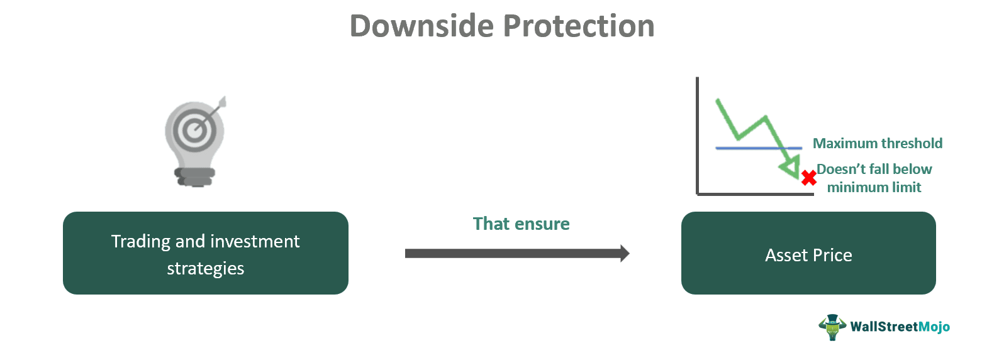

## Table of Contents

## What is a downside in financial terms?

A downside in financial terms refers to the potential loss or negative impact that an investment or financial decision might have. It's the opposite of an upside, which is the potential gain or positive outcome. When people talk about the downside, they are usually thinking about the worst-case scenario or what could go wrong with their money.

Understanding the downside is important because it helps people make better decisions about where to put their money. For example, if an investment has a high potential for loss, someone might decide it's too risky and choose a safer option instead. By considering the downside, people can try to protect themselves from big financial losses and plan for different possibilities.

## Can you provide a simple example of a downside?

Imagine you buy a stock for $100. The downside is what could happen if the stock loses value. If the stock price drops to $50, you lose $50. That's the downside risk - the chance that your investment will be worth less than what you paid for it.

This downside can affect your decisions. If you know there's a big chance the stock could drop to $50, you might decide not to buy it. Or, you might only invest money you can afford to lose. Knowing the downside helps you think about the risks and make smarter choices with your money.

## How does downside risk affect investment decisions?

Downside risk is really important when you're deciding where to put your money. It's all about figuring out how much you could lose if things go wrong. When you know the downside risk, you can decide if you're okay with that amount of loss. For example, if you might lose a lot of money on a risky stock, you might choose to put your money in a safer place instead, like a savings account or a less risky investment.

Understanding downside risk also helps you plan better. If you know there's a chance you could lose money, you might decide to only invest what you can afford to lose. This way, even if the worst happens, you won't be in big trouble. It's like wearing a seatbelt; you hope you don't need it, but it's there to keep you safe just in case. By thinking about the downside, you can make smarter choices and protect your money.

## What are the common types of downside risks in investments?

Downside risks in investments can come in different forms. One common type is market risk, which means the overall market might go down and take your investment with it. For example, if the stock market crashes, your stocks could lose a lot of value. Another type is interest rate risk. This happens when interest rates change, and it can affect the value of bonds or other investments that depend on interest rates.

Another downside risk is credit risk, which is the chance that a company or person you've lent money to won't be able to pay you back. If you buy bonds and the company goes bankrupt, you might not get your money back. There's also liquidity risk, which is when you can't sell your investment quickly enough or at a good price. If you need to sell a piece of real estate fast but can't find a buyer, that's a liquidity risk.

Inflation risk is another type of downside risk. This is when the value of money goes down because prices are going up. If your investment doesn't grow as fast as inflation, you're losing money in real terms. Lastly, there's currency risk, which comes into play if you invest in something in a different country. If that country's currency loses value compared to your own, your investment could be worth less when you convert it back.

## How can an investor measure downside risk?

Investors can measure downside risk by looking at a few key things. One way is to use something called the standard deviation, which shows how much an investment's returns can go up and down. A higher standard deviation means more risk because the investment could lose a lot of value. Another way is to look at the beta of an investment, which tells you how much it moves with the overall market. If an investment has a high beta, it might go down a lot if the market goes down.

Another way to measure downside risk is by using the Value at Risk (VaR) method. This tells you the most you could lose over a certain time, like a day or a month, with a certain level of confidence. For example, if your VaR is $1,000 at 95% confidence over a month, there's a 5% chance you could lose more than $1,000 in that month. You can also look at the downside deviation, which only focuses on the negative returns of an investment. This helps you see how bad the losses could be without considering the good times.

By using these measures, investors can get a better idea of how much they could lose. This helps them decide if they're okay with that level of risk or if they should look for safer investments. Knowing the downside risk is like having a map when you're hiking; it helps you avoid the dangerous paths and choose the ones that are right for you.

## What is the difference between downside risk and volatility?

Downside risk and volatility are both important things to think about when you're investing, but they're not the same. Downside risk is all about the chance that you could lose money. It's like looking at the worst-case scenario and figuring out how much you might lose if things go wrong. For example, if you buy a stock and it goes down, the downside risk is how much money you could lose on that stock.

Volatility, on the other hand, is about how much an investment's price can go up and down over time. It's like a roller coaster; if the price moves a lot, it's more volatile. Volatility looks at both the good times and the bad times, not just the bad ones like downside risk does. So, an investment can be very volatile but still have a low downside risk if it doesn't often lose a lot of value.

Understanding both downside risk and volatility helps you make better choices with your money. Downside risk tells you about the potential losses, which is important if you want to protect your money. Volatility tells you about the ups and downs, which can help you decide if you're okay with a bumpy ride or if you'd rather have a smoother journey. By knowing both, you can pick investments that fit your comfort level with risk.

## What are some strategies to protect against downside risk?

One way to protect against downside risk is by diversifying your investments. This means spreading your money across different types of investments, like stocks, bonds, and real estate. If one investment goes down, the others might stay the same or even go up, which can help balance out your losses. Another strategy is to use stop-loss orders. This is like setting a safety net for your investments. If the price of your investment drops to a certain level, the stop-loss order will automatically sell it, so you don't lose more money than you're okay with losing.

Another way to guard against downside risk is by investing in assets that are less risky. For example, instead of putting all your money in stocks, you might put some in bonds or a savings account. These kinds of investments usually don't go up as much as stocks, but they're also less likely to lose a lot of value. You can also look into insurance products like annuities, which can give you a steady income even if the market goes down. By choosing safer investments, you can protect your money from big losses.

Lastly, you can use hedging strategies to protect against downside risk. Hedging is like buying insurance for your investments. For example, you might buy options that go up in value if your stocks go down. This way, if your stocks lose money, the options can help make up for some of those losses. Hedging can be a bit complicated, but it's a way to limit how much you could lose if things go wrong. By using these strategies, you can feel more secure about your investments and be ready for whatever the market might do.

## How effective are stop-loss orders in managing downside risk?

Stop-loss orders can be a good way to manage downside risk because they help you limit how much money you could lose. When you set a stop-loss order, you tell your broker to sell your investment if it drops to a certain price. This means you won't lose more than you're okay with losing. For example, if you buy a stock for $100 and set a stop-loss at $90, the stock will be sold automatically if it hits $90, so you only lose $10 per share instead of more if the price keeps falling.

However, stop-loss orders aren't perfect and can have some downsides. Sometimes, the market can move very quickly, and your stop-loss order might not be filled at the exact price you set. This is called slippage, and it means you could end up selling your investment for less than you planned. Also, stop-loss orders can lead to selling your investment during a short-term dip, even if the price goes back up later. This means you might miss out on gains if the market recovers quickly. So, while stop-loss orders can help manage downside risk, they're not a foolproof solution and should be used carefully.

## Can diversification help in reducing downside risk? If so, how?

Diversification can help reduce downside risk by spreading your money across different types of investments. Instead of putting all your money in one stock or one type of investment, you can invest in a mix of things like stocks, bonds, and real estate. If one of your investments goes down, the others might stay the same or even go up. This way, the losses from one investment can be balanced out by gains in others, which helps protect your overall money from big drops.

For example, if you only invest in tech stocks and the tech industry has a bad year, you could lose a lot of money. But if you also have some money in bonds or real estate, those might not go down as much or might even go up. By having a mix of investments, you're not putting all your eggs in one basket. This can make your investment journey smoother and help you feel more secure, even when the market is bumpy.

## What role do derivatives play in hedging against downside risk?

Derivatives, like options and futures, can help you protect your investments from losing too much money. They work like insurance for your investments. For example, if you own a stock and you're worried it might go down, you can buy a put option. This gives you the right to sell the stock at a certain price, even if the market price drops lower. So, if the stock does go down, you can use the put option to sell it at the higher price you set, which limits how much money you lose.

Using derivatives to hedge against downside risk can be a bit tricky, though. You have to pay for the derivative, which is like paying for insurance. If the stock doesn't go down, you might lose the money you spent on the derivative. But if the stock does go down, the derivative can save you a lot of money. It's all about balancing the cost of the derivative with the peace of mind it gives you, knowing that you've got a safety net in case things go wrong.

## How do professional investors use advanced metrics like Value at Risk (VaR) to assess downside risk?

Professional investors use Value at Risk (VaR) to figure out how much money they could lose over a certain time, like a day or a month. They do this by looking at how their investments have moved in the past and using math to guess how much they might lose in the future. For example, if their VaR is $1 million at 95% confidence over a month, it means there's a 5% chance they could lose more than $1 million in that month. This helps them understand the worst-case scenario and decide if they're okay with that level of risk.

By using VaR, professional investors can make smarter choices about their investments. They can see if they need to change their strategy to lower their risk or if they should keep things the same. VaR isn't perfect because it's based on guesses about the future, but it's a useful tool that helps investors plan and protect their money. It's like having a weather forecast for your investments; it doesn't tell you exactly what will happen, but it gives you a good idea of what might happen so you can be ready.

## What are the latest trends in downside risk management in the financial industry?

In the financial industry, one of the latest trends in managing downside risk is the use of advanced technology and data analytics. Many investors are now using artificial intelligence (AI) and machine learning to predict how their investments might do in the future. These tools can look at a lot of data very quickly and find patterns that humans might miss. This helps investors see potential risks and make better decisions about where to put their money. For example, AI can help spot when the market might go down, so investors can take steps to protect their investments before it happens.

Another trend is the growing use of environmental, social, and governance (ESG) factors in investment decisions. More and more investors are thinking about how companies treat the environment, their workers, and their leaders when deciding where to invest. They believe that companies that do well in these areas are less likely to have big problems that could hurt their value. By focusing on ESG, investors can lower their downside risk because they're choosing companies that are more likely to be stable and successful in the long run. This approach is becoming more popular as people want their money to do good in the world while also being safe.

## What is the importance of understanding downside risk in algorithmic trading?

Downside risk in algorithmic trading represents the potential decline in an investment's value owing to various factors such as market volatility and operational failures. This type of risk management is particularly critical in algorithmic trading, where transactions occur at exceptionally high speeds, amplifying the challenges associated with risk control.

In contrast to general risk assessment frameworks, which evaluate both upside and downside potentials, downside risk concentrates solely on the likelihood of loss, providing a focused approach to risk evaluation. This targeted perspective is essential as it allows traders to refine their strategies to protect against specific threats of value reduction. For instance, whereas traditional measures might consider potential gains from favorable market movements, downside risk management zeroes in on limiting the adverse effects of negative price fluctuations or operational lapses.

Understanding the magnitude and probability of negative returns is crucial for crafting effective protection strategies. Quantitative measures such as Value at Risk (VaR) and Conditional Value at Risk (CVaR) can help traders estimate the extent of potential losses under normal market conditions. VaR, for example, is a metric that estimates the maximum expected loss over a specified time frame with a given confidence level. If $L$ represents the random loss of a portfolio, the VaR at a confidence level $1-\alpha$ is defined as:

$$
\text{VaR}_\alpha = \inf \{ l \in \mathbb{R} : P(L \leq l) \geq 1 - \alpha \}
$$

These statistical tools enable traders to anticipate potential losses and prepare appropriate hedging or liquidation strategies. Additionally, implementing [machine learning](/wiki/machine-learning) algorithms and predictive models can enhance risk assessments, allowing for more dynamic and adaptable downside protection mechanisms.

To mitigate substantial losses, it is vital for algorithmic traders to employ these measures and continuously update their models with real-time data. This approach ensures that protective strategies remain robust against both expected and unforeseen market shifts, ultimately safeguarding investment portfolios from excessive downside risks.

## What are the key strategies for downside protection?

Hedging techniques are vital in managing downside risk in [algorithmic trading](/wiki/algorithmic-trading), particularly through the use of options and futures contracts. These instruments allow traders to offset potential losses by establishing a protective position against unfavorable market movements. Options provide the right, but not the obligation, to buy or sell an asset at a predetermined price, offering flexibility in hedging strategies. For instance, purchasing put options grants the ability to sell at a set price, thus safeguarding against declines in asset value. Futures contracts, conversely, are agreements to buy or sell an asset at a future date for a specified price, facilitating risk mitigation by locking in prices and managing exposure to price fluctuations.

Portfolio diversification is another cornerstone strategy for reducing risk exposure. Diversification involves spreading investments across various asset classes such as equities, bonds, commodities, and across different sectors or geographical regions. The underlying principle is that a diversified portfolio reduces the impact of poor performance in any single investment, as losses may be counterbalanced by gains in another segment of the portfolio. This strategy is underpinned by Modern Portfolio Theory, which posits that diversification can optimize portfolio returns for a given level of risk. Mathematically, optimizing a diversified portfolio involves solving for the weights $w_i$ of each asset $i$ that minimize the portfolio variance:

$$
\min_w \sigma^2_p = \sum_{i=1}^{n} \sum_{j=1}^{n} w_i w_j \sigma_{ij}
$$

where $\sigma^2_p$ is the portfolio variance and $\sigma_{ij}$ represents the covariance between assets $i$ and $j$.

Stop-loss and take-profit orders are automated limits designed to control losses and secure profits. Stop-loss orders trigger a sale when an asset price falls to a predetermined level, thus capping the potential loss. Conversely, take-profit orders lock in gains by triggering a sale when the asset reaches a desired price, allowing traders to realize profits without constantly monitoring market movements. These automated mechanisms are essential in algorithmic trading, where rapid market shifts can precipitate unexpected losses.

Algorithm-based risk controls integrate risk management protocols within trading algorithms to enforce predefined limits. These controls dynamically adjust the algorithm's trading parameters in real-time to adhere to risk management strategies. For example, algorithms can be programmed to adjust position sizes or halt trading activity entirely if market conditions exceed specific risk thresholds. Python is frequently employed in coding such risk management solutions due to its versatility and robust libraries like Pandas and NumPy, which handle data analysis and numerical computations efficiently. A simple Python code snippet for a risk management algorithm implementing stop-loss logic might look as follows:

```python
def apply_stop_loss(current_price, purchase_price, stop_loss_percent):
    stop_loss_price = purchase_price * (1 - stop_loss_percent / 100)
    if current_price <= stop_loss_price:
        return "Sell"
    return "Hold"

# Example Usage
current_price = 95
purchase_price = 100
stop_loss_percent = 5

decision = apply_stop_loss(current_price, purchase_price, stop_loss_percent)
print(f"Trading decision: {decision}")
```

These key strategies are fundamental in protecting trading portfolios against potential losses while capitalizing on market opportunities. By integrating these risk management techniques, traders can enhance the stability and resilience of their investment strategies.

## What are Advanced Tools and Techniques for Risk Management?

Value at Risk (VaR) and Conditional Value at Risk (CVaR) are integral components of modern risk management strategies, providing quantitative frameworks for estimating potential losses within a portfolio. VaR measures the maximum expected loss over a given time frame at a certain confidence level, fundamentally answering the question: "What is my worst-case scenario given normal market conditions?" The formula for VaR, assuming a normal distribution of returns, is:

$$
\text{VaR}_{\alpha} = \mu + \sigma \cdot z_{\alpha}
$$

where $\mu$ is the expected return, $\sigma$ is the standard deviation of the portfolio returns, and $z_{\alpha}$ is the z-score corresponding to the desired confidence level $\alpha$. Although VaR provides a useful statistical measure, it does not inform about the extent of losses beyond the VaR threshold, which is where CVaR complements this analysis. CVaR, also known as Expected Shortfall, calculates the average loss exceeding VaR, offering a more comprehensive view of tail risk.

Machine Learning (ML) and Monte Carlo Simulations have emerged as powerful methods for predicting and simulating downside scenarios. Machine learning models can uncover complex patterns and nonlinear relationships within market data, enhancing prediction accuracy. Algorithms such as neural networks, decision trees, and support vector machines (SVM) are often employed to anticipate the likelihood and impact of adverse market events, thereby aiding in the development of mitigation strategies.

Monte Carlo simulations, on the other hand, involve running a large number of random simulations to model possible outcomes of a portfolio under uncertainty. This technique is particularly valuable for capturing the variability and risk of financial assets over time. A basic Monte Carlo simulation for a portfolio might look like the following in Python:

```python
import numpy as np

# Simulate daily returns
np.random.seed(42)
mu, sigma = 0.0005, 0.01  # mean and standard deviation
num_simulations = 10000
num_days = 252  # a trading year

returns = np.random.normal(mu, sigma, (num_simulations, num_days))
portfolio_values = 1000 * np.exp(returns.cumsum(axis=1))

# Calculate VaR at 95% confidence level
VaR_95 = np.percentile(portfolio_values[:, -1], 5)
CVaR_95 = portfolio_values[:, -1][portfolio_values[:, -1] < VaR_95].mean()

print(f"VaR 95%: {1000 - VaR_95:.2f}")
print(f"CVaR 95%: {1000 - CVaR_95:.2f}")
```

Stress testing forms another critical part of advanced risk management. It assesses how a portfolio might react under extreme market conditions, thus helping analysts identify points of vulnerability. Such tests include historical scenario analysis, where past market crises are simulated, and hypothetical scenarios that project future extreme conditions. By understanding the behavior of assets and portfolios under stress, traders and risk managers can create robust strategies to shield investments from potential fallout.

Incorporating these advanced tools and techniques enriches the risk management toolkit for algorithmic traders, equipping them to better predict, quantify, and mitigate potential losses. As the financial markets grow increasingly complex, leveraging statistical measures like VaR and CVaR, machine learning advancements, and simulation techniques becomes essential for maintaining the integrity and resilience of trading strategies.

## How can one mitigate market volatility and preserve capital?

Market [volatility](/wiki/volatility-trading-strategies) presents significant challenges to algorithmic trading strategies, necessitating the implementation of proactive risk management practices. The most effective methods for mitigating such volatility include setting stop-loss orders and diversifying portfolios.

Stop-loss orders are designed to limit an investor's loss on a position in a security. By automating the selling process when the price of a security drops to a predetermined level, traders can protect against substantial loss. This is crucial in algorithmic trading, where rapid execution is key, and continuous monitoring of positions may not be feasible. Stop-loss orders offer the advantage of minimizing emotional decision-making, which can often lead to irrational trading moves.

Portfolio diversification is another fundamental technique for managing downside risk arising from market volatility. By spreading investments across various asset classes, industries, and geographies, traders can reduce their exposure to any single asset or risk [factor](/wiki/factor-investing). In mathematical terms, if the returns on different assets in a portfolio are denoted as $R_1, R_2, \ldots, R_n$ with respective weights $w_1, w_2, \ldots, w_n$, then the overall portfolio return $R_p$ can be represented as:

$$
R_p = \sum_{i=1}^{n} w_i R_i 
$$

The variance $\sigma_p^2$ of the portfolio return, which measures risk, is given by:

$$
\sigma_p^2 = \sum_{i=1}^{n} w_i^2 \sigma_i^2 + \sum_{i \neq j} w_i w_j \sigma_i \sigma_j \rho_{ij}
$$

where $\sigma_i$ and $\sigma_j$ are the standard deviations of the returns of the assets, and $\rho_{ij}$ is the correlation coefficient between the returns of assets $i$ and $j$. Lower $\rho_{ij}$ leads to reduced portfolio risk through diversification.

Preserving capital is paramount to ensure the continuity and sustainability of trading strategies amidst unforeseen market fluctuations. Robust risk management practices not only protect against large losses but also provide the flexibility to capitalize on future opportunities. As markets can be unpredictable, ensuring capital preservation helps traders stay active in the market longer, allowing them to potentially recover from setbacks and benefit from favorable conditions. By maintaining a disciplined approach through diversified investments and prudent stop-loss mechanisms, traders can achieve greater resilience in their portfolios.

## References & Further Reading

[1]: Bergstra, J., Bardenet, R., Bengio, Y., & Kégl, B. (2011). ["Algorithms for Hyper-Parameter Optimization."](https://dl.acm.org/doi/10.5555/2986459.2986743) Advances in Neural Information Processing Systems 24.

[2]: ["Advances in Financial Machine Learning"](https://www.amazon.com/Advances-Financial-Machine-Learning-Marcos/dp/1119482089) by Marcos Lopez de Prado

[3]: ["Evidence-Based Technical Analysis: Applying the Scientific Method and Statistical Inference to Trading Signals"](https://www.amazon.com/Evidence-Based-Technical-Analysis-Scientific-Statistical/dp/0470008741) by David Aronson

[4]: ["Machine Learning for Algorithmic Trading"](https://github.com/stefan-jansen/machine-learning-for-trading) by Stefan Jansen

[5]: ["Quantitative Trading: How to Build Your Own Algorithmic Trading Business"](https://www.amazon.com/Quantitative-Trading-Build-Algorithmic-Business/dp/1119800064) by Ernest P. Chan