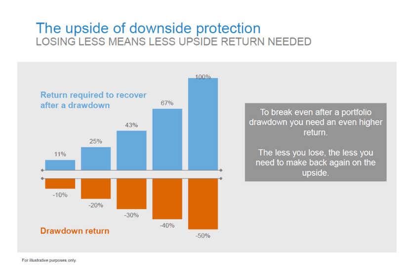

## Table of Contents

## What is downside protection in investment?

Downside protection in investment refers to strategies or measures that investors use to limit or reduce potential losses. It's like having a safety net that catches you if you fall. Investors use downside protection to make sure that if the value of their investments goes down, they don't lose as much money as they could have. This can be done through various methods, like buying insurance on investments or choosing safer investment options.

One common way to achieve downside protection is by diversifying your investments. This means spreading your money across different types of investments, so if one investment does poorly, the others might do well and balance it out. Another method is using stop-loss orders, which automatically sell an investment if its price drops to a certain level, helping to limit losses. By using these strategies, investors can feel more secure and less worried about losing money, which can make investing less stressful.

## Why is downside protection important for investors?

Downside protection is important for investors because it helps them avoid losing a lot of money. When you invest, there's always a chance that the value of your investments might go down. If you have downside protection, it's like having a safety net that stops you from falling too far. This can make you feel more secure about investing, knowing that even if things go wrong, you won't lose everything.

Another reason downside protection is important is that it helps investors keep their money safe for the long term. If you lose a big part of your investment because of a sudden drop in the market, it can take a long time to recover. By using downside protection, you can keep more of your money safe, which means you'll have more to invest in the future. This can help you reach your financial goals without having to worry as much about big losses.

## What are the common strategies for achieving downside protection?

One common strategy for achieving downside protection is diversification. This means spreading your money across different types of investments. For example, instead of putting all your money into one company's stock, you might invest in stocks from different companies, bonds, and even real estate. By doing this, if one investment goes down in value, the others might stay the same or go up, which helps balance out your losses. It's like not putting all your eggs in one basket.

Another strategy is using stop-loss orders. A stop-loss order is like a safety net for your investments. You set a price at which you want to sell an investment if it starts to drop. If the price of the investment falls to that level, it automatically sells, helping to limit how much money you lose. This can be really helpful during times when the market is going down a lot, because it helps you get out before you lose too much.

A third way to achieve downside protection is by investing in assets that are less risky. Some investments, like government bonds, are considered safer because they are less likely to lose value. While these investments might not grow as fast as riskier ones, they can help protect your money from big drops. It's all about finding a balance between growing your money and keeping it safe.

## How does diversification help in providing downside protection?

Diversification helps in providing downside protection by spreading your investments across different types of assets. When you invest in a variety of things, like stocks, bonds, and real estate, you're not putting all your money in one place. If one of your investments goes down in value, the others might not go down as much or might even go up. This means that the losses from one investment can be balanced out by the gains from another, helping to protect your overall investment from big drops.

Think of it like this: if you have a basket of different fruits and one type of fruit goes bad, you still have other fruits to eat. In the same way, if you have a mix of investments and one of them does poorly, you still have other investments that can help keep your money safe. By spreading your money around, you're less likely to lose a lot all at once, which makes investing feel less risky and more secure.

## Can you explain the role of stop-loss orders in downside protection?

Stop-loss orders are like a safety net for your investments. They work by setting a price at which you want to sell an investment if it starts to drop. For example, if you buy a stock for $100 and set a stop-loss order at $90, the stock will automatically be sold if its price falls to $90. This helps you limit how much money you lose because it gets you out of the investment before it drops even more.

Using stop-loss orders can make investing less stressful. When the market is going down a lot, it's easy to feel worried about losing money. But with a stop-loss order, you can feel more secure knowing that you have a plan to protect your money. It's like having an automatic backup plan that helps you avoid big losses, making it easier to stick with your investment strategy even when things get tough.

## What are put options and how do they contribute to downside protection?

Put options are like insurance for your investments. When you buy a put option, you're paying for the right to sell a certain investment at a specific price, called the strike price, before a certain date. If the price of the investment goes down a lot, you can use the put option to sell it at the higher strike price instead of the lower market price. This helps you avoid losing as much money as you would if you had to sell at the lower price.

Using put options can make you feel more secure about investing. They act as a safety net, protecting you from big drops in the value of your investments. By having a put option, you know that even if the market goes down, you have a way to limit your losses. This can make investing less scary and help you stick with your investment plan, even during tough times.

## How do protective puts work and what are their benefits?

Protective puts are like a safety net for your investments. When you buy a protective put, you're buying the right to sell a certain investment at a set price, called the strike price, before a certain date. If the price of your investment goes down a lot, you can use the put to sell it at the higher strike price instead of the lower market price. This means you don't lose as much money as you would if you had to sell at the lower price. It's like having insurance that protects you from big drops in the value of your investment.

The main benefit of protective puts is that they help you feel more secure about investing. Knowing that you have a way to limit your losses can make investing less scary. Even if the market goes down, you have a plan to protect your money. This can help you stick with your investment plan, even during tough times. Protective puts give you peace of mind, knowing that you're prepared for whatever the market might do.

## What is the difference between downside protection and risk management?

Downside protection and risk management are related but different ideas. Downside protection is like having a safety net for your investments. It's about using specific strategies to stop you from losing too much money if the value of your investments goes down. For example, you might use stop-loss orders or buy put options to make sure you don't lose a lot if the market drops.

Risk management, on the other hand, is a bigger idea. It's about looking at all the possible risks that could affect your investments and figuring out how to handle them. This includes thinking about things like how much you're willing to lose, how long you plan to keep your investments, and what might happen in the market. Risk management is about making a plan to deal with all kinds of risks, not just the risk of losing money when the market goes down.

## How can asset allocation be used to enhance downside protection?

Asset allocation is like deciding how to split your money among different types of investments, like stocks, bonds, and cash. By choosing the right mix, you can make your investments safer and help protect them from big drops. For example, if you put more money into bonds and less into stocks, your investments might not grow as fast, but they'll be less likely to lose a lot of value if the stock market goes down. This is because bonds are usually safer than stocks.

When you use asset allocation to enhance downside protection, you're trying to find a balance that works for you. You might decide to put some money into stocks for growth, but also keep a good amount in bonds and cash to make sure you're protected if things go wrong. By spreading your money around in this way, you can reduce the risk of losing a lot all at once. It's like not putting all your eggs in one basket, which helps keep your money safer and gives you peace of mind.

## What are the potential drawbacks or limitations of downside protection strategies?

Downside protection strategies can be helpful, but they also have some drawbacks. One big problem is that these strategies can limit how much money you can make. For example, if you use stop-loss orders or buy put options, you might miss out on big gains if the market goes up a lot. These tools are like a safety net, but they can also hold you back from earning more money.

Another limitation is that downside protection strategies can cost you money. Buying put options or other types of insurance for your investments isn't free. You have to pay for these protections, and that money could be used to buy more investments instead. So, you need to think about whether the cost of protecting your money is worth it, especially if the market doesn't go down as much as you thought it would.

## How do advanced investors use hedging techniques for downside protection?

Advanced investors use hedging techniques to protect their investments from big drops in value. One common way they do this is by using options. For example, they might buy put options, which give them the right to sell an investment at a set price if the market goes down. This acts like insurance, helping them avoid losing too much money. Another way is by using futures contracts, which let them lock in a price for an investment in the future. This can help them know what they'll get for their investment, even if the market goes down.

Another technique advanced investors use is called pairs trading. This involves buying one investment and selling another that's similar but expected to move in the opposite direction. If the market goes down, the investment they sold might lose value, but the one they bought might go up, balancing out their losses. By using these hedging techniques, advanced investors can feel more secure about their investments. They know they have ways to limit their losses, even if the market doesn't go the way they hoped.

## Can you discuss the impact of market volatility on downside protection strategies?

Market volatility, which means how much prices go up and down, can make downside protection strategies more important but also more challenging. When the market is very volatile, prices can change a lot in a short time. This makes it harder to predict what will happen, so investors might want to use downside protection strategies more often. For example, they might use stop-loss orders to sell their investments if the price drops too much, or buy put options to protect against big losses. These strategies can help investors feel safer during times when the market is moving a lot.

However, market volatility can also make downside protection strategies less effective. If the market is very volatile, the price of an investment might drop below a stop-loss order and then go back up quickly. This means the investor might sell their investment at a low price and miss out on the recovery. Also, put options can become more expensive during volatile times because more people want to buy them for protection. So, while downside protection strategies can help during volatile times, they might not work perfectly and can cost more money.

## What are Downside Protection Techniques?

Downside protection is a strategic approach to safeguarding investments from significant value declines. This strategy is integral for investors seeking to minimize potential losses while maintaining the opportunity for gains. There are several key techniques that can be employed to achieve effective downside protection.

**Stop-Loss Orders**

Stop-loss orders are a fundamental tool used to limit potential losses in an investment. This involves setting a predetermined price level at which a security will be sold. If the market price falls to this level, the order is automatically executed, thereby capping the loss. This method is particularly useful for individual securities, allowing investors to manage the risk of adverse market movements without needing constant monitoring.

**Options Contracts**

Options contracts provide investors with the right, but not the obligation, to buy or sell an asset at a specified price before a certain date. Protective puts, a type of options contract, are commonly used for downside protection. A protective put allows an investor to sell a stock at a predetermined price, effectively setting a floor for the investment's value. This can be highly beneficial during volatile market conditions, as it provides a protective layer against sharp declines.

**Diversification**

Diversification involves spreading investments across various asset classes, sectors, and geographical regions to reduce exposure to any single source of risk. By holding a well-diversified portfolio, investors can mitigate the impact of a downturn in a specific market segment. The principle behind diversification is that asset classes will respond differently to the same economic event, thus balancing potential losses with gains.

**Implementation of Protective Puts and Other Derivatives**

Protective puts and other derivative instruments can be used to construct strategies that hedge against potential market downturns. For instance, a protective put is akin to an insurance policy - it requires paying a premium but ensures the ability to sell the underlying asset at a specified price. The Black-Scholes model, a widely-used method for estimating the price of options, can be applied to assess the value and effectiveness of such instruments:

$$
C = S_0 N(d_1) - X e^{-rt} N(d_2)
$$

Where:
- $C$ = Call option price
- $S_0$ = Current stock price
- $X$ = Strike price
- $r$ = Risk-free interest rate
- $t$ = Time to expiration
- $N(d)$ = Cumulative standard normal distribution

**Cost of Protection vs. Expected Return and Duration**

One of the crucial considerations in downside protection is evaluating the cost against the expected return and investment duration. Protective measures, such as options and diversification, come with their associated costs that could impact the overall return if not appropriately balanced. Investors must carefully assess whether the expense of implementing these protective strategies is justified by the level of risk mitigation they offer, especially in relation to the potential upside and the intended holding period of the investment.

By employing these techniques thoughtfully, investors can effectively guard against significant downturns while maintaining the potential for portfolio growth under favorable market conditions.

## References & Further Reading

[1]: Bergstra, J., Bardenet, R., Bengio, Y., & Kégl, B. (2011). ["Algorithms for Hyper-Parameter Optimization."](https://dl.acm.org/doi/10.5555/2986459.2986743) Advances in Neural Information Processing Systems 24.

[2]: ["Advances in Financial Machine Learning"](https://www.amazon.com/Advances-Financial-Machine-Learning-Marcos/dp/1119482089) by Marcos Lopez de Prado

[3]: ["Evidence-Based Technical Analysis: Applying the Scientific Method and Statistical Inference to Trading Signals"](https://www.amazon.com/Evidence-Based-Technical-Analysis-Scientific-Statistical/dp/0470008741) by David Aronson

[4]: ["Machine Learning for Algorithmic Trading"](https://github.com/stefan-jansen/machine-learning-for-trading) by Stefan Jansen

[5]: ["Quantitative Trading: How to Build Your Own Algorithmic Trading Business"](https://www.amazon.com/Quantitative-Trading-Build-Algorithmic-Business/dp/1119800064) by Ernest P. Chan