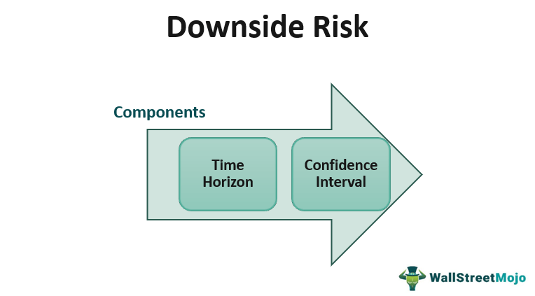

## Table of Contents

## What is downside risk?

Downside risk is the chance that an investment will lose value. It's the risk that you might get less money back than you put in. Imagine you buy a stock for $100. If the stock price drops to $80, that $20 loss is your downside risk. Investors often worry about this because no one wants to lose money.

To measure downside risk, people look at things like the biggest drop in value that could happen, how often losses happen, and how bad those losses might be. Tools like the Sortino ratio help focus just on the bad times, not the good ones. By understanding downside risk, investors can make smarter choices about where to put their money, balancing the chance of losing money with the chance of making more.

## Why is it important to measure downside risk?

Measuring downside risk is important because it helps investors understand how much money they could lose. When you invest, you want to make more money, but there's always a chance you might lose some. By knowing the downside risk, you can see if the possible losses are too big for you to handle. This helps you decide if an investment is worth the risk.

It also helps in comparing different investments. If two investments could make you the same amount of money, but one has a much bigger chance of losing money, you might choose the one with less downside risk. This way, you can pick investments that fit your comfort level with risk and help you sleep better at night knowing you've made a smart choice.

## What are the common methods used to calculate downside risk?

One common way to calculate downside risk is by looking at the biggest drop in value that could happen. This is called the maximum drawdown. Imagine you buy a stock for $100, and it drops to $80 at its lowest point before going back up. That $20 drop is the maximum drawdown. It shows the worst loss you might face, which helps you see if you can handle that kind of risk.

Another method is using the Sortino ratio. This ratio focuses only on the bad times, not the good ones. It looks at how much an investment could lose and compares that to the returns you want. If the Sortino ratio is high, it means the investment has a good chance of giving you what you want without too much risk of losing money. This helps you pick investments that balance the chance of losing money with the chance of making more.

Lastly, you can use something called Value at Risk (VaR). VaR tells you the most money you could lose over a certain time with a certain chance. For example, if your VaR is $10,000 at a 5% chance over a month, there's a 5% chance you could lose $10,000 or more in that month. This helps you understand the risk of losing money in a simple way, so you can plan better and not be surprised by big losses.

## How does the Sortino Ratio help in assessing downside risk?

The Sortino Ratio helps you understand downside risk by focusing only on the bad times, not the good ones. It looks at how much an investment might lose and compares that to the returns you want. If the Sortino Ratio is high, it means the investment has a good chance of giving you what you want without too much risk of losing money. This is different from other measures like the Sharpe Ratio, which looks at all kinds of risk, both good and bad.

By using the Sortino Ratio, you can see if an investment's potential losses are too big for you to handle. It helps you pick investments that balance the chance of losing money with the chance of making more. For example, if two investments could make you the same amount of money, but one has a higher Sortino Ratio, it means that investment is better at avoiding big losses. This way, you can choose investments that fit your comfort level with risk and help you make smarter choices about where to put your money.

## Can you explain the concept of Value at Risk (VaR) in relation to downside risk?

Value at Risk (VaR) is a way to measure how much money you could lose from an investment over a certain time. It tells you the most you might lose with a certain chance. For example, if your VaR is $10,000 at a 5% chance over a month, there's a 5% chance you could lose $10,000 or more in that month. This helps you understand the risk of losing money in a simple way, so you can plan better and not be surprised by big losses.

VaR is important because it gives you a clear number to think about when you're deciding if an investment is too risky for you. If you know you can't handle losing more than a certain amount, VaR helps you see if an investment might go over that limit. By using VaR, you can compare different investments and pick the ones that fit your comfort level with risk, helping you make smarter choices about where to put your money.

## What is the difference between downside risk and total risk?

Downside risk is the chance that an investment will lose value. It's all about the bad times, focusing on how much money you might lose. Imagine you buy a stock for $100, and it drops to $80. That $20 loss is your downside risk. Investors care about this because no one wants to lose money. Tools like the Sortino Ratio and Value at Risk (VaR) help measure downside risk by looking at the biggest possible loss and how often losses might happen.

Total risk, on the other hand, looks at both the good and the bad times. It includes all the ups and downs of an investment, not just the losses. Total risk is often measured by things like standard deviation, which shows how much an investment's value might change in any direction. While downside risk focuses on the potential for loss, total risk gives you a broader picture of how risky an investment might be overall. Understanding both helps investors make better choices about where to put their money.

## How can semi-variance be used to measure downside risk?

Semi-variance is a way to measure downside risk by looking only at the times when an investment loses money. It's different from regular variance, which looks at all the ups and downs. Semi-variance focuses just on the bad times, so it helps you see how much an investment might lose. Imagine you buy a stock, and it goes up and down. Semi-variance would only care about the times it goes down, helping you understand the risk of losing money.

By using semi-variance, you can get a better idea of how much an investment might hurt your wallet. It's a useful tool because it shows you the average size of losses, not just how often they happen. This can help you decide if an investment is too risky for you. If the semi-variance is high, it means the investment has big losses sometimes, which might make you think twice before investing.

## What are the limitations of using standard deviation as a measure of downside risk?

Standard deviation is a common way to measure risk, but it has some problems when you use it to look at downside risk. It looks at all the ups and downs of an investment, not just the bad times. This means it treats gains and losses the same way. But when you're worried about losing money, you don't care about the good times as much. You want to know how much you might lose, not how much you might gain. So, standard deviation can make an investment seem riskier than it really is if it has a lot of big gains and small losses.

Another problem with standard deviation is that it doesn't tell you how often losses happen or how bad they might be. It just gives you an average of all the changes, good and bad. This can be confusing because it doesn't focus on the downside risk you're trying to measure. If you want to know how much money you might lose, you need a tool that looks only at the bad times, like semi-variance or the Sortino Ratio. These tools can give you a clearer picture of the risk of losing money, which is what you really care about when you're thinking about downside risk.

## How do downside risk measures differ for different asset classes?

Downside risk measures can be different for stocks, bonds, and other types of investments. For stocks, people often use things like the Sortino Ratio and Value at Risk (VaR) to see how much money they might lose. Stocks can go up and down a lot, so these tools help investors understand the chance of losing money. For example, if a stock has a high Sortino Ratio, it means it's good at avoiding big losses. On the other hand, if the VaR is high, it means there's a bigger chance of losing a lot of money.

For bonds, downside risk is often measured differently because bonds usually don't change in value as much as stocks. People might look at the credit risk, which is the chance that the company or government that issued the bond might not pay back the money. They also use something called duration to see how much the bond's value might change if interest rates go up or down. This helps investors understand how much they might lose if things don't go as planned.

Other types of investments, like real estate or commodities, have their own ways to measure downside risk. For real estate, people might look at things like rental income and property values to see how much they could lose. For commodities, like gold or oil, people might use VaR to see how much the price could drop. Each type of investment has its own risks, so the tools used to measure downside risk need to fit those risks to help investors make smart choices.

## What advanced statistical methods can be used to estimate downside risk more accurately?

One advanced way to estimate downside risk more accurately is by using something called Conditional Value at Risk (CVaR). CVaR goes beyond the basic Value at Risk (VaR) by looking at not just the chance of losing money, but also how much you might lose if things go really bad. Imagine you're worried about losing money on a stock. VaR might tell you there's a 5% chance you could lose $10,000 in a month. CVaR would tell you that if you do lose money, you might lose even more than $10,000, like $12,000 on average. This helps you understand the worst-case scenarios better and plan more carefully.

Another method is using Monte Carlo simulations. This is like playing out thousands of different scenarios to see what might happen to your investment. You can use a computer to pretend the stock market goes up and down in all sorts of ways, and then see how much money you might lose in each case. By looking at all these different possibilities, you get a better idea of the downside risk. This method is great because it can show you not just the average loss but also the range of possible losses, helping you make smarter decisions about where to put your money.

## How can downside risk be incorporated into portfolio optimization?

Downside risk can be added to portfolio optimization by using tools like the Sortino Ratio and Conditional Value at Risk (CVaR). These tools help you focus on the bad times, not just the good ones. When you're building a portfolio, you want to pick investments that give you the returns you want without too much risk of losing money. By using the Sortino Ratio, you can see which investments are good at avoiding big losses. CVaR helps you understand the worst-case scenarios better, so you can plan for the biggest possible losses. This way, you can balance the chance of making money with the chance of losing money, helping you build a portfolio that fits your comfort level with risk.

Another way to include downside risk in portfolio optimization is by using something called mean-CVaR optimization. This method looks at the average return you might get and the worst losses you might face. By focusing on both, you can find the best mix of investments that give you the returns you want without taking on too much risk. This is different from traditional methods like mean-variance optimization, which looks at all kinds of risk, not just the bad times. By using mean-CVaR optimization, you can build a portfolio that's more focused on avoiding big losses, which is what you really care about when you're worried about downside risk.

## What are some real-world applications of downside risk analysis in investment management?

In investment management, downside risk analysis is used to help investors make smarter choices about where to put their money. For example, a fund manager might use tools like the Sortino Ratio to pick stocks that are good at avoiding big losses. This helps them build a portfolio that can give investors the returns they want without too much risk of losing money. By focusing on downside risk, the fund manager can help investors sleep better at night, knowing their money is in safe hands.

Another real-world use of downside risk analysis is in retirement planning. When people are saving for retirement, they want to make sure their money lasts as long as they do. Financial advisors use downside risk measures like Value at Risk (VaR) to see how much money a retiree might lose in a bad year. This helps them create a plan that balances the need for growth with the need to protect against big losses. By understanding the downside risk, advisors can help retirees feel more confident about their financial future.

## What are Risk Calculation Techniques?

Financial risk calculation techniques are crucial for effective risk management in trading and investment. These techniques primarily utilize statistical and data-driven methods to quantify potential losses within a portfolio or financial strategy. Key quantitative models include Value at Risk (VaR) and Conditional Value at Risk (CVaR), along with techniques such as stress testing and scenario analysis.

Value at Risk (VaR) is a widely employed statistic that estimates the potential loss in value of a portfolio over a specified time frame for a given confidence interval. It is defined mathematically as:

$$
VaR_\alpha = \text{inf} \{ x \in \mathbb{R} : P(L \leq x) \geq \alpha \}
$$

where $L$ is the loss variable, and $\alpha$ is the confidence level. VaR can be calculated using methods like the historical method, variance-covariance method, and Monte Carlo simulations. Each approach has its own assumptions and limitations, which must be considered in practical applications.

Conditional Value at Risk (CVaR), also known as Expected Shortfall, provides an extension to VaR by measuring the expected losses that occur beyond the VaR threshold. It is particularly useful for assessing tail risk, representing what happens in worst-case scenarios:

$$
CVaR_\alpha = E[L \mid L \geq VaR_\alpha]
$$

CVaR offers a more comprehensive risk assessment, especially for non-normal distributions of returns where tail risks are more pronounced.

Stress testing and scenario analysis complement VaR and CVaR by evaluating the potential impact of extreme or unexpected events on financial positions. Stress testing involves creating hypothetical but plausible stress scenarios (e.g., market crashes or economic downturns) to assess vulnerabilities in a portfolio. Scenario analysis extends this by considering a range of possible situations, allowing for diversified risk mitigation strategies.

The effectiveness of these techniques depends heavily on the availability and quality of data. Accurate risk calculations require high-quality, comprehensive data to ensure that the statistical models used are robust and reflective of real market conditions. Data limitations, such as outdated or incomplete data sets, can severely impact the accuracy of risk assessments.

Moreover, risk calculation models face challenges in capturing complex market dynamics and correlations, especially during times of market turmoil. The assumptions underpinning these models, such as normal distribution of returns or constant volatility, often fail during abnormal market conditions, leading to underestimation of risks.

In summary, quantitative risk calculation techniques like VaR, CVaR, stress testing, and scenario analysis are crucial for managing financial and downside risks. Their reliability depends on sound statistical methods and data integrity. However, practitioners must remain aware of and address the inherent limitations and challenges associated with these models to ensure robust risk management practices.

## How can we develop risk calculation algorithms for trading?

The development of risk calculation algorithms tailored for trading requires a nuanced understanding of both financial and downside risk and the incorporation of these assessments into algorithmic trading systems. The initial stage involves defining the specific risks pertinent to the trading strategy, including market volatility, creditworthiness of counterparties, [liquidity](/wiki/liquidity-risk-premium) constraints, and potential losses beyond the average expected levels.

An effective risk calculation algorithm must assess both standard financial risk metrics and downside risk measures. Downside risk, which focuses on potential losses rather than symmetrical risk, can be quantified using methods such as Value at Risk (VaR) and Conditional Value at Risk (CVaR). The formula for VaR helps determine the potential loss in the value of an asset or portfolio over a defined period for a given confidence interval. CVaR provides an expected loss exceeding the VaR threshold:

$$
\text{CVaR}_\alpha = \frac{1}{1 - \alpha} \int_{\alpha}^{1} \text{VaR}_\beta \, d\beta
$$

The integration of these risk assessments into trading algorithms demands accuracy, speed, and adaptability. Accuracy ensures that the algorithm accurately reflects real-world market conditions and captures relevant risk factors without introducing significant errors. Speed is critical, as trading environments involve rapid price movements, and timely calculations can mean the difference between profit and loss. Adaptability allows the algorithm to adjust to changing market dynamics, incorporating new data or modifying existing risk parameters as needed.

Developers must choose languages and tools that support efficient implementation and testing of these algorithms. Python is favored due to its extensive libraries such as NumPy for numerical computations, Pandas for data manipulation, and SciPy for advanced statistical calculations. Libraries like Scikit-learn provide [machine learning](/wiki/machine-learning) functionalities that can enhance risk assessments through pattern recognition and predictive analytics. Additionally, the flexibility of Python makes it ideal for prototyping, while C++ might be used for speed-critical components in production systems where execution speed is paramount.

An example of a simple risk analysis function in Python could involve calculating VaR using historical simulation:

```python
import numpy as np

def calculate_var(returns, confidence_level=0.95):
    sorted_returns = np.sort(returns)
    index = int((1 - confidence_level) * len(sorted_returns))
    var = abs(sorted_returns[index])
    return var

returns = np.array([-0.02, -0.01, 0.00, 0.01, 0.02, 0.03, 0.04])
var_95 = calculate_var(returns)
print(f"Value at Risk at 95% confidence level: {var_95:.2%}")
```

Effective risk calculation algorithms for trading must balance between precision, computational efficiency, and the flexibility to adapt to evolving strategies and risk landscapes. The choice of programming language, the structure of the algorithm, and robust testing are critical to ensuring that the algorithm not only meets current market demands but is also resilient to future challenges.

## References & Further Reading

[1]: JSTOR, ["Algorithmic Trading and Financial Markets."](https://www.jstor.org/stable/j.ctv191kx1k)

[2]: Lopez de Prado, M. (2018). ["Advances in Financial Machine Learning."](https://books.google.com/books/about/Advances_in_Financial_Machine_Learning.html?id=oU9KDwAAQBAJ) Wiley.

[3]: Aronson, D. (2006). ["Evidence-Based Technical Analysis: Applying the Scientific Method and Statistical Inference to Trading Signals."](https://www.amazon.com/Evidence-Based-Technical-Analysis-Scientific-Statistical/dp/0470008741) Wiley.

[4]: Jansen, S. (2020). ["Machine Learning for Algorithmic Trading."](https://github.com/stefan-jansen/machine-learning-for-trading) Independent.

[5]: Chan, E. (2008). ["Quantitative Trading: How to Build Your Own Algorithmic Trading Business."](https://github.com/ftvision/quant_trading_echan_book) Wiley.