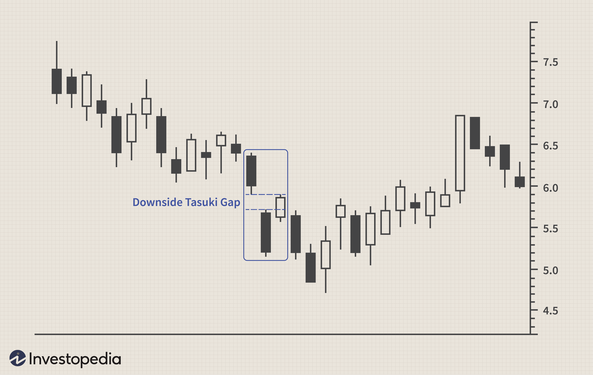

Candlestick patterns are fundamental tools in technical analysis, providing insights into possible future market trends based on historical price data. Among these patterns, the Downside Tasuki Gap is recognized as a bearish continuation pattern that traders frequently employ to predict the continuation of a downtrend. It is characterized by a specific sequence of candlesticks that depict the battle between bearish and bullish market forces, ultimately suggesting a potential resumption of a declining trend.

This article explores the Downside Tasuki Gap, examining its significance in financial analysis and its utility in algorithmic trading. By comprehending this pattern, both seasoned and novice traders can enhance their trading strategies, taking advantage of its predictive power. The Downside Tasuki Gap stands as a valuable tool for those looking to navigate the complexities of market movements and optimize their trading outcomes.



## Table of Contents

## Understanding the Downside Tasuki Gap

The Downside Tasuki Gap is a recognized pattern in candlestick charting that signals the continuation of a bearish trend. This pattern manifests itself through a particular sequence of candlesticks typically observed in a downtrending market. The formation begins with a red candle, which denotes a downward market movement, reaffirming the ongoing bearish sentiment. This is followed by another red candle that opens lower than the closing price of the first, creating a gap down. This gap is indicative of sustained selling pressure, as the market opens at a level far lower than the previous close.

The sequence culminates with a green or white candle, which attempts to close the gap between the opening price of the second red candle and its own closing price. While this might appear as an initial sign of bullish intervention, it does not indicate a reversal of the trend. Instead, the inability of this candle to exceed the gap suggests that bullish momentum is insufficient to alter the prevailing downtrend. Consequently, the pattern signals a probable continuation of the bearish market movement.

A significant feature of the Downside Tasuki Gap is its implication regarding market sentiment. The pattern reveals that while buyers attempt to push the price upwards temporarily, they lack the conviction or market strength to sustain an upward trend. Bears, therefore, are likely to reassert control, pushing prices further down. Traders, recognizing this pattern, can use it as an indicator of further declines in asset prices, adjusting their positions accordingly to capitalize on the anticipated movement.

## Financial Analysis and Implications

Analyzing the Downside Tasuki Gap involves assessing the market sentiment and the dynamics of buyer and seller interactions during its formation. This candlestick pattern is indicative of robust selling pressure, typically manifesting during a continuation of an existing downtrend. Initially, the pattern emerges with a red candlestick, succeeded by another red candle that gaps down, illustrating a sustained bearish sentiment. The emergence of a subsequent green or white candle within the gap indicates a temporary reversal as bulls attempt to regain control. However, because the green candle does not close the gap with the previous candle, it suggests that bearish forces remain dominant. 

In financial markets, recognizing the Downside Tasuki Gap can be instrumental in predicting future price movements. By identifying this pattern, traders can infer that despite temporary bullish reversals, the probability of continued price declines remains significant. This understanding aids traders in making informed decisions regarding entry and [exit](/wiki/exit-strategy) points, enabling them to position themselves advantageously in anticipation of further market downturns.

Traders often utilize technical indicators such as the Relative Strength Index (RSI) or moving averages to validate the implications of the Downside Tasuki Gap. The RSI, which measures the speed and change of price movements, can help determine whether an asset is overbought or oversold. When the RSI is in the overbought region while a Downside Tasuki Gap forms, the likelihood of a continued downtrend increases.

Similarly, moving averages, which smooth out price data over a specified period, can aid in confirming the pattern's validity. A situation where the gap occurs while prices are below the moving average reinforces the bearish outlook suggested by the Downside Tasuki Gap. Such complementary analysis ensures that traders do not rely solely on the pattern, thus minimizing the risk of false signals and improving the robustness of their trading strategies.

## Algorithmic Trading with Downside Tasuki Gap

In [algorithmic trading](/wiki/algorithmic-trading), the Downside Tasuki Gap can significantly enhance trading strategies by allowing traders to leverage technology for identifying and executing trades based on this pattern. Algorithms, designed to spot the Downside Tasuki Gap across various asset classes, offer the advantage of speed and precision, ensuring that traders do not miss potential opportunities in fast-moving markets.

One effective method is through [backtesting](/wiki/backtesting), where algorithms are tested against historical data to evaluate the pattern's reliability and performance under different market conditions. This involves creating a dataset of historical prices and programming the algorithm to simulate trades based on the pattern's appearance. Traders can assess the pattern's success rate by measuring metrics such as profit and loss, risk-reward ratio, and drawdown during simulations.

Backtesting can be implemented using Python, a popular language in the trading community due to its robust libraries such as Pandas, NumPy, and TA-Lib, which are suited for data manipulation and technical analysis. Below is a simple Python code snippet that outlines how an algorithm might be structured to identify the Downside Tasuki Gap:

```python
import pandas as pd

def identify_downside_tasuki_gap(data):
    patterns = []
    for i in range(2, len(data)):
        # Checking the upcoming pattern of candles
        if (data['Close'][i-2] < data['Open'][i-2]) and \
           (data['Close'][i-1] < data['Open'][i-1]) and \
           (data['Open'][i-1] < data['Close'][i-2]) and \
           (data['Open'][i] > data['Close'][i-1]) and \
           (data['Close'][i] > data['Open'][i]):
            patterns.append(i)
    return patterns

# Example usage with historical data
historical_data = pd.read_csv('historical_prices.csv')
patterns = identify_downside_tasuki_gap(historical_data)
print("Downside Tasuki Gap found at indices:", patterns)
```
In this code, the function `identify_downside_tasuki_gap` verifies the sequence of candlestick patterns that characterize the Downside Tasuki Gap and logs the index positions where they appear in the dataset.

Moreover, integrating the Downside Tasuki Gap within an algorithmic framework helps traders automate their entry and exit decisions. Once the pattern is detected, algorithms can place sell orders or short positions automatically, removing emotional biases from trading decisions and thus enhancing operational consistency.

It's essential to incorporate risk management strategies alongside algorithmic patterns. This could include setting stop-loss orders to mitigate adverse market movements or adjusting trading sizes to fit broader portfolio management strategies.

Overall, combining the Downside Tasuki Gap with algorithmic trading provides traders with a potent tool to capitalize on bearish market conditions, increasing their capability for efficient and repeatable trade executions.

## Limitations and Risks

The Downside Tasuki Gap pattern, like all candlestick patterns, presents certain limitations and risks that traders must consider. Firstly, the pattern is not infallible and can yield false signals, particularly within volatile or choppy market conditions. In such environments, price movements are erratic, making it challenging to distinguish between genuine patterns and market noise. This can lead to misleading conclusions about future price declines, potentially resulting in suboptimal trading decisions.

Moreover, the rarity of the Downside Tasuki Gap pattern implies limited trading opportunities. In practice, this means traders might not encounter this pattern frequently enough to rely on it as a primary strategy. Given this scarcity, it's crucial for traders to avoid overconfidence in the pattern's predictive power, which can lead to missed opportunities or erroneous trades if sole reliance is placed on its occurrence.

A comprehensive trading approach necessitates that traders consider broader market trends and incorporate additional analysis tools. For example, employing the Relative Strength Index (RSI) or moving averages can help confirm the pattern's implications and provide a more accurate assessment of market conditions. This integration of the Downside Tasuki Gap into a holistic strategy enables traders to mitigate risks associated with its limitations, enhancing overall decision-making processes. Thus, while valuable, the pattern should be a component of an expanded analytical framework rather than a standalone indicator.

## Conclusion

The Downside Tasuki Gap is a valuable pattern for traders seeking to take advantage of ongoing downtrends. Its application extends to both financial analysis and algorithmic trading, where it can significantly enhance trading strategies. In financial analysis, the pattern provides insights into market sentiment by indicating strong selling pressure and potential further declines in asset prices. In algorithmic trading, incorporating the Downside Tasuki Gap into automated systems enables precise, efficient, and consistent trade executions based on predefined conditions.

However, the successful application of the Downside Tasuki Gap relies on utilizing it alongside other analytical tools and understanding its inherent limitations. The pattern is not infallible; it can yield false signals, particularly in volatile or erratic markets. Furthermore, its rarity may limit trading opportunities. To mitigate these challenges, traders should integrate the Downside Tasuki Gap within a broader trading framework that accounts for wider market trends and utilizes additional indicators, such as the Relative Strength Index (RSI) or moving averages for confirmation.

In conclusion, by incorporating the Downside Tasuki Gap into a comprehensive trading strategy, traders can enhance their ability to make informed decisions, effectively navigate market complexities, and potentially improve their trading outcomes.

## References & Further Reading

[1]: Nison, S. (1991). ["Japanese Candlestick Charting Techniques"](https://drive.google.com/file/d/0B_CADMk621uLNDEyZTEzZjYtMmZjOS00ZmUyLTlhYmYtN2E1YTViOWRiOTdi/view). New York Institute of Finance.

[2]: Bulkowski, T. (2008). ["Encyclopedia of Candlestick Charts"](https://onlinelibrary.wiley.com/doi/book/10.1002/9781119202288). Wiley.

[3]: Murphy, J. J. (1999). ["Technical Analysis of the Financial Markets: A Comprehensive Guide to Trading Methods and Applications"](https://archive.org/details/technicalanalysi0000murp). New York Institute of Finance.

[4]: Berry, M. (2006). ["Algorithmic Trading Overview"](https://link.springer.com/chapter/10.1007/978-3-031-62843-6_8). SSRN Electronic Journal.

[5]: Chan, E. (2013). ["Algorithmic Trading: Winning Strategies and Their Rationale"](https://github.com/ftvision/quant_trading_echan_book). Wiley.