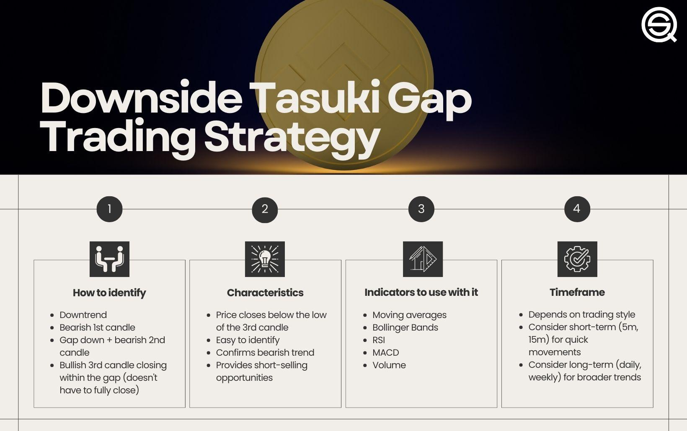

## Table of Contents

## What is a Downside Tasuki Gap in technical analysis?

A Downside Tasuki Gap is a bearish continuation pattern seen in technical analysis of stock charts. It happens when a stock's price drops, creating a gap down from the previous day's closing price. After this gap, the price continues to fall on the next day, but then a small bullish candle appears. This bullish candle tries to move back into the gap but doesn't fully close it, showing that the bearish trend is still strong.

This pattern is important because it shows that even though there is some buying interest, the sellers are still in control. Traders watch for this pattern to confirm that the downward trend will keep going. If you see a Downside Tasuki Gap, it might be a good idea to stay cautious or consider selling if you're already holding the stock.

## How is a Downside Tasuki Gap identified on a price chart?

A Downside Tasuki Gap is easy to spot on a price chart. You'll see it when the price of a stock drops and creates a gap down from the previous day's close. This means the stock opens lower than where it closed the day before, leaving a space on the chart. After this gap, the price keeps falling on the next day, making another bearish candle.

Then, on the third day, a small bullish candle appears. This candle tries to move the price back up into the gap, but it doesn't close the gap completely. This shows that even though there's some buying happening, the sellers are still in charge. So, if you see this pattern, it's a sign that the downward trend might continue.

## What are the basic components required to form a Downside Tasuki Gap?

A Downside Tasuki Gap needs a few things to happen on a stock chart. First, the price of the stock has to drop and leave a gap down from where it closed the day before. This means the stock opens lower than the previous day's close, leaving a space on the chart. After this gap, the price keeps going down the next day, making another bearish candle that shows the sellers are still in control.

Then, on the third day, a small bullish candle appears. This candle tries to move the price back up into the gap but doesn't close it completely. This shows that even though some people are buying, the sellers are still stronger. So, if you see these three parts—a gap down, another bearish day, and a small bullish candle that doesn't close the gap—you've got a Downside Tasuki Gap, which means the downward trend might keep going.

## Can you explain the psychology behind the formation of a Downside Tasuki Gap?

The psychology behind a Downside Tasuki Gap starts with a big drop in the stock price, creating a gap down. This happens when many people suddenly want to sell their stocks because they think the price will keep falling. It shows that fear and worry are strong among investors, and they're rushing to get out before the price drops even more. The next day, the price keeps falling, making another bearish candle. This shows that the sellers are still in charge and the bearish feeling is still strong.

On the third day, a small bullish candle appears, trying to push the price back up into the gap. This shows that some people see the drop as a chance to buy the stock at a lower price, hoping it will go back up. But, the bullish candle doesn't close the gap completely, which means the buying isn't strong enough to stop the downward trend. It shows that even though some people are buying, the overall feeling is still bearish, and the sellers are still more powerful. So, the Downside Tasuki Gap tells us that the downward trend is likely to continue because the fear and selling pressure are still stronger than the buying interest.

## What are the key differences between a Downside Tasuki Gap and an Upside Tasuki Gap?

A Downside Tasuki Gap and an Upside Tasuki Gap are both patterns in stock charts that show what might happen next with the price, but they work in opposite ways. A Downside Tasuki Gap happens when the stock price drops and leaves a gap down from the last day's close. Then, it keeps falling the next day, and on the third day, a small bullish candle tries to move back into the gap but doesn't close it. This shows that the sellers are still in charge, and the price might keep going down.

On the other hand, an Upside Tasuki Gap happens when the stock price goes up and leaves a gap from the last day's close. After that, the price keeps rising the next day, and on the third day, a small bearish candle tries to move back into the gap but doesn't close it. This shows that the buyers are still in control, and the price might keep going up. So, the main difference is that a Downside Tasuki Gap is a bearish sign, showing the price might keep falling, while an Upside Tasuki Gap is a bullish sign, showing the price might keep rising.

## How reliable is the Downside Tasuki Gap as a bearish continuation pattern?

The Downside Tasuki Gap is seen as a pretty good sign that a stock's price will keep falling. When you see this pattern on a chart, it means that even though some people are trying to buy, the sellers are still much stronger. This makes it likely that the price will keep going down. But, like any pattern in stock charts, it's not perfect. Sometimes the price might go up instead, so it's important to use other tools and signs to make sure before deciding what to do.

How well the Downside Tasuki Gap works can change depending on things like the stock market's overall mood and the specific stock you're looking at. In a market where everyone is worried and selling, this pattern might be more reliable. But in a market where people are feeling good and buying, it might not work as well. So, while the Downside Tasuki Gap can be a helpful sign for traders, it's best to use it along with other ways to look at the market to make the smartest choices.

## What are the common mistakes traders make when trading a Downside Tasuki Gap?

One common mistake traders make when trading a Downside Tasuki Gap is relying on it too much without looking at other signs. The Downside Tasuki Gap is just one pattern, and it's not always right. Traders need to use other tools like looking at the overall market mood, using other chart patterns, and maybe even checking news about the company to make better choices. If they only focus on the Downside Tasuki Gap, they might miss important information that could change what they should do.

Another mistake is jumping into a trade too quickly after seeing the pattern. Some traders might see a Downside Tasuki Gap and think the price will keep falling right away. But, it's important to wait and see if the pattern is really confirmed by other signs. Sometimes, the price might go up a bit before it keeps going down. So, traders should be patient and make sure the pattern is strong before they act.

Lastly, traders sometimes forget to set a stop-loss when trading based on the Downside Tasuki Gap. A stop-loss is like a safety net that helps limit how much money you could lose if the trade goes the wrong way. Without it, if the price goes up instead of down, traders could lose a lot of money. So, it's important to use a stop-loss to protect yourself, even if you think the Downside Tasuki Gap means the price will keep falling.

## How can a Downside Tasuki Gap be used in conjunction with other technical indicators?

Using a Downside Tasuki Gap with other technical indicators can help traders make better decisions. One way to do this is by looking at moving averages. If the Downside Tasuki Gap happens below a key moving average like the 50-day or 200-day moving average, it could mean the downward trend is strong. This gives traders more confidence that the price will keep falling. Also, traders can use the Relative Strength Index (RSI). If the RSI is below 30 when they see a Downside Tasuki Gap, it might mean the stock is oversold and could bounce back a bit before continuing down. This helps traders know when to enter and [exit](/wiki/exit-strategy) trades more safely.

Another useful indicator to use with a Downside Tasuki Gap is the [volume](/wiki/volume-trading-strategy). If the volume is high when the gap happens and stays high during the bearish candle, it shows that many people are selling, making the bearish trend stronger. Traders can also look at other chart patterns like support and resistance levels. If the Downside Tasuki Gap breaks through a key support level, it's a stronger sign that the price will keep going down. By combining the Downside Tasuki Gap with these other indicators, traders can get a fuller picture of what the market might do next and make smarter trading choices.

## What are some advanced strategies for trading a Downside Tasuki Gap?

One advanced strategy for trading a Downside Tasuki Gap is to use it along with other chart patterns and indicators to find the best times to trade. For example, if you see a Downside Tasuki Gap and it happens right after the price breaks through a key support level, that's a strong sign the price will keep going down. You can also look at the volume to see if many people are selling when the gap happens. If the volume is high, it shows that the bearish trend is strong. Another thing you can do is use moving averages, like the 50-day or 200-day moving average. If the Downside Tasuki Gap happens below these lines, it's a good sign to sell or short the stock because the downward trend is likely to continue.

Another strategy is to wait for the Downside Tasuki Gap to be confirmed by other signals before you make a move. Sometimes, the price might bounce back a bit after the gap, so it's smart to wait and see if other signs agree with the bearish pattern. You can use the Relative Strength Index (RSI) to help with this. If the RSI is below 30 when you see the Downside Tasuki Gap, it might mean the stock is oversold and could go up a bit before falling more. This helps you time your trade better. Also, you can set a stop-loss to protect yourself. If you're going to short the stock after seeing a Downside Tasuki Gap, put a stop-loss above the gap to limit your losses if the price goes up instead of down. By using these advanced strategies, you can make smarter trading choices and manage your risks better.

## How does volume play a role in confirming a Downside Tasuki Gap?

Volume is really important when you're trying to figure out if a Downside Tasuki Gap means the price will keep going down. When you see a Downside Tasuki Gap, you want to check if the volume is high when the gap happens and stays high during the bearish candle. If the volume is high, it shows that lots of people are selling, which makes the bearish trend stronger. This gives you more confidence that the price will keep falling.

So, when you're looking at a Downside Tasuki Gap, always check the volume. If the volume is low, it might mean the pattern isn't as strong and the price might not keep going down as much. But if the volume is high, it's a good sign that the Downside Tasuki Gap is real and the price is likely to keep dropping. This helps you make smarter choices about when to sell or short the stock.

## What are the statistical probabilities of success when trading a Downside Tasuki Gap?

The statistical probabilities of success when trading a Downside Tasuki Gap can vary a lot. Studies and backtests show that the pattern has a success rate of about 60% to 70% in predicting a continued downward trend. This means that if you see a Downside Tasuki Gap, there's a good chance the price will keep going down, but it's not a sure thing. The exact success rate can depend on things like the market conditions, the specific stock you're looking at, and how you use other tools to confirm the pattern.

It's important to remember that no pattern is perfect, and the Downside Tasuki Gap is no different. Even though it has a pretty good success rate, there will be times when the price goes up instead of down. That's why smart traders use the Downside Tasuki Gap along with other signs and indicators to make their decisions. By combining the pattern with things like volume, moving averages, and the Relative Strength Index, you can get a better idea of what might happen next and make smarter trading choices.

## Can you discuss any notable case studies where a Downside Tasuki Gap led to significant market movements?

One notable case study where a Downside Tasuki Gap led to significant market movements happened with Tesla in early 2022. After a period of strong growth, Tesla's stock price started to fall. On a specific day, the stock opened lower than the previous day's close, creating a gap down. The next day, the price continued to drop, forming a bearish candle. On the third day, a small bullish candle appeared but failed to close the gap. This Downside Tasuki Gap was a clear sign that the bearish trend was strong. Following this pattern, Tesla's stock price continued to decline significantly over the next few weeks, confirming the bearish continuation signal provided by the pattern.

Another example can be seen with the stock of GameStop in late 2021. After a period of [volatility](/wiki/volatility-trading-strategies), GameStop's stock experienced a gap down, followed by another day of falling prices. On the third day, a small bullish candle tried to move the price back into the gap but didn't close it. This Downside Tasuki Gap signaled that the downward trend was likely to continue. True to the pattern's indication, GameStop's stock price saw a further decline in the following days. These case studies show how the Downside Tasuki Gap can be a powerful tool for traders to predict significant downward movements in the market.

## References & Further Reading

[1]: Nison, S. (1991). ["Japanese Candlestick Charting Techniques"](https://drive.google.com/file/d/0B_CADMk621uLNDEyZTEzZjYtMmZjOS00ZmUyLTlhYmYtN2E1YTViOWRiOTdi/view). New York Institute of Finance.

[2]: Bulkowski, T. (2008). ["Encyclopedia of Candlestick Charts"](https://onlinelibrary.wiley.com/doi/book/10.1002/9781119202288). Wiley.

[3]: Murphy, J. J. (1999). ["Technical Analysis of the Financial Markets: A Comprehensive Guide to Trading Methods and Applications"](https://archive.org/details/technicalanalysi0000murp). New York Institute of Finance.

[4]: Berry, M. (2006). ["Algorithmic Trading Overview"](https://link.springer.com/chapter/10.1007/978-3-031-62843-6_8). SSRN Electronic Journal.

[5]: Chan, E. (2013). ["Algorithmic Trading: Winning Strategies and Their Rationale"](https://github.com/ftvision/quant_trading_echan_book). Wiley.