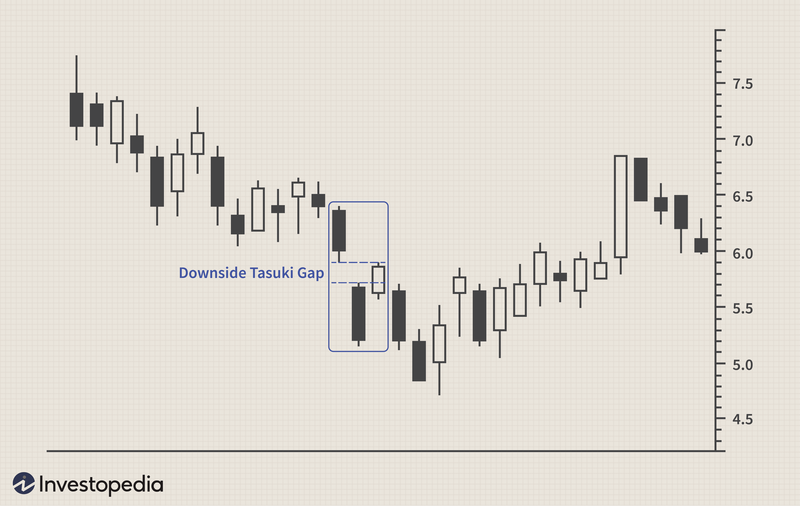

In the rapidly evolving world of algorithmic trading, technical patterns such as the downside Tasuki gap have become popular tools for traders. This candlestick pattern provides traders with insights into market sentiments and potential price movements, making it a valuable asset for optimizing trading strategies. The downside Tasuki gap is particularly intriguing due to its continuation pattern within a downtrend, which can help predict future market behavior.

Understanding the intricacies of this candlestick pattern is essential for traders aiming to make informed decisions. The downside Tasuki gap consists of a sequence of three candles: a bearish candle, followed by another bearish candle that opens with a gap down, and finally a bullish candle that closes within the gap created by the two preceding bearish candles. This formation signals a potential continuation of the existing downtrend, helping traders anticipate possible courses of action.



For those involved in algorithmic trading, recognizing patterns like the downside Tasuki gap can automate decision-making processes, enhancing efficiency. By coding this pattern into algorithms, trades can be executed based on predefined parameters with increased speed and precision. However, traders must exercise caution, as the reliance on any single pattern can lead to suboptimal results, especially in a market characterized by rapid changes.

The downside Tasuki gap, while offering potential for profitable trades, also presents several challenges. Its infrequent appearance can limit trading opportunities, and improper interpretation might lead to poor trading decisions. Understanding the broader market context and using complementary analysis tools can help mitigate these risks.

This article will examine the downside Tasuki gap, its role in algorithmic trading, and the potential risks involved. By exploring the benefits and pitfalls of this pattern, traders can better position themselves to leverage its strengths while guarding against possible drawbacks.

## Table of Contents

## Understanding the Downside Tasuki Gap

A downside Tasuki gap is a candlestick pattern consisting of three candles, typically occurring during a downward trend in financial markets. This pattern plays a crucial role in technical analysis by helping traders identify the persistence of a bearish market trend.

### Composition of the Downside Tasuki Gap

1. **First Candle**: The pattern begins with a bearish (red or black) candle, indicating a continuation of the current downtrend. This sets the stage for the subsequent candles by establishing a selling dominance in the market.

2. **Second Candle**: The following candle is also bearish but is characterized by a gap down from the close of the first candle. This gap signifies a continuation of selling pressure and increases trader conviction about the persistence of a negative market sentiment.

3. **Third Candle**: The final candle in the pattern is bullish (green or white) and closes within the gap created by the first two bearish candles, but not above the close of the first candle. Although this candle suggests some buying interest, it is not considered strong enough to reverse the bearish trend.

### Significance and Interpretation

The downside Tasuki gap is generally interpreted by traders as a signal for the continuation of the prevailing downtrend. The pattern reflects persistent negative market sentiment, which can influence traders’ decisions. The gap down and subsequent partial gap fill indicate that although there is some buying pressure, the overall market outlook remains bearish.

### Implications for Market Sentiment

Understanding the downside Tasuki gap can provide insights into market sentiment and potential price movement. The emergence of this pattern signifies that sellers are currently stronger than buyers, suggesting further price decreases may be observed. However, traders often seek additional confirmation through other technical indicators to validate the pattern and strengthen their trading decisions. 

By recognizing this pattern, traders can enhance their ability to anticipate market trends and react accordingly, increasing the potential for profitable trades in a bearish market.

## Role of Downside Tasuki Gap in Algorithmic Trading

In [algorithmic trading](/wiki/algorithmic-trading), the identification of patterns such as the downside Tasuki gap can streamline the decision-making process and enable traders to respond to markets with heightened efficiency. The use of algorithms in this context involves programming systems to detect these specific candlestick formations and execute trades when they occur, based on predefined criteria.

To integrate the downside Tasuki gap pattern into an algorithmic trading system, the algorithm may be designed to scan historical and real-time market data to identify the sequence of a bearish candle followed by a bearish gap-down and a subsequent bullish candle. For instance, a simple implementation in Python using popular libraries like Pandas and TA-Lib could look like this:

```python
import talib
import numpy as np
import pandas as pd

# Sample data - replace with your actual DataFrame containing OHLC data
data = {
    'open': [...],
    'high': [...],
    'low': [...],
    'close': [...]
}

df = pd.DataFrame(data)

# Identify downside Tasuki gap pattern
tasuki_gap = talib.CDLTASUKIGAP(df['open'], df['high'], df['low'], df['close'])

# Filter and execute trades based on the pattern
for index, pattern in enumerate(tasuki_gap):
    if pattern != 0:  # Pattern detected
        # Execute trade function or logic here
        print(f"Pattern detected at index {index}")
```

Automating pattern recognition can ultimately increase trading efficiency by reducing the time needed to spot opportunities and mitigating human error. Nonetheless, traders must remain cautious about over-reliance on such patterns, as algorithmic trading relies heavily on historical data. Should market conditions shift, the relevance and reliability of the downside Tasuki gap may wan, potentially leading to suboptimal trading outcomes.

Thus, rigorous testing, including [backtesting](/wiki/backtesting) across various market environments, is essential to validate the model's efficacy. This process involves assessing the model's performance using historical data to understand how the downside Tasuki gap would have behaved under different conditions.

Moreover, implementing [machine learning](/wiki/machine-learning) techniques that incorporate other indicators alongside the downside Tasuki gap can enhance prediction accuracy. Such robust models can adapt to evolving market scenarios, awarded by continuously learning and adjusting parameters.

Overall, while the downside Tasuki gap offers a structured approach for traders, its incorporation into algorithms must be handled with vigilance, ensuring that reliance on this tool is balanced with comprehensive testing and risk management strategies.

## Limitations and Risks of the Downside Tasuki Gap

The downside Tasuki gap, while offering valuable insights into potential trend continuations, is not devoid of limitations and risks that traders must acknowledge. One primary limitation of the pattern is its rarity. This infrequency can result in limited trading opportunities, potentially causing traders to wait for extended periods before the pattern emerges in the market. Consequently, over-reliance on this single pattern might lead to missed opportunities elsewhere, highlighting the need for a diverse set of tools in a trader's arsenal.

Furthermore, interpretation of the downside Tasuki gap largely depends on the broader market context. Traders may misinterpret the pattern if they fail to consider the overall market conditions. For instance, if a trader identifies a downside Tasuki gap within a downtrend but overlooks accompanying economic data or geopolitical news affecting market sentiment, the decision to trade based solely on this pattern could lead to erroneous conclusions and suboptimal trading decisions.

To address these challenges, additional analysis and confirmation tools are imperative. Traders should employ complementary technical indicators and analytical techniques to validate the presence of a downside Tasuki gap. Tools such as moving averages, relative strength index (RSI), or [volume](/wiki/volume-trading-strategy) analysis can help corroborate the signal provided by the downside Tasuki gap, thereby reducing the likelihood of false signals. Employing a multi-faceted approach ensures a more nuanced understanding of market dynamics and enhances the validity of the signal.

The risk of false signals can also be mitigated through the application of statistical methods and backtesting. By evaluating historical data and pattern occurrences, traders can ascertain the reliability of the downside Tasuki gap under various market conditions. This process aids in identifying the pattern's strengths and weaknesses, allowing traders to refine their strategies accordingly.

In conclusion, while the downside Tasuki gap is a valuable tool for indicating trend continuations, its limitations necessitate a cautious approach. By recognizing its rarity, understanding the importance of market context, and utilizing additional confirmation tools, traders can mitigate the associated risks and make more informed trading decisions.

## Mitigating Risks in Using the Downside Tasuki Gap

To mitigate the risks associated with the downside Tasuki gap, traders should incorporate complementary indicators that provide additional confirmation of the pattern's validity. Common complementary indicators include moving averages, the relative strength index (RSI), and the moving average convergence divergence (MACD). These tools can help traders filter out false signals by cross-verifying the market conditions suggested by the downside Tasuki gap.

Risk management strategies are crucial in protecting against unforeseen market shifts. Setting appropriate stop-loss orders can help limit potential losses. For instance, traders may choose to set stop-loss orders just above or below the resistance or support levels identified in conjunction with the downside Tasuki gap. This approach ensures that trades are exited promptly if the market moves contrary to expectations, thus preserving capital.

Backtesting is an essential process for assessing the historical performance of the downside Tasuki gap pattern. A well-structured backtesting methodology involves analyzing the pattern under various market conditions to determine its reliability. This process can be implemented using programming languages such as Python, with libraries like pandas and [backtrader](/wiki/backtrader), to automate and streamline the analysis.

```python
import pandas as pd
import backtrader as bt

# Example setup for backtesting the downside Tasuki gap pattern

class TasukiGapStrategy(bt.Strategy):
    def next(self):
        if self.data.close[-3] > self.data.open[-3] and \
           self.data.open[-2] < self.data.close[-3] and \
           self.data.close[-2] < self.data.open[-2] and \
           self.data.open[-1] > self.data.close[-2] and \
           self.data.close[-1] > self.data.open[-1] and \
           self.data.close[-1] < self.data.open[-3]:
            self.buy()

# Load historical data
data = bt.feeds.YahooFinanceData(dataname='SPY',
                                 fromdate=pd.Timestamp('2010-01-01'),
                                 todate=pd.Timestamp('2020-01-01'))

# Initialize and run backtest
cerebro = bt.Cerebro()
cerebro.addstrategy(TasukiGapStrategy)
cerebro.adddata(data)
cerebro.run()

# Print out results or plot

# Note: This code is for illustrative purposes and may require adjustments
# based on specific market data and trading conditions.
```

The effectiveness of these strategies can further be enhanced by combining them with a robust analysis of the macroeconomic environment and recent price trends. By doing so, traders can improve their ability to distinguish genuine signals from market noise, thus increasing the robustness of their trading strategies.

## Conclusion

The downside Tasuki gap is a significant technical analysis pattern for traders seeking to improve their strategy by predicting ongoing market trends. When applied with precision, this pattern can offer valuable insights into potential price movements, acting as a beacon for continuation in a downtrend. Traders leveraging this pattern must remain aware of its inherent limitations and the ever-changing dynamics of financial markets. Market conditions are volatile, and the downside Tasuki gap alone should not be relied upon in isolation from other analysis tools.

Effective utilization of the downside Tasuki gap requires a comprehensive approach that encompasses rigorous risk management practices. Setting appropriate stop-loss orders can protect traders from unfavorable turns in the market, helping to safeguard against significant losses. Furthermore, integrating additional technical indicators can provide confirmation and enhance the reliability of trading decisions based on the downside Tasuki gap.

Traders should employ backtesting and in-depth analysis of historical data to understand the pattern's performance across different market scenarios. By doing so, they can refine their strategies, adapting to various market environments and thereby increasing the robustness and reliability of their trading decisions. This careful balancing of potential rewards and associated risks ensures that the downside Tasuki gap is leveraged effectively, minimizing potential losses while optimizing trading outcomes.

## References & Further Reading

[1]: Bergstra, J., Bardenet, R., Bengio, Y., & Kégl, B. (2011). ["Algorithms for Hyper-Parameter Optimization."](https://papers.nips.cc/paper/4443-algorithms-for-hyper-parameter-optimization) Advances in Neural Information Processing Systems 24.

[2]: ["Advances in Financial Machine Learning"](https://books.google.com/books/about/Advances_in_Financial_Machine_Learning.html?id=oU9KDwAAQBAJ) by Marcos Lopez de Prado

[3]: ["Evidence-Based Technical Analysis: Applying the Scientific Method and Statistical Inference to Trading Signals"](https://www.amazon.com/Evidence-Based-Technical-Analysis-Scientific-Statistical/dp/0470008741) by David Aronson

[4]: ["Machine Learning for Algorithmic Trading"](https://github.com/stefan-jansen/machine-learning-for-trading) by Stefan Jansen

[5]: ["Quantitative Trading: How to Build Your Own Algorithmic Trading Business"](https://books.google.com/books/about/Quantitative_Trading.html?id=j70yEAAAQBAJ) by Ernest P. Chan