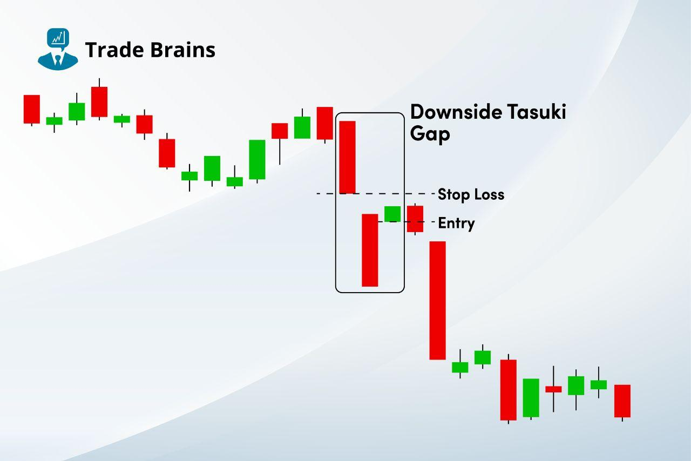

## Table of Contents

## What is the Downside Tasuki Gap candlestick pattern?

The Downside Tasuki Gap is a bearish candlestick pattern that appears during a downtrend in the stock market. It consists of three candles: the first two are bearish candles, with the second one opening lower than the first one's close, creating a gap. The third candle is a bullish one that opens within the body of the second candle and closes within the gap between the first and second candles, but does not fill the gap completely.

This pattern suggests that the bearish trend is likely to continue. The gap between the first and second candles shows strong selling pressure, and even though the third candle tries to recover some of the losses, it fails to close the gap. Traders often see this as a sign that the sellers are still in control and that the price is likely to keep falling.

## How does the Downside Tasuki Gap pattern form?

The Downside Tasuki Gap pattern forms during a time when the price of a stock or asset is going down. It starts with a long bearish candle, which means the price opened high and closed much lower. Right after this, another bearish candle appears, but it opens lower than where the first candle closed, leaving a space or gap between them. This gap shows that the sellers are strong and pushing the price down quickly.

Next, a third candle comes, but this one is different because it's bullish, meaning the price goes up a bit. This bullish candle starts within the body of the second bearish candle and tries to move back up into the gap between the first and second candles. However, it doesn't go all the way to close the gap. This tells us that even though buyers tried to push the price up, the sellers are still in charge, and the price is likely to keep falling.

## What are the key components of the Downside Tasuki Gap pattern?

The Downside Tasuki Gap pattern is made up of three candles that show a continuing downtrend. The first candle is a long bearish one, meaning the price dropped a lot from open to close. The second candle is also bearish, but it opens below the close of the first candle, creating a gap. This gap is important because it shows that sellers are strong and are pushing the price down quickly.

The third candle in the pattern is where things get interesting. It's a bullish candle, which means the price goes up a bit. This candle starts within the body of the second bearish candle and tries to move back up into the gap between the first and second candles. However, it doesn't close the gap completely. This shows that even though buyers tried to push the price up, the sellers are still in control, and the price is likely to keep going down.

## What does the Downside Tasuki Gap pattern indicate about market sentiment?

The Downside Tasuki Gap pattern tells us that sellers are still in charge of the market. When you see this pattern, it means that even though there was a small attempt by buyers to push the price up, it wasn't strong enough to change the overall trend. The gap between the first two candles shows that sellers are pushing the price down quickly, and the third candle trying to fill that gap but not quite making it shows that buyers are not strong enough to take over.

This pattern is a sign that the market sentiment is still bearish. It's like the sellers are saying, "We're not done yet," and they keep the pressure on. If you're looking at a chart and see this pattern, it's a good idea to be careful because the price might keep going down.

## How can the Downside Tasuki Gap pattern be identified on a price chart?

To spot the Downside Tasuki Gap pattern on a price chart, you need to look for three special candles during a time when prices are going down. The first candle is a long one where the price starts high and ends much lower, showing that sellers are strong. Right after this, the second candle also shows the price going down, but it starts below where the first candle ended, leaving a space or gap between them. This gap is a key part of the pattern because it means the sellers are pushing the price down quickly.

The third candle is different because it's a bullish one, meaning the price goes up a bit. This candle starts within the body of the second bearish candle and tries to move back up into the gap between the first and second candles. But, it doesn't go all the way to close the gap. When you see this pattern, it's a sign that even though buyers tried to push the price up, the sellers are still in control, and the price is likely to keep falling.

## What are the common mistakes traders make when interpreting the Downside Tasuki Gap pattern?

One common mistake traders make when looking at the Downside Tasuki Gap pattern is thinking that the third bullish candle means the price will go up. They see the price going up a bit and think the trend might change, but they forget that the gap between the first two candles didn't close. This gap is a big sign that sellers are still strong, and the price is likely to keep going down.

Another mistake is not looking at the bigger picture. Traders sometimes focus too much on the three candles of the Downside Tasuki Gap pattern and don't pay attention to what's happening in the market overall. If the market is still in a strong downtrend, the pattern is more likely to mean the price will keep falling. It's important to use the pattern along with other signs and market trends to make better trading choices.

## How reliable is the Downside Tasuki Gap pattern in predicting price movements?

The Downside Tasuki Gap pattern is a tool that traders use to guess what the price might do next, but it's not perfect. It's pretty good at showing that the price might keep going down because it happens during a time when prices are already falling. The gap between the first two candles and the third candle not closing it tells us that sellers are still strong. But, like any tool in trading, it doesn't work every time. Sometimes, even with this pattern, the price might go up instead of down.

It's important to use the Downside Tasuki Gap pattern along with other signs and market trends to make better guesses about price movements. Traders should look at the bigger picture and not just focus on these three candles. If the market is in a strong downtrend, the pattern is more likely to be right. But if things are not so clear, the pattern might not be as reliable. So, while the Downside Tasuki Gap can be a helpful hint, it's best used with other tools and a good understanding of the market.

## Can the Downside Tasuki Gap pattern be used in conjunction with other technical indicators?

Yes, the Downside Tasuki Gap pattern can be used with other technical indicators to make better guesses about where the price might go. For example, traders often look at moving averages, which are lines that show the average price over time. If the Downside Tasuki Gap pattern happens while the price is below a long-term moving average, it might mean the price will keep going down. Another tool is the Relative Strength Index (RSI), which tells us if a stock is overbought or oversold. If the RSI is low when you see the Downside Tasuki Gap, it might mean the price could drop even more.

Using other tools like [volume](/wiki/volume-trading-strategy) can also help. If the volume goes up a lot when the Downside Tasuki Gap pattern happens, it might mean more people are selling, which could make the price go down even more. It's good to use the Downside Tasuki Gap pattern with these other signs because it helps traders see the bigger picture and make better choices. No single tool is perfect, but together, they can give a clearer idea of what might happen next.

## What are the best practices for trading based on the Downside Tasuki Gap pattern?

When trading based on the Downside Tasuki Gap pattern, it's important to look at the bigger picture of the market. This pattern happens during a time when prices are already going down, so it's a sign that the price might keep falling. But it's not enough to just see the pattern; you need to check if the market is still in a strong downtrend. Look at other signs like moving averages and the Relative Strength Index (RSI) to see if they also show that the price is likely to go down. If everything lines up, the Downside Tasuki Gap pattern can be a good hint that it's time to sell or short the stock.

Another good practice is to pay attention to the volume when the Downside Tasuki Gap pattern happens. If the volume goes up a lot, it might mean more people are selling, which could push the price down even more. Also, don't just focus on these three candles; use the pattern along with other tools to make better choices. Remember, no single tool is perfect, so combining the Downside Tasuki Gap with other signs can give you a clearer idea of what might happen next. This way, you can trade more confidently and make better decisions based on a full view of the market.

## How does the Downside Tasuki Gap pattern differ from other bearish continuation patterns?

The Downside Tasuki Gap pattern is a special type of bearish continuation pattern that you can see on a price chart when the price is already going down. It's made up of three candles: the first two are long and show the price dropping a lot, with a gap between them. The third candle tries to go up a bit but doesn't close the gap. This pattern is different from other bearish continuation patterns like the Falling Three Methods or the Bearish Flag because it has this unique gap and the third candle trying to fill it but not quite making it. This gap and the failed attempt to close it are big signs that sellers are still in charge.

Other bearish continuation patterns might not have this gap or might look different. For example, the Falling Three Methods has three small bullish candles in the middle of two long bearish candles, showing a brief pause in the downtrend before it continues. The Bearish Flag, on the other hand, shows a small upward move (the flag) after a sharp drop (the pole), before the price keeps falling. The Downside Tasuki Gap pattern stands out because of the gap and the third candle's attempt to go back up, making it a clear signal that the price is likely to keep going down. It's important to look at the whole market and use other signs to make sure this pattern is a good hint for what might happen next.

## What historical examples illustrate the effectiveness of the Downside Tasuki Gap pattern?

One historical example of the Downside Tasuki Gap pattern in action can be seen in the stock chart of Apple Inc. (AAPL) during a period in late 2018. The stock was already in a downtrend, and then a long bearish candle appeared, followed by another bearish candle that opened below the close of the first one, creating a gap. The third candle tried to move up into the gap but didn't close it completely. After this pattern showed up, the stock continued to fall for several more weeks, showing that the Downside Tasuki Gap was a good sign that the price would keep going down.

Another example can be found in the chart of Tesla Inc. (TSLA) in early 2022. The stock was in a clear downtrend when the Downside Tasuki Gap pattern formed. A long bearish candle was followed by another bearish candle with a gap between them. The third candle was bullish but didn't close the gap. Following this pattern, Tesla's stock price continued to drop over the next few weeks. These examples show how the Downside Tasuki Gap pattern can be a useful hint for traders to expect that a downtrend will keep going.

## How can algorithmic trading strategies be developed around the Downside Tasuki Gap pattern?

Algorithmic trading strategies around the Downside Tasuki Gap pattern can be created by writing computer programs that look for this pattern on price charts. The program would scan through the data to find three candles that fit the Downside Tasuki Gap pattern: a long bearish candle, followed by another bearish candle with a gap, and then a bullish candle that tries to move into the gap but doesn't close it. When the pattern is spotted, the algorithm could send a signal to sell or short the stock, expecting the price to keep going down. The program could also check other signs like moving averages or the Relative Strength Index (RSI) to make sure the market is still in a downtrend, making the signal more reliable.

To make the strategy even better, the algorithm could also look at the trading volume when the Downside Tasuki Gap pattern happens. If the volume goes up a lot, it might mean more people are selling, which could push the price down even more. The algorithm could set rules for how long to keep the trade open and when to close it, based on how much the price drops or if other signs change. By combining the Downside Tasuki Gap pattern with other tools and checking the bigger picture of the market, the algorithm can make smarter trading choices and help traders take advantage of the pattern's signal that the price is likely to keep falling.

## References & Further Reading

[1]: Bergstra, J., Bardenet, R., Bengio, Y., & Kégl, B. (2011). ["Algorithms for Hyper-Parameter Optimization."](https://papers.nips.cc/paper/4443-algorithms-for-hyper-parameter-optimization) Advances in Neural Information Processing Systems 24.

[2]: ["Advances in Financial Machine Learning"](https://books.google.com/books/about/Advances_in_Financial_Machine_Learning.html?id=oU9KDwAAQBAJ) by Marcos Lopez de Prado

[3]: ["Evidence-Based Technical Analysis: Applying the Scientific Method and Statistical Inference to Trading Signals"](https://www.amazon.com/Evidence-Based-Technical-Analysis-Scientific-Statistical/dp/0470008741) by David Aronson

[4]: ["Machine Learning for Algorithmic Trading"](https://github.com/stefan-jansen/machine-learning-for-trading) by Stefan Jansen

[5]: ["Quantitative Trading: How to Build Your Own Algorithmic Trading Business"](https://books.google.com/books/about/Quantitative_Trading.html?id=j70yEAAAQBAJ) by Ernest P. Chan