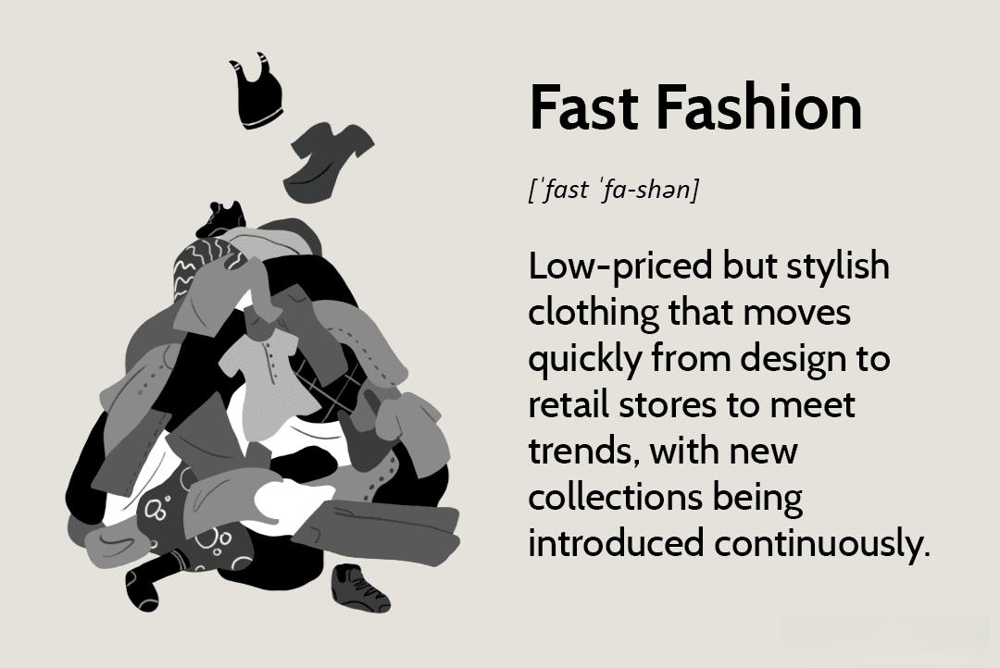

In today's fast-paced corporate environment, companies frequently undergo a myriad of changes to retain and enhance their competitive positions. One notable adaptation strategy includes downsizing, which involves the reduction of a company's workforce to decrease costs and improve operational efficiency. This strategy is often implemented during economic downturns or as part of broader restructuring efforts aimed at navigating shifting market landscapes. Simultaneously, organizational change, which encompasses modifications in company structure, strategies, and operations, is deployed to bolster competitiveness, accelerate growth, or meet evolving market demands.

At the same time, technological advancements, particularly algorithmic trading, are profoundly reshaping industries. Algorithmic trading leverages complex algorithms to execute orders at high speeds, offering substantial benefits such as enhanced efficiency, cost savings, and the reduction of human emotions in trading processes. This technology not only revolutionizes the financial industry but also sets a precedent for other sectors to adopt data-driven approaches, thereby highlighting the vital need for stringent risk management practices to mitigate associated risks.



Understanding the interconnected impacts of downsizing, organizational change, and technological advancements is crucial for businesses. As these dynamics influence corporate strategies profoundly, stakeholders must adapt to thrive within this continuously evolving landscape. By comprehensively grasping these relationships, companies can better navigate transitions and leverage innovative technologies for strategic advantage. Adaptation and innovation become essential for businesses aiming to excel in this rapidly changing environment.

## Table of Contents

## The Concept of Downsizing in Business

Downsizing in business refers to the deliberate reduction of a company's workforce as a strategic measure aimed at cutting costs and enhancing overall efficiency. This practice is particularly prevalent during periods of economic downturns, where external pressures necessitate a realignment of resources and restructuring efforts to maintain financial stability.

The primary objective of downsizing is to achieve immediate financial savings by reducing payroll expenses. However, this approach also carries the risk of potentially detrimental effects on employee morale. The sudden removal of colleagues and increased workloads for the remaining staff can lead to diminished job satisfaction and productivity. Therefore, organizations must carefully balance the material benefits of downsizing against its social and emotional impacts.

An essential consideration during the downsizing process is the potential loss of talent and expertise. Experienced employees who are laid off may possess critical skills and institutional knowledge that contribute significantly to a company's competitive advantage. Losing such assets can hinder innovation and operational effectiveness, negating some of the intended benefits of downsizing.

To mitigate the adverse effects of workforce reductions, companies should adopt strategies that include effective communication and support systems. Transparent communication regarding the reasons for downsizing and the expected outcomes can help maintain trust and reduce uncertainty among employees. Providing support measures, such as career counseling and job placement services, can also assist displaced workers in transitioning to new employment opportunities.

Moreover, engaging with employees throughout the process and involving them in decision-making can foster a sense of ownership and commitment, helping to cushion the psychological impact. By addressing both the human and financial dimensions of downsizing, businesses can navigate this complex terrain more effectively, minimizing disruptions and aligning more closely with long-term strategic objectives.

## Organizational Change and its Impact

Organizational change involves altering the structure, strategies, or operations of a company to enhance its competitiveness, stimulate growth, or respond to evolving market demands. This process can lead to significant transformations within a company, both internally and externally.

Internally, organizational change can influence a firm’s processes by altering workflow dynamics, reallocating resources, or redefining roles and responsibilities. These modifications often aim to optimize efficiency and effectiveness, positioning the company to respond more nimbly to external pressures. The successful implementation of these changes typically necessitates rigorous strategic planning and clear communication. Engaging employees throughout the change process is critical, as it fosters an environment of collaboration and minimizes resistance.

Resistance to change is a common challenge that organizations encounter. This resistance can stem from various factors, such as fear of the unknown, perceived threats to job security, or a general aversion to altering established routines. Companies must therefore proactively address these concerns to facilitate a smoother transition. Strategies may include involving employees in planning stages, offering training and support, and maintaining open channels of communication to address uncertainties and feedback.

Externally, organizational change can substantially alter a company’s market position. By restructuring strategically, companies can better align their capabilities with market demands, potentially gaining a competitive advantage. Changes may involve adopting new technologies, entering new markets, or creating innovative products and services. These strategic moves not only aim to meet current market needs but also anticipate future industry trends.

The impact of organizational change is profound and multifaceted, reflecting on almost every aspect of a company's operations and its market standing. Firms that manage this process successfully are often better equipped to adapt and thrive amid the fast-paced changes characterizing contemporary business environments.

## The Rise of Algorithmic Trading in Business

Algorithmic trading uses sophisticated mathematical models and algorithms to make trading decisions and execute orders at high speed, often measured in milliseconds or even microseconds. This technology has drastically transformed the financial industry by leveraging computational efficiency to process large amounts of market data in real-time and make split-second trading decisions. 

The primary advantage of [algorithmic trading](/wiki/algorithmic-trading) is its ability to execute trades with minimal human intervention, thereby reducing the emotional bias that often influences trading decisions. By adhering to a set of predetermined rules and strategies, algorithmic trading systems minimize the potential for errors caused by emotional reactions to market fluctuations. This results in enhanced efficiency and cost reduction, leading to potentially higher returns on investment.

Beyond efficiency, algorithmic trading has prompted the adoption of data-driven approaches across numerous sectors. For instance, through the application of algorithms, businesses can automate processes, analyze vast datasets for insights, and optimize decision-making processes. The financial industry's move towards algorithmic trading parallels other industries' adoption of [artificial intelligence](/wiki/ai-artificial-intelligence) and [machine learning](/wiki/machine-learning), where data and computational power drive innovation.

However, algorithmic trading comes with significant risks. The complexity of algorithms can lead to unexpected outcomes, influencing market dynamics in unforeseen ways. Flash crashes, where markets plummet rapidly due to cascades of automated trading, exemplify such risks. Consequently, stringent risk management practices are essential. Algorithmic traders must implement robust strategies to monitor and control risks, such as setting proper limits on trades, diversifying strategies, and continuously updating algorithms to reflect current market conditions.

For stakeholders in industries exposed to financial markets, understanding algorithmic trading is pivotal. Profound knowledge of this technology enables better assessment of market trends and risks, facilitating informed decision-making. Industries harnessing this technology must stay abreast of advancements and regulatory changes to navigate the evolving financial landscape effectively.

In summary, algorithmic trading has reshaped the financial industry, offering significant benefits alongside notable challenges. Mastery of this technology is crucial for entities looking to capitalize on its advantages while maintaining robust risk management frameworks.

## Interconnections and Impacts on Business Strategy

In the contemporary business landscape, the intertwining of downsizing, organizational change, and technological advancements such as algorithmic trading significantly influences business strategies. These dynamics compel companies to reconsider their resource allocation to foster technological adoption, thereby gaining a competitive edge. 

When businesses choose to downsize or undergo organizational transformation, they are effectively realigning their resources. This realignment often supports the adoption of advanced technologies like algorithmic trading, which demands both financial investment and skilled human capital to handle complex data analyses and strategic trading decisions [1]. However, this necessitates a formidable balance between declining workforce numbers and escalating technological investments.

Algorithmic trading exemplifies the impact of technological integration, where decision-making and trading executions are powered by algorithms capable of processing large data volumes at high speed. The adoption of such systems means that companies must meticulously plan to manage both the risks associated with rapid market changes and performance optimization. Strategic foresight involves developing robust risk management frameworks capable of mitigating potential market volatilities that algorithmic systems are vulnerable to [2]. For instance, companies might use Python to develop algorithms that analyze market trends and predict optimal trading opportunities. An example Python pseudocode for a simple moving average crossover strategy is as follows:

```python
import pandas as pd

def moving_average(stock_prices, window_size):
    return stock_prices.rolling(window=window_size).mean()

# Assuming 'data' is a DataFrame containing stock prices
short_window = 40
long_window = 100

short_mavg = moving_average(data['Close'], short_window)
long_mavg = moving_average(data['Close'], long_window)

signals = pd.DataFrame(index=data.index)
signals['Signal'] = 0.0
signals['Signal'][short_window:] = np.where(short_mavg[short_window:] > long_mavg[short_window:], 1.0, 0.0)
signals['Positions'] = signals['Signal'].diff()
```

In this context, companies striving for sustainable growth need to consistently align their strategies and be flexible in adapting to these changes. The synergy between downsizing and technology adoption can manifest in augmented efficiency, as redundant roles might be replaced with automated processes that provide greater accuracy and faster decision-making. This, however, must be juxtaposed with maintaining organizational capacity to innovate and manage these systems effectively.

Consequently, strategic alignment emerges as pivotal for seamlessly integrating these changes. Firms must synchronize their restructuring efforts with technological goals, ensuring that employee skill sets are aligned with new technological requirements. Upskilling programs could be implemented to bridge any talent gaps created by downsizing. Moreover, adaptability stands out as a critical attribute, empowering businesses to pivot swiftly in response to market shifts or technological advancements, ensuring continued relevance and success.

In summary, as companies endeavor to harmonize resource management with technological innovation, there exists an imperative to craft strategies that support long-term organizational resilience and market competitiveness. The confluence of downsizing, organizational change, and technology adoption provides both challenges and opportunities for crafting robust business strategies.

---

References:
1. Cascio, W. F. (2002). Strategies for responsible restructuring. Academy of Management Executive, 16(3), 80-91.
2. Aldridge, I. (2013). High-frequency trading: A practical guide to algorithmic strategies and trading systems. John Wiley & Sons.

## Conclusion

In a rapidly evolving business landscape, downsizing, organizational change, and algorithmic trading are pivotal elements that intertwine to shape the strategic orientation of modern enterprises. Each of these factors presents a plethora of opportunities and challenges, necessitating careful consideration and strategic management. Downsizing, for instance, provides an avenue for cost reduction and increased efficiency but poses risks to employee morale and organizational knowledge. Organizational change, while vital for maintaining competitiveness, can disrupt existing workflows and require substantial effort to manage resistance from stakeholders.

Algorithmic trading illustrates the transformative power of technology by enhancing speed, reducing costs, and minimizing human error in financial transactions. However, it also brings complexities and risks associated with technology adoption, requiring robust risk management frameworks. Businesses navigating these dynamics must, therefore, adopt a balanced approach, aligning workforce strategies with technological advancements to optimize their competitive standing.

Preparation and anticipation of the impacts of these strategic dimensions can enable companies to manage transitions more effectively. A deep understanding of each element allows businesses to harness the potential of technology while minimizing adverse effects on their human capital and organizational structure. Adaptation and innovation are critical drivers of success as companies strive to thrive amidst continuous economic and technological changes. Keeping a strategic focus on alignment, adaptability, and the integration of emerging technologies will enable organizations to leverage these changes to foster sustainable growth.

Stakeholders must adopt a vigilant and proactive approach, ensuring that these multifaceted changes translate into positive outcomes. Through strategic foresight and adaptability, businesses can not only withstand the pressures of an evolving business environment but also position themselves advantageously for future growth and success.

## References & Further Reading

[1]: Cascio, W. F. (2002). ["Strategies for Responsible Restructuring."](https://www.researchgate.net/publication/279927986_Strategies_for_responsible_restructuring) Academy of Management Executive, 16(3), 80-91.

[2]: Aldridge, I. (2013). ["High-Frequency Trading: A Practical Guide to Algorithmic Strategies and Trading Systems."](https://www.ahmetbeyefendi.com/wp-content/uploads/2020/07/High-Frequency-Trading-Irene-Aldridge.pdf) John Wiley & Sons.

[3]: Sull, D., & Spinosa, C. (2007). ["Promise-Based Management: The Essence of Execution."](https://hbr.org/2007/04/promise-based-management-the-essence-of-execution) Harvard Business Review.

[4]: Lopez de Prado, M. (2018). ["Advances in Financial Machine Learning."](https://www.amazon.com/Advances-Financial-Machine-Learning-Marcos/dp/1119482089) Wiley.

[5]: Jansen, S. (2020). ["Machine Learning for Algorithmic Trading: Predictive Models to Extract Signals from Market and Alternative Data for Systematic Trading Strategies with Python."](https://www.amazon.com/Machine-Learning-Algorithmic-Trading-alternative/dp/1839217715) Packt Publishing.