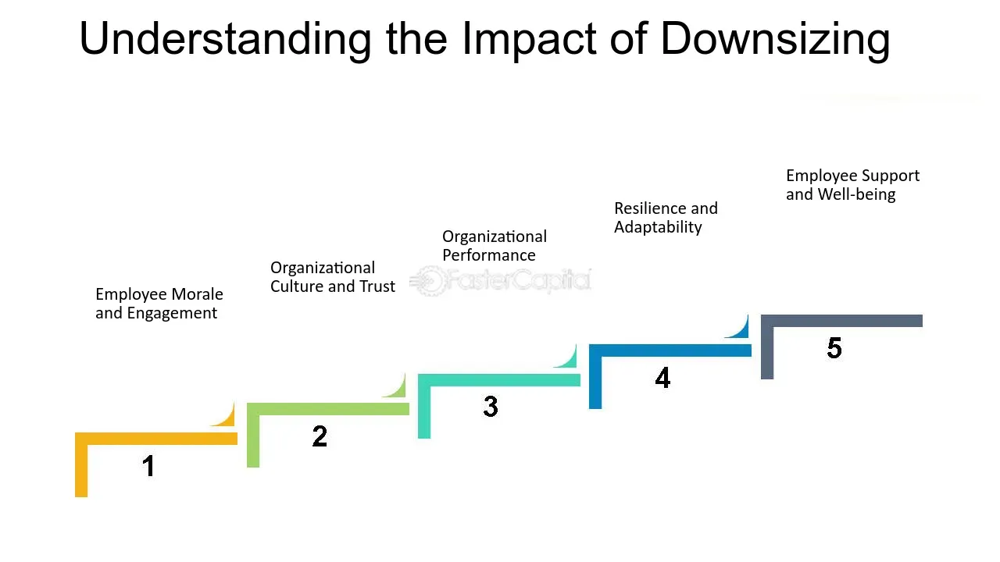

## Table of Contents

## What is downsizing and why do companies do it?

Downsizing is when a company decides to reduce the number of its employees. This can happen for many reasons, but it usually means the company is trying to save money or make changes to how it operates. When a company downsizes, it might let some workers go, close certain departments, or even shut down whole offices. This can be a tough time for the people who lose their jobs, but the company hopes it will help them in the long run.

Companies do downsizing for a few main reasons. One big reason is to cut costs. If a company is not making enough money, it might decide to downsize to save on salaries and other expenses. Another reason is to make the company more efficient. By getting rid of certain positions or departments, the company might be able to work better and faster. Sometimes, downsizing happens because the company wants to change its focus or the way it does business. No matter the reason, downsizing is a big decision that affects both the company and its employees.

## How does downsizing affect employees?

Downsizing can be really hard on employees. When a company decides to cut jobs, it means some people will lose their jobs. This can make employees feel scared and worried about their future. They might not know how they will pay their bills or find a new job. It can also make them feel sad because they might have to leave coworkers and a job they liked.

Besides losing their job, employees might also feel less secure at work even if they keep their job. They might worry that the company could downsize again and they could be next. This can make it hard for them to focus on their work and feel happy at their job. It can also make them feel less loyal to the company because they might think the company doesn't care about them.

## What are the common methods of downsizing?

One common method of downsizing is layoffs. This happens when a company decides to let go of some employees to save money or change the way it works. The company might choose who to lay off based on things like how long someone has worked there or how important their job is. Layoffs can be really hard on the people who lose their jobs because they have to find new work and might not know how they will pay their bills.

Another method is attrition. This is when a company doesn't replace people who leave their jobs. Instead of hiring new people, the company just lets the number of employees get smaller over time. This can be a gentler way to downsize because it doesn't mean people lose their jobs right away, but it can still mean more work for the people who stay.

A third method is early retirement. Sometimes, a company will offer older employees the chance to retire early with a good deal. This can help the company save money on salaries and benefits. It can be a good choice for some employees who want to retire, but it might not be right for everyone because they might not be ready to stop working.

## Can downsizing improve a company's financial health?

Downsizing can help a company's financial health by cutting costs. When a company downsizes, it spends less money on salaries and other expenses like office space and supplies. This can be really important if the company is not making enough money and needs to save. By spending less, the company might be able to pay its bills and keep running. It can also help the company make more profit because it's not spending as much money.

But downsizing doesn't always make things better. Sometimes, when a company lets people go, it can lose important skills and knowledge. This can make it harder for the company to do its work well. Also, the people who keep their jobs might feel scared and worried, which can make them less happy and productive. If the company doesn't plan carefully, downsizing might not save as much money as they hope, and it could even hurt the company in the long run.

## What are the short-term impacts of downsizing on a company?

In the short term, downsizing can help a company save money. When a company lets go of employees, it doesn't have to pay their salaries anymore. This can mean less money spent on wages, benefits, and other costs like office space. If the company was struggling to make enough money, downsizing can help it pay its bills and keep running. It can also make the company look better to people who might want to invest in it because it shows the company is trying to save money and be more efficient.

But downsizing can also cause problems right away. When a company lets people go, it can lose important skills and knowledge. The people who are left might have to do more work, which can make them feel stressed and unhappy. This can make it harder for the company to do its job well. Also, the employees who keep their jobs might feel scared and worried that they could be next. This can make them less happy and less productive, which can hurt the company's work in the short term.

## What are the long-term impacts of downsizing on a company?

In the long run, downsizing can help a company be more financially stable. By cutting costs like salaries and benefits, the company might make more profit and be in a better position to grow. If the company was struggling before, downsizing might have saved it from going out of business. It can also make the company more efficient because it might be smaller and easier to manage. This can help the company focus on what it does best and be more competitive in its industry.

But downsizing can also cause problems over time. When a company loses employees, it might lose important skills and knowledge that are hard to replace. This can make it harder for the company to do its job well and come up with new ideas. The people who stay might feel less loyal to the company because they might think the company doesn't care about them. This can make it hard for the company to keep good employees and attract new ones. If the company doesn't plan carefully, downsizing might not save as much money as they hope, and it could even hurt the company in the long run.

## How does downsizing affect remaining employees' morale and productivity?

Downsizing can really hurt the morale of the employees who stay at the company. When people see their coworkers lose their jobs, they might start to feel scared and worried that they could be next. This fear can make them feel less happy at work and less loyal to the company. They might think the company doesn't care about them and just sees them as a way to save money. This can make it hard for them to feel good about their job and the company they work for.

The fear and worry from downsizing can also make employees less productive. When people are scared about their jobs, it can be hard for them to focus on their work. They might spend more time worrying about their future than doing their job. Also, if the company let go of a lot of people, the employees who are left might have to do more work. This can make them feel stressed and tired, which can make it even harder for them to be productive. In the end, downsizing can make the people who stay feel less happy and less able to do their best work.

## What are some successful case studies of downsizing?

One successful case of downsizing happened at IBM in the 1990s. IBM was having a tough time and losing money. They decided to downsize by letting go of a lot of employees and selling some parts of their business. This helped IBM save money and focus on what they did best. Over time, IBM became profitable again and was able to grow. The downsizing helped them turn things around and be successful.

Another example is General Motors (GM) in the late 2000s. GM was struggling and almost went out of business. They decided to downsize by closing some factories and letting go of many workers. This helped GM save money and get help from the government. Over time, GM was able to recover and become profitable again. The downsizing was hard for the people who lost their jobs, but it helped save the company and let it keep going.

## What are some failed case studies of downsizing?

One example of a failed downsizing happened at Sears in the early 2000s. Sears decided to cut a lot of jobs and close many stores to save money. They thought this would help them make more profit. But after downsizing, Sears lost a lot of important skills and knowledge. The people who were left had to do more work and felt less happy. Customers started to shop at other stores, and Sears kept losing money. In the end, downsizing didn't help Sears, and the company got into more trouble.

Another example is Circuit City in the late 2000s. Circuit City decided to downsize by letting go of their highest-paid salespeople and hiring new people at lower wages. They thought this would save them money. But after downsizing, the new salespeople didn't know as much about the products. Customers didn't like this and started shopping at other stores like Best Buy. Circuit City lost a lot of business and couldn't make enough money. The downsizing didn't work, and the company had to close down.

## How can a company mitigate the negative effects of downsizing?

A company can help make downsizing less hard on people by being clear and honest about why they are doing it. They should tell employees what is happening and why it's needed. This can help people understand and feel less scared. The company can also offer help to the people who lose their jobs, like job training or help finding new work. This can make it easier for them to find new jobs and feel better about the future.

Another way to make downsizing less bad is to treat the people who stay well. The company should talk to them and listen to their worries. They can also offer support like counseling or ways to manage stress. By showing they care about the people who stay, the company can help them feel more secure and happy at work. This can make them more likely to keep working hard and stay loyal to the company.

## What role does corporate culture play in the success or failure of downsizing?

Corporate culture is really important when a company decides to downsize. A good culture can help make downsizing less hard on people. If a company has a culture where people trust each other and feel cared for, it can be easier to talk about why downsizing is needed. When employees feel like the company is honest and cares about them, they might understand why downsizing is happening and feel less scared. This can help keep the people who stay happy and working hard, even though it's a tough time.

On the other hand, a bad culture can make downsizing even worse. If a company has a culture where people don't trust each other or feel like they don't matter, downsizing can make things a lot harder. When employees feel like the company doesn't care about them, they might get really upset and worried when they hear about downsizing. This can make the people who stay feel less happy and less likely to work hard. In the end, a bad culture can make downsizing fail and hurt the company even more.

## How do different industries approach downsizing, and what are the outcomes?

Different industries have different ways of doing downsizing. In the tech industry, companies might downsize by letting go of workers to save money or to focus on new projects. They might also use automation to do jobs that people used to do. This can help the company be more efficient, but it can be hard on the people who lose their jobs. In the manufacturing industry, companies might downsize by closing factories or moving them to other countries where it's cheaper to make things. This can save money, but it can hurt the people who worked at the factories that closed.

The outcomes of downsizing can be different in each industry. In the tech industry, downsizing can help a company be more innovative and focus on new ideas. But it can also make it hard to keep good workers and can hurt the company's reputation. In the manufacturing industry, downsizing can help a company save money and be more competitive. But it can also mean losing important skills and knowledge, and it can hurt the communities where the factories were. In both cases, the success of downsizing depends a lot on how well the company plans and takes care of its people.

## References & Further Reading

[1]: Cascio, W. F. (2002). ["Strategies for Responsible Restructuring."](https://www.researchgate.net/publication/279927986_Strategies_for_responsible_restructuring) Academy of Management Executive, 16(3), 80-91.

[2]: Aldridge, I. (2013). ["High-Frequency Trading: A Practical Guide to Algorithmic Strategies and Trading Systems."](https://www.ahmetbeyefendi.com/wp-content/uploads/2020/07/High-Frequency-Trading-Irene-Aldridge.pdf) John Wiley & Sons.

[3]: Sull, D., & Spinosa, C. (2007). ["Promise-Based Management: The Essence of Execution."](https://hbr.org/2007/04/promise-based-management-the-essence-of-execution) Harvard Business Review.

[4]: Lopez de Prado, M. (2018). ["Advances in Financial Machine Learning."](https://www.amazon.com/Advances-Financial-Machine-Learning-Marcos/dp/1119482089) Wiley.

[5]: Jansen, S. (2020). ["Machine Learning for Algorithmic Trading: Predictive Models to Extract Signals from Market and Alternative Data for Systematic Trading Strategies with Python."](https://www.amazon.com/Machine-Learning-Algorithmic-Trading-alternative/dp/1839217715) Packt Publishing.