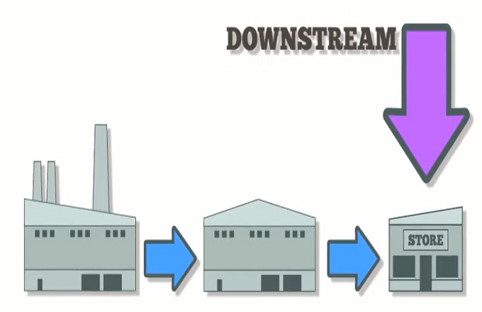

The world of finance and industry encompasses a vast array of activities, each falling within a framework often categorized into upstream and downstream processes. These terminologies, widely used in various industries such as oil and gas, describe two integral phases in the production and distribution chain. While upstream operations focus on the exploration and extraction of raw materials, downstream processes deal with converting these materials into finished products ready for consumer use. 

In this article, we direct our attention to downstream operations and their role within the context of algorithmic trading. Algorithmic trading involves using complex algorithms to execute trades in financial markets rapidly and efficiently. It requires an intricate understanding of market dynamics, data processing, and trade execution — elements predominantly situated within the downstream spectrum of financial activities.



The purpose of this exploration is to bridge the general concept of downstream operations with their specific applications in financial trading. By doing so, we seek to provide industry professionals with a nuanced comprehension of how these processes can be leveraged to optimize trading strategies and execution. We aim to offer a detailed overview and pertinent examples to illustrate the seamless integration and pivotal importance of downstream processes in the increasingly automated world of trading. Through this discussion, readers will gain insights into the critical role downstream operations play in not just facilitating but enhancing algorithmic trading performance.

## Table of Contents

## Understanding Downstream Operations

Downstream operations involve a series of processes that transform raw materials into finished consumer-ready products. This concept is prominently observed in industries such as oil and gas, where downstream operations encompass the refining of crude oil into usable commodities like gasoline, diesel, and various petrochemicals. These operations are essential because they bridge the transition between raw materials and market-ready commodities, playing a vital role in making the products usable and commercially viable for consumers.

In financial industries, downstream operations take on a analogous role, albeit in a different context. Here, the raw materials are in the form of financial data, and the finished products are financial instruments and services that are accessible to end-users, such as investors and traders. The financial data collected from various sources goes through processes such as data cleaning, integration, and analysis. These processes ensure the data is accurate, timely, and relevant, ultimately facilitating the development of financial products like mutual funds, ETFs, and derivative instruments.

Just as the oil and gas sector relies on refining techniques to produce standardized products for consumer use, financial industries depend on complex data processing techniques to convert raw financial data into actionable insights and market-ready products. This transformation is crucial for ensuring that financial markets operate smoothly and that products meet the regulatory standards and market demands.

Efficient downstream operations in both industrial and financial contexts involve not only the processing and conversion of raw inputs but also focus on cost reduction, quality improvement, and compliance with environmental and regulatory obligations. Achieving these objectives enhances the competitive stance of companies within their respective industries by delivering high-value products to market more swiftly and effectively.

In summary, downstream operations are integral to ensuring that primary inputs, whether [crude oil](/wiki/crude-oil) or financial data, are effectively translated into end-user products, aligning them closely with consumer needs and market conditions.

## Types of Downstream Operations

Downstream operations are pivotal in transitioning resources and products from raw forms to states ready for end-user consumption. In traditional industries like oil and gas, downstream operations encompass refining crude oil and marketing, distributing the end products like gasoline and diesel. These processes ensure that extracted raw materials are converted into products that meet market requirements and consumer needs.

In financial trading, downstream operations similarly play a critical role in transforming raw data into actionable information. The key components include refining, marketing, and distribution, each contributing uniquely to the overall effectiveness of trading strategies.

### Refining

In financial contexts, refining pertains to processing raw data to produce insights that can be used in trading algorithms. This involves cleaning, filtering, and organizing large volumes of streaming market data. This refinement is crucial for algorithms to perform optimally, as they rely on precise and high-quality data to make accurate trading decisions. Techniques such as data normalization, anomaly detection, and outlier removal are commonly applied to refine financial data inputs.

### Marketing

Marketing, within financial trading systems, refers to the strategic dissemination of refined data and trading signals to traders and investors. This includes the communication of actionable insights derived from analytical models and trading strategies. Effective marketing ensures that the right information reaches the right stakeholders at the right time, enhancing decision-making capabilities. It involves the packaging of data outputs in intuitive formats and integrating them into decision support systems or trading platforms.

### Distribution

Distribution in financial trading signifies the flow of refined financial products and services to clients, effectively bridging the gap between data output and trading execution. It encompasses the technological infrastructure and protocols required to deliver trade signals and strategies to the marketplace. Distribution channels must be robust and responsive to ensure that the system can handle high-frequency data exchanges and execute orders with minimal latency. This capability is fundamental to maintaining a competitive edge in markets that are increasingly driven by speed and precision.

Understanding these types of downstream operations enables traders and investors to appreciate how raw financial data evolves into products that guide trading decisions. This comprehension is vital as it underscores the importance of each step in the data processing and decision-making chain, ultimately contributing to successful trading outcomes.

## Downstream Processes in Algo Trading

Algorithmic trading, a method of executing orders using automated pre-programmed trading instructions, relies heavily on downstream processes to ensure timely and accurate trade execution. These processes are crucial due to the nature of financial markets, where fractions of a second can significantly impact trading outcomes.

**Key Processes**

1. **Data Refinement:** 
   In [algorithmic trading](/wiki/algorithmic-trading), the flood of financial data from various sources must be meticulously refined to extract meaningful insights. This data refinement process encompasses several stages—cleaning, normalization, and transformation.

   - **Cleaning** involves removing erroneous data points or filling gaps to create a continuous dataset.
   - **Normalization** ensures that data from different sources is brought to a common format, thus facilitating accurate comparisons and analyses.
   - **Transformation** adjusts the data to highlight pertinent features or indicators, such as moving averages or Bollinger Bands.

   For example, filtering high-frequency tick data for outliers and adjusting prices to account for stock splits are vital steps to create a reliable dataset for strategy testing.

2. **Strategy Implementation:**
   Once the data is refined, algorithmic strategies are developed and implemented. These strategies quantitatively analyze refined datasets to make trading decisions. Strategies can range from simple moving averages to complex [machine learning](/wiki/machine-learning) models predicting future price movements. Strategy implementation involves coding algorithms in programming languages such as Python or C++, employing libraries like NumPy, Pandas, and scikit-learn for financial analyses and model construction. For instance:

   ```python
   import pandas as pd
   import numpy as np

   # Simple Moving Average Strategy
   def moving_average_strategy(prices, period):
       return prices.rolling(window=period).mean()

   # Example usage
   prices = pd.Series([210, 215, 220, 230, 235])
   ma_strategy = moving_average_strategy(prices, period=3)
   print(ma_strategy)
   ```

   Here, the `moving_average_strategy` function calculates the rolling average over a specified period, which could serve as a basic indicator to buy or sell stocks.

3. **Order Execution:**
   The final stage involves executing the determined trades. Efficient order execution is paramount; it involves interacting with trading platforms through APIs to place buy or sell orders. Latency, or the delay between decision-making and executing a trade, is minimized to gain a competitive advantage in fast-paced markets. Algorithms often prioritize order types such as market, limit, or stop orders based on predefined conditions and analysis.

In conclusion, the interplay of data refinement, strategy implementation, and order execution forms the backbone of successful algorithmic trading. Effective management of these downstream processes ensures that trades are not only executed correctly but also in an optimal timeframe, which can substantially impact profitability in financial markets.

## Examples of Downstream Operations in Algo Trading

Consider a scenario where refined market data plays a pivotal role in executing trades for an automated trading strategy. In algorithmic trading, the downstream process encompasses several steps aimed at transforming raw market data into actionable trading decisions and executing those decisions on trading platforms. 

An algorithm begins by processing incoming market data. This data, often vast and complex, includes variables such as price quotes, bid-ask spreads, and trading volumes. The first step involves data cleaning and normalization to ensure consistency and accuracy. For instance, anomalies like outliers or erroneous values are identified and either corrected or discarded. Data may also be adjusted for discrepancies such as stock splits or dividends to maintain a coherent dataset.

Following this, the algorithm analyzes the refined data to make trading decisions. This involves implementing quantitative models that assess potential opportunities and risks. For example, a mean-reversion strategy may involve calculating the z-score of a stock price relative to its historical average, determining whether it is statistically likely to revert to the mean.

```python
import numpy as np

def calculate_z_score(prices):
    mean = np.mean(prices)
    std_dev = np.std(prices)
    z_scores = [(price - mean) / std_dev for price in prices]
    return z_scores

prices = [100, 102, 101, 105, 107, 103]  # Sample price data
z_scores = calculate_z_score(prices)
print(z_scores)
```

The algorithm utilizes these insights to select trades that align with its strategy. This decision-making process is completed in milliseconds to ensure trades capitalize on fleeting market opportunities.

Subsequently, the trades are executed through interaction with a trading platform. The algorithm sends orders that specify the asset, quantity, price, and order type (such as market or limit orders) to execute. This process is a core component of the downstream operations, ensuring orders are placed accurately and efficiently in the desired markets.

Case studies of companies like Renaissance Technologies illustrate the effectiveness of robust downstream operations. Known for their adept algorithms and strategic use of market data, Renaissance leverages data-driven models to execute profitable trades consistently and with precision. Their practice of refining data and executing strategies rapidly exemplifies the impact of well-coordinated downstream processes in maintaining a competitive edge in algorithmic trading.

## Benefits of Efficient Downstream Operations

Efficient downstream operations in algorithmic trading significantly enhance decision-making processes and profitability. These operations ensure that trades are executed promptly and accurately, which is imperative in fast-paced financial markets where milliseconds can make a substantial difference in trading outcomes. By refining and processing raw financial data into actionable insights, downstream operations allow traders to react swiftly to market fluctuations, thereby improving the likelihood of favorable trade execution.

One of the primary benefits of efficient downstream operations is their ability to handle high volumes of data and make informed decisions in real time. Algorithmic trading systems leverage these capabilities to monitor markets continuously and adjust strategies as conditions change. For instance, when a certain trading strategy is no longer viable due to market [volatility](/wiki/volatility-trading-strategies), efficient downstream operations enable the quick adaptation of strategies, minimizing potential losses and optimizing gains.

Moreover, these operations provide the flexibility required to adapt to new and evolving market conditions. This adaptability is crucial, especially in volatile markets, where rigid systems may fail to capitalize on emerging opportunities. Efficient downstream processes ensure that trading systems remain agile by integrating the latest market data and insights without significant delays. This flexibility can be illustrated using a Python snippet:

```python
import pandas as pd

# Assume df is a DataFrame containing market data
def adjust_strategy(df):
    # Example: Adjust the trading strategy based on volatility
    volatility = df['price'].pct_change().std()
    if volatility > 0.05:
        strategy = 'reduce_risk'
    else:
        strategy = 'increase_aggression'
    return strategy

# Example usage
strategy_decision = adjust_strategy(market_data)
```

In the above code, the function `adjust_strategy` uses market data to determine the level of volatility. Depending on the calculated volatility, it adjusts the trading strategy, showcasing the flexibility provided by efficient downstream processes.

In conclusion, by ensuring accurate and timely trade executions, along with maintaining adaptability, efficient downstream operations offer a competitive edge, enhancing decision-making and profitability in the dynamic domain of algorithmic trading.

## Challenges and Considerations

Managing large volumes of data and ensuring real-time processing present formidable challenges in downstream operations for algorithmic trading. The sheer [volume](/wiki/volume-trading-strategy) of financial data generated in markets today, including price movements, transaction volumes, and economic indicators, requires robust systems capable of handling, storing, and processing information efficiently. Ensuring real-time processing is crucial as even millisecond delays can impact trading outcomes significantly.

Decoupling complex strategies into efficient downstream operations involves both technological and strategic foresight. From a technological perspective, it is vital to leverage advanced data management systems and high-performance computing infrastructure. Software frameworks such as Apache Kafka and distributed processing systems like Apache Flink or Spark can facilitate real-time data streaming and processing. These technologies provide the scalability and speed necessary to handle large data volumes with minimal latency.

Strategic foresight involves developing algorithms that can effectively transform raw data into actionable insights while remaining flexible enough to adapt to rapidly changing market conditions. This often requires employing machine learning algorithms to predict market trends and optimize trading strategies dynamically. The integration of AI and machine learning techniques enables the creation of adaptive models that can refine their strategies based on historical data and real-time inputs.

Regulatory considerations also play a critical role in shaping downstream operations. Financial markets are subject to stringent regulations aimed at maintaining market integrity, ensuring fairness, and protecting investors. Compliance with these regulations adds complexity to the design and implementation of trading systems. Algorithmic trading operations must incorporate mechanisms for surveillance and monitoring to detect and prevent manipulative activities like spoofing or insider trading.

Furthermore, firms must ensure that their trading algorithms and downstream processes are transparent and auditable. This is essential to demonstrate compliance with regulatory standards and to build trust with stakeholders. Implementing a robust audit trail, which logs every decision and action taken by the algorithm, is vital. Regular reviews and updates to these systems are necessary to align with evolving regulatory frameworks and market practices.

In summary, effective management of data volume and processing speed, coupled with strategic and technological innovations, is essential for optimizing downstream operations in algorithmic trading. Companies must also navigate regulatory landscapes carefully to ensure compliant and efficient trading activities.

## Conclusion

Downstream operations form a critical component of the broader financial and industrial ecosystem, acting as the essential processes that ensure raw materials or data are transformed into final products or actionable insights. In the context of algorithmic trading, these operations are integral to achieving efficient and effective trade execution and strategy deployment. By optimizing the flow of refined data and ensuring timely execution of trades, downstream operations directly influence the success of trading strategies. 

Algorithmic trading, which relies on sophisticated mathematical models and high-speed data processing, benefits significantly from well-structured downstream processes. These processes include data refinement, execution of orders, and continuous adaptation to market changes, all of which contribute to an algorithm's ability to capitalize on market opportunities. The efficacy of these operations is bound by the quality of data processing systems and the speed at which they can act. 

Optimizing downstream operations can provide a competitive edge in the dynamic world of automated trading. Traders who carefully manage these processes can achieve more precise market entries and exits, reducing latency and enhancing profitability. Moreover, streamlined operations can offer greater flexibility to adjust strategies in response to market volatility, thereby maintaining the robustness and viability of trading algorithms. 

Ultimately, understanding and continually refining these operations is vital for firms looking to maintain a competitive advantage in algorithmic trading. As markets continue to evolve, the ability to effectively manage downstream operations will be a critical determinant of success within the highly competitive landscape of modern finance.

## References & Further Reading

[1]: Bergstra, J., Bardenet, R., Bengio, Y., & Kégl, B. (2011). ["Algorithms for Hyper-Parameter Optimization."](https://papers.nips.cc/paper/4443-algorithms-for-hyper-parameter-optimization) Advances in Neural Information Processing Systems 24.

[2]: ["Advances in Financial Machine Learning"](https://www.amazon.com/Advances-Financial-Machine-Learning-Marcos/dp/1119482089) by Marcos Lopez de Prado

[3]: ["Evidence-Based Technical Analysis: Applying the Scientific Method and Statistical Inference to Trading Signals"](https://www.amazon.com/Evidence-Based-Technical-Analysis-Scientific-Statistical/dp/0470008741) by David Aronson

[4]: ["Machine Learning for Algorithmic Trading"](https://github.com/stefan-jansen/machine-learning-for-trading) by Stefan Jansen

[5]: ["Quantitative Trading: How to Build Your Own Algorithmic Trading Business"](https://www.amazon.com/Quantitative-Trading-Build-Algorithmic-Business/dp/1119800064) by Ernest P. Chan