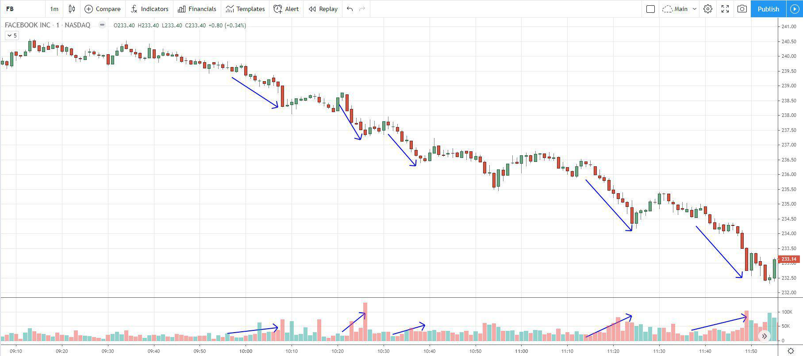

In the rapidly evolving world of stock trading, understanding market trends is crucial for both individual investors and large financial institutions. As markets fluctuate, identifying patterns and anomalies becomes essential for making informed investment decisions. Algorithmic trading, or algo-trading, has significantly altered the financial landscape by enabling computers to execute trades rapidly based on pre-defined rules. This innovation enhances the ability to process vast amounts of financial data, facilitating faster and often more accurate investment strategies than traditional methods.

A fundamental concept that traders must grasp when analyzing market dynamics is the downtick. A downtick describes a situation where a stock's price decreases compared to the price in the preceding transaction. This movement can signal changes in investor sentiment, supply and demand imbalances, or broader economic shifts. Understanding how downticks, alongside other trends, affect market performance is vital for traders aiming to harness these fluctuations effectively.



This article explores how market trends, particularly downticks, impact stock trading and the role of algorithmic trading in navigating these trends. By examining the interplay of market movements and technological advancements, traders and financial institutions can better position themselves in a competitive landscape. With the increasing reliance on technology for trading activities, comprehending these fundamental concepts becomes even more pertinent.

## Table of Contents

## Understanding Market Trends and Downticks

Market trends are the overall directions in which financial markets move over time, influenced by factors like economic data, geopolitical events, and investment sentiment. By analyzing these trends, investors and traders can make predictions about future market movements, aiding in strategic decision-making. 

Downticks, a subset of market trends, occur when a stock or security is traded at a lower price than its previous trade. These events are significant as they can reflect changes in investor sentiment or the performance of a particular stock or sector. For example, a series of downticks might indicate bearish sentiment, suggesting that investors are losing confidence, potentially due to poor financial results, negative news, or broader economic concerns.

Understanding downticks is crucial because they can provide insights into market behavior and influence decisions on buying or selling securities. This comprehension aids investors in developing strategies that account for potential risks or opportunities. For instance, recognizing a pattern of downticks could either prompt an investor to sell off securities to avoid further losses or identify a buying opportunity if they believe the stock is undervalued.

Investors often use various tools and indicators to analyze market trends and downticks, such as moving averages or relative strength indices (RSI). These tools help to smooth out price data over specified periods or measure the speed and change of price movements, respectively, allowing traders to identify potential entry and [exit](/wiki/exit-strategy) points.

In summary, understanding market trends and particularly downticks, is vital for making informed investment decisions. Recognizing these patterns helps investors anticipate market shifts, adjust their portfolios accordingly, and develop strategies that optimize their financial outcomes.

## The Role of Algorithmic Trading

Algorithmic trading employs computer algorithms to automate and enhance the decision-making process in stock trading. This approach aims for heightened efficiency and swiftness, crucial in the rapidly moving financial markets. Algorithms in this domain are often designed to execute trades based on complex, pre-defined strategies that respond to a variety of market conditions.

One of the primary advantages of [algorithmic trading](/wiki/algorithmic-trading) is its ability to reduce the influence of human errors and emotions, which can often lead to inconsistent trading decisions. By automating the trading process, investors benefit from a more disciplined approach. Algorithms can process vast amounts of data at a speed that would be impossible for a human, identifying patterns and executing trades in fractions of a second.

Algorithmic trading strategies can be constructed using a range of mathematical models and statistical techniques. For instance, moving averages, mean reversion, and [momentum](/wiki/momentum) indicators are commonly used to develop and test trading algorithms. Below is a simple Python script illustrating a basic moving average crossover strategy:

```python
import pandas as pd
import numpy as np

def moving_average_strategy(prices, short_window, long_window):
    signals = pd.DataFrame(index=prices.index)
    signals['price'] = prices
    signals['short_mavg'] = prices.rolling(window=short_window, min_periods=1, center=False).mean()
    signals['long_mavg'] = prices.rolling(window=long_window, min_periods=1, center=False).mean()
    signals['signal'] = 0.0
    signals['signal'][short_window:] = np.where(signals['short_mavg'][short_window:] > signals['long_mavg'][short_window:], 1.0, 0.0)   
    signals['positions'] = signals['signal'].diff()
    return signals

# Example usage with hypothetical price data
price_data = pd.Series([1, 2, 3, 4, 3, 2, 5, 6, 7, 8, 9, 5, 4, 3, 2, 1])
signals = moving_average_strategy(price_data, short_window=3, long_window=5)
print(signals)
```

In an era where downticks and other market trend nuances play significant roles, algorithmic trading provides an edge by quickly adapting to these market shifts. Algorithms can leverage historical data and employ predictive analytics to anticipate market movements, making them invaluable in volatile trading environments.

Moreover, with the increasing reliance on algorithmic trading, understanding its implications on market trends, such as downticks, has become essential. These trends often require traders to use sophisticated algorithms to maintain a competitive edge, both in terms of risk management and profit maximization. As the financial markets continue to evolve, algorithmic trading remains a pivotal component of modern trading practices, allowing traders to navigate complex market scenarios with relative ease.

## Impact of Downticks on Stock Trading

Downticks, instances where a stock is traded at a lower price than its previous transaction, play a crucial role in stock trading by influencing market dynamics and trader behavior. These price movements can create both opportunities and risks, which are particularly pronounced for traders engaged in short selling. Short selling involves selling stocks borrowed from a broker with the expectation that the price will decrease, allowing them to be repurchased at a lower cost. However, following a downtick, short selling may be restricted to prevent excessive downward pressure on stock prices. This regulation is exemplified by the uptick rule, which permits short selling only at a price higher than the last different price, providing a buffer against steep price declines.

Algorithmic traders, or those utilizing algorithmic trading technology, leverage advanced strategies to take advantage of downticks. These strategies often rely on historical data and predictive analytics to anticipate price movements and execute trades with precision. Algorithmic systems can rapidly assess market conditions, adjusting strategies to optimize outcomes based on price trends, including downticks. The efficacy of these systems lies in their ability to process vast amounts of data quickly, identifying patterns and making informed trading decisions that might elude human traders.

For algorithmic traders, downticks offer a window to execute trades at advantageous moments, provided they accurately predict market directions and incorporate proper risk management strategies. Understanding the broader implications of downticks on market behavior is critical for developing trading algorithms that are resilient to volatile price movements. By incorporating statistical models and [machine learning](/wiki/machine-learning) techniques, traders can refine these algorithms, enhancing their capacity to respond effectively to downticks and mitigate potential risks. 

Ultimately, the impact of downticks on stock trading underscores the need for sophisticated analytical tools that allow both human and algorithmic traders to navigate fluctuating market conditions. As traders harness these tools, their ability to capitalize on downticks will be increasingly determined by the depth of their market insights and the technological sophistication of their trading systems.

## Benefits and Risks of Algo-Trading in a Downtick Market

Algorithmic trading, commonly known as algo-trading, is a significant feature of modern financial markets, offering benefits particularly evident in volatile market conditions, such as those characterized by downticks. A downtick, indicating a decrease in the price of a stock compared to its previous trade, can create opportunities for traders to leverage algo-trading for enhanced speed, precision, and cost efficiency. 

### Benefits 

**Speed and Precision**: One of the most notable advantages of algo-trading is its ability to execute high-frequency trades rapidly and with remarkable accuracy. Algorithms can scan multiple markets and securities simultaneously, identifying and acting on trading opportunities that might be missed by human traders. This capability is particularly beneficial in fast-changing environments, where prices can fluctuate rapidly.

**Cost Efficiency**: The automation of trades reduces transaction costs by eliminating the need for manual intervention. Additionally, the high speed of execution minimizes the market impact of each trade, further reducing costs.

### Risks

Despite its advantages, algo-trading carries inherent risks. 

**System Crashes**: Technical failures, such as software bugs or hardware malfunctions, can disrupt trade executions, potentially leading to significant financial losses. Ensuring the robustness of trading systems is paramount.

**Increased Market Volatility**: The rapid execution of large volumes of trades can contribute to market volatility, particularly during downticks. This can exacerbate price movements and create feedback loops that amplify the effects of market downturns.

**Regulatory Challenges**: The regulatory environment for algo-trading is complex and continually evolving. Compliance with regulations is crucial to mitigate legal risks and maintain market integrity. Regulations such as the Securities Exchange Act in the U.S. impose strict requirements on algorithmic trading to prevent market manipulation and ensure fair trading practices.

### Balancing Benefits and Risks

Traders can balance the benefits against these risks by adopting comprehensive risk management protocols. This includes regular testing and updating of algorithms, implementing robust firewalls to prevent unauthorized access, and developing contingency plans for system failures.

### Future Trends

Looking ahead, the future of algo-trading, particularly in downtick markets, is likely to be shaped by emerging technologies. 

**AI and Big Data Analytics**: Sophisticated use of artificial intelligence (AI) and big data analytics is expected to enhance decision-making capabilities. AI algorithms can identify complex patterns and predict market movements more accurately, enabling traders to anticipate downticks and adjust their strategies accordingly.

**Machine Learning Algorithms**: The integration of machine learning allows algorithms to adapt to changing market conditions, refining their strategies based on historical data and real-time analysis. A simple Python example of such a strategy could involve the use of a machine learning library like scikit-learn to predict stock price movements:

```python
from sklearn.ensemble import RandomForestClassifier
from sklearn.model_selection import train_test_split
import numpy as np

# Sample data: features and labels 
X = np.random.rand(100, 5)  # 100 samples, 5 features
y = np.random.randint(2, size=100) # Binary outcomes

# Split data into train and test
X_train, X_test, y_train, y_test = train_test_split(X, y, test_size=0.2)

# Train RandomForest model
model = RandomForestClassifier(n_estimators=10)
model.fit(X_train, y_train)

# Predict on test data
predictions = model.predict(X_test)
```

Through the strategic integration of these innovations, traders can enhance their ability to navigate downtick markets effectively, leveraging both the speed and analytical depth provided by advanced algorithmic models. 

## Future Trends in Algorithmic Trading

The market for algorithmic trading is poised for considerable growth, underscored by ongoing advancements in machine learning and data analytics. As these technologies evolve, they create opportunities to develop more sophisticated algorithms capable of adapting to rapidly changing market conditions. For example, machine learning models can process vast quantities of market data to identify patterns and correlations that were previously undetectable. This ability enhances the predictive accuracy of trading algorithms, potentially leading to better performance in diverse market scenarios.

Emerging technologies are set to enable more complex algorithms by integrating real-time data for instant reactions to market fluctuations. This adaptability is crucial in an environment where market conditions can shift within seconds. Techniques such as [reinforcement learning](/wiki/reinforcement-learning)—where algorithms learn optimal strategies through trial and error—are gaining traction. These techniques empower trading systems to adjust their strategies dynamically, which is particularly useful during volatile market periods characterized by frequent downticks.

Regulatory developments are expected to play a significant role in shaping the future use of algorithmic trading strategies. As markets become increasingly automated, regulators are focusing on ensuring transparency, reducing systemic risks, and maintaining fair trading practices. Compliance requirements may necessitate traders to be more vigilant and incorporate mechanisms that align with these regulations into their algorithms. This could include implementing circuit breakers or monitoring systems that automatically halt trading if certain thresholds are exceeded.

The integration of [artificial intelligence](/wiki/ai-artificial-intelligence) and big data analytics stands to further enhance the capabilities of trading algorithms. By leveraging AI, traders can refine their predictions of market movements, including downticks, with greater precision. AI techniques, such as natural language processing, enable algorithms to analyze unstructured data sources such as news articles and social media sentiment, providing insights that complement traditional financial data. Big data analytics allow for the processing of massive datasets, facilitating the identification of emerging trends and anomalies in the market.

In conclusion, the future of algorithmic trading is characterized by increased sophistication, adaptability, and regulatory oversight. As technology continues to advance, traders equipped with cutting-edge algorithms will likely be better positioned to navigate the complexities of modern financial markets.

## Conclusion

Market trends, particularly downticks, are pivotal in influencing trading strategies and understanding the fluctuations within financial markets. Downticks, which indicate a price decrease compared to a prior trade, can serve as signals for strategic decision-making among traders, particularly in volatile market conditions. Algorithmic trading has become indispensable in navigating these trends by automating trades with precision and speed, thus providing both opportunities and challenges for investors.

In downtick environments, the use of algorithmic trading facilitates rapid adjustments to strategies, leveraging data analytics and historical patterns. Algorithms are designed to parse substantial amounts of data to execute trades based on predetermined criteria, thus minimizing human emotions and errors. Consequently, successful trading in such environments necessitates a comprehensive understanding of both market behaviors and the sophisticated operation of trading algorithms. Traders must be proficient in interpreting downticks and utilizing technological advancements to stay ahead.

As financial markets continue their rapid evolution, staying informed about these trends will be crucial for traders. Regularly updating strategies in alignment with market dynamics will allow traders to optimize their approaches. This includes recognizing the implications of regulatory changes and advancements in machine learning and data analytics, which are set to further enhance algorithmic trading capabilities. Overall, the ability to adapt to market trends like downticks through an informed comprehension of trading algorithms will be vital for success in future trading landscapes.

## References & Further Reading

[1]: Bergstra, J., Bardenet, R., Bengio, Y., & Kégl, B. (2011). ["Algorithms for Hyper-Parameter Optimization."](https://dl.acm.org/doi/10.5555/2986459.2986743) Advances in Neural Information Processing Systems 24.

[2]: ["Advances in Financial Machine Learning"](https://www.amazon.com/Advances-Financial-Machine-Learning-Marcos/dp/1119482089) by Marcos Lopez de Prado

[3]: ["Evidence-Based Technical Analysis: Applying the Scientific Method and Statistical Inference to Trading Signals"](https://www.amazon.com/Evidence-Based-Technical-Analysis-Scientific-Statistical/dp/0470008741) by David Aronson

[4]: ["Machine Learning for Algorithmic Trading"](https://github.com/stefan-jansen/machine-learning-for-trading) by Stefan Jansen

[5]: ["Quantitative Trading: How to Build Your Own Algorithmic Trading Business"](https://www.amazon.com/Quantitative-Trading-Build-Algorithmic-Business/dp/1119800064) by Ernest P. Chan