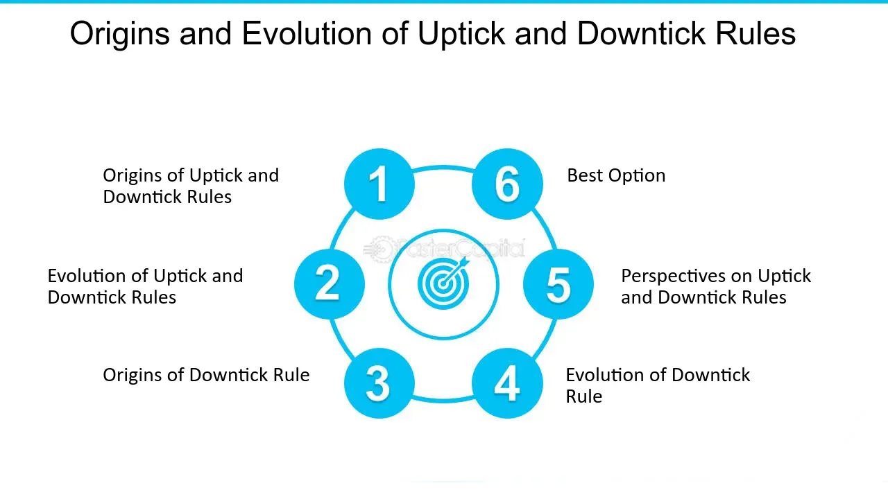

## Table of Contents

## What is a downtick?

A downtick is when the price of a stock goes down compared to the last trade. It's a term used in stock markets to describe a small drop in the price of a stock. If a stock was last traded at $50 and the next trade happens at $49, that's a downtick.

Downticks are important because they help traders and investors understand the direction the stock price is moving. When there are more downticks than upticks, it might mean that the stock's price is going to keep falling. This information can help people decide when to buy or sell a stock.

## How does a downtick occur in stock trading?

A downtick happens in stock trading when the price of a stock goes down from the last trade. Imagine a stock was last sold for $50. If the next person buys it for $49, that's a downtick. It's like a small step down in price. This can happen for many reasons, like if more people want to sell the stock than buy it, or if something bad happens to the company that makes people think the stock is worth less.

Downticks are important because they show which way the stock's price is moving. If there are more downticks than upticks (which is when the price goes up), it might mean the stock's price will keep falling. Traders and investors watch downticks closely to decide if they should buy or sell. It's like trying to guess if the price will keep going down or if it's a good time to buy the stock at a lower price.

## What is the difference between a downtick and an uptick?

A downtick happens when the price of a stock goes down from the last trade. For example, if a stock was sold for $50 last time and the next trade is at $49, that's a downtick. It shows that the stock's price is moving down a little bit. Downticks are important because they help people see if the stock might keep going down in price.

An uptick is the opposite of a downtick. It happens when the price of a stock goes up from the last trade. If a stock was sold for $50 last time and the next trade is at $51, that's an uptick. It shows that the stock's price is moving up a little bit. Upticks are important because they help people see if the stock might keep going up in price.

Both downticks and upticks help traders and investors make decisions about buying or selling stocks. They watch these ticks to guess where the stock price might go next.

## Can you explain the mechanism behind a downtick?

A downtick happens when the price of a stock goes down from the last trade. Imagine a stock was last sold for $50. If the next person buys it for $49, that's a downtick. It's like a small step down in the price. This can happen for many reasons, like if more people want to sell the stock than buy it, or if something bad happens to the company that makes people think the stock is worth less.

Downticks are important because they show which way the stock's price is moving. If there are more downticks than upticks (which is when the price goes up), it might mean the stock's price will keep falling. Traders and investors watch downticks closely to decide if they should buy or sell. It's like trying to guess if the price will keep going down or if it's a good time to buy the stock at a lower price.

## How does a downtick affect the market?

A downtick can affect the market by making people think a stock's price might keep going down. If a stock goes down from $50 to $49, that's a downtick. When people see this, they might decide to sell their stock to avoid losing more money. If lots of people sell, the stock's price can go down even more. This can make other people nervous, and they might start selling too, causing a bigger drop in the stock's price.

Downticks can also change how people feel about the whole market. If there are many downticks happening at the same time, it might make people think the market is going to have a bad day or even a bad week. This can lead to more selling and more downticks. But sometimes, if a stock goes down a little, it can make it look like a good deal to buy. Some people might see a downtick as a chance to buy the stock at a lower price, hoping it will go back up later.

## What are the rules regarding downticks in different stock exchanges?

Different stock exchanges have different rules about downticks, but they all want to make sure trading is fair and orderly. In the United States, the New York Stock Exchange (NYSE) and the NASDAQ have rules about short selling related to downticks. Short selling is when someone sells a stock they borrowed, hoping to buy it back later at a lower price. The NYSE and NASDAQ used to have an "uptick rule" which said you could only short sell a stock on an uptick or a zero-plus tick (when the price stays the same but is higher than the last different price). This rule was meant to stop people from making the stock price fall too fast. In 2010, the uptick rule was brought back but in a different form called the "alternative uptick rule," which only kicks in during big price drops to help slow down the fall.

In other parts of the world, rules can be different. For example, the London Stock Exchange doesn't have an uptick rule but has other rules to keep trading fair. They might use something called a "circuit breaker," which stops trading for a while if a stock's price falls too fast. This gives everyone a chance to calm down and think before trading starts again. Each exchange tries to find the best way to keep trading smooth and fair, even when there are lots of downticks happening.

## How do downticks impact short selling?

Downticks are important for short selling because they help decide when someone can sell a stock short. Short selling is when someone borrows a stock and sells it, hoping to buy it back later at a lower price. In the U.S., there used to be a rule called the "uptick rule" that said you could only short sell a stock on an uptick or a zero-plus tick. This was to stop the stock price from falling too fast. But in 2010, they changed it to the "alternative uptick rule," which only stops short selling if the stock's price is dropping a lot.

When there are a lot of downticks, it might make short sellers more active. They see the stock price going down and think it might keep falling, so they want to short sell to make money from the drop. But if there are rules like the alternative uptick rule, it can slow them down and stop the stock price from falling too quickly. This helps keep the market fair and stops big, sudden drops in stock prices.

## What is the significance of downticks in technical analysis?

Downticks are important in technical analysis because they help traders and investors see which way the stock's price is moving. Technical analysis is all about looking at past price movements to guess what might happen next. When traders see a lot of downticks, it tells them that the stock's price is going down. This can be a sign that the stock might keep going down, and it can help them decide if it's a good time to sell or wait for a better price.

In technical analysis, downticks are used to make charts and patterns that show trends. For example, a chart might show a lot of downticks over time, making a pattern that looks like a downward slope. Traders use these patterns to make decisions. If they see a pattern of downticks, they might think the stock will keep falling and choose to sell. But if they think the downticks are a good buying opportunity, they might buy the stock, hoping it will go back up later.

## How have downtick rules evolved over time?

Downtick rules have changed a lot over time, especially in the United States. A long time ago, the U.S. had something called the "uptick rule." This rule said that you could only short sell a stock if its price went up a little bit from the last trade. The idea was to stop people from making the stock price fall too fast. But in 2007, they got rid of this rule because some people thought it wasn't needed anymore.

Then, after a big drop in the stock market in 2008, people started to think the uptick rule might be a good idea again. So, in 2010, they brought back a new version called the "alternative uptick rule." This new rule only stops short selling if the stock's price is dropping a lot. It's meant to slow down big price drops and keep the market fair. Other countries have their own rules too, but they all want to make sure trading is fair and doesn't go too wild.

## What are some strategies traders use in response to downticks?

When traders see a lot of downticks, they might use different strategies to make the most of the situation. One common strategy is to sell their stocks. If they see the price going down, they might think it will keep falling. By selling early, they can avoid losing more money. Another strategy is short selling. This is when traders borrow a stock and sell it, hoping to buy it back later at a lower price. Downticks can make them think the stock will keep going down, so they short sell to make money from the drop.

But not all traders see downticks as a bad thing. Some traders use downticks as a chance to buy stocks at a lower price. They might think the stock is a good deal now and will go back up later. This is called buying the dip. They wait for the price to go down a bit and then buy, hoping to sell it later when the price goes up again. So, downticks can lead to different strategies depending on what traders think will happen next.

## How do downticks relate to market volatility?

Downticks can make the market more volatile. Volatility means the market is moving a lot, up and down. When there are a lot of downticks, it can make people worried. They might start selling their stocks because they think the price will keep going down. If lots of people sell at the same time, it can make the stock price drop even more, causing more downticks and making the market even more volatile.

But downticks can also help calm the market sometimes. If traders see a lot of downticks, they might think it's a good time to buy stocks at a lower price. This can help stop the price from falling too much. So, while downticks can make the market more volatile by causing people to sell, they can also help balance things out by giving people a chance to buy when prices are low.

## What advanced metrics or indicators are used to analyze downticks?

Advanced metrics and indicators help traders understand downticks better. One common indicator is the "tick index," which shows the difference between the number of stocks that go up and the number that go down at any moment. If the tick index is negative, it means there are more downticks than upticks, which can signal that the market might keep going down. Another useful tool is the "[volume](/wiki/volume-trading-strategy)-weighted average price" (VWAP), which looks at the average price of a stock but also considers how many shares were traded. If the stock price is below the VWAP during a downtick, it might mean the stock is undervalued and could be a good time to buy.

Traders also use the "relative strength index" (RSI) to see if a stock is overbought or oversold. If the RSI is low during a downtick, it might mean the stock has been going down a lot and could be ready to go back up. Another important metric is the "moving average convergence divergence" (MACD), which looks at the difference between two moving averages of a stock's price. If the MACD line crosses below the signal line during a downtick, it can be a sign that the downtrend will continue. These advanced metrics help traders make better decisions by giving them more information about what's happening with downticks.

## References & Further Reading

[1]: Bergstra, J., Bardenet, R., Bengio, Y., & Kégl, B. (2011). ["Algorithms for Hyper-Parameter Optimization."](https://dl.acm.org/doi/10.5555/2986459.2986743) Advances in Neural Information Processing Systems 24.

[2]: ["Advances in Financial Machine Learning"](https://www.amazon.com/Advances-Financial-Machine-Learning-Marcos/dp/1119482089) by Marcos Lopez de Prado

[3]: ["Evidence-Based Technical Analysis: Applying the Scientific Method and Statistical Inference to Trading Signals"](https://www.amazon.com/Evidence-Based-Technical-Analysis-Scientific-Statistical/dp/0470008741) by David Aronson

[4]: ["Machine Learning for Algorithmic Trading"](https://github.com/stefan-jansen/machine-learning-for-trading) by Stefan Jansen

[5]: ["Quantitative Trading: How to Build Your Own Algorithmic Trading Business"](https://www.amazon.com/Quantitative-Trading-Build-Algorithmic-Business/dp/1119800064) by Ernest P. Chan