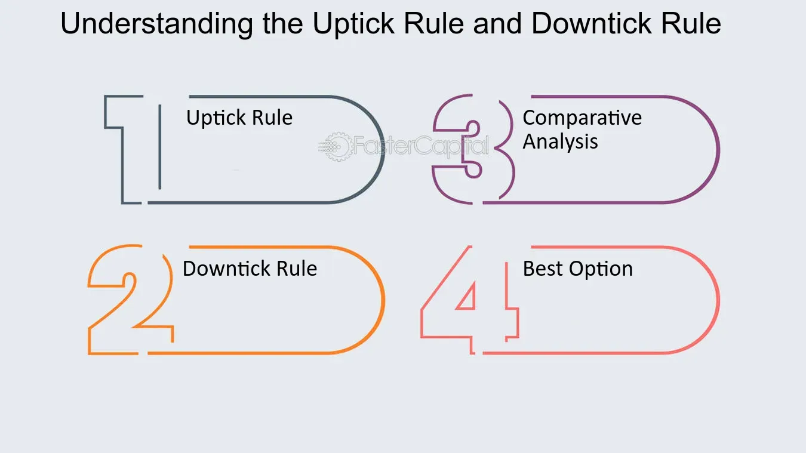

## Table of Contents

## What is the Downtick-Uptick Rule?

The Downtick-Uptick Rule is a regulation used in stock markets to control the selling of stocks. It was created to stop people from making the stock prices go down too fast by selling a lot of stocks at once. The rule says that if a stock's price goes down, you can't sell it short until the price goes up again. Selling short means borrowing stocks and selling them, hoping to buy them back later at a lower price.

This rule was first used in the United States after the stock market crash in 1929. It was meant to keep the market stable and prevent big drops in stock prices. However, the rule was taken away in 2007 because some people thought it didn't work well anymore. Even though it's not used in the U.S. anymore, some other countries still have similar rules to help keep their stock markets steady.

## Why was the Downtick-Uptick Rule introduced on the New York Stock Exchange?

The Downtick-Uptick Rule was introduced on the New York Stock Exchange to help stop stock prices from falling too quickly. After the big stock market crash in 1929, people were worried about the market becoming too unstable. The rule was meant to slow down how fast stocks could be sold short. Selling short is when someone borrows stocks, sells them, and hopes to buy them back later at a lower price to make money. By not allowing short sales on a downtick, the rule tried to keep the market from falling too fast.

The rule worked by only letting short sales happen when the stock price went up, called an uptick. This was supposed to make the market more stable and give it time to recover if prices started to drop. The Downtick-Uptick Rule stayed in place for many years, but it was removed in 2007. Some people thought it didn't help the market as much as it used to. Even though it's not used in the U.S. anymore, other countries still use similar rules to keep their stock markets steady.

## How does the Downtick-Uptick Rule affect short selling?

The Downtick-Uptick Rule makes short selling harder when stock prices are going down. Short selling is when someone borrows stocks, sells them, and hopes to buy them back later at a lower price to make money. The rule says you can't sell short if the last trade made the stock's price go down, which is called a downtick. You have to wait for the price to go up, called an uptick, before you can do a short sale. This is meant to stop people from making the stock price drop too fast by doing a lot of short selling.

By making people wait for an uptick, the rule tries to keep the stock market from falling too quickly. If everyone could short sell on a downtick, it might make the stock price go down even more, causing panic and big drops in the market. The rule was used to slow this down and give the market time to recover if prices started to fall. Even though the rule isn't used in the U.S. anymore, it was important for a long time in trying to keep the stock market stable.

## When was the Downtick-Uptick Rule originally implemented?

The Downtick-Uptick Rule was first put into place in the United States after the big stock market crash in 1929. This crash made people worry about the market becoming too unstable, so they created the rule to help stop stock prices from falling too fast. The rule said that if a stock's price went down, you couldn't sell it short until the price went up again. Selling short means borrowing stocks and selling them, hoping to buy them back later at a lower price.

The rule stayed in place for many years, but it was taken away in 2007. Some people thought it didn't work well anymore to keep the market stable. Even though it's not used in the U.S. now, other countries still use similar rules to help keep their stock markets steady. The Downtick-Uptick Rule was important because it tried to slow down how fast stocks could be sold short, which helped keep the market from falling too quickly.

## What changes have been made to the Downtick-Uptick Rule over time?

The Downtick-Uptick Rule was first used after the big stock market crash in 1929 to stop stock prices from falling too fast. The rule said that if a stock's price went down, you couldn't sell it short until the price went up again. This was meant to slow down how fast stocks could be sold short, which helped keep the market from falling too quickly. The rule stayed in place for many years and was important for keeping the stock market stable.

In 2007, the Downtick-Uptick Rule was taken away in the United States. Some people thought it didn't work well anymore to keep the market stable. After it was removed, people could sell short even if the stock price was going down. Even though the rule isn't used in the U.S. anymore, other countries still use similar rules to help keep their stock markets steady. The changes over time show how rules can be adjusted based on what people think works best for the market.

## How does the Downtick-Uptick Rule differ from other stock exchange regulations?

The Downtick-Uptick Rule is different from other stock exchange regulations because it focuses on controlling short selling when stock prices are going down. Short selling is when someone borrows stocks, sells them, and hopes to buy them back later at a lower price to make money. The Downtick-Uptick Rule says you can't sell short if the last trade made the stock's price go down. You have to wait for the price to go up before you can do a short sale. This is meant to stop people from making the stock price drop too fast by doing a lot of short selling.

Other stock exchange regulations might focus on different things, like making sure companies tell the truth about their business, or setting rules for how trades are made. For example, circuit breakers are rules that stop trading for a short time if the market drops a lot, to give people time to calm down and think. Another rule, called the "tick test," is similar to the Downtick-Uptick Rule but might have different details about when short selling is allowed. The Downtick-Uptick Rule is special because it was meant to keep the market from falling too quickly by controlling short selling in a specific way.

## Can you explain the specific criteria that trigger the Downtick-Uptick Rule?

The Downtick-Uptick Rule is triggered when someone wants to sell a stock short. Selling short means borrowing stocks, selling them, and hoping to buy them back later at a lower price to make money. The rule says you can't do this if the last trade made the stock's price go down. This drop in price is called a downtick. So, if the price of the stock went down in the last trade, you have to wait until the price goes up before you can sell it short.

The rule is all about waiting for an uptick, which is when the stock's price goes up after a downtick. If the price goes up, even just a little bit, then you can sell the stock short. This rule was made to stop people from making the stock price fall too fast by doing a lot of short selling. It tries to keep the market steady by making people wait for the right time to sell short.

## What are the potential impacts of the Downtick-Uptick Rule on market stability?

The Downtick-Uptick Rule helps keep the stock market from falling too fast by controlling short selling. Short selling is when someone borrows stocks, sells them, and hopes to buy them back later at a lower price to make money. The rule says you can't sell short if the stock's price just went down. You have to wait for the price to go up before you can do it. This stops people from making the stock price drop too quickly by doing a lot of short selling all at once. By making people wait, the rule gives the market time to calm down and recover if prices start to fall.

Even though the Downtick-Uptick Rule was taken away in the U.S. in 2007, it was important for a long time in helping keep the market stable. Some people thought it didn't work well anymore, so they got rid of it. But when it was in place, it helped slow down big drops in stock prices. Other countries still use similar rules to help keep their markets steady. The rule shows how trying to control short selling can be a way to make the market more stable and prevent panic selling.

## How do traders and investors adapt their strategies around the Downtick-Uptick Rule?

Traders and investors have to be careful with their short selling when the Downtick-Uptick Rule is in place. They can't just sell short whenever they want if the stock's price has gone down. They have to wait for the price to go up a little bit before they can do it. This means they need to watch the stock prices very closely. They might wait for the right moment to sell short, hoping to make money when the price goes down again. It can be tricky because they have to be patient and time their trades just right.

Even though the rule isn't used in the U.S. anymore, traders and investors in other countries with similar rules still have to think about it. They might change their trading plans to fit the rule. For example, they might look for other ways to make money if they can't sell short right away. They could buy stocks they think will go up, or use other trading strategies that don't involve short selling. The rule makes them think more about when and how they trade, trying to keep the market from getting too wild.

## What are the criticisms and controversies surrounding the Downtick-Uptick Rule?

Some people didn't like the Downtick-Uptick Rule because they thought it didn't really help the stock market. They said it made it harder for traders to do their jobs because they had to wait for the right time to sell short. This waiting could make them miss good chances to make money. Also, some people thought the rule didn't stop big drops in the market like it was supposed to. They said the market could still fall a lot even with the rule in place.

There were also arguments about whether the rule was fair. Some people said it was too hard on short sellers, who were just trying to make money like everyone else. They thought the rule treated short sellers differently from people who buy stocks hoping they will go up. When the rule was taken away in 2007, some people were happy because they thought it would make trading easier. But others worried that without the rule, the market might become too unstable and have big drops more often.

## How is compliance with the Downtick-Uptick Rule monitored and enforced?

When the Downtick-Uptick Rule was in place, stock exchanges and regulatory bodies like the Securities and Exchange Commission (SEC) in the U.S. made sure people followed it. They used computer systems to watch trades and check if anyone was selling short when they weren't supposed to. If someone broke the rule, they could get in trouble. The exchanges and the SEC would look into it and might fine the person or stop them from trading for a while.

Even though the rule isn't used in the U.S. anymore, other countries with similar rules still keep an eye on things the same way. They use technology to watch the market and make sure no one is selling short on a downtick. If someone doesn't follow the rule, the country's stock exchange or financial watchdog will step in and take action to make sure the market stays fair and stable.

## What are the future prospects and potential reforms for the Downtick-Uptick Rule?

The future of the Downtick-Uptick Rule depends a lot on what people think about it and how stock markets change. Even though it's not used in the U.S. anymore, some people still think it could help keep the market stable. They might want to bring it back if there are big drops in the market again. Other countries that still use similar rules might keep them or change them to fit their markets better. As trading gets more high-tech and fast, rules like the Downtick-Uptick Rule might need to be updated to work with new ways of trading.

There could be new ideas about how to make the rule better. Some people might suggest making the rule easier to follow or changing it so it only applies to certain stocks or during certain times. Others might want to find new ways to stop the market from falling too fast without using the Downtick-Uptick Rule at all. As the stock market keeps changing, people will keep talking about the best ways to keep it stable and fair for everyone.

## References & Further Reading

[1]: ["Securities and Exchange Commission: Adoption of Regulation SHO"](https://www.investopedia.com/terms/r/regsho.asp) - Detailed information about various regulations including the uptick rule.

[2]: ["Uptick Rule: Fairness and Market Stability"](https://fastercapital.com/content/Uptick-Rule-and-Market-Surveillance--Ensuring-Fairness-and-Compliance.html) - NYSE document discussing the impact of the uptick rule on market stability.

[3]: Harris, L. (2003). ["Trading and Exchanges: Market Microstructure for Practitioners"](https://www.amazon.com/Trading-Exchanges-Market-Microstructure-Practitioners/dp/0195144708) - A comprehensive book on market structures and trading rules.

[4]: ["The Effect of the Uptick Rule on Stock Price Volatility"](https://fastercapital.com/content/Understanding-the-Uptick-Rule--A-Guide-to-Stock-Market-Regulations.html) by CFA Institute - Analysis of the uptick rule's impact on volatility.

[5]: Stein, J. C. (2009). ["Presidential Address: Sophisticated Investors and Market Efficiency"](https://scholar.harvard.edu/files/stein/files/presidential-address-jf-final.pdf) - Discusses market regulations and efficiency relevant to algorithmic trading.