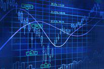

The New York Stock Exchange (NYSE) is a cornerstone of the global financial landscape, serving as a pivotal platform for the buying and selling of securities. As one of the largest and most influential stock exchanges in the world, the NYSE plays an essential role in providing liquidity, facilitating capital formation, and determining the prices of publicly traded stocks. Due to its significant impact on the economy, ensuring the stability and integrity of trading on the NYSE is of utmost importance.

To uphold order and stability within its markets, the NYSE enforces a series of regulations designed to manage trading activities, particularly during times of market volatility. These regulations aim to protect investors, maintain fair trading practices, and prevent abrupt market disruptions caused by excessive volatility. One such regulatory mechanism historically employed by the NYSE is the downtick-uptick rule. This rule was implemented to regulate the volume and manner of trades during significant market movements, helping to maintain orderly market conditions during both upturns and downturns.



Examining the downtick-uptick rule provides valuable insights into its purpose, historical development, and the effects on algorithmic trading practices. Although the rule is no longer in effect, understanding its implications remains crucial for traders and investors navigating the complexities of the NYSE. Grasping these regulatory nuances can aid in formulating better risk management strategies and aligning with prevailing market norms, ensuring informed participation in today's dynamic trading environment.

## Table of Contents

## What is the Downtick-Uptick Rule?

The downtick-uptick rule, historically known as Rule 80A, represented a critical regulatory measure on the New York Stock Exchange (NYSE) designed to maintain orderly trading conditions during periods of significant market volatility. This rule played a crucial role in stabilizing markets by imposing restrictions on the volume of trades that could be executed during substantial market movements, which were characterized by rapid price fluctuations either upwards or downwards.

The primary mechanism of the downtick-uptick rule, also referred to as the "collar rule" or "index [arbitrage](/wiki/arbitrage) tick test," was to flag specific trades under volatile conditions. These flags were applied to deter excessive buying or selling orders, which could exacerbate market instability. By requiring certain trades to be marked appropriately, the rule aimed to curb the impact of automated trading strategies that might otherwise lead to sharp market movements. This regulation was particularly applicable to program trading strategies, which involve large volumes of buy and sell orders executed via algorithms.

In practice, the downtick-uptick rule functioned by identifying and restricting trades conducted during a downtick (a downward price movement) or an uptick (an upward price movement). The rule's enforcement ensured that traders could not engage in indexed arbitrage—a trading strategy designed to exploit pricing discrepancies between indices and their component stocks—without adhering to the procedural constraints imposed by the flagged status. Consequently, by managing the flow and execution of large trades, the downtick-uptick rule contributed to reducing the potential for market disruptions that automated and high-frequency trading might cause under volatile conditions.

## The History and Evolution of the Downtick-Uptick Rule

The downtick-uptick rule, initially established to mitigate the effects of program trading and curb market [volatility](/wiki/volatility-trading-strategies), has undergone considerable change since its origin. Introduced as Rule 80A, it was designed to respond to significant directional movements in stock indices on the NYSE, specifically targeting moments of excessive volatility that could destabilize the market. In its original form, the rule was triggered by specific point movements in market indices, acting as a mechanism to maintain orderly markets by limiting the [volume](/wiki/volume-trading-strategy) and frequency of program trades during pronounced price shifts.

Over time, the parameters governing the rule were revised to adapt to the evolving nature of market dynamics. The rule's trigger was adjusted from being based purely on point movements to incorporating percentage changes in the NYSE Composite Index. This shift was aimed at ensuring the rule's relevance across different market conditions, recognizing that market indices could undergo significant movements in point values without necessarily indicating extreme volatility.

Despite its initial efficacy, the changing landscape of financial markets in the early 21st century ushered in re-evaluations of various trading regulations. The proliferation of technological advancements and the rise of high-frequency trading transformed how markets operated, leading to increased scrutiny of existing rules. By 2007, Rule 80A was officially removed by the Securities and Exchange Commission (SEC). The decision was influenced by evolving market conditions and significant input from industry stakeholders who argued that the rule's framework was no longer suited to the contemporary trading environment. The elimination of the rule marked a shift towards a more flexible regulatory approach, while ongoing discussions continue regarding its potential resurgence or the introduction of alternative mechanisms to address similar market challenges.

## Purpose and Impact of the Downtick-Uptick Rule

The downtick-uptick rule was primarily instituted to stabilize the stock market, particularly during times of intense volatility. Its core function was to regulate program trading executed via sophisticated algorithms, which are capable of precipitating substantial market swings. Through the application of this rule, the NYSE aimed to impose restrictions on certain types of trading activities, which were flagged as 'sell-plus' during ascending markets and 'buy-minus' during descending trends. This labeling was a measure intended to curb the potential for abrupt price movements, thereby reducing the risk of flash crashes—sudden and severe drops in market prices that are often exacerbated by automated trading strategies.

The rule worked by mandating that certain trades could only occur if they satisfied specific conditions related to previous trade prices, effectively slowing down the rate at which orders could be executed during volatile periods. This mechanism helped prevent cascading effects in price movements, whereby a rapid sequence of sell or buy orders could lead to a steep decline or surge in stock prices, respectively.

Despite the eventual removal of the downtick-uptick rule in 2007, there remains significant discourse around its potential benefits if reinstated, particularly given the prominence of high-frequency trading ([HFT](/wiki/high-frequency-trading-strategies)) in today's markets. HFT involves executing a large number of trades at incredibly high speeds, often magnifying market volatility. The ongoing discussions reflect concerns that without such regulatory safeguards, modern markets may be predisposed to higher frequency and magnitude of market disturbances.

In contemplating its reintroduction, market regulators and participants weigh the trade-offs between the rule's potential to enhance market stability and the constraints it might impose on trading freedom and market [liquidity](/wiki/liquidity-risk-premium). Consequently, whether similar regulatory mechanisms should be reinstated remains a topic of inquiry and debate among economists, market analysts, and policymakers.

## Algo Trading and the NYSE Regulations

Algorithmic trading, often referred to as algo trading, utilizes complex algorithms and high-speed data networks to execute trades at a rapid pace. This type of trading facilitates the handling of large volumes of assets, with computerized systems making trade decisions based on pre-defined criteria. Algorithmic trading now dominates the landscape of modern financial markets, significantly impacting the New York Stock Exchange (NYSE) by increasing efficiency and liquidity while also posing particular challenges regarding market fairness and stability.

Regulations, such as the downtick-uptick rule, were developed to ensure these automated trading activities do not disrupt the orderly functioning of markets. Although the downtick-uptick rule is no longer active, the principles behind it continue to inform current regulatory practices. Implementing such guidelines helps maintain fairness by controlling the volume and speed of trades, particularly during periods of market volatility. For example, algorithmic systems must be designed to recognize and adhere to existing market rules, which prevent excessive price swings influenced by high-frequency trading.

Understanding these regulations is crucial for traders employing algorithmic strategies on the NYSE. Being knowledgeable about existing and historical regulations can enhance risk management strategies by aligning trading algorithms with compliance requirements. Traders must ensure that their algorithms are engineered to respect trading halts, tick sizes, and execution venues, which collectively aid in maintaining market equilibrium.

For instance, incorporating constraints to limit trade volumes during volatile periods can be embedded directly into trading algorithms. This approach requires programming skills and a deep understanding of market structure. An example in Python to simulate a simple trade volume limiter might look like this:

```python
class AlgoTrader:
    def __init__(self, max_volume):
        self.max_volume = max_volume

    def execute_trade(self, trade_volume):
        if trade_volume <= self.max_volume:
            print(f"Trade executed with volume: {trade_volume}")
        else:
            print(f"Trade volume {trade_volume} exceeds the limit of {self.max_volume}")

# Usage
trader = AlgoTrader(max_volume=1000)
trader.execute_trade(800)  # Outputs: Trade executed with volume: 800
trader.execute_trade(1200) # Outputs: Trade volume 1200 exceeds the limit of 1000
```

In conclusion, the interplay between [algorithmic trading](/wiki/algorithmic-trading) and regulations like those historically implemented on the NYSE underscores the importance of balanced oversight in modern finance. As the trading environment evolves, keeping up-to-date with regulatory developments and integrating them into trading systems is essential for maintaining both compliance and competitive advantage.

## Comparison: Downtick-Uptick Rule vs. Uptick Rule

The downtick-uptick rule and the uptick rule, while related, serve distinct purposes within the regulatory framework of securities trading. Both rules were designed to mitigate excess volatility and protect market integrity, yet they apply to different trading circumstances.

The downtick-uptick rule, also known as Rule 80A, was primarily focused on curbing program trading during significant market moves. It mandated that certain trades be flagged according to their direction—'sell-plus' during upturns and 'buy-minus' during downturns—aiming to limit the volume of trades that could exacerbate market volatility, particularly during heightened activity. Despite its influence on trading dynamics, this rule was removed in 2007 as market conditions evolved and were deemed self-regulating to an extent.

On the other hand, the uptick rule, often referred to as Rule 10a-1, targeted short selling and operated under different conditions. Instituted by the Securities and Exchange Commission (SEC) in 1938, the uptick rule allowed short sales only if the last traded price was above the previous price—an "uptick." This rule aimed to protect against market manipulation and ensure short selling did not lead to runaway downturns during periods of declining prices. Its abolition in 2007 triggered debates around market vulnerability, leading to its reimplementation in a modified form in 2010 as the alternative uptick rule (Rule 201). This updated rule introduces a circuit breaker, activating restrictions on short selling once a security's price drops by 10% or more from the previous day’s close, thereby balancing market fluidity with safeguards against undue pessimism and panic-selling.

These regulatory measures highlight the ongoing challenge of implementing effective mechanisms to maintain fair and orderly markets amidst evolving trading technologies and strategies. It reflects the constant shift towards accommodating market freedom while ensuring structural guards to prevent exploitation and extreme volatility.

## Concluding Thoughts

The downtick-uptick rule, while no longer part of current NYSE regulations, continues to shape discussions about market stability and the need for measures to control volatility. As markets evolve and technology becomes more integrated into trading processes, understanding such historical regulations is essential for grasping the modern regulatory environment's complexities and aims. The role of algorithmic trading, with its capacity to execute substantial transactions at high speeds, underscores the importance of safeguarding mechanisms to ensure fair and efficient markets.

Investors and traders benefit significantly from staying informed about NYSE regulations. A deep understanding of market rules can help identify potential risks and opportunities, ultimately contributing to more informed trading decisions. In the fast-paced world of finance, knowledge of the regulatory landscape equips market participants to navigate effectively through different market scenarios. As technological advances continue to reshape trading activities, an appreciation of past and present regulations becomes vital in managing risk and maintaining market integrity.

## References & Further Reading

[1]: ["Securities and Exchange Commission: Adoption of Regulation SHO"](https://www.investopedia.com/terms/r/regsho.asp) - Detailed information about various regulations including the uptick rule.

[2]: ["Uptick Rule: Fairness and Market Stability"](https://fastercapital.com/content/Uptick-Rule-and-Market-Surveillance--Ensuring-Fairness-and-Compliance.html) - NYSE document discussing the impact of the uptick rule on market stability.

[3]: Harris, L. (2003). ["Trading and Exchanges: Market Microstructure for Practitioners"](https://www.amazon.com/Trading-Exchanges-Market-Microstructure-Practitioners/dp/0195144708) - A comprehensive book on market structures and trading rules.

[4]: ["The Effect of the Uptick Rule on Stock Price Volatility"](https://fastercapital.com/content/Understanding-the-Uptick-Rule--A-Guide-to-Stock-Market-Regulations.html) by CFA Institute - Analysis of the uptick rule's impact on volatility.

[5]: Stein, J. C. (2009). ["Presidential Address: Sophisticated Investors and Market Efficiency"](https://scholar.harvard.edu/files/stein/files/presidential-address-jf-final.pdf) - Discusses market regulations and efficiency relevant to algorithmic trading.